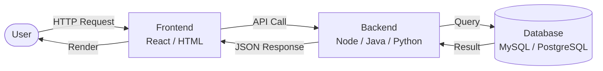

# What is System Design?

## Why This Topic Exists

Most programmers start their careers learning how to write code that solves a specific problem: sort this list, fetch this record, render this button. That skill is valuable. But when a product grows from 100 users to 10 million users, the original code — no matter how elegantly written — starts breaking in ways that no amount of clean syntax can fix. System design is the discipline that answers the question: *how do we build software that keeps working as it grows?*

---

## Learning Objectives

By the end of this chapter you will be able to:

- Define system design in your own words
- Distinguish between functional and non-functional requirements
- Explain why system design is different from programming
- Describe the basic components of any web system
- Understand why tech companies test system design in interviews

---

## Prerequisites

- You know what a website is (you type a URL and a page loads)
- You have written code in at least one programming language
- No prior system design knowledge required

---

## Introduction

There is a moment in every developer's career where they realize that knowing how to code is not the same as knowing how to build systems. You can be a brilliant programmer — writing the fastest algorithms, the cleanest functions, the most readable code — and still build something that falls apart the moment it gets popular.

System design is the practice of making decisions *before* you write code. It is about figuring out: what components do we need? How will they talk to each other? What happens when one of them fails? How do we handle 100 times more users than we expected?

Think of it this way. A carpenter can cut wood perfectly. But a carpenter alone cannot build a skyscraper. You need an architect — someone who thinks about load-bearing walls, fire exits, elevator shafts, plumbing, electrical systems, and how all of these interact. System design is the architecture of software.

---

## Real-World Analogy: Building a House

Imagine you are hired to build a house. You could just start laying bricks. But a good architect asks questions first:

- How many people will live here?
- How many bedrooms do they need?
- Where should the kitchen be relative to the dining room?
- Where does the electrical wiring go without creating a fire hazard?
- What happens if a pipe bursts — can we isolate it without flooding the whole house?
- Will this house need an extra floor added in five years?

None of these questions are about *how to lay bricks*. They are about the *structure* of the house — the decisions that are very expensive to change once construction begins.

Software is the same. Deciding to use a single database when you need three, or to store files on a server that you later need to scale horizontally — these are decisions that cost an enormous amount to undo later. System design is the practice of making these structural decisions thoughtfully, *before* you start coding.

---

## Core Concepts

### 1. What Is a System?

A system is a collection of components that work together to serve a purpose. In software, a "system" typically means: users interact with a frontend, the frontend talks to a backend, the backend reads from and writes to a database, and various other services (caching, file storage, messaging queues) support the whole thing.

### 2. Functional Requirements

Functional requirements describe *what the system does*. They are the features. Examples:

- A user can register and log in
- A user can post a photo
- A user can follow another user
- A user can search for a product by name

These are the things a product manager writes in a requirements document. They define the *behaviour* of the system.

### 3. Non-Functional Requirements

Non-functional requirements describe *how well the system does it*. Examples:

- The system must handle 1 million concurrent users
- A page must load in under 200 milliseconds
- The system must have 99.99% uptime
- User data must never be lost

These are not features — they are *qualities*. And they are what separate a toy prototype from a production system. A system can have all the right features but still be unusable because it is too slow, goes down every week, or loses data.

### 4. The Difference Between Coding and Designing

| Coding | Designing |
|--------|-----------|
| Solves a specific problem | Solves a class of problems |
| Focused on correctness | Focused on correctness AND scale |
| Output is code | Output is a blueprint |
| Happens at the keyboard | Happens at the whiteboard first |
| Deals with now | Deals with now AND the future |

A senior engineer will often spend more time thinking about design than writing code. Bad design is much harder to fix than bad code.

---

## Visual Diagram (Mermaid)

The simplest possible web system looks like this:

Every single web application you have ever used — Google, Instagram, Spotify, Amazon — is some version of this diagram, just with many more boxes and arrows. System design is the practice of deciding what those extra boxes are, where those arrows go, and how the whole thing stays running when parts of it fail.

---

## Deep Explanation

### The Naive Approach (and Why It Fails)

Imagine a startup building a food delivery app. In the beginning, the team writes a simple application: one server, one database, deployed on a single machine. This works fine for the first 500 users. Everyone is happy.

Then the app gets featured in a news article. Overnight, 50,000 people try to use it. The single server cannot handle the load. The database chokes on thousands of simultaneous writes. The whole thing goes down. The startup loses customers and credibility.

The problem was not the code. The code was correct. The problem was the *design*. The team never asked: "what happens when this gets popular?" They never designed for scale, redundancy, or failure.

### The System Design Mindset

System design is about asking "what if" questions before they become "why did" questions:

- What if traffic suddenly spikes?
- What if the database server crashes?
- What if the network between two services goes down?
- What if we need to add a new feature that requires a different data model?

A system designer thinks about these scenarios upfront and builds the system to handle them gracefully — or at least to fail gracefully (degrade politely rather than crash completely).

### Why This Matters at Scale

At 1,000 users, almost any design works. At 1,000,000 users, design choices that seemed irrelevant suddenly matter enormously:

- Whether you store sessions in memory or in a database determines whether you can run multiple servers
- Whether you use synchronous or asynchronous processing determines how your system handles traffic spikes
- Whether you normalize your database or denormalize it determines how fast your queries run
- Whether you store images on your server or in object storage determines whether you can scale horizontally

These decisions are invisible when the system is small. They become critical when the system grows.

---

## Step-by-Step Example: Designing a URL Shortener

Let us walk through the simplest possible system design exercise to make this concrete.

**Problem:** Build a system like bit.ly — users paste a long URL, they get a short URL, and when they visit the short URL they get redirected to the original.

**Step 1 — Functional Requirements**
- User can submit a long URL and get a short URL back
- Anyone who visits the short URL is redirected to the long URL
- Short URLs should be 6-8 characters

**Step 2 — Non-Functional Requirements**
- The system should handle 100 million URLs shortened per day
- Redirects should happen in under 10 milliseconds
- Short URLs should work for at least 5 years

**Step 3 — The Naive Design**
One server, one database. Store a mapping of short_code → long_url. When a short URL is visited, look it up in the database and redirect.

**Step 4 — Why Naive Fails**
With 100 million URLs per day, the database has billions of rows. Every redirect is a database read. At peak, you might have millions of redirects per second. One database cannot handle this. The naive design breaks.

**Step 5 — The Better Design**
Add a cache (like Redis) in front of the database. Most redirects hit the cache (which is very fast) rather than the database. Add multiple servers behind a load balancer. Suddenly the system can handle massive traffic.

This progression — naive solution → identify the bottleneck → fix it — is the core loop of system design thinking.

---

## Advantages / Disadvantages / Trade-offs

| Aspect | Investing in System Design | Skipping System Design |
|--------|---------------------------|------------------------|
| Initial speed | Slower (more upfront thinking) | Faster (just start coding) |
| Long-term maintainability | High | Low — becomes messy fast |
| Ability to scale | Built in by design | Requires painful rewrites |
| Team communication | Shared blueprint makes collaboration easier | Everyone makes local decisions, things conflict |
| Cost of change | Lower (addressed early) | High (structural changes are expensive) |

Every trade-off in system design comes down to this: you pay a small cost now (thinking carefully) or a large cost later (rewriting a production system that millions of people depend on).

---

## When to Use / When NOT to Use

**When system design thinking is essential:**
- You are building a product that expects to grow
- You are working on infrastructure that other systems depend on
- You are in a technical interview for a mid-to-senior engineering role
- You are making a technology decision that will be hard to reverse

**When you can skip the heavy design process:**
- You are building a personal project for learning
- The system will never have more than a few hundred users
- You are writing a script or automation tool
- You are prototyping to test an idea (but revisit before going to production)

The key word is *context*. System design is a tool. Use it where it is needed, not everywhere.

---

## Common Interview Questions

**Q: What is system design?**
A: System design is the process of defining the architecture, components, and interactions of a system to satisfy specified requirements. It bridges the gap between requirements and implementation.

**Q: What is the difference between functional and non-functional requirements?**
A: Functional requirements define what the system does (features and behaviour). Non-functional requirements define how well the system does it (performance, reliability, scalability).

**Q: Why do big tech companies test system design in interviews?**
A: Because at scale, the biggest problems are not algorithmic — they are architectural. Companies want to see how candidates think about trade-offs, constraints, and building systems that hold up under real-world conditions.

**Q: Can a junior engineer benefit from learning system design?**
A: Absolutely. Even if you are not designing systems yet, understanding the architecture helps you write better code, ask better questions, and understand why things are built the way they are.

---

## Common Beginner Mistakes

1. **Confusing system design with coding.** System design is about architecture, not implementation. You should be drawing diagrams and discussing trade-offs, not writing code.

2. **Jumping straight to solutions.** Before designing anything, gather requirements. A system for 100 users looks very different from a system for 100 million users.

3. **Thinking there is one right answer.** System design problems do not have a single correct solution. There are trade-offs. The goal is to demonstrate that you understand those trade-offs.

4. **Ignoring non-functional requirements.** Many beginners focus entirely on features and forget about performance, availability, and reliability. NFRs are often what make or break a real system.

5. **Over-engineering small systems.** A blog with 50 readers does not need Kafka, Redis, and a microservices architecture. Match the design to the scale.

---

## Summary

System design is the discipline of making architectural decisions about software before you write it. It is about thinking through what a system needs to do (functional requirements), how well it needs to do it (non-functional requirements), what components are needed, and how those components interact. It is different from coding the same way architecture is different from carpentry — both matter, and you need both, but they operate at different levels of abstraction.

---

## Key Takeaways

- System design is architecture, not implementation
- Functional requirements = what the system does; Non-functional requirements = how well it does it
- The naive solution almost always works at small scale and breaks at large scale
- System design is about anticipating bottlenecks and trade-offs before they become emergencies
- There is no single right answer — only well-reasoned trade-offs
- Tech companies test system design because at scale, architectural decisions matter more than algorithmic ones

---

## Related Topics

- [Why Learn System Design?](./02.%20Why%20Learn%20System%20Design%20(BEGINNER).md)
- [Client-Server Architecture](./03.%20Client%20Server%20Architecture%20(BEGINNER).md)
- [Functional vs Non-Functional Requirements](./04.%20Functional%20vs%20Non-Functional%20Requirements%20(BEGINNER).md)
- [Capacity Estimation](./05.%20Capacity%20Estimation%20(BEGINNER).md)
