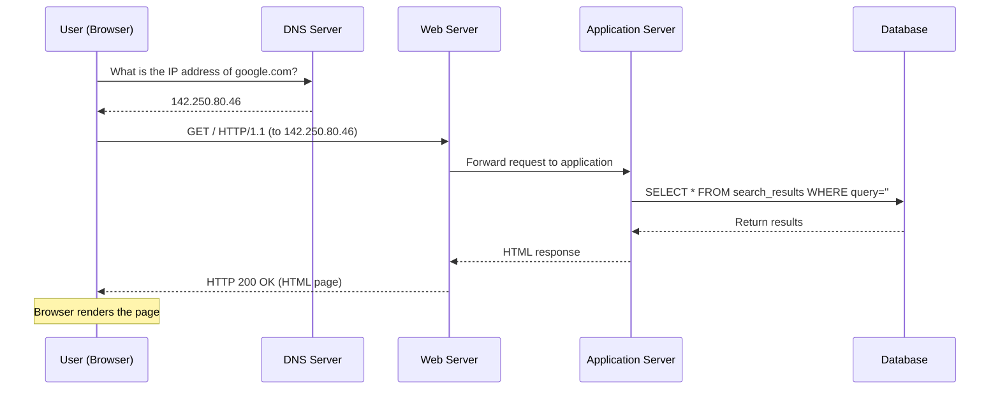
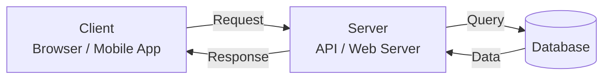
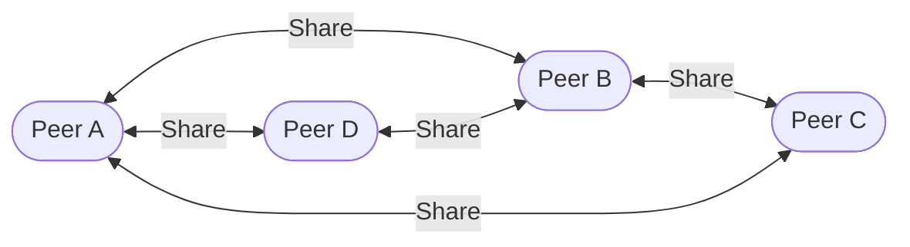

# Client-Server Architecture

## Why This Topic Exists

Every web application you have ever used — Gmail, YouTube, Instagram, Amazon — is built on a single foundational idea: the client-server model. Before you can design any system, you need to understand this model deeply. It is the skeleton on which every system design sits. Once you understand it, a huge amount of what happens "on the internet" will stop being magic and start making sense.

---

## Learning Objectives

By the end of this chapter you will be able to:

- Define what a client and a server are
- Describe the request-response cycle step by step
- Walk through exactly what happens when you type "google.com" in your browser
- Explain the difference between stateless and stateful servers
- Describe the peer-to-peer model and when it is used instead

---

## Prerequisites

- [What is System Design?](./01.%20What%20is%20System%20Design%20(BEGINNER).md)
- No networking knowledge required

---

## Introduction

When you open a browser and type "google.com," something remarkable happens in the space of roughly 200 milliseconds: your computer sends a message across the internet, that message reaches a computer (or more likely, thousands of computers) owned by Google, those computers process your request, prepare a response, and send it back to you — and your browser turns that response into the page you see.

You did not have to think about any of this. It just worked. But understanding *how* it worked is the foundation of system design. Every design decision you will ever make builds on top of this model.

---

## Real-World Analogy: The Restaurant

The client-server model maps almost perfectly onto a restaurant:

| Restaurant | Software System |
|------------|-----------------|
| Customer | Client (your browser) |
| Waiter | Server (the web server / API) |
| Kitchen | Backend application logic |
| Pantry / Storage | Database |
| Menu | API specification |
| Order | HTTP Request |
| Dish that arrives | HTTP Response |

The customer (you) does not go into the kitchen and cook their own food. They place an order with the waiter. The waiter takes the order to the kitchen. The kitchen prepares the food. The waiter brings it back.

The customer has no idea what happens in the kitchen. They just make a request and receive a response. This is exactly how the client-server model works.

Notice a few things:
- The kitchen (backend) and pantry (database) are *hidden* from the customer. The customer only talks to the waiter (server).
- The waiter does not cook anything — they are the interface between the customer and the kitchen.
- If the kitchen is slow, the customer waits, but the waiter can still take other orders and bring back other dishes.
- If a table's order is wrong, only that table is affected — other tables continue eating.

These properties — separation of concerns, isolation of failure, hiding implementation details — are not accidents. They are fundamental design principles that the client-server architecture embodies.

---

## Core Concepts

### What Is a Client?

A client is any program that *initiates* a request to a server in order to access a service. Examples:

- Your web browser (Chrome, Firefox, Safari) is a client when you visit a website
- A mobile app on your phone is a client when it fetches your feed
- A command-line tool like `curl` is a client when it makes an API call
- One backend service calling another backend service is also a client

The defining characteristic of a client is that it *asks*. It makes requests.

### What Is a Server?

A server is any program that *listens* for requests and *responds* to them. Examples:

- A web server (Nginx, Apache) that serves HTML pages
- An application server (Node.js, Django, Spring) that runs your business logic
- A database server (PostgreSQL, MySQL) that stores and retrieves data
- A file server that stores files and allows them to be downloaded

The defining characteristic of a server is that it *waits* and then *responds*. Servers do not initiate conversations — they react to them.

### The Request-Response Cycle

The fundamental unit of interaction in the client-server model is the request-response cycle:

1. Client initiates a request (e.g., "Give me the homepage")
2. Request travels across the network to the server
3. Server processes the request
4. Server sends back a response (e.g., the HTML of the homepage)
5. Client receives the response and does something with it (e.g., renders the page)

This cycle is synchronous by default: the client sends the request and then *waits* for the response before doing anything else. (Asynchronous patterns exist too, but the basic cycle is synchronous.)

### What Is HTTP?

HTTP (Hypertext Transfer Protocol) is the language that clients and servers use to communicate on the web. It defines:

- The format of requests (method, URL, headers, body)
- The format of responses (status code, headers, body)
- The rules for how they exchange messages

Common HTTP methods:
| Method | Purpose | Example |
|--------|---------|---------|
| GET | Retrieve a resource | Load a webpage, fetch a user's profile |
| POST | Create a new resource | Submit a form, post a tweet |
| PUT | Replace a resource entirely | Update a user's profile |
| PATCH | Update part of a resource | Change just a user's username |
| DELETE | Remove a resource | Delete a post |

Common HTTP status codes:
| Code | Meaning | Example |
|------|---------|---------|
| 200 | OK — success | Page loaded successfully |
| 201 | Created — resource was created | New user registered |
| 301 | Moved Permanently — redirect | Old URL redirected to new URL |
| 400 | Bad Request — client sent invalid data | Missing required field |
| 401 | Unauthorized — not logged in | Trying to access a protected page |
| 403 | Forbidden — logged in but not allowed | Normal user trying to access admin panel |
| 404 | Not Found — resource does not exist | Visiting a deleted page |
| 500 | Internal Server Error — server broke | Bug in the backend code |

---

## Visual Diagram (Mermaid)

### The Full Request-Response Cycle



### The Simplified Client-Server Model



---

## Deep Explanation

### What Actually Happens When You Visit google.com?

Let us walk through the full journey of a single request, step by step.

**Step 1 — You type google.com and press Enter**
Your browser needs to send a request to Google's servers. But "google.com" is a human-readable name. Computers communicate using IP addresses (like 142.250.80.46). So first, your browser needs to translate the name into an IP address.

**Step 2 — DNS Resolution**
Your browser asks a DNS (Domain Name System) server: "What is the IP address for google.com?" DNS is like the phone book of the internet. The DNS server responds with an IP address. Your browser caches this so it does not have to ask again immediately.

**Step 3 — TCP Connection**
Your browser establishes a connection with Google's server at that IP address using TCP (Transmission Control Protocol). Think of TCP as establishing a phone call — both sides agree they are ready to talk before any real conversation starts. For HTTPS (which is what google.com uses), there is also a TLS handshake that establishes encryption.

**Step 4 — HTTP Request**
Your browser sends an HTTP GET request:
```
GET / HTTP/1.1
Host: www.google.com
User-Agent: Mozilla/5.0 ...
Accept: text/html
```

This is the actual "order" — a structured message saying "give me the homepage."

**Step 5 — Server Processing**
Google's server receives the request. It determines what to send back. For a search engine homepage, this might involve checking whether you are logged in (cookie lookup), personalizing results, and assembling the HTML.

**Step 6 — HTTP Response**
Google's server sends back an HTTP response:
```
HTTP/1.1 200 OK
Content-Type: text/html
Content-Length: 12543
...
<html>...</html>
```

The status code 200 means "success." The body contains the HTML of the page.

**Step 7 — Browser Renders the Page**
Your browser receives the HTML and starts rendering it. As it parses the HTML, it discovers references to CSS files, JavaScript files, and images. For each of these, it makes *additional* HTTP requests (steps 3–6 again, for each resource). A single page load can involve dozens or hundreds of requests.

### The Key Insight: Separation of Concerns

The client-server model enforces a separation between:
- *What you see* (the client — browser, app)
- *Where data lives and how it is processed* (the server + database)

This separation is powerful because:
- The client can change (you update your app) without changing the server
- The server can change (you refactor your backend) without changing the client
- Multiple clients can use the same server (web app, mobile app, desktop app — all talking to the same API)
- The server can be scaled independently of the client

---

## Stateless vs. Stateful Servers

This is an important concept that beginners often get confused by.

### What Is State?

"State" means memory — information that persists from one request to the next. 

### Stateless Servers

A **stateless server** does not remember anything about previous requests. Every request contains everything the server needs to process it. The server treats each request as completely independent.

HTTP is stateless by design. When you send a GET request, the server processes it and forgets about you. The next request you send is treated as if the server has never seen you before.

**Advantage:** Stateless servers are very easy to scale. You can add more servers and route requests to any of them — since no server remembers anything about you, any server can handle any request.

**Disadvantage:** You need a way to re-attach context to each request. This is what cookies and authentication tokens are for — they carry state from the client to the server with each request.

### Stateful Servers

A **stateful server** remembers information about a client across requests. Traditional session-based web applications are stateful: the server stores a session (shopping cart contents, login status) in memory and the client sends a session ID cookie with each request.

**Advantage:** Simpler to reason about within a session. The server "knows" who you are and what you are doing.

**Disadvantage:** Hard to scale. If your session lives on Server A, your next request must also go to Server A. You cannot route requests to any server — you are "stuck" to one server. If Server A crashes, your session is lost.

Modern systems strongly prefer stateless servers for this reason. State is stored in the database or a distributed cache (like Redis), not in the server's memory.

---

## Peer-to-Peer: The Alternative

The client-server model is not the only way to structure a distributed system. The alternative is **peer-to-peer (P2P)**.

In a P2P network, every participant is both a client and a server simultaneously. Each node can both send and receive data.



Examples of P2P systems:
- BitTorrent (file sharing — you download pieces from many peers while uploading to others)
- Bitcoin / blockchains (no central server — all nodes participate equally)
- Skype (older versions used P2P for calls)
- WebRTC (real-time communication between browsers)

**When P2P is useful:**
- When you want to avoid a central bottleneck
- When no trusted central authority should exist (blockchains)
- When the content being shared benefits from being distributed across many nodes (file sharing)

**When P2P is hard:**
- Discovery (how do peers find each other without a central server?)
- Trust (how do you verify what peers are sending you?)
- Coordination (how do you achieve consistency without a single source of truth?)

Most web applications you build will use the client-server model. P2P is a specialized tool for specialized problems.

---

## Step-by-Step Example: How a Login Works

Let us trace through a login flow to make the client-server model concrete.

**1. User opens the login page**
```
Client → GET /login
Server → Returns HTML login form
```

**2. User enters email and password, clicks "Login"**
```
Client → POST /login
         Body: { email: "user@example.com", password: "secret123" }
```

**3. Server verifies credentials**
```
Server → Query database: SELECT * FROM users WHERE email = 'user@example.com'
Database → Returns user record (including hashed password)
Server → Compare submitted password against stored hash
```

**4. Server responds**
```
If match:
  Server → HTTP 200
           Set-Cookie: session_id=abc123
           Body: { success: true }

If no match:
  Server → HTTP 401
           Body: { error: "Invalid credentials" }
```

**5. Subsequent requests**
```
Client → GET /dashboard
         Cookie: session_id=abc123

Server → Look up session abc123 (in database or Redis)
       → Identify user
       → Return personalized dashboard
```

The cookie is how the client carries state to the stateless server. The session data itself is stored server-side — the client only holds the key (the session ID).

---

## Advantages / Disadvantages / Trade-offs

| Aspect | Client-Server | Peer-to-Peer |
|--------|--------------|--------------|
| Simplicity | Simple to reason about | Complex — nodes play dual roles |
| Scalability | Scale server independently | Scales naturally — more peers = more capacity |
| Central control | Easy to manage and update | No central authority — harder to coordinate |
| Single point of failure | Server is a SPOF (mitigated by redundancy) | Resilient — no single critical node |
| Security | Easier to enforce (central point) | Harder — no central trust authority |
| Typical use case | Web apps, APIs, most internet services | File sharing, blockchains, real-time P2P comms |

---

## When to Use / When NOT to Use

**Client-server is the right model when:**
- You need a central source of truth (most web applications)
- You need to enforce authentication and authorization
- You need to update the application for all users simultaneously
- You want simple, predictable architecture

**Consider P2P when:**
- You explicitly want to avoid a central authority
- The workload is naturally distributed (file sharing)
- You want built-in redundancy without managing servers
- You are building a decentralized application

---

## Common Interview Questions

**Q: What is the difference between a client and a server?**
A: A client initiates requests; a server listens for and responds to requests. A client asks; a server answers.

**Q: What is stateless architecture and why is it preferred?**
A: In stateless architecture, the server does not store any information about previous requests. Each request is self-contained. It is preferred because it allows any server to handle any request, making horizontal scaling straightforward.

**Q: What happens when you type a URL in your browser?**
A: DNS resolution → TCP/TLS handshake → HTTP request → server processing → HTTP response → browser rendering. This is a very common interview question and worth knowing in detail.

**Q: What is the difference between HTTP and HTTPS?**
A: HTTPS is HTTP with TLS encryption on top. The data is encrypted in transit, preventing eavesdropping and tampering. The same request-response cycle applies, but with an added TLS handshake step.

---

## Common Beginner Mistakes

1. **Thinking the server "knows" who you are.** Servers are stateless by default. They only know what you tell them in each request. Authentication tokens and cookies are how you tell the server who you are.

2. **Conflating the web server with the application server.** The web server (Nginx, Apache) handles HTTP traffic. The application server (Node.js, Django) runs your business logic. In small setups they may be the same process. In large setups they are separate.

3. **Assuming one request = one server.** A single page load in a modern application triggers dozens of requests, often to different servers (API servers, CDNs, analytics servers, ad servers).

4. **Thinking servers are special hardware.** A server is a program, not a machine. You can run a server on your laptop. The "servers" in data centers are just computers optimized for running server software 24/7.

5. **Not understanding that the database is also a server.** The database listens for connections and responds to queries. From the application's perspective, the application is the *client* of the database.

---

## Summary

The client-server model is the foundation of the internet. Clients (browsers, apps) make requests; servers process them and respond. The full cycle — DNS, TCP, HTTP, processing, response — happens in milliseconds. Servers are ideally stateless (each request is self-contained), with state stored in the database or cache. Peer-to-peer is an alternative for use cases that benefit from distributed, decentralized architecture. Understanding this model deeply is the starting point for all system design.

---

## Key Takeaways

- Client = asks; Server = answers
- The request-response cycle is the fundamental unit of interaction on the web
- DNS translates human-readable names to IP addresses; TCP establishes the connection; HTTP is the message format
- Stateless servers are easier to scale — any server can handle any request
- State lives in the database or cache, not in the server's memory
- P2P removes the central server but introduces complexity in coordination and trust
- Every system design problem you will encounter is built on top of this model

---

## Related Topics

- [What is System Design?](./01.%20What%20is%20System%20Design%20(BEGINNER).md)
- [Why Learn System Design?](./02.%20Why%20Learn%20System%20Design%20(BEGINNER).md)
- [Functional vs Non-Functional Requirements](./04.%20Functional%20vs%20Non-Functional%20Requirements%20(BEGINNER).md)
- [Capacity Estimation](./05.%20Capacity%20Estimation%20(BEGINNER).md)
