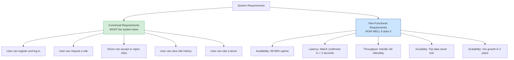

# Functional vs Non-Functional Requirements

## Why This Topic Exists

Every failed system design interview has the same pattern: the candidate hears the problem, nods, and immediately starts drawing boxes and arrows — databases, load balancers, caches. They have skipped the most important step. They never stopped to ask: what exactly does this system need to do, and how well does it need to do it?

Requirements gathering is not a formality. It is the step that determines *what you are building*. A ride-sharing app for 1,000 users a day in a single city is a fundamentally different system from one handling 10 million daily rides globally. The features might be identical, but the architecture is radically different. Without understanding the requirements first, you cannot make a single well-reasoned design decision.

---

## Learning Objectives

By the end of this chapter you will be able to:

- Define functional and non-functional requirements and give examples of each
- Explain why gathering requirements is the mandatory first step of any design
- Build a complete requirements profile for a given system
- Recall the most common non-functional requirements and what they mean
- Demonstrate the correct interview pattern: requirements first, design second

---

## Prerequisites

- [What is System Design?](./01.%20What%20is%20System%20Design%20(BEGINNER).md)
- [Client-Server Architecture](./03.%20Client%20Server%20Architecture%20(BEGINNER).md)

---

## Introduction

Before a single line of code is written, before a single database is chosen, before a single diagram is drawn, a system designer asks two categories of questions:

1. **What does the system need to do?** (Functional requirements)
2. **How well does it need to do it?** (Non-functional requirements)

These two categories are the complete specification of what you are building. Everything that comes after — the architecture, the technology choices, the trade-offs — is in service of satisfying these requirements.

Skipping this step is like a builder starting to pour concrete without seeing the blueprints. You might build something. But it almost certainly will not be the right thing.

---

## Real-World Analogy: Ordering a Custom Car

Imagine you walk into a car dealership and say: "Build me a car."

The salesperson would immediately ask questions:

- "What do you need the car *for*?" (Functional requirement: commuting, racing, hauling cargo?)
- "How many people need to fit in it?" (Functional requirement: seating capacity)
- "How fast does it need to go?" (Non-functional requirement: performance)
- "How fuel-efficient?" (Non-functional requirement: efficiency)
- "How safe?" (Non-functional requirement: safety rating)
- "What is your budget?" (Constraint)

Only after getting answers to these questions can the salesperson recommend a car. A Ferrari answers the "fast" requirement but fails the "haul cargo" and "budget" requirements. A pickup truck answers "haul cargo" but not "fuel efficiency."

The same logic applies to systems. A design that works for a small startup fails for a global enterprise. A design optimised for speed might sacrifice consistency. You cannot make good recommendations until you understand the requirements.

---

## Core Concepts

### Functional Requirements: What the System Does

Functional requirements describe the *behaviour* of the system. They are the features. They answer the question: "What can a user do with this system?"

Functional requirements are typically written as user stories or feature descriptions:
- "A driver can accept or reject a ride request"
- "A user can view their ride history"
- "A user can rate a driver after a trip"
- "A user can schedule a ride in advance"

Each functional requirement describes one specific thing the system allows or does. They are the things you would put in a product specification document.

**Key characteristics of functional requirements:**
- Describes a specific action or capability
- Usually framed around user interactions
- Testable: you can verify whether the system does this or not
- Independent of scale: "a user can post a photo" is the same requirement whether you have 10 users or 10 million

### Non-Functional Requirements: How Well the System Does It

Non-functional requirements (NFRs) describe the *qualities* of the system. They are not features — they are constraints and targets that the system must meet while performing its features.

NFRs answer questions like:
- How many users must the system support simultaneously?
- How fast must it respond?
- How available must it be?
- What happens if part of it fails?
- How long must data be retained?

NFRs are often invisible when a system is small and become the dominant design challenge as a system grows.

**Key characteristics of non-functional requirements:**
- Describes a quality of the system, not a behaviour
- Often expressed as measurable targets (99.9% uptime, <200ms latency)
- Often in tension with each other (availability vs. consistency)
- Scale-dependent: they change as the system grows
- Architectural drivers: they determine which design choices are acceptable

---

## The Complete NFR Table

These are the non-functional requirements that appear in almost every system design discussion. Know all of them.

| NFR | Definition | Example Target | Why It Matters |
|-----|-----------|----------------|----------------|
| **Availability** | The percentage of time the system is operational and accessible | 99.9% (allows ~8.7 hours downtime/year) | Downtime loses users and revenue |
| **Latency** | The time from a request being sent to a response being received | P99 < 200ms | Slow systems feel broken; users leave |
| **Throughput** | The number of requests the system can handle per unit of time | 100,000 requests/second | Sets the scaling floor |
| **Durability** | The guarantee that stored data will not be lost | 99.999999999% (11 nines) for S3 | Lost data is unrecoverable — catastrophic |
| **Consistency** | Whether all nodes/clients see the same data at the same time | Strong consistency vs. eventual consistency | Determines correctness guarantees |
| **Scalability** | The ability to handle growth (more users, more data) | Horizontal scale to 10x current load | Prevents redesign as the system grows |
| **Reliability** | The ability to function correctly over time | Mean Time Between Failures (MTBF) | Users trust reliable systems |
| **Security** | Protection against unauthorized access and attacks | PCI DSS compliance, encryption at rest | Data breaches are existential for companies |
| **Maintainability** | How easily the system can be updated and debugged | Deploy without downtime | Slow deployments kill team velocity |
| **Fault Tolerance** | The ability to continue operating when components fail | No single point of failure | Hardware always eventually fails |

### The "Nines" of Availability

Availability is often expressed as a percentage. The difference between each "nine" is dramatic:

| Availability | Downtime per Year | Downtime per Month | Downtime per Week |
|-------------|-------------------|--------------------|-------------------|
| 99% (two nines) | 3.65 days | 7.2 hours | 1.68 hours |
| 99.9% (three nines) | 8.7 hours | 43.8 minutes | 10.1 minutes |
| 99.99% (four nines) | 52.6 minutes | 4.4 minutes | 1.01 minutes |
| 99.999% (five nines) | 5.26 minutes | 26.3 seconds | 6.05 seconds |

Getting from three nines to four nines is not a minor improvement — it requires a fundamentally different architecture. This is why understanding the availability requirement early is critical.

---

## Visual Diagram (Mermaid)

---

## Deep Explanation: Full Requirements Profile for a Ride-Sharing App

Let us build a complete requirements profile for a system like Uber or Lyft. This is the kind of exercise that should precede any system design.

### Step 1 — Understand the Core Use Case

A ride-sharing app connects drivers (people with cars who want to earn money) with riders (people who need a ride). The core flow is:

1. Rider opens app and requests a ride
2. System finds nearby available drivers
3. System notifies a driver of the request
4. Driver accepts or rejects
5. Driver picks up rider
6. Trip completes, fare is charged
7. Both parties rate each other

### Step 2 — Gather Functional Requirements

Ask: "What must the system be able to do?"

**Rider-facing:**
- Register and authenticate (email, phone, social login)
- Set pickup and destination
- View nearby available drivers and estimated arrival time
- Receive real-time location updates of the driver
- Pay for the trip (card, in-app wallet)
- View trip history
- Rate the driver

**Driver-facing:**
- Register and authenticate (with background check integration)
- Toggle availability (go online / offline)
- Receive ride requests with rider location
- Accept or reject requests
- Navigate to rider and destination
- View earnings history

**System-level:**
- Match riders to nearby drivers efficiently
- Calculate fares based on distance and time
- Handle cancellations and refunds
- Send push notifications and SMS

### Step 3 — Gather Non-Functional Requirements

Ask: "How well must the system do these things, and under what conditions?"

**Scale:**
- 10 million daily active users
- 5 million daily rides
- Peak: 500,000 concurrent users (Friday/Saturday evenings, events)
- Operating in 50 cities across 10 countries

**Latency:**
- Ride match must be confirmed within 2 seconds of request
- Driver location updates must reach the rider within 500ms
- App must load within 3 seconds on a 4G connection

**Availability:**
- 99.99% uptime (less than 1 hour downtime per year) — rides are time-sensitive; downtime directly causes revenue loss
- Payment processing must have separate 99.999% availability SLA

**Durability:**
- All trip records must be stored permanently (legal and financial requirements)
- No payment data can ever be lost

**Consistency:**
- A driver cannot be matched to two riders simultaneously (critical)
- Location updates can be slightly delayed (eventual consistency acceptable)

**Scalability:**
- System must handle 3x current load during special events (New Year's Eve, Super Bowl)
- Must be able to expand to 10 new cities per quarter

**Security:**
- All payment data must be PCI DSS compliant
- Driver background check data must be encrypted at rest
- Location data must be end-to-end encrypted

### Step 4 — Identify Constraints

Ask: "What are we not building? What are the boundaries?"

- No carpooling feature (out of scope)
- No driver-to-driver communication
- Payment processing is outsourced to Stripe — we do not store raw card data
- No scheduled rides in the first version

---

## Why This Step Cannot Be Skipped

Consider how different the design becomes based on just one NFR: the availability requirement.

**Scenario A: 99% availability (small internal tool)**
- A single server with daily backups is acceptable
- If it goes down for a few hours, it is annoying but not critical
- Simple, cheap architecture

**Scenario B: 99.99% availability (production ride-sharing app)**
- Requires multi-region deployment (if one region fails, another takes over)
- Requires load balancers with automatic failover
- Requires database replication with automatic promotion of replicas
- Requires zero-downtime deployment pipelines
- Requires health checks and automated recovery
- Architecture is 10x more complex and expensive

Same functional requirements. Radically different architecture — driven entirely by the NFR.

This is why requirements come first.

---

## Step-by-Step Example: How to Gather Requirements in an Interview

In a system design interview, the first 5 minutes should be requirements gathering. Here is the pattern:

**Step 1 — Clarify functional scope (2 minutes)**
"Before I start designing, I'd like to understand the scope. Are we building just the core ride-matching flow, or do we also need payments and ratings in this design?"

Get a clear list of what is in scope. Write it down.

**Step 2 — Clarify scale (2 minutes)**
"How many daily active users are we expecting? What is the read/write ratio? Are we designing for a specific geography or globally?"

These numbers will drive every capacity and architecture decision.

**Step 3 — Clarify NFRs (1 minute)**
"Are there specific latency targets? What availability SLA are we targeting? Are there any consistency requirements I should be aware of?"

**Step 4 — State your assumptions**
"Based on your answers, I am going to assume: 10 million DAU, 5 million rides per day, 99.99% availability requirement, sub-2-second match time. Let me know if any of these are off."

**Then** — and only then — start designing.

---

## Advantages / Disadvantages / Trade-offs

| Approach | Advantages | Disadvantages |
|----------|-----------|---------------|
| Gather requirements first (correct approach) | Design matches actual needs; fewer wasted decisions; interviewers see structured thinking | Takes time upfront; requires discipline to not jump ahead |
| Jump straight to design (common mistake) | Feels faster initially | High probability of designing the wrong system; NFRs discovered late force expensive redesigns |
| Over-specify requirements | Nothing is ambiguous | Slows everything down; some requirements only become clear once you start building |
| Under-specify requirements | Move fast | Architectural landmines discovered at the worst possible time |

The sweet spot is gathering the requirements that *drive architectural decisions* — scale, availability, latency, consistency — and deferring detailed feature specifications to later.

---

## When to Use / When NOT to Use

**Always gather requirements before designing:**
- Every system design interview
- Every new product or feature that involves architectural decisions
- Any decision that will be hard to reverse (database choice, data model, communication protocol)

**You can be lighter on requirements gathering when:**
- The scope is very small and well-understood
- You are making a local change inside an existing, well-specified system
- You are prototyping to explore the problem space (but revisit before committing)

---

## Common Interview Questions

**Q: What is the difference between a functional and non-functional requirement?**
A: Functional requirements define what the system does (its features and behaviour). Non-functional requirements define how well it does it (its qualities like performance, availability, and scalability).

**Q: Why do you gather requirements before designing?**
A: Because the architecture is determined by the requirements, especially the non-functional ones. A system targeting 99.99% availability looks fundamentally different from one targeting 99%. Without knowing the requirements, you cannot make well-reasoned design decisions.

**Q: What are the most important NFRs to ask about in a system design interview?**
A: Scale (DAU, QPS, data volume), availability (uptime target), latency (response time target), and consistency (strong vs eventual). These four drive the most significant architectural decisions.

**Q: Is consistency always a requirement?**
A: No — it depends on the use case. A social media feed can tolerate eventual consistency (showing slightly stale content is acceptable). A bank account balance requires strong consistency (seeing an outdated balance could cause real harm).

---

## Common Beginner Mistakes

1. **Jumping straight to the solution.** The most common mistake in system design interviews. "I'll design a service that does X" before asking a single question. Always gather requirements first.

2. **Only gathering functional requirements.** Beginners list features and start designing. Without NFRs, the design has no scale, availability, or latency targets — it is incomplete.

3. **Treating all NFRs as equal.** Not all non-functional requirements matter equally in every system. For a bank, consistency and durability are paramount. For a social media feed, availability and latency dominate. Prioritise based on the use case.

4. **Forgetting to state assumptions.** If the interviewer does not give you specific numbers, make reasonable assumptions and state them out loud. "I'm assuming 1 million DAU — does that sound right?" This shows structured thinking.

5. **Confusing latency and throughput.** Latency is how long one request takes. Throughput is how many requests the system can handle per second. A system can have low latency (each request is fast) but low throughput (it can only handle one at a time). Or high throughput but high latency. They are different dimensions.

---

## Summary

Requirements are the foundation of every system design. Functional requirements describe what the system does; non-functional requirements describe how well it does it. The NFRs — especially scale, availability, latency, and consistency — are the primary drivers of architectural decisions. In interviews and in real work, always gather requirements before designing. The question is never "what boxes do I draw?" — it is "what problem am I solving, and what constraints must the solution respect?"

---

## Key Takeaways

- Functional requirements = what the system does (features, user actions)
- Non-functional requirements = how well it does it (scale, performance, availability, durability)
- Requirements gathering is always the first step, not an optional warm-up
- One change in an NFR (e.g., availability from 99% to 99.99%) can require a completely different architecture
- The most important NFRs to ask about: scale, availability, latency, consistency
- State your assumptions explicitly — interviewers reward structured thinking
- Never treat requirements gathering as a formality — it is the core of the discipline

---

## Related Topics

- [What is System Design?](./01.%20What%20is%20System%20Design%20(BEGINNER).md)
- [Capacity Estimation](./05.%20Capacity%20Estimation%20(BEGINNER).md)
- [Client-Server Architecture](./03.%20Client%20Server%20Architecture%20(BEGINNER).md)
- [Why Learn System Design?](./02.%20Why%20Learn%20System%20Design%20(BEGINNER).md)
