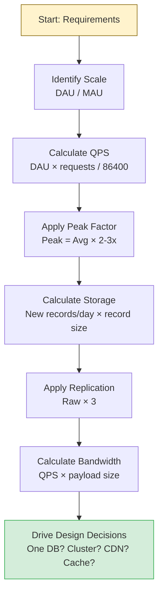

# Capacity Estimation

## Why This Topic Exists

Imagine two engineers are asked to design a photo-sharing app. One says "we'll need a database and some storage." The other says "we'll have 50 million daily active users, each uploading 2 photos per day at an average of 3 MB each — that's 300 TB of new storage every day, so we need a distributed object storage system like S3, and our write QPS is approximately 1,160 per second."

The second engineer is not showing off. They are doing something essential: turning vague requirements into concrete numbers that drive architecture decisions. This is capacity estimation — and it is one of the most practically useful skills in system design.

---

## Learning Objectives

By the end of this chapter you will be able to:

- Explain why capacity estimation drives design decisions
- Define and calculate DAU, MAU, QPS, storage, and bandwidth requirements
- Work through a complete estimation exercise for a real system (Instagram-style)
- Use the estimation framework in an interview setting
- Recall the key numbers every engineer should have memorized

---

## Prerequisites

- [What is System Design?](./01.%20What%20is%20System%20Design%20(BEGINNER).md)
- [Functional vs Non-Functional Requirements](./04.%20Functional%20vs%20Non-Functional%20Requirements%20(BEGINNER).md)

---

## Introduction

Good system design is not guesswork. It is informed decision-making based on numbers. The numbers come from capacity estimation — a set of back-of-envelope calculations that tell you approximately how large a system needs to be, how much it will process, and how much it will store.

The key word is "approximately." Capacity estimation is not an exercise in precision. You are not calculating to four decimal places. You are calculating to the nearest order of magnitude — the difference between thousands and millions, megabytes and terabytes. These rough numbers are enough to answer critical architecture questions:

- Do we need one database or a distributed cluster?
- Do we need to cache data, or is direct database access fast enough?
- Do we need to partition data across multiple servers?
- What kind of network bandwidth will we need?
- What will our infrastructure costs look like?

Without estimation, these questions cannot be answered. With estimation, even rough answers eliminate whole categories of design mistakes.

---

## Real-World Analogy: Planning a Party

Suppose you are planning a party. If you expect 10 guests, you buy a 6-pack of drinks, order two pizzas, and set up your living room. If you expect 200 guests, you rent a venue, hire caterers, arrange parking, and prepare for significantly more of everything.

Your planning — the venue, the food, the logistics — is completely determined by your estimate of how many people will show up. Get the estimate wrong (you expected 10, 200 showed up), and the party is a disaster — not because of any failure of execution, but because of a failure of estimation.

System design is identical. The architecture is driven by the expected scale. Estimate the scale first.

---

## Core Concepts

### DAU and MAU

**DAU (Daily Active Users):** The number of unique users who interact with the system in a given day. This is the most important scaling metric for most consumer products.

**MAU (Monthly Active Users):** The number of unique users who interact with the system in a given month.

The ratio of DAU to MAU tells you something about user engagement:
- High DAU/MAU ratio (e.g., 50%) → users return daily (like Twitter, Instagram)
- Low DAU/MAU ratio (e.g., 10%) → users return occasionally (like a travel booking site)

In system design, you use DAU to calculate how many requests your system handles per day, and then per second.

### QPS (Queries Per Second)

QPS is the number of requests your system must handle each second. It is the most direct measure of your system's load.

**How to calculate QPS from DAU:**

The naive formula: `QPS = DAU × requests_per_user_per_day / seconds_per_day`

Seconds per day: 24 hours × 60 minutes × 60 seconds = 86,400. Round to 100,000 for easy math.

Example: 10 million DAU, each making 10 requests per day
```
QPS = 10,000,000 × 10 / 100,000 = 1,000 QPS
```

**Peak QPS:** Traffic is not evenly distributed. Traffic spikes in the evening, during events, and when content goes viral. A common rule of thumb is that peak traffic is approximately 2-3x the average. Always design for peak, not average.

```
Peak QPS = Average QPS × 2 to 3
```

### Read/Write Ratio

Most systems have very different read and write loads. A social media feed might have:
- 1 user writes a post
- 1,000 users read that post

This is a 1:1,000 read/write ratio. Knowing this ratio tells you:
- Where to focus optimization efforts (reads are the bottleneck here)
- Whether caching will be effective (high read/write ratio → caching is very effective)
- How to scale the database (read replicas can serve reads; a single primary handles writes)

### Storage Estimation

**Formula:**
```
Daily storage = (number of new records per day) × (average record size)
Annual storage = daily storage × 365
5-year storage = daily storage × 365 × 5
```

You also need to account for replication — most systems store data in at least 3 copies for durability:
```
Total storage needed = raw storage × replication factor (typically 3)
```

### Bandwidth Estimation

Bandwidth is how much data moves in and out of your system per second.

**Ingress (incoming) bandwidth:**
```
Ingress bandwidth = write QPS × average write payload size
```

**Egress (outgoing) bandwidth:**
```
Egress bandwidth = read QPS × average response size
```

---

## Numbers Every Engineer Should Memorize

Keep these numbers in your head. They save time during estimation and make you look authoritative in interviews.

### Storage Size Reference

| Unit | Value | Example |
|------|-------|---------|
| 1 Kilobyte (KB) | 1,000 bytes | A short text message |
| 1 Megabyte (MB) | 1,000 KB | A high-quality photo |
| 1 Gigabyte (GB) | 1,000 MB | A feature-length movie |
| 1 Terabyte (TB) | 1,000 GB | 1,000 movies |
| 1 Petabyte (PB) | 1,000 TB | ~500 billion pages of text |

### Typical Data Sizes

| Data Type | Approximate Size |
|-----------|-----------------|
| Tweet / short text message | 280 bytes (~0.3 KB) |
| Instagram photo (compressed) | 3 MB |
| 4K video (1 minute) | 375 MB |
| HD video (1 minute) | 100 MB |
| Audio file (1 minute, MP3) | 1 MB |
| User profile record | 1 KB |
| URL | 100 bytes |
| UUID / ID field | 8–16 bytes |
| Metadata record | 1–10 KB |

### Latency Reference (Latency Numbers Every Programmer Should Know)

| Operation | Approximate Latency |
|-----------|---------------------|
| L1 cache reference | 1 ns |
| L2 cache reference | 4 ns |
| RAM access | 100 ns |
| SSD random read | 100 microseconds (0.1 ms) |
| HDD seek + read | 10 ms |
| Read 1 MB from SSD | 1 ms |
| Network: same data center | 0.5 ms |
| Network: USA to Europe | 150 ms |
| Network: USA to Australia | 200 ms |

### Time Reference

| Period | Seconds |
|--------|---------|
| 1 minute | 60 |
| 1 hour | 3,600 |
| 1 day | 86,400 (use 100,000 for estimates) |
| 1 month | 2,600,000 (~3 million) |
| 1 year | 31,500,000 (~30 million) |

---

## Visual Diagram (Mermaid)



---

## Deep Explanation: The Estimation Framework

Here is a repeatable 5-step framework for any capacity estimation problem.

### Step 1 — Establish the Scale

Start with users. How many daily active users? How many requests does each user make per day? Calculate average QPS and peak QPS.

### Step 2 — Determine the Read/Write Split

For every system, ask: "Is this read-heavy, write-heavy, or balanced?" This tells you where to focus. It also informs caching strategy.

### Step 3 — Estimate Storage

What is the primary data being stored (photos, videos, messages, records)? How much per day? How long is it retained? What is the total at year 1, year 3, year 5?

### Step 4 — Estimate Bandwidth

Given your read/write QPS and the size of the data being moved, how much bandwidth is needed inbound and outbound?

### Step 5 — Identify Bottlenecks

Given the numbers, what is the hardest problem? Is it storage volume? Is it read QPS? Is it write QPS? This tells you where to focus the architecture.

---

## Step-by-Step Example: Estimating Instagram's Storage

This is a classic estimation exercise. Let us walk through it completely.

### Problem Statement

Instagram has approximately 500 million daily active users. Design the storage requirements for photo uploads.

### Step 1 — Establish Scale

- DAU: 500 million
- Each user uploads approximately 1 photo every 5 days on average
- Photos uploaded per day: 500,000,000 / 5 = **100 million photos per day**

### Step 2 — Calculate Write QPS

```
Write QPS = 100,000,000 photos / 86,400 seconds ≈ 1,160 writes/second
```

Round to: **~1,200 writes/second average**

With a 2x peak factor:
**Peak write QPS: ~2,400 writes/second**

### Step 3 — Calculate Read QPS

Instagram is extremely read-heavy. A single photo might be viewed hundreds of times. Assume a 1:100 write-to-read ratio.

```
Read QPS = 1,200 × 100 = 120,000 reads/second average
Peak read QPS = ~240,000 reads/second
```

This immediately tells you: you need aggressive caching. No database can serve 240,000 photo lookups per second from disk.

### Step 4 — Calculate Daily Storage

- Photos per day: 100 million
- Average compressed photo size: 3 MB
- Raw daily storage: 100,000,000 × 3 MB = **300 TB per day**

### Step 5 — Apply Replication Factor

Instagram uses at least 3 replicas for durability:
```
Total daily storage = 300 TB × 3 = 900 TB per day
```

### Step 6 — Calculate Long-Term Storage

| Time Period | Storage Needed |
|------------|----------------|
| 1 day | 900 TB |
| 1 month | 900 TB × 30 = 27 PB |
| 1 year | 900 TB × 365 = ~328 PB |
| 5 years | ~1.6 Exabytes |

This is why Instagram uses distributed object storage (similar to Amazon S3) — not a traditional database. No traditional storage system can hold petabytes and exabytes affordably.

### Step 7 — Calculate Bandwidth

**Ingress (uploads):**
```
Ingress = 1,200 writes/sec × 3 MB = 3,600 MB/s = 3.6 GB/s
```

**Egress (views):**
Assume each photo view delivers a compressed 1 MB thumbnail (not full resolution):
```
Egress = 120,000 reads/sec × 1 MB = 120,000 MB/s = 120 GB/s
```

120 GB/s of outgoing bandwidth. This is why Instagram uses a CDN (Content Delivery Network) — the photos are served from edge servers close to the user, not from Instagram's origin servers.

### Step 8 — Summary of Design Implications

| Finding | Design Implication |
|---------|-------------------|
| 300 TB raw storage per day | Distributed object storage (S3-style), not traditional database |
| 120,000 read QPS | Aggressive CDN caching; photos served from edge |
| 1,200 write QPS | Distributed upload pipeline; async processing |
| 100:1 read/write ratio | Read optimization is the priority |
| Petabytes in year 1 | Storage must be infinitely scalable with linear cost |

This is the value of capacity estimation: five calculations turn a vague requirement ("store photos") into a set of specific architectural decisions.

---

## Another Example: Estimating a URL Shortener

**Assumptions:**
- 100 million new URLs shortened per day
- 10:1 read/write ratio (10 billion redirects per day)
- URLs stored for 5 years

**Write QPS:**
```
100,000,000 / 86,400 ≈ 1,160 writes/second
```

**Read QPS:**
```
1,160 × 10 = 11,600 reads/second
Peak: ~23,000 reads/second
```

**Storage per URL:**
- Short code: 7 characters = 7 bytes
- Long URL: average 100 characters = 100 bytes
- Timestamp + metadata: ~100 bytes
- Total per record: ~300 bytes, round to 500 bytes

**Daily storage:**
```
100,000,000 × 500 bytes = 50 GB/day
```

**5-year storage:**
```
50 GB × 365 × 5 = ~91 TB
```

**Design implications:**
- 91 TB fits comfortably in a distributed relational database (PostgreSQL cluster)
- 23,000 read QPS benefits heavily from caching (Redis) — popular short links are accessed millions of times
- A single primary database handles 1,160 writes/second comfortably

---

## Advantages / Disadvantages / Trade-offs

| Approach | Advantages | Disadvantages |
|----------|-----------|---------------|
| Estimate early | Drives correct architecture from the start; prevents over/under-engineering | Estimates can be wrong; requires assumptions |
| Skip estimation | Move faster initially | Architecture may be wrong for the actual scale; expensive to fix later |
| Over-estimate by 10x | Comfortable headroom; never caught off-guard | Over-engineered for actual load; unnecessary cost and complexity |
| Under-estimate | Lean, cheap architecture | Fails under real load; requires emergency scaling |

The right approach: estimate conservatively, state your assumptions, and design for 2-3x your estimate. Revisit as real data comes in.

---

## When to Use / When NOT to Use

**Always estimate capacity when:**
- Starting the design of any new system
- In a system design interview (within the first 5-10 minutes)
- Making a decision about infrastructure (choosing a database, deciding on storage class)
- Evaluating whether an architecture can handle expected growth

**You can skip detailed estimation when:**
- Building a prototype with no meaningful scale requirements
- Making a purely internal tool for a team of 10 people
- The scale is so small that any modern architecture will handle it easily

---

## Common Interview Questions

**Q: How do you calculate QPS from DAU?**
A: QPS = DAU × requests_per_user_per_day / 86,400. Then multiply by 2-3x for peak traffic.

**Q: What is a read/write ratio and why does it matter?**
A: It is the ratio of read requests to write requests. A high ratio (100:1) means caching is highly effective and read optimization is the priority. A low ratio or write-heavy workload means you need to focus on write throughput.

**Q: How do you estimate storage for a photo-sharing app?**
A: Photos per day × average photo size × replication factor = daily raw storage. Multiply by retention period for total storage.

**Q: How many seconds are in a day?**
A: 86,400. Use 100,000 for mental math estimates.

**Q: What does it mean when someone says a system needs to handle 10,000 QPS?**
A: It means the system must be able to process 10,000 individual requests every second, at peak. This typically requires either a very powerful single machine or multiple machines behind a load balancer.

---

## Common Beginner Mistakes

1. **Using exact numbers instead of round numbers.** When estimating, you do not need 86,400 — use 100,000. The goal is an order of magnitude, not a precise figure.

2. **Forgetting the replication factor.** Raw storage × 1 is almost never correct. Most systems replicate data 3x. Always account for this.

3. **Ignoring peak traffic.** Average QPS is not what your system needs to handle — peak QPS is. Always apply a 2-3x multiplier to get the peak figure.

4. **Forgetting to translate to design decisions.** Estimation is not the goal — design decisions are. After every estimation, ask: "What does this number tell me about the architecture?"

5. **Being paralysed by uncertainty.** You do not need exact numbers to estimate. Make reasonable assumptions, state them out loud, and proceed. "I'm assuming a 3MB average photo size — please correct me if that's off" is a perfectly valid approach.

6. **Not differentiating read and write QPS.** Systems often have very different read and write requirements. Treating them as the same leads to wrong architecture choices.

---

## Summary

Capacity estimation is the practice of turning user-scale requirements into concrete technical numbers: QPS, storage, and bandwidth. These numbers are not precise — they are approximations, correct to within an order of magnitude. But they are enough to make critical architectural decisions: whether to use a single database or a distributed cluster, whether caching is necessary, whether a CDN is required. The Instagram storage example demonstrates the technique: 500 million DAU, 100 million photos per day, 300 TB raw storage per day, 120,000 read QPS — each number leading directly to a design requirement. Estimation is not optional. It is the step that connects requirements to architecture.

---

## Key Takeaways

- Capacity estimation converts scale requirements into concrete numbers
- QPS = DAU × requests_per_user / 86,400 — then multiply by 2-3x for peak
- Always account for the replication factor in storage estimates (typically 3x)
- Read/write ratio determines where to focus: high ratio → prioritise caching
- Bandwidth = QPS × average payload size — drives CDN and network decisions
- Estimation errors of ±50% are acceptable; order-of-magnitude errors are not
- Every estimate should translate directly into a design decision
- Memorise: 86,400 seconds/day, key data sizes (3MB photo, 100MB HD video minute)

---

## Related Topics

- [What is System Design?](./01.%20What%20is%20System%20Design%20(BEGINNER).md)
- [Functional vs Non-Functional Requirements](./04.%20Functional%20vs%20Non-Functional%20Requirements%20(BEGINNER).md)
- [Client-Server Architecture](./03.%20Client%20Server%20Architecture%20(BEGINNER).md)
- [Why Learn System Design?](./02.%20Why%20Learn%20System%20Design%20(BEGINNER).md)
