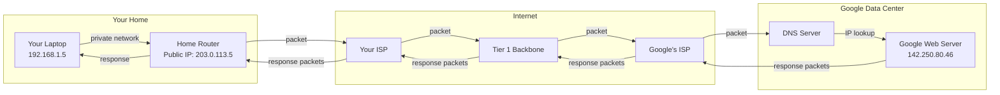

# How the Internet Works

## Why This Topic Exists

Before you can design any distributed system, you need to understand the medium those systems run on. The internet is not magic. It is a global network of computers connected by physical wires, fiber-optic cables, and radio waves. Every time you open an app, watch a video, or send a message, data is traveling across this network. Understanding how that happens — at a basic level — will shape every decision you make as a system designer.

This topic is placed first in the networking chapter because everything else (TCP, HTTP, DNS, CDNs) builds on top of these fundamentals.

## Learning Objectives

By the end of this topic, you will be able to:

- Describe what the internet is in plain English
- Explain what an IP address is and why every device needs one
- Describe what a router does and why routers exist
- Explain what a packet is and how data is broken up and reassembled
- Walk through exactly what happens when you type `google.com` in your browser
- Explain what DNS is at a high level
- Understand what ISPs and backbone networks are

## Prerequisites

- No prior networking knowledge required
- Basic familiarity with the concept of a web browser and a website

## Introduction

The internet is, at its core, just computers talking to each other. Some computers send requests (we call them clients), some computers respond to requests (we call them servers), and an enormous network of cables, routers, and systems shuttles data between them.

If you have ever mailed a letter, you already understand the internet. The postal system and the internet solve the same problem: how do you reliably get a message from one place to another when there is a huge, complex network of roads, sorting offices, and delivery vans in between?

## Real-World Analogy

Think about the postal mail system:

- **Your home address** is like an **IP address** — it uniquely identifies where you live so mail can find you.
- **A letter** is like a **data packet** — it contains a message and has a destination address on it.
- **The post office and sorting facilities** are like **routers** — they look at the address on the letter and decide which direction to send it next.
- **The postal network** (roads, vans, planes) is like the **internet infrastructure** — the physical medium that carries things.
- **A phone book** is like **DNS** — it translates a name (John Smith) into an address (123 Main Street).

When you send a letter:
1. You write the address on the envelope.
2. You drop it in a mailbox.
3. The post office picks it up and routes it toward the destination.
4. It passes through several sorting centers.
5. A local mail carrier delivers it to the door.

The internet works the same way, just billions of times faster and with packets instead of letters.

## Core Concepts

### 1. IP Addresses

Every device on the internet has a unique identifier called an **IP address** (Internet Protocol address). Think of it as a home address for your computer.

There are two versions:

| Version | Example | Address Space |
|---------|---------|---------------|
| IPv4 | `142.250.80.46` | ~4.3 billion addresses |
| IPv6 | `2607:f8b0:4004:c09::6a` | 340 undecillion addresses |

IPv4 is running out of addresses (the internet grew faster than expected), so the world is slowly moving to IPv6.

**Private vs Public IP:**
- Your laptop has a **private IP** (like `192.168.1.5`) inside your home network.
- Your home router has a **public IP** that the wider internet sees.
- NAT (Network Address Translation) converts between the two — many devices share one public IP.

### 2. Packets

If your letter analogy has you thinking about whole messages traveling across the network — stop. The internet does not send whole files at once. It breaks data into small pieces called **packets**.

Why packets?
- A single large file would monopolize the entire connection.
- If one part of the network is congested, packets can take different routes.
- If a packet is lost, only that small piece needs to be resent.

A typical packet is 1,500 bytes (about 1.5 KB). A 5 MB image gets broken into roughly 3,300 packets. Each packet travels independently and is reassembled at the destination.

Each packet contains:
- **Header**: source IP, destination IP, packet number, total packets
- **Payload**: the actual chunk of data

### 3. Routers

Routers are the sorting offices of the internet. When a packet arrives at a router, the router looks at the destination IP address and decides which direction to forward it next, using a **routing table**.

Routers do not know the full path — they only know the next best hop. It is like asking for directions and being told "turn left at the intersection, then ask someone else." Each router makes a local decision, and the packet eventually finds its destination.

### 4. DNS — The Phone Book

You never type `142.250.80.46` to visit Google. You type `google.com`. DNS (Domain Name System) is the system that translates human-readable names into IP addresses.

Think of DNS as a massive, distributed phone book. When you type `google.com`:
1. Your computer asks a DNS server: "What is the IP address for google.com?"
2. The DNS server responds: "It is `142.250.80.46`."
3. Your computer now knows where to send requests.

DNS is covered in full detail in [04. DNS - Domain Name System](./04.%20DNS%20-%20Domain%20Name%20System%20(BEGINNER).md).

### 5. ISPs and the Backbone

**ISP (Internet Service Provider):** The company you pay for internet access — Comcast, AT&T, Jio, etc. They connect your home to the broader internet.

**Tier 1 networks (backbone):** These are enormous networks owned by companies like AT&T, NTT, and Tata Communications. They form the core of the internet — high-capacity, long-haul fiber-optic cables that span continents and oceans. Tier 1 networks peer with each other for free; smaller ISPs pay them for access.

The hierarchy looks like this:

```
You → Home Router → Your ISP (Tier 3) → Regional ISP (Tier 2) → Backbone (Tier 1) → Destination
```

## Visual Diagram



## Deep Explanation

### The Physical Layer

The internet is physical. Data travels as:
- **Electrical signals** in copper cables (your home ethernet)
- **Light pulses** in fiber-optic cables (the backbone, and increasingly homes)
- **Radio waves** in WiFi and cellular networks

Undersea fiber-optic cables connect continents. There are over 500 submarine cables active today, carrying over 95% of international internet traffic. Satellites (like Starlink) carry the rest and serve areas without cable access.

### The Protocol Stack

Computers agree on standards (protocols) so that a laptop made by Apple can talk to a server running Linux. The internet is built on layers of protocols:

| Layer | Protocol | Job |
|-------|----------|-----|
| Application | HTTP, DNS, SMTP | What the data means |
| Transport | TCP, UDP | Reliable or fast delivery |
| Network | IP | Routing across the internet |
| Link | Ethernet, WiFi | Communication on local network |
| Physical | Cables, radio | Actual bits moving |

Each layer adds its own header to the packet, wrapping the data like nested envelopes. This is called **encapsulation**.

### Ports

An IP address identifies a machine. A **port** identifies a specific service on that machine.

Think of a hotel: the hotel address is the IP, the room number is the port.

| Port | Service |
|------|---------|
| 80 | HTTP (web) |
| 443 | HTTPS (secure web) |
| 22 | SSH |
| 25 | SMTP (email) |
| 53 | DNS |

## Step-by-Step Example: What Happens When You Type google.com

Let us trace every step from keystroke to page load:

**Step 1: You type `google.com` and press Enter.**
Your browser needs to know the IP address for `google.com`.

**Step 2: DNS Resolution.**
- Your browser checks its own cache first. Not there.
- Your operating system checks its cache. Not there.
- Your OS asks your local DNS resolver (usually your router or ISP).
- The resolver walks the DNS hierarchy: root → `.com` TLD → Google's authoritative DNS.
- Result: `142.250.80.46`. This is cached for future use.

**Step 3: TCP Connection.**
Your browser initiates a TCP connection to `142.250.80.46:443` (port 443 for HTTPS). This involves a 3-way handshake (covered in [02. TCP vs UDP](./02.%20TCP%20vs%20UDP%20(BEGINNER).md)).

**Step 4: TLS Handshake (for HTTPS).**
Browser and server exchange certificates and agree on encryption keys. All future data is encrypted.

**Step 5: HTTP Request.**
Your browser sends an HTTP GET request:
```
GET / HTTP/1.1
Host: www.google.com
User-Agent: Chrome/120.0
```

**Step 6: Packet Journey.**
The request is broken into packets. Each packet goes:
- Your laptop → your home router
- Home router → your ISP
- ISP → regional network → Tier 1 backbone
- Backbone → Google's network
- Google's network → Google's server

Each hop takes milliseconds. Total round trip to a server in the same continent: typically 20–100ms.

**Step 7: Server Processes Request.**
Google's server handles your request, generates an HTML response.

**Step 8: Response Travels Back.**
The HTML (and referenced CSS, JS, images) travels back as packets along a similar (but not necessarily identical) route.

**Step 9: Browser Renders the Page.**
Your browser reassembles the packets, parses the HTML, fetches additional resources (CSS, JavaScript, images — each triggering their own requests), and renders the page.

All of this happens in under a second.

## Advantages / Disadvantages / Trade-offs

| Aspect | Detail |
|--------|--------|
| Decentralized | No single point of failure — packets can route around damage |
| Scalable | Billions of devices can participate without central coordination |
| Best-effort delivery | The internet does not guarantee packets arrive — that is TCP's job |
| Latency constraints | Speed of light is a hard limit — distant servers are always slower |
| IPv4 exhaustion | Only ~4.3B addresses; NAT and IPv6 are the workarounds |

## When to Use / When NOT to Use

This section applies to design decisions about network topology:

**Consider network distance when:**
- Designing globally distributed systems (use CDNs and regional servers)
- Picking data center locations (place servers near users)
- Choosing between synchronous and asynchronous communication

**Do not ignore network latency when:**
- Designing real-time systems — milliseconds matter for gaming, trading, video calls
- Designing mobile apps — mobile networks have higher and more variable latency

## Common Interview Questions

**Q: What is the difference between a public and private IP address?**
A: A public IP is globally unique and routable on the internet. A private IP (like 192.168.x.x) is used inside a local network. NAT translates between them.

**Q: What happens when you type a URL in the browser?**
A: DNS resolution → TCP connection → TLS handshake → HTTP request → server response → browser renders page. Be ready to go deep on any step.

**Q: Why do we break data into packets instead of sending it whole?**
A: Packets allow multiple streams to share the network, allow different routes to be used, and make retransmission of lost data efficient.

**Q: What is the difference between latency and bandwidth?**
A: Latency is the time for a packet to travel from source to destination (measured in ms). Bandwidth is how much data can be transferred per second (measured in Mbps or Gbps). You can have high bandwidth and high latency (like a satellite link).

## Common Beginner Mistakes

**Mistake 1: Thinking the internet is one thing.**
The internet is a network of networks. Your ISP's network, Google's network, and Amazon's network are all separate networks that agree to exchange traffic.

**Mistake 2: Confusing latency and bandwidth.**
A fiber-optic cable to Australia has enormous bandwidth but still has ~170ms latency because light can only travel so fast. Bandwidth and latency are independent.

**Mistake 3: Ignoring network topology in system design.**
Many beginners design systems as if all servers are in the same room. In reality, cross-continent requests add 100–300ms. This changes architectural decisions fundamentally.

**Mistake 4: Thinking HTTPS means the server is trustworthy.**
HTTPS means the connection is encrypted. It does not mean the website is legitimate. Attackers can have HTTPS certificates too.

## Summary

The internet is a global network of computers that communicate by:
1. Breaking data into small packets
2. Addressing each packet with IP addresses
3. Routing packets through routers toward the destination
4. Reassembling packets at the destination

Supporting infrastructure includes:
- **DNS**: translates domain names to IP addresses
- **ISPs**: connect homes and businesses to the internet
- **Backbone networks**: high-capacity long-haul infrastructure
- **Protocols**: agreed-upon rules (TCP/IP, HTTP) that make it all work together

## Key Takeaways

- Every device has an IP address — a unique identifier on the network
- Data travels as packets, not whole files
- Routers are the sorting offices — they forward packets toward their destination
- DNS translates human-readable names (google.com) to IP addresses
- The internet has physical infrastructure — cables, routers, data centers
- Latency is constrained by the speed of light — distant servers are always slower
- The internet is decentralized and resilient — no single point controls it

## Related Topics

- [02. TCP vs UDP](./02.%20TCP%20vs%20UDP%20(BEGINNER).md) — how data is reliably delivered once we know where to send it
- [03. HTTP and HTTPS](./03.%20HTTP%20and%20HTTPS%20(BEGINNER).md) — the language the web uses on top of TCP
- [04. DNS - Domain Name System](./04.%20DNS%20-%20Domain%20Name%20System%20(BEGINNER).md) — deep dive into the phone book of the internet
- [07. CDN - Content Delivery Network](./07.%20CDN%20-%20Content%20Delivery%20Network%20(BEGINNER).md) — how to bring servers closer to users
- [README](./README.md) — chapter overview
