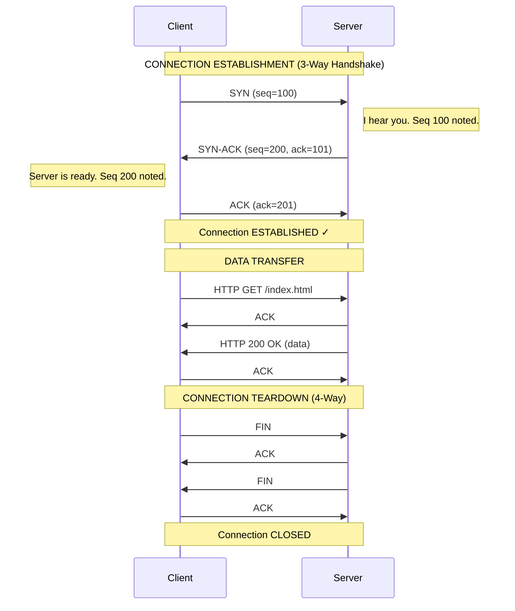
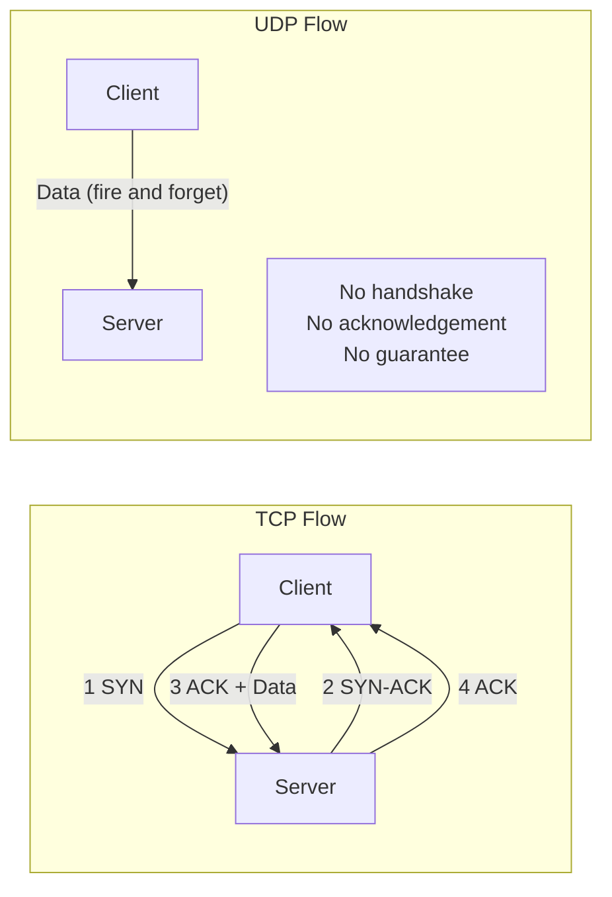

# TCP vs UDP

## Why This Topic Exists

When two computers want to exchange data over the internet, they need to agree on rules: how to start the conversation, what to do if a message is lost, how to know when the conversation is over. These rules are called **transport protocols**.

There are two main ones: **TCP** (Transmission Control Protocol) and **UDP** (User Datagram Protocol). They solve the same core problem — moving data from one place to another — but they make very different trade-offs. Choosing the wrong one can make your system slow, unreliable, or both. Every senior engineer understands this distinction deeply.

## Learning Objectives

By the end of this topic, you will be able to:

- Explain what TCP and UDP are and how they differ
- Describe the TCP 3-way handshake step by step
- List real-world use cases for each protocol
- Make an intelligent protocol choice when designing a system
- Explain this clearly in a system design interview

## Prerequisites

- [01. How the Internet Works](./01.%20How%20the%20Internet%20Works%20(BEGINNER).md) — specifically: IP addresses, packets, and routers

## Introduction

Imagine two ways of communicating:

1. **A phone call**: You dial, the other person picks up, you confirm you can hear each other, you talk, you say goodbye and hang up. Every word is heard. If the line drops, you know immediately and call back.

2. **A postcard**: You write a message and drop it in the mailbox. You do not know if it arrived. You do not get a confirmation. But it is cheap and fast to send.

**TCP is the phone call. UDP is the postcard.**

Both are useful. Which one you use depends entirely on what you are trying to do.

## Real-World Analogy

### TCP — The Phone Call

When you make a phone call:
- You **establish a connection** first (dial and wait for pickup)
- Both sides **confirm they are ready** to communicate
- Every word is delivered and heard **in order**
- If the signal drops, **both sides notice** and can retry
- You **formally end** the call ("bye, bye, okay bye")

This is TCP. Before any data is sent, a connection is established. Every packet is acknowledged. Lost packets are retransmitted. Data arrives in order.

### UDP — The Postcard

When you send a postcard:
- You write the message and mail it
- **No setup required** — you do not call ahead
- You have **no idea if it arrived**
- The postcard cannot be "in order" — there is only one
- It is **fast and cheap** to send

This is UDP. No connection. No acknowledgement. No ordering. Just send the data and hope for the best. But for many use cases, that is exactly what you want.

## Core Concepts

### TCP (Transmission Control Protocol)

TCP provides:

| Feature | Description |
|---------|-------------|
| Connection-oriented | A connection is established before data is sent |
| Reliable delivery | Lost packets are detected and retransmitted |
| Ordered delivery | Packets arrive in the same order they were sent |
| Error checking | Checksums detect corrupted data |
| Flow control | Prevents sender from overwhelming receiver |
| Congestion control | Reduces send rate when network is congested |

The cost of all this reliability is **overhead and latency**. Every packet requires acknowledgement. Lost packets require retransmission. The connection setup takes time.

### UDP (User Datagram Protocol)

UDP provides:

| Feature | Description |
|---------|-------------|
| Connectionless | No setup required — just send |
| No reliability | Packets can be lost with no notification |
| No ordering | Packets can arrive out of order |
| Error checking | Basic checksum only (optional) |
| No flow control | Sender can flood receiver |
| No congestion control | Sender does not back off under load |

The benefit is **low latency and low overhead**. No handshake. No waiting for acknowledgements. Just raw speed.

### The TCP 3-Way Handshake

Before TCP can send any data, it establishes a connection using a 3-way handshake:

**Step 1 — SYN (Synchronize):**
Client sends a SYN packet to the server saying "I want to connect. My sequence number starts at X."

**Step 2 — SYN-ACK (Synchronize-Acknowledge):**
Server responds with SYN-ACK saying "I got your request. I am ready. My sequence number starts at Y. I acknowledge your sequence number X+1."

**Step 3 — ACK (Acknowledge):**
Client sends ACK saying "I acknowledge your sequence number Y+1. Connection established. Let us talk."

Only after this handshake does actual data transfer begin.

**Why sequence numbers?**
Sequence numbers let TCP put packets back in order at the receiver and detect gaps (missing packets).

**The cost:**
The 3-way handshake adds at least one full round trip (RTT) of latency before any data flows. On a 100ms RTT link, that is 100ms before the first byte of data is sent. This is why HTTP/3 (which uses QUIC/UDP) was invented — to eliminate this setup cost.

## Visual Diagram

### TCP 3-Way Handshake

### TCP vs UDP Comparison

## Deep Explanation

### How TCP Handles Lost Packets

When a sender sends a packet, it starts a timer. If it does not receive an ACK within the timeout:
- It retransmits the packet
- It doubles the timeout (exponential backoff)
- After too many failures, the connection is terminated

This makes TCP reliable but adds latency when packets are lost. On a lossy network (like mobile), TCP's retransmission behavior can make things significantly slower.

### TCP Flow Control

TCP uses a **sliding window** to control how much data can be in-flight at once. The receiver tells the sender "I have X bytes of buffer available." The sender cannot send more than X bytes without an ACK. This prevents a fast sender from overwhelming a slow receiver.

### TCP Congestion Control

When the network between sender and receiver is congested (too many packets, routers are dropping things), TCP backs off. It:
1. Starts with a small window (slow start)
2. Grows the window exponentially until it detects packet loss
3. Backs off significantly on packet loss
4. Grows again more slowly

This is why a new TCP connection feels slow at first — it has not yet learned what the network can handle.

### Head-of-Line Blocking in TCP

A subtle but important TCP problem: if packet #5 is lost, TCP will not deliver packets #6, #7, #8 to the application even if they have already arrived. It waits for packet #5 to be retransmitted and received. This is called **head-of-line blocking** and is one reason HTTP/3 moved to UDP.

### Why UDP for Real-Time Applications?

In a video call, if a single packet of audio is lost:
- The gap lasts 20ms — barely noticeable
- Waiting for retransmission would delay all subsequent audio by 50–200ms — very noticeable
- So it is better to just play silence for 20ms and move on

In live streaming, in gaming, and in VoIP — a slightly degraded experience now is better than a perfect but delayed experience.

Application-layer protocols (like WebRTC, used for video calls) are built on top of UDP and add their own reliability mechanisms only where needed.

## Comparison Table

| Feature | TCP | UDP |
|---------|-----|-----|
| Connection | Required (3-way handshake) | Not required |
| Reliability | Guaranteed delivery | No guarantee |
| Ordering | Packets ordered | Packets may arrive out of order |
| Speed | Slower (due to overhead) | Faster |
| Error recovery | Automatic retransmission | Not built-in |
| Use cases | Web, email, file transfer, SSH | Video streaming, gaming, DNS, VoIP |
| Header size | 20 bytes minimum | 8 bytes |
| Congestion control | Yes | No |
| When packet lost | Wait and retransmit | Drop it and move on |

## Step-by-Step Example

### Scenario: Downloading a File vs Watching a Live Stream

**Downloading a File (TCP is right):**

1. You click download for a 500MB file.
2. Your browser opens a TCP connection to the server.
3. 3-way handshake completes.
4. Server sends the file as thousands of packets.
5. Your client sends ACK for each batch.
6. If packet #4,500 is lost in transit, TCP detects this (no ACK received).
7. Server retransmits packet #4,500.
8. Your client reassembles all packets in order.
9. The file you receive is 100% identical to the original.

If a single byte is wrong, the file is corrupt. You want TCP.

**Watching a Live Sports Stream (UDP is right):**

1. You open the stream. Video starts immediately (no 3-way handshake overhead).
2. The server sends video packets at 30 frames per second.
3. Packet for frame #450 is lost.
4. Your player plays a slightly glitchy frame for 33ms.
5. The stream continues with frame #451.
6. You did not notice the glitch.

If UDP had waited for retransmission, you would have seen a freeze. UDP is right here.

## Advantages / Disadvantages / Trade-offs

### TCP Advantages
- Data integrity guaranteed
- Ordering guaranteed
- Works correctly even on lossy networks
- Widely supported and battle-tested

### TCP Disadvantages
- Connection setup adds latency (1 RTT minimum)
- Head-of-line blocking
- Higher CPU and memory overhead
- Not ideal for real-time or latency-sensitive applications

### UDP Advantages
- No connection setup — lowest possible latency
- No head-of-line blocking
- Lower CPU and memory overhead
- Application can implement custom reliability as needed

### UDP Disadvantages
- No built-in reliability — application must handle this
- No ordering — application must handle reordering
- Prone to amplification attacks (used in DDoS)

## When to Use / When NOT to Use

### Use TCP when:
- Data integrity is critical (file transfer, email, banking transactions)
- You are building a web API (HTTP is built on TCP)
- Ordering matters (database replication, command streaming)
- You cannot tolerate data loss

### Use UDP when:
- Low latency matters more than reliability (gaming, VoIP, video calls)
- You are sending small, independent messages (DNS queries)
- You are streaming live data where stale data is worthless (live video, stock tickers)
- You are building your own transport protocol on top (QUIC is UDP-based)

### Real-world protocol choices:

| Application | Protocol | Reason |
|-------------|----------|--------|
| Web browsing (HTTP/1.1, HTTP/2) | TCP | Reliability needed for HTML, CSS, JS |
| Web browsing (HTTP/3) | UDP (QUIC) | Avoid TCP head-of-line blocking |
| Email (SMTP, IMAP) | TCP | Cannot lose email |
| File transfer (FTP, SCP) | TCP | Cannot corrupt files |
| DNS queries | UDP | Small, fast, one-shot queries |
| Video streaming (Netflix) | TCP (DASH) | Needs reliable delivery for video segments |
| Live video calls (Zoom, WebRTC) | UDP | Latency beats reliability |
| Online gaming | UDP | Stale position data is worthless |
| SSH | TCP | Interactive terminal needs reliability and order |

## Common Interview Questions

**Q: What is the TCP 3-way handshake?**
A: SYN → SYN-ACK → ACK. The client sends SYN to initiate. The server responds with SYN-ACK. The client confirms with ACK. After this, data flows.

**Q: Why does DNS use UDP?**
A: DNS queries are tiny (under 512 bytes typically) and can fit in a single packet. If the response is lost, the client just retries. The overhead of a TCP connection is unnecessary for such small, simple exchanges.

**Q: Why does Netflix use TCP if video streaming could use UDP?**
A: Netflix uses adaptive bitrate streaming (DASH/HLS), where the video is pre-encoded and stored as segments. The player downloads segments in advance and buffers them. Reliability matters more than ultra-low latency here. Live streaming (Twitch, sports) sometimes uses UDP-based protocols for lower latency.

**Q: What is head-of-line blocking?**
A: In TCP, if one packet in a stream is lost, all subsequent packets must wait for that packet to be retransmitted before the application can process them. This creates a "head-of-line" that blocks everything behind it.

**Q: What is QUIC and why does it use UDP?**
A: QUIC is a transport protocol developed by Google (now an IETF standard), used by HTTP/3. It runs on UDP to avoid TCP's head-of-line blocking and connection setup latency while implementing its own reliability and ordering per-stream.

## Common Beginner Mistakes

**Mistake 1: Thinking UDP is always faster than TCP.**
UDP has lower overhead, but if your application needs to implement reliability on top of UDP (like QUIC does), the total overhead can be comparable. UDP is faster for truly fire-and-forget scenarios.

**Mistake 2: Always choosing TCP to be safe.**
Many beginners default to TCP because it feels safer. But for real-time systems — gaming, VoIP, live streaming — TCP's retransmission behavior causes worse user experience than just dropping packets.

**Mistake 3: Forgetting that the 3-way handshake has a latency cost.**
On every new TCP connection, you pay at least 1 RTT before data flows. On mobile networks (50–150ms RTT), this matters. This is why HTTP keep-alive and connection pooling exist — to reuse connections.

**Mistake 4: Thinking TCP guarantees message boundaries.**
TCP is a stream protocol. If you send "hello" and "world" in two writes, the receiver might get "helloworld" or "hell" then "oworld". TCP preserves bytes, not messages. Applications must implement their own framing.

## Summary

TCP and UDP are the two main transport protocols. TCP is reliable, ordered, and connection-oriented — use it when data integrity matters. UDP is fast, lightweight, and connectionless — use it when low latency matters more than reliability.

The TCP 3-way handshake (SYN → SYN-ACK → ACK) establishes a connection before data flows, adding reliability at the cost of latency. UDP skips all setup and sends immediately.

Understanding this trade-off is fundamental to system design. Every time you choose an API style, a streaming approach, or a communication pattern, you are implicitly making a TCP-vs-UDP trade-off.

## Key Takeaways

- TCP = phone call (reliable, ordered, connection-required, slower setup)
- UDP = postcard (unreliable, unordered, no setup, fast)
- TCP 3-way handshake: SYN → SYN-ACK → ACK
- Use TCP for web, email, file transfer, databases
- Use UDP for gaming, VoIP, live video, DNS
- HTTP/3 runs on UDP (via QUIC) to eliminate TCP's head-of-line blocking
- TCP is a byte stream, not a message protocol — you must implement framing yourself

## Related Topics

- [01. How the Internet Works](./01.%20How%20the%20Internet%20Works%20(BEGINNER).md) — IP addresses and packets
- [03. HTTP and HTTPS](./03.%20HTTP%20and%20HTTPS%20(BEGINNER).md) — HTTP is built on top of TCP
- [06. WebSockets and Long Polling](./06.%20WebSockets%20and%20Long%20Polling%20(INTERMEDIATE).md) — real-time communication built on TCP
- [README](./README.md) — chapter overview
