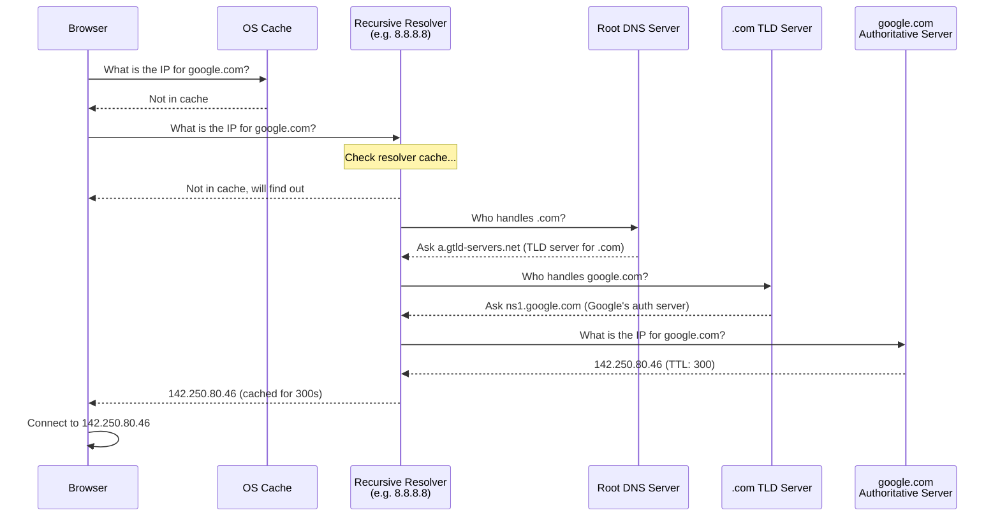

# DNS - Domain Name System

## Why This Topic Exists

Every time you visit a website, send an email, or make an API call, DNS is working invisibly behind the scenes. DNS is the reason you can type `google.com` instead of `142.250.80.46`. It is one of the most critical pieces of internet infrastructure — and it directly affects system design decisions.

As a system designer, you will use DNS for load balancing, CDN routing, failover, and blue-green deployments. When DNS is misconfigured, entire services go down. When TTLs are wrong, deployments fail to propagate. Understanding DNS is not optional.

## Learning Objectives

By the end of this topic, you will be able to:

- Explain what DNS does and why it exists
- Describe the DNS hierarchy (root, TLD, authoritative)
- Walk through a full DNS resolution process step by step
- Explain what TTL is and why it matters for deployments
- List the main DNS record types (A, CNAME, MX, NS, TXT) and their uses
- Explain DNS caching and where caching happens
- Describe how DNS is used for load balancing, CDN routing, and failover

## Prerequisites

- [01. How the Internet Works](./01.%20How%20the%20Internet%20Works%20(BEGINNER).md) — IP addresses, packets, routers
- [02. TCP vs UDP](./02.%20TCP%20vs%20UDP%20(BEGINNER).md) — DNS uses UDP

## Introduction

When the internet was first designed, computers were given numeric addresses (IP addresses). This works fine for machines, but humans are terrible at remembering numbers. `142.250.80.46` is hard to remember. `google.com` is not.

DNS was created in 1983 to solve this: a distributed system that translates human-readable domain names into IP addresses that computers can route to.

The staggering scale: DNS handles over **3 trillion queries per day** worldwide. It is one of the most heavily used systems ever built. And it does all this with a hierarchical, distributed, cached architecture that is elegant in its design.

## Real-World Analogy

DNS is the phone book of the internet.

In the old days, you had a phone book. You looked up "Pizza Palace" and found the phone number "555-0123". You did not need to memorize the number — you just knew the name. The phone book translated name to number.

DNS does exactly this:
- **Name**: `google.com`
- **Phone book (DNS)**: translates it
- **Number (IP address)**: `142.250.80.46`

But unlike a single phone book, DNS is a **distributed, hierarchical phone book** — no single server has all the answers, but the system knows exactly who to ask next.

## Core Concepts

### The DNS Hierarchy

DNS is organized as a tree. At the top is the **root**, below that are **Top-Level Domains (TLDs)**, below that are **Second-Level Domains**, and so on.

```
.                           ← Root (top of the tree)
├── .com
│   ├── google.com
│   │   ├── www.google.com
│   │   └── mail.google.com
│   └── amazon.com
├── .org
│   └── wikipedia.org
├── .in
│   └── flipkart.in
└── .io
    └── github.io
```

**Root DNS servers**: 13 root server clusters (named a.root-servers.net through m.root-servers.net), distributed globally. They know about all TLDs.

**TLD DNS servers**: Servers for `.com`, `.org`, `.net`, `.in`, etc. They know about all second-level domains under their TLD.

**Authoritative DNS servers**: The final authority for a specific domain. `google.com` has its own authoritative DNS servers that know about all subdomains under `google.com`.

### DNS Resolver (Recursive Resolver)

When you make a DNS query, your computer does not talk directly to root servers. It talks to a **recursive resolver** — usually provided by:
- Your ISP (default)
- A public resolver like Google (8.8.8.8) or Cloudflare (1.1.1.1)

The resolver does the hard work: it walks the DNS hierarchy on your behalf and returns the final answer.

### TTL — Time to Live

Every DNS record has a **TTL** (Time to Live) in seconds. It tells resolvers how long to cache the answer.

```
google.com.   300   IN   A   142.250.80.46
                ↑
         TTL: 300 seconds = 5 minutes
```

After TTL expires, the resolver must ask again. Before expiry, it returns the cached answer without asking.

**TTL trade-offs:**

| TTL | Behavior | Use case |
|-----|----------|---------|
| Low (60s) | Changes propagate fast, more DNS queries | During deployments, failover |
| High (3600s) | Changes propagate slowly, fewer queries | Stable production records |

**Important rule for deployments**: Lower your TTL **before** making a change, not during. If TTL is 3600 (1 hour), and you change the IP, clients may point to the old IP for up to an hour. Lower TTL to 60s hours before the change.

## Visual Diagram

### DNS Resolution Process



## Deep Explanation

### DNS Caching Layers

DNS answers are cached at multiple levels, reducing latency and load on DNS servers:

1. **Browser cache**: Chrome, Firefox cache DNS lookups (typically 1 minute)
2. **OS cache**: The operating system maintains a DNS cache (check with `ipconfig /displaydns` on Windows)
3. **Router cache**: Your home router may cache DNS
4. **ISP/Resolver cache**: Your recursive resolver caches results

When you ask for `google.com`, the system walks up these layers. On a cache hit at any level, resolution returns immediately without going to DNS servers.

### DNS Record Types

DNS stores different types of records for different purposes:

| Record Type | Purpose | Example |
|------------|---------|---------|
| A | Maps hostname to IPv4 address | `google.com → 142.250.80.46` |
| AAAA | Maps hostname to IPv6 address | `google.com → 2607:f8b0::6a` |
| CNAME | Alias — points one name to another name | `www.google.com → google.com` |
| MX | Mail exchange — where to deliver email | `google.com → aspmx.l.google.com` |
| NS | Name server — which servers are authoritative | `google.com → ns1.google.com` |
| TXT | Arbitrary text — used for verification, SPF, DKIM | `google.com → "v=spf1 include:..."` |
| SOA | Start of Authority — zone metadata | Contains primary NS, admin email, serial number |
| PTR | Reverse DNS — IP to hostname | `142.250.80.46 → google.com` |
| SRV | Service location — hostname and port for a service | Used by SIP, XMPP, Kubernetes |

**A vs CNAME:**

- **A record**: directly maps a name to an IP. `api.example.com → 203.0.113.5`
- **CNAME**: maps a name to another name. `www.example.com → example.com`

A CNAME cannot be used at the zone apex (root of a domain). You cannot make `example.com` a CNAME — only subdomains can be CNAMEs. This is why many DNS providers offer ALIAS or ANAME records that work like CNAME but can be used at the apex.

**Why CNAME matters:**
When you use a CDN like Cloudflare, you point a CNAME from `www.example.com` to `example.cdn.cloudflare.net`. Cloudflare resolves that name to the nearest CDN server's IP. When Cloudflare changes their IPs, you do not need to update your DNS.

### How DNS Is Used for Load Balancing

DNS can return multiple A records for the same hostname:

```
api.example.com    60    A    203.0.113.1
api.example.com    60    A    203.0.113.2
api.example.com    60    A    203.0.113.3
```

Clients will use one of these IPs (typically the first one in the list). The DNS resolver may rotate the order (round-robin DNS), distributing traffic across servers.

**Limitations of DNS load balancing:**
- Clients cache the IP and keep using it until TTL expires
- No health checking — DNS will return an IP even if that server is down
- No session affinity

This is why proper load balancers (like nginx or AWS ALB) are used for serious traffic distribution, with DNS just pointing to the load balancer.

### DNS for CDN Routing (GeoDNS)

CDN providers use **GeoDNS** (also called Geo-aware DNS) to return different IPs based on where the client is located:

```
User in New York asks for: www.example.com
→ DNS returns: 203.0.113.5 (CDN server in New York)

User in Mumbai asks for: www.example.com
→ DNS returns: 203.0.113.99 (CDN server in Mumbai)
```

The DNS resolver detects the user's approximate location (based on the resolver's IP) and returns the IP of the nearest CDN node.

This is how CDNs like Cloudflare and Akamai route users to nearby servers with zero application-level logic.

### DNS Failover

When a server fails, DNS can be updated to point to a healthy server. This is called **DNS failover**.

The process:
1. Monitor detects that `203.0.113.5` is down
2. DNS record for `api.example.com` is updated to `203.0.113.6` (the backup)
3. New clients (after TTL expires) get the new IP

**The problem**: Failover is only as fast as your TTL. With a 3600s TTL, it takes up to an hour for all clients to get the new IP. This is why DNS is not suitable as the only failover mechanism for critical systems. Load balancers with health checks (which operate at the IP layer, not DNS) fail over in seconds.

### DNS Security

**DNS Spoofing / Cache Poisoning**: An attacker can trick a resolver into caching a wrong IP for a domain (sending you to a fake website). DNSSEC (DNS Security Extensions) uses cryptographic signatures to prevent this.

**DNS over HTTPS (DoH)**: Traditional DNS queries are unencrypted — your ISP can see every domain you query. DoH sends DNS queries over HTTPS, encrypting them. Implemented by Firefox, Chrome, and OS-level resolvers.

**DNS Amplification Attacks**: DNS responses can be much larger than requests. Attackers spoof the source IP to be a victim's IP, send small queries to many DNS servers, and the victim gets flooded with large responses. Mitigated by limiting recursive queries to trusted clients.

## Step-by-Step Example

### Deploying a New Server Without Downtime

You are moving `api.example.com` from an old server (`203.0.113.5`) to a new one (`203.0.113.99`).

**Wrong approach:**
1. Change DNS A record from `.5` to `.99`
2. Wait and hope clients get the new IP quickly
3. Some clients are stuck on old IP for 3600 seconds (1 hour) and see errors

**Right approach:**
1. **24+ hours before migration**: Lower TTL from 3600 to 60
2. Wait for 3600 seconds (old TTL) so all caches expire
3. **At migration time**: Update DNS A record from `.5` to `.99`
4. Within 60 seconds, all clients switch to new server
5. **After migration**: Raise TTL back to 3600

## Advantages / Disadvantages / Trade-offs

| Aspect | Detail |
|--------|--------|
| Distributed | No single point of failure — root, TLD, and authoritative servers are distributed globally |
| Scalable | Caching means most queries are answered locally without reaching authoritative servers |
| Propagation delay | Changes take time to propagate based on TTL — not instant |
| No health awareness | DNS does not know if a server is healthy — needs external monitoring |
| Eventually consistent | DNS is not strongly consistent — different clients may get different answers during a TTL window |

## When to Use / When NOT to Use

**Use DNS for:**
- Routing users to the nearest CDN server (GeoDNS)
- Simple round-robin load distribution across identical servers
- DNS-based failover (where failover time in the TTL range is acceptable)
- Pointing subdomains to CDNs, third-party services

**Do NOT rely on DNS alone for:**
- Sub-second failover (use a load balancer with health checks)
- Session-aware load balancing (DNS is not sticky)
- Traffic splitting / A/B testing (use an application-layer load balancer)

## Common Interview Questions

**Q: What is a TTL in DNS and why does it matter?**
A: TTL (Time to Live) is how long DNS resolvers cache a record. A high TTL reduces DNS queries but makes changes propagate slowly. For deployments, lower TTL before making changes so the change propagates quickly.

**Q: What is the difference between an A record and a CNAME?**
A: An A record maps a name to an IP address. A CNAME maps a name to another name (alias). Use CNAME to point a subdomain to a CDN hostname; the CDN handles IP management. CNAME cannot be used at the domain apex.

**Q: How does DNS-based load balancing work? What are its limitations?**
A: DNS returns multiple A records and clients pick one. Limitation: no health checking, client caching means one server may be overloaded, no session affinity.

**Q: What is GeoDNS?**
A: DNS that returns different IP addresses based on the geographic location of the requesting resolver. Used by CDNs to route users to nearby servers.

**Q: Why might your DNS change take an hour to propagate even though you just updated it?**
A: The old TTL was 3600 seconds (1 hour). Resolvers cached the old IP and will not re-query until that TTL expires. This is why you should lower TTL before making changes.

## Common Beginner Mistakes

**Mistake 1: Expecting DNS changes to take effect immediately.**
DNS propagation takes as long as the TTL of the old record. Always lower TTL before making changes.

**Mistake 2: Using CNAME at the domain apex.**
`example.com` cannot be a CNAME. Only subdomains like `www.example.com` can. Use ALIAS/ANAME records or A records at the apex.

**Mistake 3: Relying on DNS for health-based failover.**
DNS does not check if your server is healthy. A failed server will still receive traffic until DNS is manually updated. Use a load balancer with health checks for real failover.

**Mistake 4: Not understanding caching layers.**
When you clear your own DNS cache (`ipconfig /flushdns`), that only clears your OS cache. ISP resolvers still have the old entry until their TTL expires.

**Mistake 5: Hardcoding IP addresses instead of DNS names.**
Always use DNS names in configuration. IP addresses of services change. DNS names let you update the mapping without changing config everywhere.

## Summary

DNS is the distributed, hierarchical phone book of the internet. It translates domain names (human-readable) to IP addresses (machine-readable).

The hierarchy: your computer → recursive resolver → root DNS → TLD DNS → authoritative DNS.

DNS records (A, CNAME, MX, NS, TXT) store different types of mappings. TTL controls caching duration. Low TTL = fast propagation, more queries. High TTL = slow propagation, fewer queries.

In system design, DNS enables CDN routing, load distribution, and failover — but its propagation delay and lack of health awareness mean it is always paired with other mechanisms for critical systems.

## Key Takeaways

- DNS translates domain names to IP addresses
- Resolution hierarchy: resolver → root → TLD → authoritative
- TTL controls how long resolvers cache answers — lower it before deployments
- A record = name to IP; CNAME = name to name; MX = mail server; NS = name server
- DNS caches at browser, OS, router, and resolver levels
- GeoDNS routes users to nearest servers — how CDNs work
- DNS failover works but is limited by TTL propagation delay
- Never rely on DNS alone for sub-second failover

## Related Topics

- [01. How the Internet Works](./01.%20How%20the%20Internet%20Works%20(BEGINNER).md) — IP addresses and the internet
- [03. HTTP and HTTPS](./03.%20HTTP%20and%20HTTPS%20(BEGINNER).md) — HTTP request lifecycle starts with DNS
- [07. CDN - Content Delivery Network](./07.%20CDN%20-%20Content%20Delivery%20Network%20(BEGINNER).md) — CDNs use DNS for geographic routing
- [README](./README.md) — chapter overview
