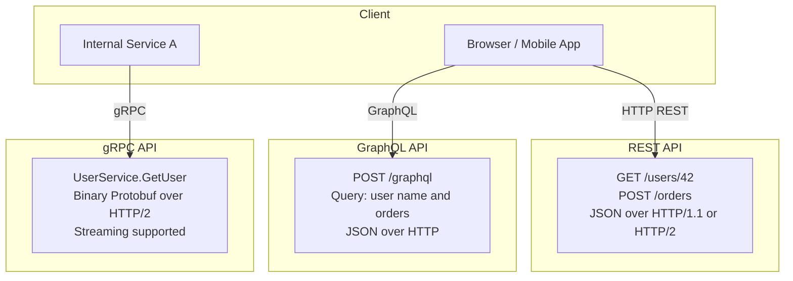

# APIs - REST, GraphQL, and gRPC

## Why This Topic Exists

Every modern system is built from services that talk to each other. Your frontend talks to your backend. Your backend talks to payment services, databases, and third-party APIs. How these services communicate — the contract and protocol they agree on — is called an API.

Choosing the wrong API style is a common and costly mistake. REST, GraphQL, and gRPC are three fundamentally different approaches, each optimized for different situations. Senior engineers choose deliberately. This topic explains what each is, why it exists, and when to use it.

## Learning Objectives

By the end of this topic, you will be able to:

- Explain what an API is and why APIs exist
- Describe the principles of REST (resources, stateless, CRUD, HTTP methods)
- Explain GraphQL and how it solves over-fetching and under-fetching
- Explain gRPC and why it is used for microservices
- Compare all three in a table and choose intelligently
- List common REST API design mistakes and how to avoid them
- Discuss API design in a system design interview

## Prerequisites

- [03. HTTP and HTTPS](./03.%20HTTP%20and%20HTTPS%20(BEGINNER).md) — HTTP methods, status codes, headers
- [02. TCP vs UDP](./02.%20TCP%20vs%20UDP%20(BEGINNER).md) — gRPC uses HTTP/2 over TCP

## Introduction

An **API** (Application Programming Interface) is a contract between two pieces of software. It defines what requests can be made, what format those requests must take, and what responses will be returned.

Think of an API as a wall between your code and someone else's code. You do not care how the other side is implemented. You only care about the menu — what you can ask for and what you will get back.

APIs are everywhere:
- Your weather app calls a weather API
- Your payment form calls Stripe's API
- Your frontend React app calls your backend API
- Your order service calls your inventory service

## Real-World Analogy

Imagine a restaurant:

- **The menu** is the API — it lists what you can order, what format to ask in, and what you will receive.
- **You (the customer)** are the client — you place orders but never enter the kitchen.
- **The kitchen** is the server — it processes requests and sends responses.
- **The waiter** is the API layer — mediates between you and the kitchen.

You do not need to know how the kitchen makes pasta. You just say "I want the spaghetti carbonara" (the API call) and you receive the dish (the response).

Different API styles are like different types of restaurants:
- **REST** is a diner with a traditional menu — fixed items, clear sections, familiar to everyone.
- **GraphQL** is a custom order restaurant — you tell them exactly what you want, and they make it.
- **gRPC** is a fast food drive-through — highly efficient, specific interactions, no frills.

## Core Concepts

### What is REST?

**REST** (Representational State Transfer) is an architectural style for building APIs on top of HTTP. It was defined by Roy Fielding in his 2000 PhD dissertation.

REST is not a protocol or a standard — it is a set of **constraints and principles**:

1. **Resources**: Everything is a resource (users, orders, products). Resources are identified by URLs.
2. **HTTP Methods**: Use the right method for the right action (GET to read, POST to create, etc.)
3. **Stateless**: No session state is stored on the server between requests.
4. **Representations**: Resources can be represented in different formats (JSON, XML). JSON is standard today.
5. **Uniform Interface**: Consistent URL structure and method usage across all resources.

**REST URL conventions:**

| Resource | GET (read) | POST (create) | PUT/PATCH (update) | DELETE |
|----------|-----------|--------------|-------------------|--------|
| /users | Get all users | Create user | — | — |
| /users/42 | Get user 42 | — | Update user 42 | Delete user 42 |
| /users/42/orders | Get user 42's orders | Create order for user 42 | — | — |
| /users/42/orders/7 | Get order 7 of user 42 | — | Update order 7 | Delete order 7 |

### What is GraphQL?

**GraphQL** is a query language for APIs developed by Facebook in 2012 and open-sourced in 2015.

In REST, you call an endpoint and get back a fixed shape of data. GraphQL flips this: you send a query describing **exactly what data you want**, and you get back exactly that — nothing more, nothing less.

**REST problem: Over-fetching**
You call `GET /users/42` and get:
```json
{
  "id": 42,
  "name": "Alice",
  "email": "alice@example.com",
  "phone": "555-0123",
  "address": {...},
  "preferences": {...},
  "billing": {...}
}
```
But you only needed the name and email. The rest is wasted bandwidth.

**REST problem: Under-fetching**
You want to show a user's name and their 3 most recent orders. With REST:
- Call 1: `GET /users/42` — get user
- Call 2: `GET /users/42/orders?limit=3` — get orders

Two round trips. On mobile over a slow network, this hurts.

**GraphQL solution:**
```graphql
query {
  user(id: 42) {
    name
    email
    orders(last: 3) {
      id
      total
      status
    }
  }
}
```

One request. You get exactly:
```json
{
  "user": {
    "name": "Alice",
    "email": "alice@example.com",
    "orders": [
      {"id": 7, "total": 49.99, "status": "shipped"},
      {"id": 6, "total": 12.50, "status": "delivered"},
      {"id": 5, "total": 89.00, "status": "delivered"}
    ]
  }
}
```

No over-fetching. No under-fetching. One endpoint (`/graphql`).

### What is gRPC?

**gRPC** (Google Remote Procedure Call) is a high-performance RPC framework developed by Google, open-sourced in 2015.

Instead of HTTP+JSON (which is text-based), gRPC uses:
- **Protocol Buffers (protobuf)**: a binary serialization format — much smaller and faster than JSON
- **HTTP/2**: supports streaming and multiplexing
- **Code generation**: you define your API in a `.proto` file, and gRPC generates client and server code in multiple languages

Think of gRPC as calling a function on another computer directly, without manually constructing HTTP requests. You define the function signature in protobuf, and gRPC handles the network transport.

**Protobuf definition:**
```protobuf
service UserService {
  rpc GetUser (GetUserRequest) returns (User);
  rpc ListUsers (ListUsersRequest) returns (stream User);
}

message GetUserRequest {
  int64 user_id = 1;
}

message User {
  int64 id = 1;
  string name = 2;
  string email = 3;
}
```

**Generated code usage (Go):**
```go
user, err := client.GetUser(ctx, &pb.GetUserRequest{UserId: 42})
```

It looks like a local function call. gRPC handles serialization, transport, and deserialization.

## Visual Diagram



## Deep Explanation

### REST in Depth

**Maturity Model (Richardson Maturity Model):**

Level 0: One endpoint, one method (bad REST)
Level 1: Multiple resources, one method
Level 2: Multiple resources, correct HTTP methods ← most APIs are here
Level 3: HATEOAS (responses include links to next actions) ← rare in practice

**REST is not a standard**: Many APIs call themselves REST but violate its principles. Common violations:
- Using `/getUser?id=42` instead of `GET /users/42`
- Using POST for everything
- Returning 200 OK with an error body

**REST strengths:**
- Universal understanding — every developer knows REST
- Works with every HTTP client, browser, and framework
- Easy to test with curl or Postman
- Cacheable (GET requests can be cached by browsers and CDNs)

**REST weaknesses:**
- Over-fetching (getting more data than needed)
- Under-fetching (needing multiple requests)
- No type safety between client and server
- Versioning is painful (`/v1/users`, `/v2/users`)

### GraphQL in Depth

GraphQL has three operation types:

**Query** (read data):
```graphql
query GetUser {
  user(id: 42) {
    name
    email
  }
}
```

**Mutation** (write data):
```graphql
mutation CreateUser {
  createUser(input: {name: "Bob", email: "bob@example.com"}) {
    id
    name
  }
}
```

**Subscription** (real-time data):
```graphql
subscription OnOrderUpdate {
  orderUpdated(userId: 42) {
    id
    status
  }
}
```

**GraphQL strengths:**
- No over-fetching or under-fetching
- One endpoint for all operations
- Self-documenting (introspection — clients can query the schema)
- Strongly typed schema
- Great for complex, nested data

**GraphQL weaknesses:**
- More complex to implement on the server
- Caching is harder (all requests are POST to one endpoint)
- N+1 query problem (a query for 100 users and their orders might trigger 101 DB queries without careful optimization — use DataLoader)
- Overkill for simple CRUD APIs
- Learning curve for clients unfamiliar with GraphQL

### gRPC in Depth

**Why protobuf is faster than JSON:**

JSON:
```json
{"user_id": 42, "name": "Alice Johnson", "email": "alice@example.com"}
```
This is 60 bytes of text that must be parsed character by character.

Protobuf encodes the same data as roughly 25 bytes of binary. It is 2-10x smaller than JSON and much faster to serialize/deserialize.

**gRPC streaming types:**

| Type | Description | Use case |
|------|-------------|---------|
| Unary | One request, one response | Standard API call |
| Server streaming | One request, multiple responses | Real-time feeds, file download |
| Client streaming | Multiple requests, one response | File upload, batching |
| Bidirectional streaming | Both sides stream | Chat, live video |

**gRPC strengths:**
- Very high performance (binary protocol, HTTP/2)
- Strong typing via protobuf
- Code generation eliminates client/server contract mismatches
- Native streaming support
- Great for microservices

**gRPC weaknesses:**
- Not human-readable (binary) — harder to debug
- Requires protobuf tooling
- Browser support is limited (gRPC-web is a workaround)
- Larger learning curve
- Not as universal as REST

## Comparison Table

| Feature | REST | GraphQL | gRPC |
|---------|------|---------|------|
| Protocol | HTTP/1.1 or HTTP/2 | HTTP/1.1 or HTTP/2 | HTTP/2 |
| Data format | JSON (usually) | JSON | Binary (Protobuf) |
| Endpoint structure | Multiple (`/users`, `/orders`) | Single (`/graphql`) | Multiple methods |
| Request style | URL + method | Query language | Method call |
| Over-fetching | Yes | No | No |
| Under-fetching | Yes | No | No |
| Streaming | Limited (SSE) | Subscriptions | Native (4 types) |
| Type safety | No (unless OpenAPI) | Yes (schema) | Yes (protobuf) |
| Browser support | Excellent | Excellent | Limited (gRPC-web) |
| Debugging | Easy (readable) | Moderate | Hard (binary) |
| Caching | Native HTTP caching | Custom | Custom |
| Learning curve | Low | Medium | High |
| Best for | Public APIs, simple CRUD | Complex frontend queries | Microservice-to-service |

## Step-by-Step Example

### Building a Social Media API

You are building an API for a Twitter-like app. Let us see how each style handles "get user profile with their last 5 tweets and follower count":

**REST (3 requests):**
```http
GET /users/42
GET /users/42/tweets?limit=5
GET /users/42/followers/count
```
Three round trips. On mobile, this adds up.

**GraphQL (1 request):**
```graphql
query {
  user(id: 42) {
    id
    username
    bio
    followerCount
    tweets(last: 5) {
      id
      text
      likeCount
      createdAt
    }
  }
}
```
One round trip, exactly the data needed.

**gRPC (for internal user service):**
```protobuf
service UserService {
  rpc GetUserProfile (GetUserProfileRequest) returns (UserProfile);
}
```
Binary, low latency, used between your backend services.

## Advantages / Disadvantages / Trade-offs

### REST
- Simple, universal, well-understood
- Works everywhere, no special tooling
- Caching built-in via HTTP
- Can lead to over-fetching, under-fetching in complex UIs

### GraphQL
- Optimal data loading for frontends
- Single endpoint, flexible queries
- Server complexity increases (resolver functions, DataLoader)
- Harder to cache, N+1 query risk

### gRPC
- Highest performance
- Strong typing, code generation
- Not browser-native, binary format is opaque
- Best suited for internal service-to-service

## When to Use / When NOT to Use

**Use REST when:**
- Building a public API (developers expect REST)
- Simple CRUD operations
- Need HTTP caching for GET requests
- Team has varying skill levels (REST is easiest to learn)

**Use GraphQL when:**
- Building complex frontends with varied data needs (mobile app with different screens needing different data)
- Different clients (mobile, web, tablet) need different data shapes
- You want a self-documenting, explorable API (GraphiQL)
- Reducing over-fetching matters (mobile bandwidth)

**Use gRPC when:**
- Internal microservice-to-microservice communication
- High-performance, low-latency requirements
- Streaming is needed (real-time feeds, file uploads)
- Strong typing and code generation between services is valuable
- You control both client and server

**Do NOT use gRPC for:**
- Public APIs (poor browser support, not human-readable)
- Simple projects where the overhead is not justified

## Common REST API Design Mistakes

1. **Using verbs in URLs**: `/getUser` should be `GET /users/{id}`
2. **Inconsistent naming**: `/user_profiles` vs `/orders` — pick snake_case or camelCase and stick with it
3. **Wrong HTTP methods**: `POST /deleteUser` should be `DELETE /users/{id}`
4. **Returning 200 for errors**: Return `404` when the resource does not exist, not `200 {"error": "not found"}`
5. **Not versioning**: When you make breaking changes, use `/v2/users` — do not break existing clients
6. **No pagination**: `GET /users` returning all 10 million users will crash your server
7. **Exposing internal IDs**: Use UUIDs instead of sequential IDs in URLs to prevent enumeration attacks
8. **Not using proper status codes**: Learn the status codes — 201 for created, 204 for deleted, 400 for bad input, 401/403 for auth

## Common Interview Questions

**Q: What is the difference between REST and GraphQL?**
A: REST has multiple endpoints, each returning a fixed shape. GraphQL has one endpoint with a query language — clients specify exactly what data they want, eliminating over-fetching and under-fetching.

**Q: When would you use gRPC over REST?**
A: For internal microservice communication where performance matters. gRPC uses binary protobuf (2-10x smaller than JSON) and HTTP/2 for multiplexing. Not suitable for public APIs due to browser limitations.

**Q: What is over-fetching and under-fetching?**
A: Over-fetching: getting more data than needed (wasted bandwidth). Under-fetching: not getting enough data in one request, requiring multiple calls. GraphQL solves both.

**Q: What is the N+1 problem in GraphQL?**
A: If you query 100 users and each user has an orders field, a naive implementation makes 1 query for users + 100 queries for orders = 101 queries. Solution: DataLoader batches requests.

**Q: How do you version a REST API?**
A: Common approaches: URL versioning (`/v1/users`), header versioning (`API-Version: 1`), or accept header (`Accept: application/vnd.api+json;version=1`). URL versioning is most common and explicit.

## Common Beginner Mistakes

**Mistake 1: Thinking REST is a protocol.**
REST is an architectural style, not a protocol. HTTP is the protocol. REST is a set of constraints for using HTTP well.

**Mistake 2: Using GraphQL for everything.**
GraphQL adds server-side complexity. For a simple CRUD API, REST is simpler, better understood, and easier to cache.

**Mistake 3: Exposing database schema directly in REST.**
Your API is a contract. Your database schema is an implementation detail. Do not create a 1:1 mapping — design your API for consumers, not for your tables.

**Mistake 4: Forgetting that gRPC is hard to debug.**
Binary protobuf is not human-readable. You need specialized tools (grpcurl, Bloomrpc) to inspect gRPC traffic. Factor this into your debugging and monitoring strategy.

## Summary

APIs are contracts between services. REST uses HTTP methods and URL conventions — simple, universal, ideal for public APIs. GraphQL uses a query language — flexible, no over/under-fetching, ideal for complex frontends. gRPC uses binary protobuf over HTTP/2 — high performance, strongly typed, ideal for internal microservices.

Choose based on who your clients are, what performance you need, and how much complexity you can afford. For public APIs: REST. For complex mobile/web frontends: GraphQL. For internal microservices: gRPC.

## Key Takeaways

- An API is a contract — what can be requested and what will be returned
- REST: multiple endpoints, HTTP verbs, JSON, universal, cacheable
- GraphQL: one endpoint, query language, no over/under-fetching, strong schema
- gRPC: binary protobuf, HTTP/2, code generation, high performance, internal use
- Public API = REST. Complex frontend = GraphQL. Microservices = gRPC
- Common REST mistakes: verbs in URLs, wrong status codes, no versioning, no pagination
- N+1 problem in GraphQL: solved by DataLoader

## Related Topics

- [03. HTTP and HTTPS](./03.%20HTTP%20and%20HTTPS%20(BEGINNER).md) — REST and GraphQL are built on HTTP
- [02. TCP vs UDP](./02.%20TCP%20vs%20UDP%20(BEGINNER).md) — gRPC runs on HTTP/2 over TCP
- [06. WebSockets and Long Polling](./06.%20WebSockets%20and%20Long%20Polling%20(INTERMEDIATE).md) — when APIs need real-time push
- [README](./README.md) — chapter overview
