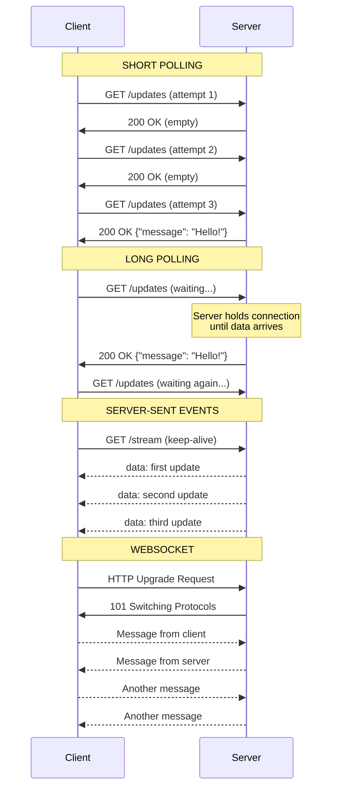
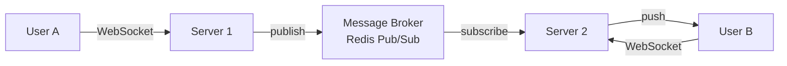

# WebSockets and Long Polling

## Why This Topic Exists

HTTP is a request-response protocol. The client asks, the server answers. The server cannot send data to the client unless the client asks first.

This works perfectly for loading web pages or calling APIs. But what about a chat application? What about live sports scores? What about collaborative editing where ten people are editing the same document simultaneously?

In these cases, the server needs to **push** data to the client the moment it becomes available. HTTP alone cannot do this. This topic covers the techniques engineers have developed to solve this problem — from simple polling hacks to full-duplex WebSocket connections.

This is an intermediate topic because it requires understanding HTTP and TCP first, and because real-time architecture is a common and challenging system design interview topic.

## Learning Objectives

By the end of this topic, you will be able to:

- Explain why HTTP alone is insufficient for real-time applications
- Describe short polling and its problems
- Describe long polling and how it differs from short polling
- Explain WebSockets — the persistent, bidirectional connection
- Explain Server-Sent Events (SSE) — one-way server push
- Compare all four approaches with a latency and efficiency table
- Choose the right approach for chat, live scores, collaborative editing, and stock tickers
- Discuss real-time design in a system design interview

## Prerequisites

- [03. HTTP and HTTPS](./03.%20HTTP%20and%20HTTPS%20(BEGINNER).md) — HTTP request/response cycle, status codes
- [02. TCP vs UDP](./02.%20TCP%20vs%20UDP%20(BEGINNER).md) — persistent TCP connections

## Introduction

The web was designed around a simple model: you ask for a page, the server sends it, done. HTTP is **pull-based** — the client always initiates.

But modern applications are **push-based**: new chat messages arrive, friend requests come in, stock prices change, your Uber driver moves on a map. None of these are initiated by the client — they happen on the server and must be pushed to the client.

Engineers have solved this with progressively better techniques. Understanding each technique — and why it was replaced — gives you deep insight into real-time system design.

## Real-World Analogy

Imagine you are waiting for a package delivery.

**Short Polling**: You call the courier every 5 minutes: "Has my package arrived?" They say no 47 times and yes once. You made 48 calls to learn one fact. Wasteful.

**Long Polling**: You call the courier and say "Do not hang up — just stay on the line and tell me when it arrives." They stay silent on the line for an hour, then say "It arrived!" One long call instead of 48 short ones.

**WebSockets**: The courier gives you a walkie-talkie. Now you can both talk at any time without initiating a new call each time. You can ask questions and get updates instantly.

**Server-Sent Events**: The courier sends you text messages only when something happens. You cannot reply to the texts — it is one-way. But you do not need to call them either.

## Core Concepts

### 1. Short Polling

The simplest approach: the client sends a new HTTP request every N seconds and asks "is there any new data?"

```
Client: Is there new data? → Server: No
[wait 2 seconds]
Client: Is there new data? → Server: No
[wait 2 seconds]
Client: Is there new data? → Server: Yes! Here it is.
```

**The problem**: Most of these requests return "no new data." You are paying the full cost of an HTTP request for nothing. At scale, this generates enormous unnecessary traffic. A chat app with 1 million users polling every 2 seconds makes 500,000 requests per second — nearly all useless.

### 2. Long Polling

An improvement: the client sends an HTTP request, but the server **holds the connection open** until data is available (or a timeout occurs). When data arrives, the server responds and the client immediately makes a new request.

```
Client: Any new data? →
[Server holds connection open... waiting...]
[New message arrives on server]
Server: → Yes! New message: "Hello"
Client: Any new data? →
[Server holds connection open... waiting...]
```

**Better than short polling**: connections are not constantly opened and closed. The client gets data immediately when it is available.

**Still has problems**:
- Every "poll" still establishes a new HTTP connection (1 RTT overhead)
- High server memory usage — each waiting connection holds a thread or file descriptor
- Cannot efficiently push to many clients simultaneously
- Still HTTP overhead (headers sent every request)

Long polling is how older real-time apps (Facebook Chat circa 2008) worked before WebSockets were available.

### 3. WebSockets

WebSockets provide a **persistent, full-duplex (two-way) communication channel** over a single TCP connection. Once established, both client and server can send messages to each other at any time with minimal overhead.

The connection starts as HTTP and upgrades:

1. Client sends a special HTTP request with `Upgrade: websocket` header
2. Server responds `101 Switching Protocols`
3. The TCP connection stays open, but now speaks the WebSocket protocol instead of HTTP
4. Both sides can send "frames" to each other at any time
5. Either side can close with a close frame

A WebSocket frame has only 2–10 bytes of overhead (vs 200–800 bytes for HTTP headers). This makes WebSockets extremely efficient for high-frequency messages.

### 4. Server-Sent Events (SSE)

SSE is a standard HTTP mechanism for **one-way** server-to-client push. The client makes a normal HTTP GET request, but the server keeps the connection open and streams data over time.

The client uses the browser's `EventSource` API:
```javascript
const source = new EventSource('/live-scores');
source.onmessage = (event) => {
  console.log('Score update:', event.data);
};
```

The server sends responses in a special format:
```
data: {"team": "Lakers", "score": 102}\n\n
data: {"team": "Bulls", "score": 99}\n\n
```

SSE is simpler than WebSockets when you only need server-to-client push (stock prices, live scores, notification feeds). It works over HTTP/2 with all its benefits and automatically reconnects on disconnect.

## Visual Diagram

### Comparison of All Four Approaches



## Deep Explanation

### WebSocket Protocol Details

The upgrade handshake:

```http
GET /chat HTTP/1.1
Host: example.com
Upgrade: websocket
Connection: Upgrade
Sec-WebSocket-Key: dGhlIHNhbXBsZSBub25jZQ==
Sec-WebSocket-Version: 13
```

```http
HTTP/1.1 101 Switching Protocols
Upgrade: websocket
Connection: Upgrade
Sec-WebSocket-Accept: s3pPLMBiTxaQ9kYGzzhZRbK+xOo=
```

After this exchange, the TCP connection stays open. Both sides speak WebSocket frames. The connection persists until either side closes it or the network drops.

**WebSocket frame structure:**
- 2 bytes minimum header (opcode, payload length, masking bit)
- Optional 2 or 8 additional bytes for longer messages
- Optional 4-byte masking key (client-to-server messages are masked)
- Payload data

Compare to HTTP: each request has 200–800 bytes of headers. A WebSocket frame for a small chat message might have just 6 bytes of overhead.

### WebSocket vs HTTP: The Overhead Math

Imagine a chat app sending 1 message per second:

**With HTTP long-polling:**
- Each request: ~400 bytes of headers + data
- 1,000 users × 400 bytes × 3,600 seconds/hour = 1.44 GB of header overhead per hour

**With WebSockets:**
- Each frame: ~6 bytes of overhead + data
- 1,000 users × 6 bytes × 3,600 seconds/hour = 21.6 MB of frame overhead per hour

WebSockets use ~67x less overhead for this use case.

### Scaling WebSockets

WebSockets create a persistent connection between a client and a specific server. This creates a **stickiness problem** in a horizontally scaled system.

The challenge:
- User A is connected to Server 1
- User B is connected to Server 2
- User A sends a message to User B
- Server 1 receives the message but cannot push directly to User B (who is on Server 2)

Solution: a **message broker** (Redis Pub/Sub, Kafka, RabbitMQ) that all WebSocket servers subscribe to:



Server 1 publishes the message. The message broker delivers it to Server 2. Server 2 pushes it to User B's WebSocket connection. This pattern is essential for any real-time system at scale.

### Server-Sent Events vs WebSockets

When to choose SSE over WebSockets:

| Aspect | SSE | WebSocket |
|--------|-----|-----------|
| Direction | Server → Client only | Full duplex (both ways) |
| Protocol | HTTP | WebSocket protocol |
| Auto-reconnect | Built in | Must implement manually |
| HTTP/2 support | Yes (native) | Limited |
| Browser support | All modern browsers | All modern browsers |
| Server complexity | Lower | Higher |
| Use when | Push-only feeds | Bidirectional chat/games |

SSE is underused. Many applications that only need server-to-client push (notification feeds, live dashboards, stock prices) use WebSockets when SSE would be simpler and sufficient.

### When WebSockets Are Overkill

WebSockets add server complexity and connection management overhead. Do not use them when:

- The user only needs occasional updates (email notifications) — use polling or push notifications
- The update frequency is low (once every 30 seconds) — long polling is sufficient
- You only need server-to-client push — SSE is simpler
- The client is a non-browser environment (cron jobs, scripts) — just poll

## Latency Comparison Table

| Approach | Latency to receive data | Server load | Connection overhead |
|----------|------------------------|-------------|---------------------|
| Short polling (2s) | 0–2000ms | High (many requests) | High (new connection each time) |
| Long polling | ~0ms (immediate when data arrives) | Medium | Medium (new connection after each response) |
| WebSocket | ~0ms (immediate) | Low (persistent connection) | Low (established once) |
| SSE | ~0ms (immediate) | Low (persistent connection) | Low (established once) |

## Step-by-Step Example

### Building a Chat Application

Let us trace how a message from Alice to Bob flows in a WebSocket-based chat system:

**Setup:**
1. Alice opens the chat app. Browser establishes WebSocket connection to `wss://chat.example.com/ws`
2. Bob opens the chat app. Browser establishes WebSocket connection to `wss://chat.example.com/ws`
3. Alice and Bob may be connected to different servers in a cluster

**Sending a message:**
1. Alice types "Hello Bob!" and presses send
2. Browser sends WebSocket frame to Server 1:
   ```json
   {"type": "message", "to": "bob", "text": "Hello Bob!"}
   ```
3. Server 1 receives the message, saves it to the database
4. Server 1 publishes to Redis Pub/Sub channel `user:bob:messages`
5. Server 2 (where Bob is connected) receives the Redis message
6. Server 2 pushes a WebSocket frame to Bob's connection:
   ```json
   {"type": "message", "from": "alice", "text": "Hello Bob!", "timestamp": "..."}
   ```
7. Bob's browser receives the frame and displays the message

Total time: typically 20–100ms (limited by network latency, not polling interval).

**Comparison with polling:**
With 2-second short polling, Bob might wait up to 2 seconds to see the message. With WebSockets, it is instant.

### Building a Live Sports Score Tracker

SSE is perfect here — scores only go server → client:

1. User opens sports app. EventSource connects to `https://scores.example.com/live`
2. Server sends SSE stream:
   ```
   event: score
   data: {"game": "Lakers vs Bulls", "home": 102, "away": 99, "quarter": 4}

   event: score
   data: {"game": "Lakers vs Bulls", "home": 104, "away": 99, "quarter": 4}
   ```
3. Browser renders each update in real-time
4. If the connection drops, `EventSource` automatically reconnects (built-in behavior)

No WebSocket complexity needed. SSE is sufficient.

## Advantages / Disadvantages / Trade-offs

### Short Polling
- Simple to implement
- Works on any HTTP infrastructure
- Wasteful at scale, high latency (0 to polling interval)

### Long Polling
- Lower latency than short polling
- Works on any HTTP infrastructure
- Server resource usage can be high with many concurrent connections
- Complex to implement correctly (timeout handling, reconnection)

### WebSockets
- Lowest latency, lowest overhead for bidirectional communication
- Efficient for high-frequency messages
- Requires sticky sessions or message broker for horizontal scaling
- Does not work through some corporate proxies/firewalls
- Need to handle reconnection logic

### Server-Sent Events
- Simple, standard HTTP — works through all proxies and CDNs
- Auto-reconnect built in
- HTTP/2 compatible (multiple SSE streams over one connection)
- One-way only — cannot send from client to server via SSE

## When to Use / When NOT to Use

| Use case | Recommended approach | Why |
|----------|---------------------|-----|
| Chat application | WebSocket | Bidirectional, high frequency |
| Live sports scores | SSE | Server-to-client only, auto-reconnect |
| Collaborative document editing | WebSocket | Bidirectional, high frequency |
| Stock ticker | SSE | Server-to-client only |
| Notifications (occasional) | SSE or Long Polling | Low frequency |
| Multiplayer game | WebSocket (or UDP) | Ultra-low latency, bidirectional |
| Live video/audio | WebRTC (UDP-based) | WebSockets are TCP — too slow for media |
| Order status updates | SSE or Long Polling | Infrequent server push |

**Do NOT use WebSockets for:**
- Simple request-response (just use REST)
- Low-frequency updates where HTTP overhead does not matter
- Environments where WebSockets are blocked by firewalls (use SSE instead)

## Common Interview Questions

**Q: How would you design a chat application? What technology would you use for real-time messaging?**
A: WebSockets for the persistent connection. Each user holds a WebSocket connection to a server. Servers communicate via a message broker (Redis Pub/Sub or Kafka). Messages are persisted to a database. Handle reconnection on the client with exponential backoff.

**Q: What is the difference between WebSockets and long polling?**
A: Long polling is simulated push over HTTP — the client makes a request, the server holds it until data is ready, then responds, and the client immediately makes a new request. WebSockets establish a persistent TCP connection with a lightweight frame protocol — true full-duplex with minimal overhead.

**Q: When would you use SSE instead of WebSockets?**
A: When you only need server-to-client push and do not need the client to send data through the same connection. SSE is simpler, works over HTTP/2, auto-reconnects, and works through all proxies. Examples: notification feeds, live scores, real-time dashboards.

**Q: How do you scale WebSockets horizontally?**
A: Use a message broker (Redis Pub/Sub, Kafka). Each server subscribes to relevant channels. When a message should be pushed to a client, publish to the broker. The server holding that client's connection receives the message and pushes it. Load balancers must use sticky sessions (based on client ID or cookie) to route the same client to the same server, or the message broker approach removes this need.

**Q: Why is WebSockets more efficient than HTTP for high-frequency updates?**
A: HTTP has 200–800 bytes of header overhead per request. WebSocket frames have 2–10 bytes of overhead. For an application sending 100 messages per second per user, WebSockets reduce header overhead by 50-100x.

## Common Beginner Mistakes

**Mistake 1: Using WebSockets for everything.**
WebSockets add complexity. If your app only needs occasional updates (every 30 seconds), long polling or SSE is simpler and perfectly sufficient.

**Mistake 2: Forgetting reconnection handling.**
Networks drop. Servers restart. Your WebSocket client must handle reconnection with exponential backoff. Without this, users silently lose their real-time connection and have no idea until they refresh.

**Mistake 3: Not thinking about scale.**
A single WebSocket server can handle 10,000–100,000 concurrent connections. At 1 million users, you need many servers — and those servers need to coordinate message delivery via a message broker.

**Mistake 4: Using WebSockets for live audio/video.**
WebSockets use TCP. TCP's retransmission behavior makes it unsuitable for live audio/video where a 20ms gap is better than a 200ms delay. Use WebRTC (which uses UDP via DTLS) for media.

**Mistake 5: Ignoring heartbeats.**
NAT boxes and load balancers close idle TCP connections after a timeout (often 60 seconds). WebSocket applications should send periodic ping/pong frames to keep the connection alive.

## Summary

HTTP alone cannot push data to clients. Engineers have developed four techniques in increasing sophistication:

1. **Short polling**: Client asks repeatedly — simple but wasteful.
2. **Long polling**: Client asks and server holds the connection open — better latency, but still HTTP overhead.
3. **WebSockets**: Persistent TCP connection, full-duplex, minimal overhead — best for bidirectional high-frequency communication.
4. **SSE**: One-way HTTP stream from server to client — simpler than WebSockets when you only need push.

Choose based on frequency, direction, and infrastructure constraints. For real-time bidirectional communication (chat, games, collaborative editing), WebSockets. For server-push-only (scores, notifications, dashboards), SSE. For occasional updates, long polling or SSE.

## Key Takeaways

- HTTP is pull-based — WebSockets and SSE make it push-based
- Short polling: wasteful, every request may return empty
- Long polling: server holds connection until data available, then responds
- WebSockets: persistent full-duplex TCP connection, 2-10 bytes overhead per frame
- SSE: one-way server push over HTTP, auto-reconnect, HTTP/2 compatible
- Scale WebSockets with a message broker (Redis Pub/Sub) across server instances
- Chat/games = WebSocket; Scores/notifications = SSE; Audio/video = WebRTC
- Always implement reconnection with exponential backoff

## Related Topics

- [03. HTTP and HTTPS](./03.%20HTTP%20and%20HTTPS%20(BEGINNER).md) — WebSockets start as an HTTP upgrade
- [02. TCP vs UDP](./02.%20TCP%20vs%20UDP%20(BEGINNER).md) — WebSockets are built on TCP; WebRTC uses UDP
- [05. APIs - REST GraphQL gRPC](./05.%20APIs%20-%20REST%20GraphQL%20gRPC%20(BEGINNER).md) — GraphQL subscriptions use WebSockets under the hood
- [README](./README.md) — chapter overview
