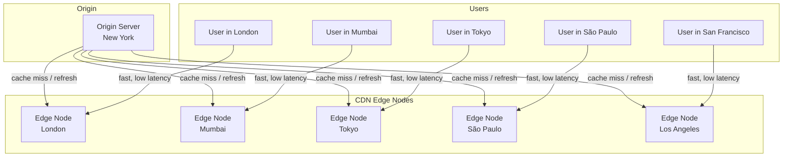
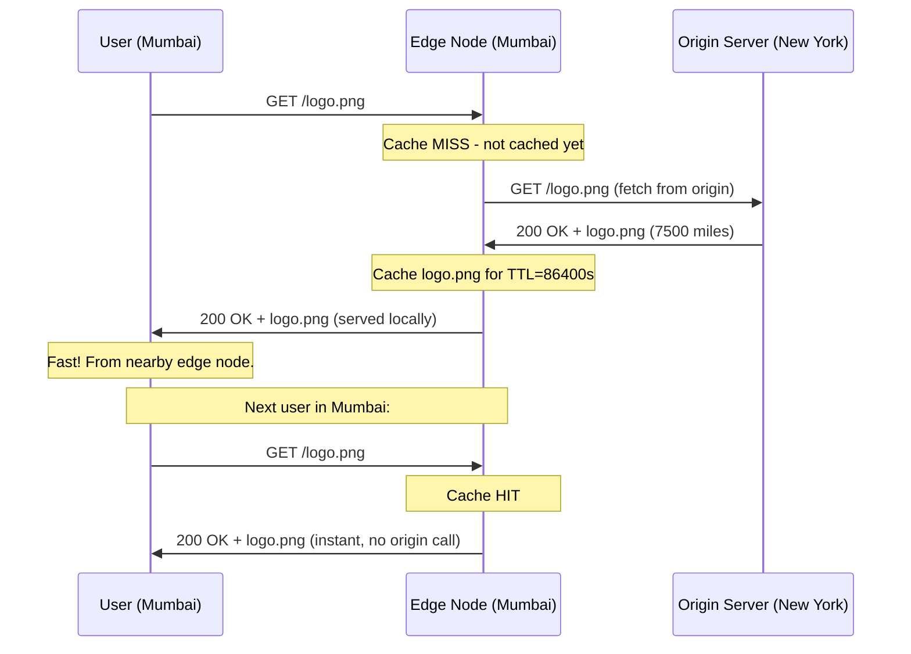

# CDN - Content Delivery Network

## Why This Topic Exists

You have built a beautiful web application. Your server is in New York. A user in Mumbai opens your app. Their request travels ~7,500 miles to New York and back. At the speed of light in fiber, that is ~75ms for the round trip — just for the network. Add server processing, TCP handshake, and TLS, and a simple page load takes 300–500ms before anything even renders.

Now multiply that by images, CSS, JavaScript, videos — each requiring its own round trip. The user in Mumbai has a measurably worse experience than the user next door to your server.

A **CDN** solves this: instead of all traffic going to your single server, content is served from a distributed network of servers placed close to users worldwide. The Mumbai user gets content from a CDN server in Mumbai. The London user gets it from London. Everyone gets fast responses.

This is not optional at scale. CDNs are used by virtually every major website, app, and API. Understanding CDNs is essential for system design interviews and production systems.

## Learning Objectives

By the end of this topic, you will be able to:

- Explain what a CDN is and what problem it solves
- Describe how a CDN serves content from the nearest location
- Distinguish between push CDNs and pull CDNs
- Explain cache invalidation and why it is one of the hardest problems in computer science
- List the main use cases for CDNs (static files, video, DDoS protection, API acceleration)
- Name real-world CDN providers and their use cases
- Design a system that uses a CDN appropriately

## Prerequisites

- [01. How the Internet Works](./01.%20How%20the%20Internet%20Works%20(BEGINNER).md) — latency, routers, internet infrastructure
- [04. DNS - Domain Name System](./04.%20DNS%20-%20Domain%20Name%20System%20(BEGINNER).md) — CDNs use DNS for routing

## Introduction

Imagine a global bookstore with one warehouse in New York. When someone in Tokyo orders a book, it ships from New York — slow, expensive, and frustrating. Now imagine that bookstore opens regional warehouses in Tokyo, London, Mumbai, and São Paulo. Most orders ship from the nearest warehouse within hours. A few special orders still come from New York.

A CDN is exactly this: a **network of geographically distributed servers** (called **edge nodes** or **Points of Presence / PoPs**) that cache and serve content from a location close to the end user.

The "New York warehouse" in this analogy is your **origin server** — the authoritative source of your content. Edge nodes are the regional warehouses — they serve cached copies of content. When a user requests a file, they get it from the nearest edge node, not the distant origin.

## Real-World Analogy

Think about a popular book that millions of people want to read:

**Without CDN (central warehouse):**
Every person in the world orders from one warehouse in New York. The warehouse is overwhelmed. People in Sydney wait weeks for shipping. The shipping cost is enormous.

**With CDN (regional warehouses):**
- The publisher (origin server) sends copies to regional warehouses in every city.
- When you order, you get it from your nearest warehouse.
- Delivery is fast, cheap, and the central warehouse is not overwhelmed.
- If the book is updated, the publisher sends new copies to all warehouses.

This is exactly how CDNs work: your files live on your origin server, and CDN edge nodes cache copies of them worldwide.

## Core Concepts

### How a CDN Serves Content

When a user requests `https://www.example.com/logo.png`:

1. DNS resolves `www.example.com` to the nearest CDN edge node (using GeoDNS)
2. The edge node checks its cache:
   - **Cache HIT**: The file is cached. Return it immediately. No request to origin.
   - **Cache MISS**: The file is not cached. Edge node fetches it from the origin server, caches it, and serves it to the user.
3. Subsequent requests from any user near that edge node are served from cache.

This is the fundamental model. Most requests are cache hits — served from edge nodes close to users, never touching the origin.

### CDN Points of Presence (PoPs)

A PoP is a CDN data center in a specific geographic location. Large CDNs have hundreds of PoPs worldwide:

- Cloudflare: 300+ cities
- Akamai: 4,000+ PoPs
- AWS CloudFront: 600+ PoPs

When a user makes a request, DNS routing (GeoDNS) directs them to the PoP with the lowest network latency — usually the geographically nearest one.

### Pull CDN vs Push CDN

There are two models for how content gets to edge nodes:

**Pull CDN (lazy caching):**
- Content is only cached at edge nodes when first requested
- Process: User requests file → Edge node does not have it → Edge fetches from origin → Caches it → Serves user
- Subsequent requests: served from cache
- Old cache expires after TTL → next request triggers a fresh fetch

Best for: content you cannot predict will be popular, frequently changing content, long-tail content.

**Push CDN (proactive caching):**
- You explicitly push content to all edge nodes in advance
- When you upload a new file to your CDN, it is immediately distributed to all PoPs
- User requests: always a cache hit (the file is already there)
- You are responsible for pushing updates when content changes

Best for: known high-traffic content (major product launch, video premiere), content that must be available immediately worldwide without a first-request miss.

| Aspect | Pull CDN | Push CDN |
|--------|----------|----------|
| Simplicity | Simpler — just point DNS at CDN | More complex — must push files explicitly |
| Cold start | First user in each region waits | No cold start — files pre-distributed |
| Storage cost | Lower — only cache what is requested | Higher — store everything everywhere |
| Best for | General content, long tail | Known popular content, media |
| Examples | Cloudflare (default), AWS CloudFront | AWS CloudFront (configured), Akamai |

### Cache Invalidation

Caching is powerful, but what happens when content changes?

Imagine you cached `logo.png` with a 24-hour TTL across 300 edge nodes. You update the logo. For up to 24 hours, users may see the old logo from cached edge nodes.

**Strategies:**

1. **TTL expiry**: Set a short TTL. Content refreshes frequently. Simple but means occasional stale content.

2. **Versioned URLs (cache busting)**: Rename the file every time it changes.
   - Old: `logo.png`
   - New: `logo-v2.png` or `logo.abc123.png` (hash of content)
   - No need to invalidate — the new URL is always uncached. Old URL is simply abandoned.
   - This is the standard approach for JavaScript and CSS in web apps.

3. **Manual invalidation**: Send an invalidation request to the CDN to purge specific files immediately. Cloudflare, CloudFront, and Akamai all support this. Use sparingly — large-scale invalidations can be slow and expensive.

4. **Surrogate keys / Cache tags**: Tag responses with logical identifiers. When you update user #42's data, purge all cached responses tagged with `user-42`. More precise than URL-based invalidation.

"There are only two hard things in computer science: cache invalidation and naming things." — Phil Karlton. This quote is famous because cache invalidation is genuinely difficult in production systems.

## Visual Diagram

### CDN Architecture

### Pull CDN Request Flow

## Deep Explanation

### What CDNs Cache

CDNs are most effective for content that:
- Does not change often (static assets)
- Is identical for all users (public content, not personalized)
- Is large (images, videos, JavaScript bundles)

**Commonly cached:**
- Static assets: JavaScript, CSS, images, fonts, favicons
- Video files and streaming segments (HLS/DASH chunks)
- HTML pages (if the same for all users)
- Software downloads
- API responses (if public and non-personalized)

**Not suitable for CDN caching:**
- Personalized responses (user dashboards, private data)
- Real-time data (live stock prices, chat messages)
- Responses with cookies/auth headers (CDNs typically do not cache these by default)

### CDN and Video Streaming

CDNs are the backbone of video streaming. Netflix, YouTube, and Twitch all rely on CDNs.

How Netflix uses CDNs:
1. Videos are encoded in multiple qualities (1080p, 720p, 480p, 360p)
2. Each video is broken into 4–10 second segments
3. Segments are pushed to CDN PoPs worldwide
4. When you play a video, your player downloads segments from the nearest PoP
5. The adaptive bitrate algorithm switches quality based on your bandwidth

Without CDNs, Netflix would need to deliver 500 Gbps of video traffic from a single origin — impossible. CDNs distribute this load across hundreds of edge locations.

### CDN and DDoS Protection

A DDoS (Distributed Denial of Service) attack floods your server with traffic to overwhelm it. CDNs provide significant DDoS mitigation:

1. **Traffic absorption**: CDN edge nodes collectively have enormous bandwidth (Cloudflare has 100+ Tbps capacity). Attacks that would saturate a single origin server are absorbed.
2. **Geographic distribution**: Attacking a CDN means attacking hundreds of PoPs simultaneously — resource-intensive for attackers.
3. **Filtering at the edge**: CDN edge nodes can detect and block malicious traffic before it reaches the origin.

Cloudflare in particular is widely used as a DDoS shield, sitting in front of origins and absorbing attacks. This is why many companies use Cloudflare even if they do not have global traffic — the DDoS protection alone justifies it.

### CDN for API Acceleration

CDNs are not only for static files. They can also:

**Cache API responses**: If your API returns the same list of top products for all users, cache it at the CDN. A `Cache-Control: public, max-age=300` header tells the CDN to cache the response for 5 minutes. 99% of requests never reach your origin server.

**Terminate TLS at the edge**: The TLS handshake happens at the nearest edge node (low latency), not at the distant origin. After the handshake, the CDN forwards requests to the origin over a pre-established warm connection.

**Route around internet congestion**: CDN providers have their own private backbone networks between PoPs. Traffic from Mumbai to New York travels over Cloudflare's backbone instead of the public internet — often faster and more reliable.

### CDN Headers

CDNs respect and add HTTP headers to control caching behavior:

| Header | Example | Purpose |
|--------|---------|---------|
| Cache-Control | `max-age=86400, public` | How long to cache, and whether CDN can cache it |
| CDN-Cache-Control | `max-age=3600` | CDN-specific cache duration (overrides Cache-Control for CDN) |
| Surrogate-Control | `max-age=86400` | Varnish/Fastly-specific cache duration |
| ETag | `"abc123"` | Version identifier for conditional requests |
| Vary | `Accept-Encoding` | Cache separately based on this request header |
| CF-Cache-Status | `HIT` or `MISS` | Cloudflare-specific: tells you if CDN served from cache |
| X-Cache | `HIT from cloudfront` | CloudFront cache status |

If your response has `Cache-Control: private` or `Authorization` header in the request, CDNs will not cache it. This is the right behavior for personalized or authenticated content.

### Real-World CDN Providers

| Provider | Strengths | Used by |
|----------|-----------|---------|
| Cloudflare | DDoS protection, easy setup, free tier, Workers (serverless at edge) | Millions of websites |
| AWS CloudFront | Deep AWS integration, highly configurable | AWS-heavy companies |
| Akamai | Largest PoP network (4,000+), enterprise features | Media, large enterprises |
| Fastly | Real-time purging, edge compute (Compute@Edge) | GitHub, Stripe, Shopify |
| Google Cloud CDN | GCP integration, HTTP/2 and HTTP/3 | GCP-heavy companies |
| Bunny CDN | Low cost, developer-friendly | Independent developers |

## Step-by-Step Example

### Setting Up a CDN for a Web Application

**Scenario**: Your e-commerce site is slow for users in Southeast Asia. Your server is in Virginia.

**Step 1: Choose a CDN.**
Pick Cloudflare (simple setup, free tier, good global coverage).

**Step 2: Update DNS.**
Change your domain's nameservers to Cloudflare. Cloudflare now acts as a DNS resolver and proxy for all traffic to your domain.

**Step 3: Configure caching rules.**
- Static assets (`*.js`, `*.css`, `*.png`): Cache-Control `max-age=31536000` (1 year) — use versioned filenames for cache busting
- HTML pages: Cache-Control `max-age=300` (5 minutes)
- API responses: `Cache-Control: private` — do not cache personalized data

**Step 4: Enable cache busting.**
Configure your build process to add content hashes to filenames:
`app.js` → `app.a1b2c3d4.js`

When you deploy, users automatically get new files (new URL = cache miss). Old files expire naturally.

**Step 5: Test.**
Use `curl -I https://yoursite.com/static/logo.png` and check `CF-Cache-Status: HIT` on the second request.

**Result**: Static assets served from a PoP in Singapore for Southeast Asian users. Page loads go from 1.5s to 200ms.

## Advantages / Disadvantages / Trade-offs

### Advantages

| Benefit | Detail |
|---------|--------|
| Lower latency | Content served from nearby edge nodes |
| Reduced origin load | Most traffic never reaches your server |
| Higher availability | Edge nodes serve cached content even if origin is down |
| DDoS mitigation | Edge absorbs attack traffic |
| Scalability | Handle traffic spikes without scaling your origin |
| Cost reduction | Fewer requests to your origin = lower bandwidth and server costs |

### Disadvantages

| Drawback | Detail |
|----------|--------|
| Stale content | Cached content may be outdated until TTL expires |
| Cache invalidation complexity | Purging cached content correctly is non-trivial |
| Cost | CDN bandwidth is not free (though often cheaper than origin bandwidth) |
| Debugging complexity | Cached responses can mask bugs; headers must be inspected |
| Not for dynamic content | Personalized, real-time, or authenticated content cannot be CDN-cached |

## When to Use / When NOT to Use

**Use a CDN for:**
- Static assets in web applications (JavaScript, CSS, images, fonts)
- Video and audio content
- Software downloads and large file distribution
- Public API responses that are the same for all users
- Any website with global users
- Any application needing DDoS protection

**Do NOT use CDN caching for:**
- Personalized responses (user profiles, dashboards) — users would see each other's data
- Real-time data (stock prices, live scores) — cached data would be wrong
- Responses containing session cookies or auth tokens — do not cache authenticated content
- Highly dynamic content that changes every request

## Common Interview Questions

**Q: What is a CDN and how does it reduce latency?**
A: A CDN is a network of geographically distributed servers that cache content close to users. Instead of all requests going to a distant origin server, users are served from the nearest edge node. This reduces the network distance data must travel, cutting latency from hundreds of milliseconds to single digits.

**Q: What is the difference between a pull CDN and a push CDN?**
A: Pull CDN caches content lazily — only when first requested by a user. The first request from a new region fetches from origin and caches it. Push CDN requires you to proactively push content to all edge nodes. Pull is simpler; push eliminates cold start misses for known popular content.

**Q: How would you invalidate CDN cache after a deployment?**
A: Three main options: (1) Version URLs — append a content hash to filenames so new files have new URLs that are never cached; (2) Short TTL — set cache to expire in 5 minutes so stale content is brief; (3) Manual invalidation — call the CDN API to purge specific URLs immediately after deployment.

**Q: Can CDNs cache API responses?**
A: Yes, for public API responses with appropriate Cache-Control headers (`public, max-age=300`). Personalized or authenticated responses must not be CDN-cached. Many companies cache public endpoint responses (product listings, public profiles) with short TTLs to reduce origin load.

**Q: How does a CDN protect against DDoS attacks?**
A: CDNs have massive aggregate bandwidth across hundreds of PoPs. DDoS traffic is absorbed and distributed across the CDN network before it can overwhelm the origin. CDN edges also filter known attack patterns and rate-limit suspicious traffic.

## Common Beginner Mistakes

**Mistake 1: Assuming CDN only means static file hosting.**
CDNs also accelerate dynamic content (by terminating TLS at the edge), protect against DDoS, cache API responses, and run serverless code at the edge (Cloudflare Workers, Lambda@Edge). CDNs are full-featured platforms.

**Mistake 2: Caching authenticated or personalized content.**
If you cache a response that includes user-specific data without proper `Vary` headers or cache keying, you risk serving one user's private data to another. Always ensure authenticated responses have `Cache-Control: private` or `no-store`.

**Mistake 3: Setting TTL too long without versioned URLs.**
If you set `max-age=31536000` (1 year) on a file named `app.js`, deploying a new `app.js` will leave users on the cached old version for a year. Always use versioned filenames (`app.abc123.js`) with long TTLs, or use short TTLs for files with predictable names.

**Mistake 4: Not thinking about CDN cost in system design.**
CDN bandwidth is typically cheaper than origin egress, but it is not free. For very large video files, CDN costs can be significant. Consider in your cost estimation.

**Mistake 5: Forgetting the CDN misses for the first request.**
In a pull CDN, the very first user to request content from a new PoP waits for a cache miss (the edge fetches from origin). For important content, consider warming the cache (sending artificial requests to popular edge PoPs before a launch).

## Summary

A CDN is a geographically distributed network of servers that serve cached content close to users, reducing latency and origin server load.

Pull CDNs cache on demand (simple, good for general use). Push CDNs pre-distribute content (good for known popular files).

Cache invalidation is the hard problem: use versioned URLs for static assets, short TTLs for dynamic content, and manual purge for urgent updates.

CDNs are used for static assets, video streaming, DDoS protection, and API response caching. Major providers: Cloudflare, AWS CloudFront, Akamai, Fastly.

Every production system with global users should use a CDN. It is one of the highest-ROI infrastructure investments available.

## Key Takeaways

- CDN = network of edge nodes worldwide that cache content close to users
- Reduces latency by eliminating long-distance round trips to origin
- Pull CDN: cached on first request. Push CDN: pre-distributed.
- Cache invalidation strategies: versioned URLs, TTL, manual purge
- Use CDN for: static assets, video, public APIs, DDoS protection
- Do NOT CDN-cache: personalized content, authenticated responses, real-time data
- CDNs use GeoDNS to route users to the nearest PoP
- Major providers: Cloudflare, AWS CloudFront, Akamai, Fastly

## Related Topics

- [01. How the Internet Works](./01.%20How%20the%20Internet%20Works%20(BEGINNER).md) — latency, network infrastructure
- [04. DNS - Domain Name System](./04.%20DNS%20-%20Domain%20Name%20System%20(BEGINNER).md) — CDNs use GeoDNS for routing
- [03. HTTP and HTTPS](./03.%20HTTP%20and%20HTTPS%20(BEGINNER).md) — Cache-Control headers, TLS termination
- [README](./README.md) — chapter overview
