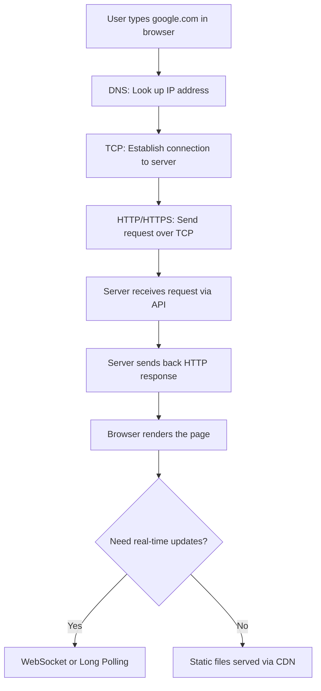

# Chapter 02: Networking

## Why This Chapter Exists

Every system you build runs on a network. Whether you are designing a chat application, a video streaming service, or a global e-commerce platform, data has to travel between computers. Understanding how that happens — from the physical wires to the protocols that govern communication — is the foundation of everything else in system design.

This chapter takes you from absolute zero. You do not need to know anything about networking before starting here. By the end, you will understand how the internet works, why certain protocols exist, and how to make intelligent decisions when designing systems that talk to each other.

## Learning Objectives

After completing this chapter, you will be able to:

- Explain how the internet moves data from one computer to another
- Choose the right protocol (TCP vs UDP) for a given use case
- Read and write HTTP requests and responses confidently
- Explain DNS resolution and why it matters for system design
- Compare REST, GraphQL, and gRPC and pick the right one for a project
- Design real-time features using WebSockets, long polling, or Server-Sent Events
- Use CDNs to reduce latency for global users

## Prerequisites

- Basic understanding of what a web browser does
- Familiarity with the concept of a server (a computer that serves data)
- No prior networking knowledge required

## How This Chapter Is Organized

The topics build on each other. Start from the top if you are a beginner. If you already know the basics, jump to the topic you need.

---

## Topics in This Chapter

| # | File | Level | One-Line Description |
|---|------|-------|----------------------|
| 01 | [How the Internet Works](./01.%20How%20the%20Internet%20Works%20(BEGINNER).md) | Beginner | The internet is just computers talking to each other — here is how that actually happens. |
| 02 | [TCP vs UDP](./02.%20TCP%20vs%20UDP%20(BEGINNER).md) | Beginner | TCP guarantees delivery like a phone call; UDP is fast but unreliable like a postcard. |
| 03 | [HTTP and HTTPS](./03.%20HTTP%20and%20HTTPS%20(BEGINNER).md) | Beginner | HTTP is the language browsers and servers use to communicate; HTTPS adds encryption. |
| 04 | [DNS - Domain Name System](./04.%20DNS%20-%20Domain%20Name%20System%20(BEGINNER).md) | Beginner | DNS is the phone book of the internet — it translates names like google.com to IP addresses. |
| 05 | [APIs - REST, GraphQL, gRPC](./05.%20APIs%20-%20REST%20GraphQL%20gRPC%20(BEGINNER).md) | Beginner | APIs are menus at a restaurant — how clients ask servers for what they need. |
| 06 | [WebSockets and Long Polling](./06.%20WebSockets%20and%20Long%20Polling%20(INTERMEDIATE).md) | Intermediate | When you need the server to push data to the client in real time — chat, live scores, stock tickers. |
| 07 | [CDN - Content Delivery Network](./07.%20CDN%20-%20Content%20Delivery%20Network%20(BEGINNER).md) | Beginner | Serve data from a server near your users instead of across the planet. |

---

## The Big Picture

Before diving into individual topics, here is a mental model of how they all connect.

Every single box above is a concept covered in this chapter.

---

## Reading Order for Beginners

If you are brand new to networking, follow this order:

1. How the Internet Works — understand the physical and logical foundation
2. TCP vs UDP — understand how data is reliably (or not) delivered
3. HTTP and HTTPS — understand how the web communicates
4. DNS — understand how names are resolved to addresses
5. APIs — understand how services expose their capabilities
6. WebSockets and Long Polling — understand real-time communication
7. CDN — understand how to serve data globally with low latency

---

## Reading Order for Interview Prep

If you are preparing for a system design interview, focus on:

1. TCP vs UDP (interviewers ask about this constantly)
2. HTTP and HTTPS (status codes, methods — must know cold)
3. DNS (CDN routing, failover)
4. APIs — REST vs GraphQL vs gRPC (comes up in microservices discussions)
5. WebSockets (comes up in any real-time system design question)
6. CDN (comes up in any global system with high read traffic)

---

## Key Vocabulary

| Term | Simple Definition |
|------|------------------|
| IP Address | A unique number that identifies a computer on a network |
| Port | A number that identifies a specific service on a computer |
| Protocol | A set of rules for how computers communicate |
| Packet | A small chunk of data sent over a network |
| Latency | How long it takes for data to travel from source to destination |
| Bandwidth | How much data can be sent per second |
| Client | The computer that asks for data |
| Server | The computer that serves data |
| Request | A message from client to server asking for something |
| Response | A message from server to client answering the request |

---

## Related Chapters

- [01. Fundamentals](../01.%20Fundamentals/README.md) — Start here if you have not already
- [03. Databases](../03.%20Databases/README.md) — How servers store and retrieve data
- [04. Caching](../04.%20Caching/README.md) — How to make systems faster by remembering results
- [05. Load Balancing](../05.%20Load%20Balancing/README.md) — How to distribute traffic across servers
