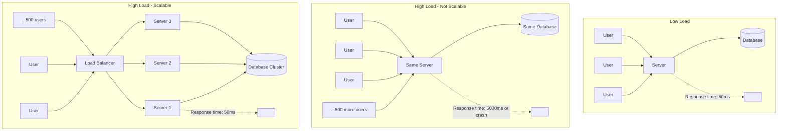

# What is Scalability?

## Why This Topic Exists

Every system starts small. A startup builds a product for 100 users. It works fine. Then it gets featured on the news and suddenly 100,000 people try to use it on the same day. The site crashes. The database falls over. Customers leave. The engineers scramble.

This is not a hypothetical story — it happens constantly. Twitter's famous "Fail Whale" page existed because the system couldn't handle its own growth. Friendster lost an entire generation of users to Myspace partly because it was too slow. Instagram's early engineers had to scale from 0 to 1 million users in 10 weeks before they were even acquired by Facebook.

Scalability is the engineering discipline that answers the question: **how do you build a system that can grow without collapsing?** It is the #1 topic in system design interviews because it is the #1 challenge in real-world engineering.

---

## Learning Objectives

By the end of this file, you will be able to:

- Define scalability precisely
- Explain the difference between load, throughput, and latency
- Describe why systems fail under increased load
- Distinguish between vertical scaling and horizontal scaling at a conceptual level
- Explain why scalability matters in system design interviews

---

## Prerequisites

- Basic understanding of what a server is (a computer that responds to requests)
- Basic understanding of the request-response cycle

---

## Introduction

Scalability is **the ability of a system to handle increased load without degrading in performance, or the ability to add resources to handle that increased load**.

Notice there are two parts:
1. Handle more load without breaking
2. Add resources to help it handle that load

A system that works great for 100 users but crashes for 1,000 users is not scalable. A system that works great for 100 users and can be extended — by adding more machines, more memory, more processing power — to handle 1 million users *is* scalable.

---

## Real-World Analogy: The Coffee Shop

Imagine a coffee shop with a single barista named Alex.

On a Tuesday morning with 5 customers, Alex is fine. Orders come in, Alex makes them, customers wait 2 minutes, everyone is happy. The system works.

Now it's Friday morning before a big local event. 500 people show up in one hour. Alex is completely overwhelmed. The queue stretches out the door. Wait times balloon from 2 minutes to 45 minutes. Some customers leave. Alex makes mistakes because of the pressure. The system is failing under load.

What do you do? You have two options:

**Option 1: Make Alex work faster.** Buy a better espresso machine. Give Alex a faster grinder. Upgrade the point-of-sale system so taking orders is quicker. This is called **vertical scaling** — making the existing resource more powerful.

**Option 2: Hire more baristas.** Add Sarah, Marcus, and Priya to the team. Now four people can serve customers simultaneously. This is called **horizontal scaling** — adding more instances of the resource.

Both approaches help. But they have different limits, different costs, and different complexities. We will explore both in depth in the next file. For now, remember this: the core problem that scalability solves is **demand exceeding capacity**.

---

## Core Concepts

### Load

Load is what your system has to handle. It can take many forms:

- **Users**: how many people are using your system simultaneously
- **Requests per second (RPS)**: how many HTTP requests your server receives each second
- **Data volume**: how much data your database stores and retrieves
- **Write load**: how many records are being created or updated per second
- **Read load**: how many records are being read per second

Different systems have different load profiles. A social media feed is read-heavy (users scroll and read far more than they post). A logging system is write-heavy (every user action generates a log entry). An analytics platform is compute-heavy (it runs expensive aggregations).

Understanding your load profile is the first step to designing a scalable system.

### Throughput

Throughput is **how much work a system can do in a unit of time**. For a web server, throughput is typically measured in **requests per second**. For a database, it might be **queries per second** or **transactions per second**.

If your system has a throughput of 100 requests/second and you suddenly receive 1,000 requests/second, the extra 900 requests are either queued (latency increases) or dropped (errors occur).

### Latency

Latency is **how long it takes to complete a single unit of work**. For a web request, latency is the time between the client sending the request and receiving the response.

Latency and throughput are related but distinct:
- A system can have **high throughput and low latency** (a highly optimized server farm)
- A system can have **high throughput and high latency** (a batch processing pipeline that handles millions of jobs but each takes minutes)
- A system can have **low throughput and low latency** (a fast but limited single-server setup)

Under increased load, latency usually increases even if you haven't hit peak throughput, because resources start competing. Database queries wait for connections. Requests queue up. Garbage collection pauses the app.

### Availability Under Load

Scalability and availability are related but different concepts. **Availability** is whether the system is up and accessible. **Scalability** is whether it can handle more load.

However, a system that is not scalable often becomes unavailable under high load — it crashes, times out, or returns errors. This is why scalability work directly improves availability. A system that cannot scale will eventually fail to be available.

---

## Visual Diagram

---

## Deep Explanation

### Why Systems Fail Under Load: The Naive View

Most developers, when they start out, think about correctness — does the code do the right thing? They write a function that queries the database and returns results. It works on their laptop. It works in testing. They deploy it.

What they don't think about is what happens when 10,000 users call that function at the same time.

### The Queue Effect

Imagine a single-threaded server (one that handles one request at a time). Each request takes 100ms. With 1 request/second, response time is 100ms. With 10 requests/second, the server starts a queue — requests wait their turn. The 10th request arrives and has to wait for 9 others to finish: 9 * 100ms = 900ms wait time. The response time for that user is 1,000ms (1 second).

With 100 requests/second, the 100th request waits 10 seconds. With 1,000 requests/second, the queue grows faster than it drains — the server never recovers. This is called **queue saturation**, and it is the most common failure mode of web servers under load.

Modern servers are multi-threaded or use async I/O to handle many requests concurrently, but the same principle applies — every resource has a finite capacity, and when demand exceeds that capacity, performance degrades non-linearly.

### The Database Bottleneck

Even if you add more web servers, they all share the same database. The database has a finite number of connections it can handle, finite disk I/O, finite memory for caching queries. As web server count grows, the database becomes the new bottleneck.

This is why database scaling is covered as its own topic in [File 04](./04.%20Database%20Scaling%20(BEGINNER).md). In almost every real system at scale, the database is where performance goes to die if you're not careful.

### The State Problem

Here is a subtlety that trips up many engineers. If you add more web servers, great — but what if your server stores data about the user in memory? Server 1 knows the user is logged in. The next request goes to Server 2. Server 2 doesn't know the user is logged in. The user is suddenly logged out.

This is the **state problem** in distributed systems, and it is why [File 05 on Stateless vs Stateful Architecture](./05.%20Stateless%20vs%20Stateful%20Architecture%20(INTERMEDIATE).md) is so critical. You cannot horizontally scale a stateful system without solving the state problem first.

### The Two Types of Scaling

**Vertical Scaling (Scale Up):** Add more resources to the existing machine. More CPU cores, more RAM, faster disks, faster network interfaces. The machine gets more powerful.

**Horizontal Scaling (Scale Out):** Add more machines. Run the same software on multiple machines and distribute the load across them.

We explore these in depth in [File 02](./02.%20Vertical%20vs%20Horizontal%20Scaling%20(BEGINNER).md). For now, understand that:
- Vertical scaling is simpler but has hard limits (you can't buy infinite RAM)
- Horizontal scaling is more complex but theoretically unlimited

### The Scalability Spectrum

Scalability is not binary — it is a spectrum. Systems are more or less scalable. A well-designed system might handle 10x its initial load with no changes. A great system might handle 1,000x with minimal changes. The most scalable systems in the world (Google, Amazon) handle billions of times more load than any single machine could.

Your job as an engineer is not to design for infinite scale from day one — that is premature optimization and wastes engineering time. Your job is to understand where your current system's limits are, and to ensure you *can* scale it when you need to. This means avoiding architectural decisions that make scaling impossible later.

---

## Step-by-Step Example

Let's trace a simple social media "like" feature as user count grows.

**Step 1: 100 users**
Single server, single database. User clicks "like," server updates the like count in the DB, returns the new count. Works perfectly. P99 latency is 20ms.

**Step 2: 10,000 users**
Now 1,000 users are active simultaneously. The server is handling multiple concurrent requests. The database is handling dozens of concurrent queries. Response time creeps up to 150ms. It's okay, but you start to notice. You add an index to the likes table. Response time drops to 50ms. Problem solved (for now).

**Step 3: 1,000,000 users**
100,000 simultaneous active users. A single server cannot handle this many open connections. The database is swamped with queries. What do you do?

- Add more web servers (horizontal scaling). Now you need a load balancer.
- Add a read replica database so that read queries go to one DB and write queries go to another.
- Add a cache (Redis) in front of the database so that the like count is served from memory, not disk.

Response times return to normal. Cost has increased, but the system works.

**Step 4: 100,000,000 users**
Now you need database sharding, CDN for static assets, geographic distribution, and more. Each scaling challenge unlocks the next. This is what this entire chapter is about.

---

## Advantages / Disadvantages / Trade-offs

| Aspect | Scalable System | Non-Scalable System |
|--------|----------------|---------------------|
| Handles growth | Yes, gracefully | No, fails or degrades |
| Initial complexity | Higher | Lower |
| Initial cost | Higher | Lower |
| Engineering effort | Ongoing | Low at first, catastrophic later |
| Reliability under load | High | Low |
| Debugging difficulty | Higher (distributed) | Lower (single machine) |

The core trade-off: scalable systems are more complex and expensive to build upfront, but they save you from catastrophic failure as you grow. The key insight is that you do not need to build for 1 billion users on day one — you need to build in a way that *allows* you to scale when needed.

---

## When to Use / When NOT to Use

**Design for scalability when:**
- You expect significant user growth
- Your product could go viral or receive a sudden spike (product launch, news feature)
- Business continuity depends on uptime during peak periods
- You are building for an enterprise or platform use case

**Do not over-engineer for scalability when:**
- You have fewer than a few thousand users (a single server is fine)
- You are building an MVP to validate a business idea
- The product may pivot significantly (premature architecture is wasted work)
- The cost of the scalability infrastructure exceeds your revenue

The industry wisdom: "Make it work, make it right, make it fast." Scalability is the third step, not the first.

---

## Common Interview Questions

1. **What is the difference between scalability and availability?**
   Availability is whether a system is up. Scalability is whether it can handle more load. A system can be highly available but not scalable (always up, but slow under load) or scalable but not highly available (handles huge load when it works, but crashes often).

2. **What is the difference between latency and throughput?**
   Latency is the time for a single operation. Throughput is how many operations per second the system can handle. A highway analogy: latency is travel time from A to B, throughput is how many cars per hour can travel from A to B.

3. **How do you know when a system is not scalable enough?**
   Warning signs: increasing latency under load, increasing error rates under load, database CPU consistently at 90%+, servers running out of memory, queue depth growing over time.

---

## Common Beginner Mistakes

1. **Thinking scalability = performance.** Performance is about how fast one operation is. Scalability is about how performance holds up as load increases. A system can be fast for 1 user but unscalable for 10,000.

2. **Over-engineering from day one.** Building a microservices architecture with a sharded database for a product with 50 users is wasteful. Start simple, identify real bottlenecks, then scale.

3. **Ignoring the database.** Developers often focus on web server scaling (because it's more visible) and forget the database. Almost every production scalability crisis involves the database.

4. **Assuming horizontal scaling is always the answer.** Horizontal scaling introduces coordination complexity. Sometimes the right answer is "just upgrade the server" — especially for databases and caches where horizontal scaling (sharding) is genuinely complex.

5. **Confusing adding features with scaling.** Scalability is about handling more of the same load, not about adding new capabilities.

---

## Summary

Scalability is the ability of a system to handle increased load, either by performing better under that load or by allowing you to add resources to handle it. Systems fail under load due to queue saturation, resource exhaustion, and the database bottleneck. The two primary strategies — vertical scaling (bigger machines) and horizontal scaling (more machines) — each have trade-offs. The state problem is a critical challenge in horizontal scaling. Most scalability work is about identifying bottlenecks and addressing them one by one.

---

## Key Takeaways

- Scalability = handling more load gracefully
- Load comes in many forms: users, RPS, data volume, write/read ratio
- Latency (speed per request) degrades non-linearly as load increases
- Two scaling types: vertical (bigger machine) and horizontal (more machines)
- The database is almost always the first bottleneck
- State stored on servers breaks horizontal scaling
- Do not over-engineer for scale you don't have yet — but do not make scaling impossible either

---

## Related Topics

- [Vertical vs Horizontal Scaling](./02.%20Vertical%20vs%20Horizontal%20Scaling%20(BEGINNER).md)
- [Load Balancing Basics](./03.%20Load%20Balancing%20Basics%20(BEGINNER).md)
- [Database Scaling](./04.%20Database%20Scaling%20(BEGINNER).md)
- [Stateless vs Stateful Architecture](./05.%20Stateless%20vs%20Stateful%20Architecture%20(INTERMEDIATE).md)
- [Caching for Scalability](./06.%20Caching%20for%20Scalability%20(BEGINNER).md)
- [The Scalability Interview Framework](./07.%20The%20Scalability%20Interview%20Framework%20(BEGINNER).md)
- [Chapter 04: Databases](../04.%20Databases/README.md)
- [Chapter 05: Caching](../05.%20Caching/README.md)
