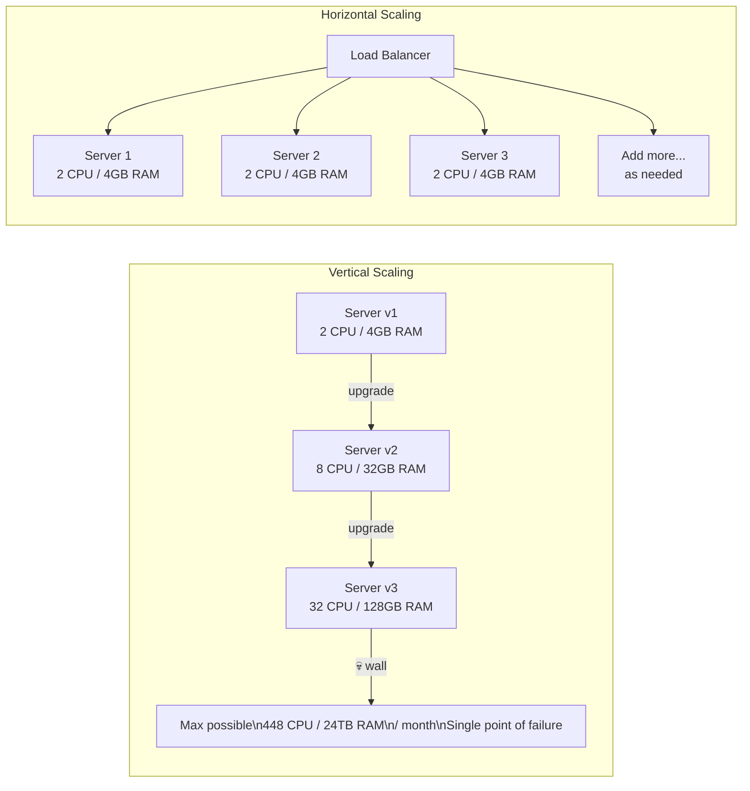

# Vertical vs Horizontal Scaling

## Why This Topic Exists

You have a server. It is struggling under load. You know you need to scale. What do you do?

This is the most fundamental decision in infrastructure engineering: **do you make the existing machine bigger, or do you add more machines?** Both approaches work — up to a point. Both have costs, limits, and complications. Every senior engineer has had to make this decision under pressure, and getting it wrong is expensive.

Understanding vertical vs horizontal scaling is not just interview preparation. It is the foundation on which every architectural decision in this chapter rests.

---

## Learning Objectives

By the end of this file, you will be able to:

- Define vertical scaling and horizontal scaling precisely
- Explain the physical and economic limits of vertical scaling
- Describe the coordination challenges that horizontal scaling introduces
- Choose the appropriate strategy for a given scenario
- Compare the two approaches across cost, complexity, failure modes, and real-world examples

---

## Prerequisites

- [What is Scalability](./01.%20What%20is%20Scalability%20(BEGINNER).md)

---

## Introduction

When your system struggles under load, you have two fundamental options:

1. **Vertical Scaling (Scale Up):** Make the existing machine more powerful — add CPU, RAM, storage, or network bandwidth to the machine you already have.

2. **Horizontal Scaling (Scale Out):** Add more machines — run the same application on multiple servers and distribute the load across all of them.

These are not mutually exclusive. Real systems often use both. But understanding when each makes sense, and where each breaks down, is essential knowledge.

---

## Real-World Analogy: The Delivery Truck

Your e-commerce company ships products. You use a single delivery truck.

As your order volume grows, your single truck is overwhelmed. You have two choices:

**Vertical Scaling: Buy a Bigger Truck**
Upgrade to a larger truck — more cargo space, more powerful engine. Costs more money, but your driver already knows how to operate a truck. Simple solution. But eventually, there is a limit to how big a single truck can get. The largest trucks in the world still have a maximum cargo capacity. You cannot keep buying "a bigger truck" forever.

**Horizontal Scaling: Buy More Trucks**
Buy three more trucks and hire three more drivers. Now you can deliver four times as many packages. You can keep adding trucks indefinitely. But now you have coordination problems: How do you divide the packages between drivers? What happens if a driver calls in sick? How do you make sure all the drivers know the latest route changes?

This is the essence of the trade-off. Vertical scaling is simpler but limited. Horizontal scaling is more complex but theoretically unbounded.

---

## Core Concepts

### Vertical Scaling (Scale Up)

Vertical scaling means increasing the resources of a single machine:

- **CPU**: More cores, faster clock speed
- **RAM**: More memory so the process can keep more data in memory and do fewer disk reads
- **Storage**: Faster disks (e.g., upgrading from HDD to SSD to NVMe)
- **Network**: Faster network interface cards

**When vertical scaling helps:**
- Your application is single-threaded and cannot use multiple servers (some legacy databases, for example)
- You need to keep all data in one place (before you've solved the state/sharding problem)
- You're in early-stage growth and the simplicity is worth the cost
- You're scaling a database and replication complexity is not yet worth it

**The wall you hit:**
Hardware has limits. As of 2025, the largest AWS EC2 instance (`u-24tb1.112xlarge`) has 448 virtual CPUs and 24 TB of RAM. That sounds enormous, but:
- It costs tens of thousands of dollars per month
- It is still a single point of failure — if that machine crashes, everything crashes
- There are applications (like large social networks) that have traffic exceeding what even the most powerful single server can handle

### Horizontal Scaling (Scale Out)

Horizontal scaling means adding more machines and distributing load across them:

- **More web servers**: Multiple servers each handle a portion of incoming requests
- **Read replicas**: Multiple database replicas each serve a portion of read queries
- **Sharding**: Data is split across multiple database nodes so no single node holds all the data
- **Distributed caches**: Cache clusters that spread the cache load

**The challenges horizontal scaling introduces:**

1. **Load distribution**: How do you decide which server handles which request? Answer: a load balancer (see [File 03](./03.%20Load%20Balancing%20Basics%20(BEGINNER).md)).

2. **State management**: If server 1 has a user's session in memory, what happens when the next request goes to server 2? Answer: stateless architecture or shared external state (see [File 05](./05.%20Stateless%20vs%20Stateful%20Architecture%20(INTERMEDIATE).md)).

3. **Data consistency**: If multiple servers are writing to multiple databases, how do you ensure all copies of the data agree? This is covered in Chapter 10 (Consistency and Consensus).

4. **Network overhead**: Multiple machines must communicate over the network. In a single machine, function calls take nanoseconds. Over the network, they take milliseconds. This is the key trade-off in distributed systems.

5. **Failure modes multiply**: Instead of one machine that might fail, you now have ten. The probability of at least one machine failing at any given time is much higher. You need to design for partial failure.

---

## Visual Diagram

---

## Deep Explanation

### Why Vertical Scaling Is Always the First Step

When your system is struggling, vertical scaling is almost always the first thing you try. Why?

1. **Zero code changes required.** You don't have to change your application at all. You just upgrade the server. This can often be done in minutes or hours on cloud platforms (by changing the instance type and restarting).

2. **No architectural changes required.** Your application continues to run on one machine. It does not need to know about other servers, coordinate with other servers, or handle failures of other servers.

3. **Immediate results.** You upgrade the machine, the extra resources are available immediately. No need to set up load balancers, session stores, or distributed systems.

The limitation, as noted, is that hardware has a ceiling. But more importantly, even before you hit that ceiling, cost-efficiency drops sharply. The relationship between hardware cost and performance is not linear. Doubling your RAM does not double your bill — it often costs three or four times more to go from a medium to a large instance than from a small to a medium instance.

### Why Horizontal Scaling Is the Long-Term Answer

At scale, horizontal scaling becomes the only viable option. Here is why:

**Cost per unit of compute is lower.** Running ten commodity machines is often cheaper than running one high-end machine with equivalent total resources. Cloud providers can use commodity hardware in bulk and pass savings to customers.

**No single point of failure.** If one of ten servers crashes, you lose 10% of capacity. The other nine servers absorb the extra load (perhaps with a slight performance degradation). You stay up. With a single vertical machine, any crash means total downtime.

**You can scale dynamically.** On cloud platforms, you can add servers in minutes and remove them when load drops. This allows **auto-scaling** — the system automatically adds servers during traffic spikes (like a flash sale or news event) and removes them afterward. You pay only for what you use.

**Geographic distribution becomes possible.** With horizontal scaling, you can run servers in multiple regions (US, Europe, Asia). Users connect to the nearest server, reducing latency dramatically.

### The Challenges Are Real

Horizontal scaling is not free. These challenges are serious and have entire sub-fields of engineering dedicated to solving them:

**The State Problem** is the most immediately painful. A user logs in on Server 1. Their session is stored in Server 1's memory. Their next request, routed by the load balancer, goes to Server 3. Server 3 has no session information. The user appears to be logged out. This is the kind of bug that is invisible in development (you only have one server) and explosive in production.

**Network Partitions** mean that sometimes machines cannot talk to each other. When Server 1 cannot reach Server 2, what does Server 1 do? Assume Server 2 is dead and take over its work? Wait? Return an error? These decisions define your system's consistency and availability guarantees — the famous CAP theorem (Chapter 10).

**Distributed Transactions** mean that if you need to update data on multiple servers atomically (either both updates happen or neither does), you need a distributed transaction protocol. These are complex and slow.

### Historical Example: YouTube's Scaling Journey

YouTube launched in 2005 on a single server — literally a box under a desk. As viewership exploded, they kept vertically scaling: bigger server, more RAM, faster disks. By 2006 (one year after launch), they were serving 100 million videos per day and vertical scaling was no longer sufficient.

They switched to a horizontally scaled architecture with many web servers, MySQL database clusters, and memcached (a distributed cache). This architectural shift was what allowed YouTube to continue growing after acquisition by Google in 2006.

The lesson: vertical scaling bought them time to figure out the architecture. Horizontal scaling enabled growth beyond what any single machine could handle.

---

## Step-by-Step Example

A startup builds a news aggregation site. Here is how their scaling strategy evolves:

**Month 1 — 1,000 daily users**
Single server: 2 CPU, 4GB RAM. The app and database both run on this machine. Latency is 30ms. No issues.

**Month 6 — 50,000 daily users**
Server is under strain. CPU usage at 80% during peak hours. Decision: vertical scale. Upgrade to 8 CPU, 32GB RAM. Problem solved. No code changes needed. Cost doubles.

**Month 12 — 500,000 daily users**
The upgraded server is now at 85% CPU again. Vertical scaling to the next tier is very expensive. Also, if this machine crashes, the entire site is down (this happened once last month, costing 4 hours of downtime).

Decision: horizontal scale. Add three web servers behind a load balancer. Move the database to a dedicated server. Add a read replica for the database.

Now the app server code needs to be stateless (sessions moved to Redis). This required two weeks of engineering work. But now the site can handle 5x the load and has much higher availability.

**Month 24 — 5,000,000 daily users**
The database is the bottleneck again. Web servers are fine (can add more). Database is at its limit.

Decision: add more read replicas (for reads), consider sharding (for writes), add a caching layer in front of the database.

This pattern — vertical scale quickly, horizontal scale for real growth, database always becomes the next bottleneck — is the classic scaling journey.

---

## Advantages / Disadvantages / Trade-offs

| Dimension | Vertical Scaling | Horizontal Scaling |
|-----------|-----------------|-------------------|
| Complexity | Low — no code or architecture changes | High — requires stateless design, load balancer, distributed systems |
| Cost (low scale) | Lower — just upgrade the machine | Higher — more machines + coordination infrastructure |
| Cost (high scale) | Very high — premium hardware costs exponentially more | Lower — commodity hardware is cheap |
| Failure mode | Single point of failure — total outage on crash | Partial failure — one server down means reduced capacity, not total outage |
| Upper limit | Hard ceiling — cannot exceed largest available machine | Theoretically unlimited |
| Speed to implement | Fast — minutes to hours to upgrade | Slower — days to weeks of engineering work |
| Dynamic scaling | Hard — can't quickly upgrade/downgrade hardware | Easy — cloud auto-scaling, add/remove servers in minutes |
| Geographic distribution | Not possible (one machine, one location) | Yes — run servers in multiple regions |
| State management | Trivial — all state on one machine | Complex — state must be externalized |
| Real examples | Early-stage startups, single-master databases | Google, Amazon, Netflix, Twitter |
| When to prefer | Early stage, simple systems, databases | Growth stage, high availability requirement, global scale |

---

## When to Use / When NOT to Use

**Use vertical scaling when:**
- You are an early-stage product and simplicity matters more than cost-efficiency
- Your application has not been designed for horizontal scaling (e.g., it stores state in memory)
- You need a quick fix and cannot afford engineering time for a distributed system
- You are scaling a database and replication/sharding complexity is not yet justified

**Use horizontal scaling when:**
- You need high availability (no single point of failure)
- You have outgrown what vertical scaling can provide cost-effectively
- You need to scale dynamically in response to traffic spikes
- You need geographic distribution (users in multiple regions)
- Your load is read-heavy and read replicas can help

**Do NOT use horizontal scaling prematurely when:**
- Your team is small and doesn't have distributed systems expertise
- You haven't yet made your application stateless
- You are still iterating on the product and the architecture may change significantly
- The coordination overhead exceeds the benefit (small systems)

---

## Common Interview Questions

1. **"When would you choose vertical scaling over horizontal scaling?"**
   Early stage, when simplicity is paramount, when the application stores state that's difficult to externalize, when you need a quick fix, and for databases before replication/sharding is justified.

2. **"What are the limits of vertical scaling?"**
   Physical hardware maximums, cost curves (premium hardware is exponentially more expensive), and the single point of failure problem.

3. **"Why is horizontal scaling harder than it sounds?"**
   State management (sessions, caches), load distribution, network latency between machines, distributed transaction complexity, partial failure handling, and operational overhead of managing many machines.

4. **"Can you do both at the same time?"**
   Yes. Many systems scale each tier independently: vertical scale the database (most complex to distribute), horizontal scale the web tier (easier to make stateless).

---

## Common Beginner Mistakes

1. **Jumping to horizontal scaling before making the app stateless.** If your app stores sessions in memory, adding more servers makes things worse (users randomly get logged out depending on which server they hit). Always solve state first.

2. **Forgetting that the database doesn't horizontally scale automatically.** Adding more web servers is relatively easy. The database needs its own scaling strategy (read replicas, sharding, caching in front). Treating them as the same problem is incorrect.

3. **Assuming bigger instance = proportionally better performance.** A database with 4x the RAM does not necessarily run 4x faster. The relationship is non-linear and depends on your specific query patterns.

4. **Underestimating the operational cost of horizontal scaling.** More machines means more servers to monitor, more deployments to coordinate, more failure scenarios to plan for, more network issues to debug. This is a real engineering cost.

5. **Not accounting for the network in distributed systems.** When you have one machine, function calls are nanoseconds. When you distribute across machines, even a fast local network adds ~1ms per hop. For systems that make many internal calls, this adds up quickly.

---

## Summary

Vertical scaling (making one machine bigger) is simple and fast to implement, but has hard limits and creates a single point of failure. Horizontal scaling (adding more machines) is more complex but enables unlimited growth, high availability, and geographic distribution. In practice, systems use vertical scaling early for simplicity, then transition to horizontal scaling as they grow. The main challenges of horizontal scaling are state management, load distribution, and the complexity of distributed systems. The database is usually the hardest component to scale horizontally.

---

## Key Takeaways

- Vertical scaling = bigger machine. Fast to implement, limited ceiling, single point of failure
- Horizontal scaling = more machines. Complex to implement, unlimited ceiling, higher availability
- Early systems use vertical scaling for simplicity and speed
- Mature systems use horizontal scaling for availability and cost efficiency at scale
- Making an application stateless is a prerequisite for effective horizontal scaling
- The database is the hardest component to scale horizontally
- Most real systems use both — vertical for the database, horizontal for the web tier

---

## Related Topics

- [What is Scalability](./01.%20What%20is%20Scalability%20(BEGINNER).md)
- [Load Balancing Basics](./03.%20Load%20Balancing%20Basics%20(BEGINNER).md)
- [Database Scaling](./04.%20Database%20Scaling%20(BEGINNER).md)
- [Stateless vs Stateful Architecture](./05.%20Stateless%20vs%20Stateful%20Architecture%20(INTERMEDIATE).md)
- [The Scalability Interview Framework](./07.%20The%20Scalability%20Interview%20Framework%20(BEGINNER).md)
- [Chapter 06: Load Balancing](../06.%20Load%20Balancing/README.md)
- [Chapter 08: Distributed Systems](../08.%20Distributed%20Systems/README.md)
