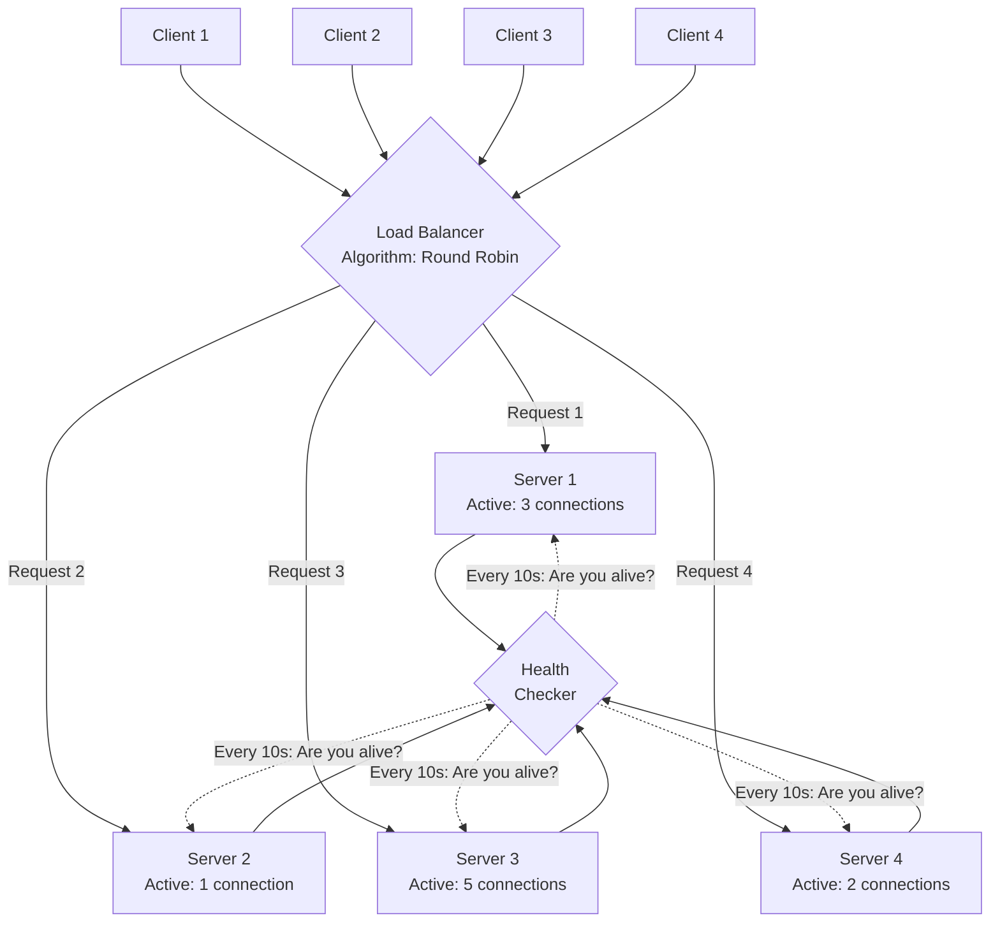

# Load Balancing Basics

## Why This Topic Exists

You have decided to horizontally scale. You added three more web servers. Now you have four servers ready to handle traffic. But here is the problem: when a user's browser makes a request, it contacts a specific IP address or domain. How does that request know which of your four servers to go to?

Without a solution to this problem, all traffic goes to one server (because that's the only IP the client knows about), and your three new servers sit idle doing nothing. The load is not balanced at all.

This is the problem that load balancers solve. A load balancer sits in front of your server pool and intelligently distributes incoming requests across all available servers. It is the traffic cop of your infrastructure — ensuring no single server is overwhelmed while others are underused.

---

## Learning Objectives

By the end of this file, you will be able to:

- Explain what a load balancer does and why it is essential for horizontal scaling
- Describe the major load balancing algorithms and when to use each
- Distinguish between Layer 4 and Layer 7 load balancing
- Explain how health checks work and why they matter
- Describe sticky sessions, why they exist, and their downsides

---

## Prerequisites

- [What is Scalability](./01.%20What%20is%20Scalability%20(BEGINNER).md)
- [Vertical vs Horizontal Scaling](./02.%20Vertical%20vs%20Horizontal%20Scaling%20(BEGINNER).md)

---

## Introduction

A **load balancer** is a component that receives incoming requests and distributes them across a pool of backend servers according to a defined algorithm. The client talks to the load balancer. The load balancer talks to the servers. The servers send responses back through (or sometimes directly to) the client.

Load balancers serve multiple functions simultaneously:
1. **Distribute load** — prevent any single server from being overwhelmed
2. **Health checking** — detect when a server is down and stop sending it traffic
3. **High availability** — ensure the system stays up even if some servers fail
4. **SSL termination** — decrypt HTTPS requests once at the load balancer so servers don't all need to handle encryption
5. **Request routing** — at higher layers, route different types of requests to different server pools

---

## Real-World Analogy: Supermarket Checkout

You walk into a busy supermarket. There are 8 checkout lanes open and 60 customers waiting to pay. Without a system, customers would all rush to the first lane they see, creating chaos — some lanes jammed, others empty.

The supermarket solves this with a supervisor at the entrance to the checkout area. The supervisor watches all the lanes and tells each customer, "Go to Lane 4 — it has the shortest queue." Or they might just send customers to the next lane in rotation: "You go to Lane 1, you go to Lane 2, you go to Lane 3..." and so on.

The supervisor is the load balancer. The lanes are the servers. The supervisor's job is to make sure work is distributed fairly so no single lane is overwhelmed, and to redirect customers away from a lane if the cashier goes on break (server down).

---

## Core Concepts

### What a Load Balancer Actually Does

At the most basic level, a load balancer:

1. Receives an incoming connection or request from a client
2. Applies an algorithm to select a backend server
3. Forwards the request to that server
4. Returns the server's response to the client

This happens for every single request. A high-traffic load balancer might process millions of requests per second.

### Load Balancing Algorithms

The algorithm determines *which* server gets the next request. Different algorithms suit different workloads.

**Round Robin**
Distribute requests in rotation: request 1 to Server 1, request 2 to Server 2, request 3 to Server 3, request 4 back to Server 1, and so on.

- Simple to implement
- Works well when all requests have similar cost and all servers have equal capacity
- Fails when some requests are much more expensive than others (Server 1 might get a cheap request while Server 2 gets an expensive one; they finish at different times, breaking the "balance")

**Weighted Round Robin**
Like round robin, but each server has a weight. A server with weight 3 gets three requests for every one request a server with weight 1 gets.

- Useful when servers have different capacities (e.g., during migration when new servers are more powerful)
- Still doesn't account for current load

**Least Connections**
Send the next request to the server with the fewest currently active connections.

- Better for workloads where requests have varying duration (a slow database query on one server vs a fast in-memory lookup on another)
- Requires the load balancer to track connection counts for all servers
- More intelligent than round robin for uneven workloads

**Least Response Time**
Send the next request to the server with the lowest combination of active connections and average response time.

- Most intelligent of the common algorithms
- Requires more tracking (response time monitoring per server)
- Used in production systems where response time matters greatly

**IP Hash**
Use a hash of the client's IP address to determine which server handles the request. The same IP always goes to the same server.

- Ensures the same client always reaches the same server ("sticky" by IP)
- Useful for caching: if a server caches data for a particular user, the next request from that user hits the same server and benefits from the cache
- Problematic if one IP represents many users (corporate NAT, where many employees share one external IP)
- Also problematic when a server goes down: all clients hashed to that server need to be remapped

**Random**
Simply pick a random server. Statistically approximates round robin at high request volumes. Simpler to implement. Surprisingly effective.

---

## Visual Diagram



---

## Deep Explanation

### Layer 4 vs Layer 7 Load Balancing

Load balancers operate at different levels of the networking stack. The two most common are Layer 4 and Layer 7.

**Layer 4 Load Balancing (Transport Layer)**
Layer 4 load balancers operate at the TCP/UDP level. They see the source IP, destination IP, and port number, but they do not look inside the request data (the HTTP headers, URL, or body).

- They route based purely on network information
- They are very fast because they don't need to parse request content
- They cannot make routing decisions based on content (can't route `/api/images` to one server pool and `/api/payments` to another)
- Examples: AWS Network Load Balancer, HAProxy in TCP mode

**Layer 7 Load Balancing (Application Layer)**
Layer 7 load balancers understand the application protocol (typically HTTP/HTTPS). They can inspect the actual request — the URL path, headers, cookies, and even the request body.

- Slower than Layer 4 because they must parse the HTTP request
- Can make intelligent routing decisions based on content
- Can implement SSL termination (decryption happens at the load balancer, not the servers)
- Can inject headers, rewrite URLs, and perform A/B testing
- Examples: AWS Application Load Balancer, Nginx, Traefik

**When to use which:**
- Use Layer 4 when you need maximum performance and don't need content-based routing
- Use Layer 7 when you need intelligent routing (microservices, A/B testing, canary deployments), SSL termination, or header manipulation

In practice, most web applications use Layer 7 load balancers because the flexibility is worth the small performance cost.

### Health Checks

A load balancer must know which servers are healthy and able to accept requests. Health checks are the mechanism for this.

**Active Health Checks**
The load balancer periodically sends a small request to each server — typically an HTTP GET to a `/health` endpoint — and checks the response. If the server responds with HTTP 200, it is healthy. If it times out, responds with an error, or returns a non-200 response, it is marked unhealthy.

Typical configuration:
- Check every 10 seconds
- Mark unhealthy after 2 consecutive failures
- Mark healthy again after 3 consecutive successes

**Passive Health Checks**
The load balancer monitors the actual traffic it is forwarding. If a server starts returning errors or timing out, it is marked unhealthy. No separate health check request is needed.

**Why health checks matter:**
When a server crashes, ongoing connections to it will fail. Without health checks, the load balancer keeps sending new requests to the dead server, which fail immediately. With health checks, the load balancer detects the failure within seconds and routes all traffic to the remaining healthy servers. The system stays up, though at reduced capacity.

This is a critical component of high availability. A load balancer without health checks is only doing half its job.

### Sticky Sessions (Session Affinity)

Here is a problem: a user logs in and their session is stored in memory on Server 2. The next request goes to Server 3 (round robin). Server 3 doesn't have their session. The user appears logged out.

One quick-fix solution is **sticky sessions** (also called session affinity): configure the load balancer to always route a given user to the same server. This is typically done by setting a cookie with a server identifier, or by using IP hash routing.

**The problem with sticky sessions:**

Sticky sessions are a band-aid, not a solution. Here is why:

1. **Uneven load**: If one server has all the heavy users and another has all the light users, the load is not actually balanced.
2. **Server failure**: If the server a user is "stuck to" goes down, their session is lost anyway. The user gets logged out, which is the exact problem you were trying to avoid.
3. **Scaling complexity**: When you add new servers, existing users stay on their old servers. New servers only get new users. This creates an imbalance.

The right solution is to make your application stateless — store session data externally (in Redis or a database) rather than on the server. Then any server can handle any request because the session data is not on the server. This is covered in depth in [File 05: Stateless vs Stateful Architecture](./05.%20Stateless%20vs%20Stateful%20Architecture%20(INTERMEDIATE).md).

Sticky sessions are acceptable as a temporary measure while you refactor to stateless, but they are not a long-term architecture.

### Load Balancer as a Single Point of Failure

A sharp student will ask: "If I have multiple servers to avoid a single point of failure, but I have one load balancer, isn't the load balancer now my single point of failure?"

Yes. And this is how you solve it:

- **Active-Passive**: Two load balancers. One is active, the other is standby. If the active one fails, the passive one takes over (failover). Requires a virtual IP that can move between machines.
- **Active-Active**: Two load balancers both actively handling traffic. A DNS round-robin or a higher-level load balancer distributes between them.
- **Managed cloud load balancers**: AWS ALB, Google Cloud Load Balancing, and Azure Load Balancer are managed services with built-in high availability. You don't manage the underlying infrastructure — the cloud provider guarantees availability.

In practice, most modern deployments use managed cloud load balancers and do not worry about load balancer high availability. The cloud provider handles it.

---

## Step-by-Step Example

**Setting up a basic load balancer with Nginx:**

Nginx is one of the most popular web servers and also serves as an excellent reverse proxy and load balancer.

```nginx
upstream backend_servers {
    least_conn;  # Use the least-connections algorithm

    server 10.0.0.1:8080 weight=3;  # This server is 3x as powerful
    server 10.0.0.2:8080 weight=1;
    server 10.0.0.3:8080 weight=1;
}

server {
    listen 80;

    location / {
        proxy_pass http://backend_servers;
        proxy_set_header X-Forwarded-For $remote_addr;
    }

    # Health check endpoint for monitoring
    location /nginx-health {
        return 200 "healthy\n";
    }
}
```

This configuration:
- Uses the least-connections algorithm
- Weights Server 1 three times more than Servers 2 and 3
- Forwards the client's real IP to the backend servers via a header
- Serves traffic on port 80

Nginx checks server health passively (by monitoring responses). For active health checks, you need Nginx Plus (commercial) or a tool like HAProxy.

---

## Advantages / Disadvantages / Trade-offs

| Aspect | Detail |
|--------|--------|
| Benefits | Enables horizontal scaling, eliminates single point of failure, enables zero-downtime deployments, SSL termination, health checking |
| Layer 4 pros | Very fast, low overhead, simple |
| Layer 4 cons | No content-based routing, no HTTP awareness |
| Layer 7 pros | Content-based routing, SSL termination, header manipulation |
| Layer 7 cons | Slightly slower, more complex |
| Round Robin | Simple, even distribution, bad for unequal request costs |
| Least Connections | Better for unequal load, more tracking required |
| IP Hash | Client-server affinity, breaks on server failure, uneven with NAT |
| Sticky Sessions | Quick fix for stateful apps, causes uneven load, breaks on server failure |

---

## When to Use / When NOT to Use

**Use a load balancer when:**
- You have more than one server (almost always)
- You need high availability (if one server can go down)
- You are implementing auto-scaling (dynamically add/remove servers)
- You need zero-downtime deployments (take servers out of rotation one at a time)
- You need SSL termination at one point rather than every server

**Be careful with sticky sessions when:**
- You cannot yet make your application stateless
- Only use as a temporary measure — always plan to migrate to stateless

**Note:** This file is an introduction to load balancing concepts. Chapter 06 (Load Balancing) goes into depth on advanced patterns including global server load balancing, consistent hashing, L3/L4/L7 details, and more.

---

## Common Interview Questions

1. **"Explain how a load balancer works."**
   A load balancer receives requests from clients and distributes them across a pool of backend servers using a configured algorithm (round robin, least connections, etc.). It performs health checks to detect and remove unhealthy servers from rotation.

2. **"What is the difference between Layer 4 and Layer 7 load balancing?"**
   L4 operates at the TCP level — routes based on IP and port, very fast, no HTTP awareness. L7 operates at the HTTP level — can route based on URL, headers, and cookies, slightly slower but much more flexible.

3. **"What is a sticky session and what is the problem with it?"**
   A sticky session ensures a user always goes to the same server. The problem is it causes uneven load distribution, breaks when a server fails, and is a band-aid for a deeper problem (stateful servers). The real solution is stateless architecture.

4. **"How do you make the load balancer itself highly available?"**
   Active-passive setup with failover, active-active with DNS round robin, or use a managed cloud load balancer that provides built-in HA.

---

## Common Beginner Mistakes

1. **Thinking load balancers only balance CPU load.** Load balancers distribute requests, not necessarily compute load. A round-robin load balancer might send all expensive requests to Server 1 and all cheap requests to Server 2, resulting in very uneven CPU load. Use least-connections or least-response-time for workloads with uneven request costs.

2. **Forgetting SSL termination.** If you don't terminate SSL at the load balancer, every single backend server needs its own SSL certificate and crypto processing. Terminating at the load balancer is simpler and allows the backend network to use plain HTTP (which is fine since it's internal and trusted).

3. **Using sticky sessions as a permanent solution.** They work temporarily but create long-term problems. Always plan to migrate to stateless architecture.

4. **Not configuring health checks properly.** A load balancer without health checks will keep sending requests to dead servers until you manually remove them. Always configure health checks.

5. **Not accounting for the load balancer in capacity planning.** If you have 10 servers that can each handle 1,000 RPS, your theoretical maximum is 10,000 RPS. But the load balancer itself has a limit. Most production load balancers handle millions of RPS, so this is rarely an issue in practice — but it is worth knowing.

---

## Summary

A load balancer distributes incoming requests across a pool of backend servers. It uses algorithms (round robin, least connections, IP hash, weighted) to decide which server gets each request. It performs health checks to detect and route around failed servers. Layer 4 load balancers operate at the TCP level (fast, no HTTP awareness). Layer 7 load balancers operate at the HTTP level (slower, content-aware). Sticky sessions are a temporary workaround for stateful applications — the real solution is stateless architecture. The load balancer itself can be made highly available using an active-passive or active-active setup.

---

## Key Takeaways

- Load balancers sit between clients and servers, distributing requests across the server pool
- Without a load balancer, horizontal scaling doesn't work — all traffic goes to one server
- Round robin is simple; least connections is smarter for uneven workloads; IP hash provides affinity
- Layer 4 is faster; Layer 7 is more flexible and supports content-based routing
- Health checks are essential — they detect failed servers and remove them from rotation
- Sticky sessions are a temporary fix, not a long-term solution
- The load balancer itself should be made highly available to avoid becoming a single point of failure

---

## Related Topics

- [Vertical vs Horizontal Scaling](./02.%20Vertical%20vs%20Horizontal%20Scaling%20(BEGINNER).md)
- [Stateless vs Stateful Architecture](./05.%20Stateless%20vs%20Stateful%20Architecture%20(INTERMEDIATE).md)
- [The Scalability Interview Framework](./07.%20The%20Scalability%20Interview%20Framework%20(BEGINNER).md)
- [Chapter 06: Load Balancing](../06.%20Load%20Balancing/README.md) — deep dive into advanced patterns
- [Chapter 08: Distributed Systems](../08.%20Distributed%20Systems/README.md)
