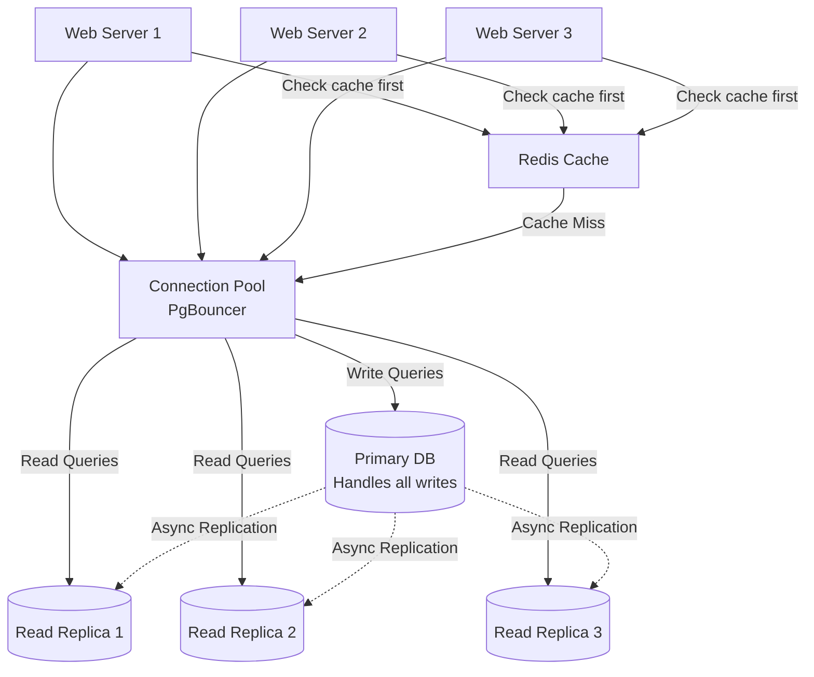

# Database Scaling

## Why This Topic Exists

Here is the pattern that plays out in almost every growing system: you add more web servers, put a load balancer in front of them, make your app stateless, and things improve dramatically. Traffic spikes no longer crash your web tier. You feel confident.

Then you check the database metrics. CPU: 95%. Memory: nearly full. Query response time: 2 seconds and climbing. Error rate: spiking.

The database has become the bottleneck. It almost always does.

Web servers are stateless and easy to scale horizontally — just add more. But a database holds your data. All of it. And every web server, every request, every user is reading from and writing to that same database. It is the one component that every part of your system depends on, and it is the hardest to scale.

This file is about the tools available to you when your database is the problem.

---

## Learning Objectives

By the end of this file, you will be able to:

- Explain why the database is typically the first major bottleneck in a growing system
- Describe how read replicas work and when they help
- Explain connection pooling and why it matters
- Describe vertical scaling as a database strategy
- Explain caching in front of the database and why it dramatically reduces load
- Define sharding at a high level and understand when it becomes necessary

---

## Prerequisites

- [What is Scalability](./01.%20What%20is%20Scalability%20(BEGINNER).md)
- [Vertical vs Horizontal Scaling](./02.%20Vertical%20vs%20Horizontal%20Scaling%20(BEGINNER).md)

---

## Introduction

Most applications follow an 80/20 rule for database operations: roughly 80% of operations are reads (SELECT queries) and 20% are writes (INSERT, UPDATE, DELETE). For social media platforms, the ratio is even more extreme — users scroll and read content far more often than they post.

This read-heavy nature of most applications is good news. It means there is a specific, effective, and relatively simple solution that handles most of the scaling load: **read replicas**. The database primary handles writes, while multiple replicas handle reads. This is the first and most important tool in database scaling.

But read replicas are not the complete answer. Let's work through the full toolkit.

---

## Real-World Analogy: The Library

Imagine a library with a single librarian. The librarian both receives new book donations (writes) and helps visitors find and retrieve books (reads). As the library grows popular, the librarian is overwhelmed — too many people need help finding books.

**Naive solution:** Make the librarian work faster (vertical scaling — faster hardware, more memory).

**Better solution:** Hire assistants who each have a copy of the library's catalog. When visitors want to find a book (read), they talk to any assistant. Only when new books arrive (write) do they go to the head librarian, who updates the master catalog. The assistants periodically sync their catalogs with the master.

This is exactly how read replicas work. The head librarian is the primary database. The assistants are the read replicas.

**Further improvement:** Post a list of the most-asked-for books on a board near the entrance (cache). Now visitors don't need to ask anyone at all for those common titles — they just look at the board.

---

## Core Concepts

### The Database Bottleneck

Why does the database become a bottleneck before the web servers?

1. **It is stateful.** Unlike web servers (which you can make stateless), the database *must* store state. You cannot simply add ten database servers without solving the hard problem of keeping them in sync.

2. **Every request touches it.** A single web request might require 5-20 database queries. With 1,000 requests per second, you might have 10,000-20,000 database queries per second. That is a lot for one machine.

3. **Disk I/O is slow.** Reading and writing to disk is orders of magnitude slower than reading from memory. Database operations that cannot fit in memory must go to disk, and disk access is a bottleneck.

4. **Connections are expensive.** Every application thread that wants to talk to the database needs a connection. Opening and closing a database connection has overhead. And databases have a maximum number of concurrent connections they can support.

5. **Locking and contention.** When multiple queries try to read and write the same rows, the database must serialize those accesses using locks. At high concurrency, lock contention causes queries to queue up waiting for each other.

### Read Replicas

A read replica is a copy of the primary database that is kept up-to-date (usually within milliseconds) using a process called **replication**.

How it works:
1. All write operations (INSERT, UPDATE, DELETE) go to the **primary** database
2. The primary writes changes to a **replication log** (also called a write-ahead log or binlog)
3. Each **replica** reads this log and applies the same changes to its own copy of the data
4. Read queries (SELECT) are sent to one of the replicas, freeing the primary to focus on writes

The result: if you have 1 primary and 3 replicas, your read capacity has quadrupled (4 copies of the data instead of 1, all able to serve reads simultaneously). Write capacity has not changed — you still have only one primary accepting writes — but writes are typically a small fraction of total load.

**Replication Lag**

There is a trade-off: replication is asynchronous by default, which means replicas are usually slightly behind the primary. If User A posts a tweet and immediately refreshes the page (reading from a replica), they might not see their own tweet for a fraction of a second. This is called **replication lag**.

For most operations, this is acceptable. For operations that must read immediately after writing (like "show me the post I just created"), you can route that specific read to the primary. This pattern is called **read-your-writes consistency**.

### Connection Pooling

Every time an application opens a connection to the database, it goes through a connection handshake: TCP connection, authentication, session setup. This takes 20-50ms for a local connection and up to 300ms for a remote one.

If your web server opens a new database connection for every single request, this overhead adds up significantly. For a server handling 500 requests per second, you'd be opening 500 new connections per second — an enormous overhead.

**Connection pooling** solves this by maintaining a pool of pre-established, reusable connections. When a request needs a database connection, it borrows one from the pool. When finished, it returns the connection to the pool (not close it). The next request gets that already-open connection immediately.

```
Without Connection Pooling:
Request 1 → Open connection (50ms) → Query (10ms) → Close connection
Request 2 → Open connection (50ms) → Query (10ms) → Close connection
Total: 120ms for 2 requests

With Connection Pooling:
Request 1 → Get connection from pool (1ms) → Query (10ms) → Return to pool
Request 2 → Get connection from pool (1ms) → Query (10ms) → Return to pool
Total: 24ms for 2 requests
```

Tools for connection pooling:
- **PgBouncer** — dedicated connection pooler for PostgreSQL, handles thousands of application connections with only a few actual database connections
- **Application-level poolers** — most ORMs and database drivers include built-in connection pooling (SQLAlchemy, HikariCP for Java, pg-pool for Node.js)

**Database connection limits** are a real constraint. PostgreSQL defaults to 100 maximum connections. Each connection consumes memory on the database server (~5-10 MB). With 10 web servers each wanting 20 connections, you're at 200 — over the limit. Connection pooling allows 1,000 app connections to share 50 database connections gracefully.

### Vertical Scaling the Database

Before introducing the complexity of read replicas and sharding, the first step for a struggling database is usually vertical scaling: give it more RAM and faster storage.

**Why more RAM helps so much for databases:**
Databases try to keep frequently accessed data in memory (the "buffer pool" or "shared buffers"). A query that reads from memory takes microseconds. A query that reads from disk takes milliseconds — often 1,000x slower. Giving the database more RAM means more data fits in the cache, and more queries are served from memory.

For many workloads, upgrading from a 32 GB machine to a 256 GB machine and ensuring the working dataset fits in RAM transforms database performance without any architectural changes.

**Why faster storage matters:**
Writes and cache misses (queries that don't find data in memory) must go to disk. Upgrading from SATA SSD to NVMe SSD can provide 5-10x higher disk I/O throughput.

Vertical scaling is the first response to a struggling database precisely because it is simple and requires no application changes.

### Caching Query Results

Even with read replicas, some queries are extremely expensive — they might involve joining multiple large tables, running aggregations over millions of rows, or computing rankings. Running these queries on every page load is wasteful.

The solution is to cache the results of expensive or frequently-repeated queries in a fast in-memory store (typically **Redis** or **Memcached**).

When a user requests their news feed:
1. Check the cache: "Is there a cached news feed for user 12345?"
2. If yes (cache hit): return it immediately (~1ms)
3. If no (cache miss): run the expensive database query (~500ms), store the result in cache with an expiration time, return the result

After the first request, every subsequent request for that user's news feed is served from memory in 1ms instead of hitting the database for 500ms. This is a 500x reduction in database load for that specific operation.

Caching is so powerful as a scalability tool that it has its own chapter ([Chapter 05: Caching](../05.%20Caching/README.md)) and a dedicated introductory file in this chapter ([File 06](./06.%20Caching%20for%20Scalability%20(BEGINNER).md)).

### Introduction to Sharding

What happens when even read replicas and caching are not enough? When the volume of writes is so high that a single primary database cannot keep up? Or when the dataset is so large that it doesn't fit on any single machine?

The answer is **sharding** (also called horizontal partitioning): split the data across multiple database servers so each server holds only a portion of the total data.

For example, a social media platform might shard by user ID:
- Users with ID 1-10 million: Shard 1
- Users with ID 10-20 million: Shard 2
- Users with ID 20-30 million: Shard 3

When a query comes in for user 15,000,000, the application knows to go to Shard 2. The shards operate independently — each has its own storage, CPU, and RAM. Write capacity scales with the number of shards.

Sharding is powerful but complex. It introduces hard problems:
- **Cross-shard queries**: "Find all users who follow User X" might require querying multiple shards and combining results
- **Resharding**: When a shard gets too full and you need to split it, migrating data without downtime is difficult
- **Hot spots**: If user activity is not evenly distributed (e.g., a celebrity with millions of followers is on Shard 1), one shard can be much busier than others

Sharding is a last resort for database scaling — after you have already tried read replicas, caching, connection pooling, and vertical scaling. It is covered in depth in **Chapter 04 (Databases)**.

---

## Visual Diagram



---

## Deep Explanation

### A Social Media Feed Example: Walking Through the Load

Let's trace a concrete example. You are building a Twitter-like platform.

**Key operations:**
- **Tweet**: User posts a tweet (write to DB)
- **Feed**: User loads their home feed of tweets from people they follow (read from DB)
- **Like**: User likes a tweet (write to DB)
- **Profile view**: User views another user's profile and recent tweets (read from DB)

**Load ratio:** For every 1 tweet posted, there are approximately 1,000 feed loads. For every 1 like, there are approximately 200 feed loads. The system is overwhelmingly read-heavy.

**At 10,000 users:**
Single database handles everything. A few dozen queries per second. No problem.

**At 1,000,000 users:**
Peak load: 10,000 concurrent users, each loading their feed. That's 10,000 feed queries per second, each possibly joining tweets, users, and follow tables. The single database is at its limit.

**Apply read replicas:** Route all feed loads (reads) to 3 read replicas. The primary only handles tweets and likes (writes). Each read replica now handles around 3,333 read queries/second instead of one DB handling 10,000. Latency drops dramatically.

**At 10,000,000 users:**
Read replicas are now each handling 30,000+ read queries/second. This is too many. We add caching: cache the home feed for each user for 30 seconds. Now a feed load only hits the DB if the cache has expired. Cache hit rate is 90%+. Database read load drops by 90%.

**At 100,000,000 users:**
Write load is now the problem. Celebrity users have millions of followers. When they tweet, the system has to write fan-out records (or compute feeds dynamically) for millions of users. The single primary database cannot keep up with write throughput. Now sharding becomes necessary — perhaps sharding by user ID across 10 database shards.

This is the natural progression of database scaling, and it mirrors the history of platforms like Twitter and Instagram.

### The Write Bottleneck

It is worth emphasizing that read replicas only solve the read bottleneck. If your write load is also high (e.g., a logging system, a financial transactions platform, a high-frequency trading system), read replicas do not help at all — all writes still go to the single primary.

For write-heavy workloads, the options are:
1. Vertical scale the primary (give it more CPU and faster NVMe storage)
2. Use a database designed for high write throughput (Cassandra, DynamoDB) — covered in Chapter 04
3. Shard the database so writes are distributed across multiple primaries
4. Use a write-ahead log and batch writes together to reduce the number of actual disk writes

### Why Connection Limits are a Hidden Killer

Here is a real scenario that silently kills systems as they scale:

- You have 5 web servers, each running 50 threads
- Each thread holds one database connection
- Total connections: 5 * 50 = 250
- Your PostgreSQL is configured for 100 max connections

What happens? New connections are refused. Requests fail. The error message is cryptic ("too many connections" or "connection pool exhausted"). Everything looks fine from the outside — your web servers are healthy, your database is healthy — but users are getting errors.

Connection pooling (PgBouncer) is not optional at scale. It is the component that allows 5 servers * 50 threads = 250 application-level connections to share just 20-30 actual database connections. PgBouncer queues excess requests and serves them as connections become available, rather than letting them fail.

---

## Step-by-Step Example

**Before optimization: everything hits one database**

Single database handling all reads and writes. Average query time: 200ms. Peak load: 500 queries/second. CPU: 95%, Disk I/O: 85%, Connections: 490/500 (near limit).

**Step 1: Add Connection Pooler (PgBouncer)**

PgBouncer manages 20 actual DB connections. Web servers can now use 500 threads, all sharing those 20 connections. Result: connections no longer a bottleneck. CPU still high.

**Step 2: Add Read Replicas**

Write requests go to Primary DB. Read requests go to one of 3 Read Replicas. Primary DB handles only writes (~20% of queries). Each Replica handles ~27% of reads. CPU on Primary drops to 35%.

**Step 3: Add Redis Cache for Expensive Queries**

Feed requests first check Redis Cache. On cache hit: return immediately (1ms, no DB query). On cache miss: query Read Replica, store in Redis with a 30-second TTL, return result. Cache hit rate: 85%. DB read queries drop by 85%. Average response time: 5ms (was 200ms).

**Result:** System now handles 10x the original load with graceful response times.

---

## Advantages / Disadvantages / Trade-offs

| Strategy | Solves | Doesn't Solve | Complexity | Cost |
|----------|--------|---------------|------------|------|
| Vertical Scaling | All bottlenecks temporarily | Nothing permanently; single point of failure | Low | Medium-High |
| Connection Pooling | Connection limit exhaustion | Query load, storage | Very Low | Very Low |
| Read Replicas | Read bottleneck | Write bottleneck; adds replication lag | Medium | Medium |
| Query Caching | Expensive/repeated reads | Writes; stale data risk | Medium | Low |
| Sharding | Write bottleneck; dataset size | Cross-shard queries; huge operational complexity | Very High | High |

---

## When to Use / When NOT to Use

**Vertical scale the database when:**
- You have a sudden performance problem and need a quick fix
- Your working dataset can fit in more RAM
- You haven't exhausted simpler options yet

**Add read replicas when:**
- More than 60-70% of your database load is reads
- You can tolerate small amounts of replication lag for most queries
- Your application can be updated to route reads to replicas

**Add connection pooling when:**
- You have multiple application servers each needing database connections
- You are seeing connection limit errors
- You are using PostgreSQL (connection overhead is higher than MySQL)

**Add caching when:**
- You have expensive or frequently-repeated read queries
- The data doesn't need to be perfectly up-to-the-millisecond fresh
- You want to dramatically reduce DB load without changing the DB architecture

**Consider sharding when:**
- After all of the above, you still have a write bottleneck
- Your dataset has grown beyond what a single machine can store
- You have read and understood the complexity involved (Chapter 04)

---

## Common Interview Questions

1. **"What are read replicas and when do they help?"**
   Read replicas are copies of the primary database that handle read queries. They help when your system is read-heavy — the replicas absorb read load, freeing the primary to focus on writes. They do not help with write-heavy workloads.

2. **"What is replication lag and how do you handle it?"**
   Replication lag is the delay between a write on the primary and its visibility on a replica. Handle it by routing "read your own writes" operations to the primary, or using synchronous replication for critical data (at the cost of higher write latency).

3. **"What is connection pooling and why is it important?"**
   Connection pooling maintains a pool of open database connections that are reused across requests. It reduces the overhead of opening/closing connections and prevents connection limit exhaustion as you scale the web tier.

4. **"How would you scale a database for a social media feed?"**
   Most feed loads are reads, so add read replicas. Cache computed feeds in Redis (they don't need to be perfectly fresh). Add a connection pooler for the primary. If write volume grows (very popular platform), consider sharding by user ID.

---

## Common Beginner Mistakes

1. **Scaling web servers without thinking about the database.** The web tier scales easily. Engineers often add web servers, see the load balancer working, and think they've solved the scaling problem. Then the database explodes. Always think about the database when planning scale.

2. **Sending all queries to the primary when replicas exist.** After setting up read replicas, many engineers forget to update their application to actually use them. The replicas sit idle while the primary is overwhelmed. You have to configure your ORM or connection layer to route reads to replicas.

3. **Not setting appropriate TTLs on cached data.** Caching stale data is a serious bug. If you cache a user's post and then the user deletes it, your cache might serve the deleted post. Always set appropriate expiration times and/or invalidate the cache on writes.

4. **Trying to shard before trying simpler options.** Sharding is complex and hard to undo. Many teams shard prematurely when read replicas + caching would have been sufficient. Exhaust simpler options first.

5. **Forgetting about connection pooling when scaling the web tier.** As you add web servers, each one wants its own connections to the database. Without a connection pooler, this blows past the database's connection limit quickly.

---

## Summary

The database is almost always the first major bottleneck in a scaling system. The database scaling toolkit, in order of increasing complexity, is: vertical scaling (more RAM, faster storage), connection pooling (reuse connections, avoid the connection limit), read replicas (distribute read load across multiple copies), caching (avoid hitting the DB for frequently-read data), and sharding (split data across multiple databases for write scale). For most applications, read replicas plus a Redis cache handle the database bottleneck remarkably well. Sharding is a last resort and has serious complexity trade-offs.

---

## Key Takeaways

- The database is stateful and therefore harder to scale than the web tier
- Most applications are read-heavy (80%+ reads) — read replicas directly solve this
- Read replicas have replication lag — consider it when routing queries
- Connection pooling prevents connection limit exhaustion — it is not optional at scale
- Caching expensive/repeated queries is extremely effective for reducing DB load
- Sharding solves write bottlenecks but introduces significant complexity — use it last

---

## Related Topics

- [What is Scalability](./01.%20What%20is%20Scalability%20(BEGINNER).md)
- [Vertical vs Horizontal Scaling](./02.%20Vertical%20vs%20Horizontal%20Scaling%20(BEGINNER).md)
- [Caching for Scalability](./06.%20Caching%20for%20Scalability%20(BEGINNER).md)
- [The Scalability Interview Framework](./07.%20The%20Scalability%20Interview%20Framework%20(BEGINNER).md)
- [Chapter 04: Databases](../04.%20Databases/README.md) — sharding, replication models, NoSQL
- [Chapter 05: Caching](../05.%20Caching/README.md) — deep dive into caching strategies
