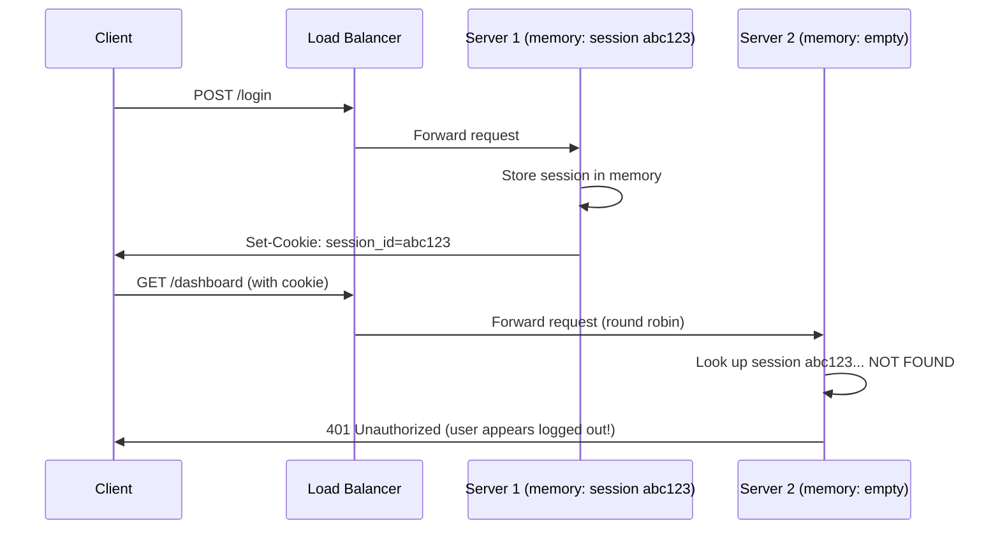
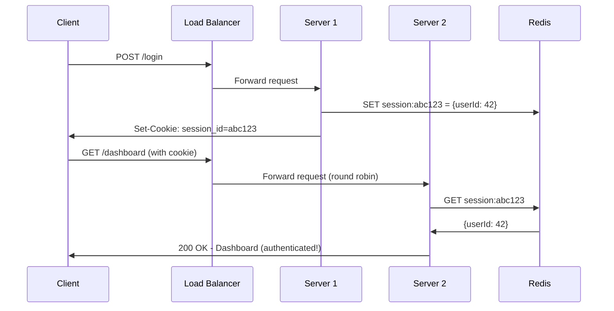

# Stateless vs Stateful Architecture

## Why This Topic Exists

You decided to horizontally scale. You set up three web servers and a load balancer. Traffic is now distributed. You deploy and go home feeling good about it.

The next morning, your support inbox is full. Hundreds of users are complaining: "I keep getting logged out randomly." "My shopping cart keeps disappearing." "I have to log in again every few minutes."

You investigate and find the bug: your application stores session data in memory on each web server. User logs in, session stored on Server 1. Next request hits Server 2 (round robin). Server 2 has no session. User is treated as unauthenticated. The fix for this problem — making your application stateless — is one of the most important architectural concepts in scalable system design.

This is not a niche edge case. This is the single most common reason that horizontal scaling fails in practice.

---

## Learning Objectives

By the end of this file, you will be able to:

- Define state and explain why it matters in distributed systems
- Distinguish between stateless and stateful architectures with precise definitions
- Explain why stateful servers break horizontal scaling
- Describe multiple strategies for moving state out of servers
- Compare JWT tokens and server-side sessions as authentication mechanisms
- Design a stateless version of a stateful system

---

## Prerequisites

- [What is Scalability](./01.%20What%20is%20Scalability%20(BEGINNER).md)
- [Vertical vs Horizontal Scaling](./02.%20Vertical%20vs%20Horizontal%20Scaling%20(BEGINNER).md)
- [Load Balancing Basics](./03.%20Load%20Balancing%20Basics%20(BEGINNER).md)

---

## Introduction

**State** is any data that a server stores about a specific client or about past interactions. The most common form of state in web applications is a **session**: when you log in, the server creates a record saying "User 12345 is authenticated" and stores it somewhere. Future requests include a session ID, and the server looks up the session to verify identity.

Where the session data is stored is the critical question. If it is stored in the server's memory, you have a stateful server. If it is stored somewhere external (a shared cache, a database, or in the request itself), you have a stateless server.

---

## Real-World Analogy: Two Types of Bank Tellers

You walk into a bank. There are two approaches a teller could take.

**Stateful Teller (Old-school):**
Maria has been your teller for years. She recognizes you by face, knows your account details from memory, and doesn't need to look anything up. She knows you prefer wire transfers over checks. The service is personal and fast — *if you see Maria*. But if Maria is sick and you see John, he has no idea who you are. He has to start from scratch. Worse, if Maria leaves the bank, all that knowledge about you is gone.

**Stateless Teller (Modern System):**
James looks you up in the system every time you visit. He doesn't recognize you personally — he asks for your account number or ID, retrieves your information from the database, and serves you based on what the system says. If James is sick, you see Sara. Sara does the same thing — looks you up in the system. She serves you identically to James because she uses the same database. It doesn't matter which teller you see.

James and Sara are stateless servers. The database is the external state store. Any teller can serve any customer because they all share the same source of truth.

This is the architecture you want for horizontally scalable systems: **servers that don't remember anything between requests** — all state lives outside the server.

---

## Core Concepts

### What Is State?

State is any information that a system component stores that affects how it processes future requests. Types of state in a web server:

- **Session data**: Is this user authenticated? What is their user ID? What permissions do they have?
- **Shopping cart**: What items has this user added to their cart?
- **In-progress operations**: Is this user currently in the middle of a checkout flow?
- **Application-level cache**: The server has cached some database results in memory for performance
- **Connection state**: The server holds an open WebSocket connection to a specific client

Not all state is bad. The problem is specifically state that is **not shared** between server instances — state that only one server knows about.

### Stateful Architecture

In a stateful architecture, each server instance stores client-specific data in its own memory. The server "remembers" the client between requests.

**How it works:**
1. User logs in to Server 1
2. Server 1 creates a session in memory: `sessions["abc123"] = { userId: 42, loggedIn: true }`
3. Server 1 returns a cookie to the client: `session_id=abc123`
4. Client's next request includes the cookie
5. If the next request goes to Server 1: Server 1 finds `sessions["abc123"]`, knows the user is authenticated. Works.
6. If the next request goes to Server 2: Server 2's memory has no entry for `abc123`. It treats the user as unauthenticated. Breaks.

The user experience is a random, mysterious logout.

### Stateless Architecture

In a stateless architecture, each request contains all the information needed to process it. The server does not rely on any memory from previous requests.

**How it works:**
Option 1 — External session store:
1. User logs in to Server 1
2. Server 1 creates a session in **Redis** (external cache): `SETEX session:abc123 3600 '{"userId": 42}'`
3. Server 1 returns the session ID as a cookie
4. Client's next request goes to any server (say Server 3)
5. Server 3 reads the cookie: `session_id=abc123`
6. Server 3 queries Redis: `GET session:abc123` → gets `{"userId": 42}`
7. Server 3 knows the user is authenticated. Works.

Option 2 — JWT (self-contained tokens):
1. User logs in to any server
2. Server creates a **JWT** (JSON Web Token): a signed payload containing `{ userId: 42, expiresAt: ... }`
3. Server returns the JWT to the client (as a cookie or in the Authorization header)
4. Client's next request includes the JWT in every request
5. Any server can **verify the JWT's signature** and **read its payload** without querying any external store
6. No server-to-server or server-to-cache communication needed for authentication. Works.

---

## Visual Diagram

**Stateful Architecture (Breaks with multiple servers):**



**Stateless Architecture with External Session Store:**



---

## Deep Explanation

### JWT Tokens: Moving State to the Client

JWTs are a clever solution to the session problem: instead of storing session data on the server (stateful) or in a shared cache (stateless but requires infrastructure), you store the session data in the token itself and give it to the client.

A JWT has three parts, separated by dots:
1. **Header**: algorithm used to sign the token (`{"alg": "HS256"}`)
2. **Payload**: the actual data (`{"userId": 42, "role": "admin", "exp": 1704067200}`)
3. **Signature**: a cryptographic signature created using a secret key

The signature is the key. Any server that knows the secret key can verify that:
- The token was created by your system (not forged by an attacker)
- The payload has not been tampered with

So a server receiving a JWT does not need to talk to any other server or database to authenticate the user. It simply verifies the signature and reads the payload. This is truly stateless — no shared infrastructure required.

**JWT advantages:**
- No external session store required
- Works across multiple services (microservices can each verify the same JWT)
- Scales to any number of servers with zero coordination
- Can include custom claims (permissions, roles, user metadata)

**JWT trade-offs:**
- **Cannot be revoked easily.** Once a JWT is issued, it is valid until it expires. If a user logs out or you want to invalidate their session (e.g., they changed their password), you cannot "delete" the JWT — the user still has it. Solutions involve short expiration times (15 minutes) combined with refresh tokens, or a small "token blacklist" in Redis (which partially reintroduces shared state).
- **Payload is public.** The payload is base64-encoded, not encrypted. Anyone who has the token can read the payload. Don't store sensitive data (passwords, PII) in the payload. The signature ensures integrity but not confidentiality.
- **Token size.** JWTs are larger than a simple session ID. Every request includes the full JWT in the header. For a payload with many claims, this can add 500+ bytes to every request.

**Server-side session advantages:**
- **Instant revocation.** Delete the session from Redis, and the user is immediately logged out on the next request. Essential for banking applications, admin panels, and any system where you need to invalidate sessions immediately.
- **No sensitive data in the client.** The client only has an opaque session ID. All session data stays server-side.
- **Smaller request size.** A session ID is typically 32-64 characters. A JWT might be 500 characters.

**Choosing between JWT and server-side sessions:**
- Need immediate revocation (banking, security-sensitive apps)? Use server-side sessions in Redis.
- Building microservices where many services need to authenticate users without a central session store? JWTs are excellent.
- Simple web app? Either works. Redis sessions are arguably simpler to reason about for most cases.

### Where to Store External State

If you choose server-side sessions, you need an external store. Options:

**Redis:**
An in-memory key-value store. Extremely fast (sub-millisecond reads/writes). Purpose-built for session storage. Supports automatic expiration (TTL). Nearly universal choice for session storage. The risk: if Redis goes down, all sessions are invalidated (users are logged out). Mitigate with Redis Cluster or Redis Sentinel for high availability.

**Database (PostgreSQL, MySQL):**
More durable than Redis (sessions persist across restarts). Slower (10-100ms reads vs sub-millisecond for Redis). Appropriate if you need session history for audit purposes. Generally not the first choice for high-performance session storage.

**Distributed Cache (Memcached):**
Similar to Redis but simpler (no persistence, fewer data structures). Fast. Does not support TTL expiration on individual keys. Redis has largely superseded Memcached for modern applications.

**Sticky Sessions (Load Balancer):**
Route each user to the same server always. The server's in-memory session is always found. This is a workaround, not a real solution — covered in [File 03: Load Balancing Basics](./03.%20Load%20Balancing%20Basics%20(BEGINNER).md). Avoid except as a temporary measure.

### Other Types of State to Externalize

Sessions are the most visible, but not the only state you need to consider.

**Shopping carts:** Store in Redis or the database, keyed by user ID or a cart token. Not in the web server's memory.

**Rate limiting counters:** "This IP has made 95 requests in the last minute." This counter needs to be shared across all web servers or every server starts fresh. Use Redis with atomic increment operations.

**Distributed locks:** "Only one server should process this payment at a time." Locks must be stored in a shared location (Redis supports distributed locks via the Redlock algorithm).

**Application-level cache:** Be careful here. Caching data in web server memory is fine, but the cache might be inconsistent across servers (Server 1 has stale data, Server 2 has fresh data). Use a shared cache (Redis) or accept eventual consistency.

### The Spectrum: Fully Stateless is Rarely Achievable

In practice, truly stateless systems are rare. Even a "stateless" web server usually maintains:
- A database connection pool (connection state)
- In-memory application caches
- Background job state

The goal is not to eliminate all state from servers, but to eliminate **per-client session state** from servers. This is the specific type of state that breaks horizontal scaling.

The principle: **make your servers interchangeable**. Any server in your pool should be able to handle any request from any client at any time. If you can achieve this, you can add or remove servers freely, and the load balancer can distribute traffic without constraint.

---

## Step-by-Step Example

A team builds a web app with in-memory sessions. As they scale, they hit the session problem. Here is the migration:

**Step 1: Identify the state**
Audit all places where the server stores per-client data in memory:
- `app.sessions[sessionId]` — in-memory session store
- `app.cache[userId]` — in-memory user profile cache

**Step 2: Move sessions to Redis**

Before (stateful):
```javascript
// Login
req.session.userId = user.id; // stored in server memory
req.session.isAdmin = user.isAdmin;

// Auth check (only works on the same server)
if (req.session.userId) {
    // authenticated
}
```

After (stateless with Redis):
```javascript
// Login
const sessionId = crypto.randomUUID();
await redis.setex(`session:${sessionId}`, 3600, JSON.stringify({
    userId: user.id,
    isAdmin: user.isAdmin
}));
res.cookie('sessionId', sessionId, { httpOnly: true, secure: true });

// Auth check middleware (works on any server)
const sessionData = await redis.get(`session:${req.cookies.sessionId}`);
if (sessionData) {
    req.user = JSON.parse(sessionData); // authenticated
}
```

**Step 3: Test with multiple servers**
Simulate two servers by running two instances of the app locally (on ports 3001 and 3002) with a round-robin proxy in front. Log in, then make requests. Confirm that authentication works regardless of which server handles the request.

**Step 4: Deploy and scale freely**
Now that servers are stateless, you can add, remove, or replace servers without any effect on users. Auto-scaling works correctly.

---

## Advantages / Disadvantages / Trade-offs

| Dimension | Stateful | Stateless |
|-----------|----------|-----------|
| Horizontal scalability | Poor — requests must go to specific server | Excellent — any server handles any request |
| Session revocation | Easy — delete from local memory | Requires external store (Redis) for server-side sessions; hard for JWTs |
| Failure recovery | Bad — server crash loses all sessions | Good — sessions in Redis survive server crashes |
| Infrastructure complexity | Low (no Redis needed) | Medium (requires Redis or similar) |
| Request size | Small (just a session ID) | Larger for JWT (full payload in every request) |
| Latency | Low (memory lookup, no network) | Slightly higher (Redis lookup ~1ms) |
| Debugging | Simpler (state is local) | Slightly harder (state is distributed) |
| Multi-service (microservices) | Hard (sessions tied to one service) | Easy with JWT (any service can verify) |

---

## When to Use / When NOT to Use

**Prefer stateless architecture when:**
- You are horizontally scaling (more than one server)
- You need auto-scaling (servers added/removed dynamically)
- You are building microservices (multiple services need to verify identity)
- You want resilience to server crashes (session survives in Redis)

**Stateful architecture is acceptable when:**
- You have a single server and are not planning to scale (simple internal tools)
- You are in very early stage development and want to ship fast
- You need a quick prototype and will refactor later

**Use JWTs when:**
- Building microservices or APIs consumed by mobile/SPA clients
- You don't need immediate session revocation
- You want to avoid Redis infrastructure

**Use server-side sessions (Redis) when:**
- You need immediate session revocation (logout, password change, admin invalidation)
- You're building security-sensitive features (banking, admin panels)
- You want smaller request payloads

---

## Common Interview Questions

1. **"Why can't you store session data on a web server when you have multiple servers?"**
   Because the load balancer might route the user's next request to a different server, which has no knowledge of the session. The user appears logged out. Sessions must be stored in a shared external store (Redis) or in the request itself (JWT).

2. **"What is the difference between JWT and server-side sessions?"**
   JWT is self-contained — the server cryptographically signs the user's identity and gives the token to the client. No server needs to store anything. Server-side sessions store session data in Redis and give the client only an opaque ID. JWTs cannot be easily revoked; sessions can be instantly invalidated by deleting the Redis key.

3. **"What is a stateless service?"**
   A service where any instance can handle any request without relying on data stored locally from previous requests. All state is either passed in the request (JWT) or stored externally (Redis, database).

4. **"How do you handle a JWT after a user changes their password?"**
   The JWT is still valid until it expires. Solutions: (a) short expiration (15 minutes) so the risk window is small, (b) include a "password changed at" timestamp in the JWT and in the user record; if the JWT's timestamp predates the user's current timestamp, reject the token, (c) maintain a Redis blacklist of invalidated JWT IDs.

---

## Common Beginner Mistakes

1. **Using sticky sessions instead of fixing the state problem.** Sticky sessions work around the symptom but not the cause. They prevent horizontal scaling from being effective and create fragility (if the server a user is "stuck to" goes down, their session is lost anyway).

2. **Storing sensitive data in JWT payloads.** The JWT payload is base64-encoded, not encrypted. Anyone with the token can decode and read the payload. Never store passwords, credit card numbers, or PII in a JWT.

3. **Setting JWT expiration too long.** A JWT with a 30-day expiration that cannot be revoked is a security risk. If the signing key is compromised or the user account is suspended, the token remains valid for 30 days. Use short-lived JWTs (15-60 minutes) combined with refresh tokens.

4. **Forgetting to make shared caches consistent.** A common mistake after moving sessions out of memory is to keep application-level caches in server memory. Now Server 1 might have cached an old version of a user's profile, while Server 2 has the fresh version. Move shared caches to Redis as well.

5. **Not accounting for Redis availability.** If Redis is a single instance and it crashes, all sessions are lost. Use Redis with replication (Redis Sentinel or Redis Cluster) for production workloads.

---

## Summary

State is data stored by a server about a specific client. Stateful servers store session data in their own memory, which breaks horizontal scaling because different servers don't share memory. The solution is stateless architecture: either store sessions externally (Redis) so all servers share access, or use JWTs so the session data travels with each request and no external store is needed. The right choice between JWTs and Redis sessions depends on your need for immediate revocation, request size, and infrastructure complexity. Making servers stateless is a prerequisite for effective horizontal scaling.

---

## Key Takeaways

- Stateful servers store client session data in memory — this breaks load balancing
- Stateless servers store no client-specific data — any server can handle any request
- Stateless is a prerequisite for effective horizontal scaling
- Two main approaches: external session store (Redis) or client-side tokens (JWT)
- JWT: self-contained, no infrastructure needed, but hard to revoke immediately
- Redis sessions: immediately revocable, slightly more infrastructure, smaller request size
- Even "stateless" servers may have non-session state (caches, connection pools) — that is acceptable
- The goal: make all servers interchangeable

---

## Related Topics

- [Vertical vs Horizontal Scaling](./02.%20Vertical%20vs%20Horizontal%20Scaling%20(BEGINNER).md)
- [Load Balancing Basics](./03.%20Load%20Balancing%20Basics%20(BEGINNER).md)
- [Database Scaling](./04.%20Database%20Scaling%20(BEGINNER).md)
- [Caching for Scalability](./06.%20Caching%20for%20Scalability%20(BEGINNER).md)
- [The Scalability Interview Framework](./07.%20The%20Scalability%20Interview%20Framework%20(BEGINNER).md)
- [Chapter 05: Caching](../05.%20Caching/README.md) — Redis in depth
- [Chapter 10: Consistency and Consensus](../10.%20Consistency%20and%20Consensus/README.md) — distributed state and consistency models
