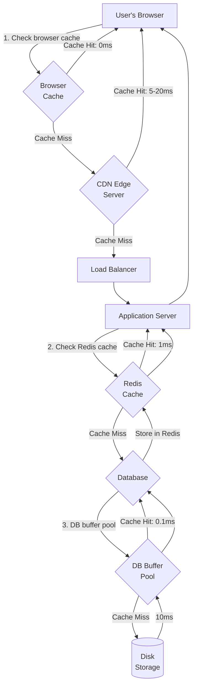

# Caching for Scalability

## Why This Topic Exists

Your system is under heavy load. Database queries are slow. Web servers are CPU-bound. You've added read replicas and you've scaled your web tier. But things are still sluggish.

You look at your logs. The same query runs thousands of times per minute, returning the same data every single time. "Get the top 10 trending articles." "Fetch the configuration for this feature flag." "Return the user's public profile." These results don't change very often — but you're computing them from scratch on every request.

This is the problem that caching solves. Instead of computing an answer every time it's asked, you compute it once, store the result, and return the stored result on subsequent requests. If the computation takes 200ms but the cached result takes 1ms, and you receive 10,000 requests per second, caching just saved you from doing 200 milliseconds * 10,000 operations/second = 2,000 seconds worth of compute *per second*. The leverage is enormous.

---

## Learning Objectives

By the end of this file, you will be able to:

- Explain why caching dramatically reduces system load
- Identify the multiple levels at which caching operates
- Define cache hit ratio and explain why it matters
- Describe the core cache invalidation problem
- Know when caching helps and when it introduces problems

---

## Prerequisites

- [What is Scalability](./01.%20What%20is%20Scalability%20(BEGINNER).md)
- [Database Scaling](./04.%20Database%20Scaling%20(BEGINNER).md)

---

## Introduction

A cache is a **faster storage layer** that holds copies of frequently accessed data. When a request needs data, it checks the cache first. If the data is there (a cache hit), it returns immediately. If it is not (a cache miss), it fetches from the source (database, external API, computation), stores a copy in the cache, and returns the result. Future requests for the same data get the cached copy.

The fundamental insight: **most systems access a small subset of their data most of the time**. This is the Pareto principle applied to data access — 20% of your data is responsible for 80% of your reads. Caching that popular 20% in fast memory eliminates 80% of your expensive data lookups.

---

## Real-World Analogy: Tools on Your Desk

You are an engineer. You use a screwdriver dozens of times a day. You use an arc welder once a month.

The naive approach: keep all tools in the storeroom. Every time you need a screwdriver, walk to the storeroom (30 seconds round trip), get the screwdriver, use it, walk it back.

The smart approach: keep frequently used tools on your desk. The screwdriver is always within arm's reach (1 second). Less-used tools stay in the storeroom. You only go to the storeroom for things you don't have on your desk.

Your desk is the cache. The storeroom is the database. The trade-off: your desk has limited space. You can only keep a few tools at hand. You must make a decision about what is worth the desk space.

Cache eviction policies (which data to remove when the cache is full) are exactly this decision: LRU (Least Recently Used) removes tools you haven't touched in a while — probably not worth the desk space. LFU (Least Frequently Used) removes tools you use least often.

---

## Core Concepts

### The Cache Hit Ratio

The cache hit ratio is the percentage of requests served from the cache vs. total requests.

```
Cache Hit Ratio = Cache Hits / (Cache Hits + Cache Misses)
```

If your hit ratio is 80%, 80% of requests are served instantly from memory, and only 20% hit the underlying data source.

**Why hit ratio matters so much:**

Consider a database that can handle 1,000 queries/second. You have 10,000 requests/second hitting your system.

- Without caching: 10,000 queries/second to the DB — 10x beyond capacity. System collapses.
- With 80% hit ratio: 2,000 queries/second to the DB — 2x beyond capacity. Still failing.
- With 95% hit ratio: 500 queries/second to the DB — well within capacity. System works.
- With 99% hit ratio: 100 queries/second to the DB — 10x headroom. Comfortable.

The relationship between hit ratio and performance is non-linear. Going from 90% to 99% hit ratio is not a 9% improvement — it reduces database load by 90% (from 10% of requests to 1% of requests hitting the DB).

Designing your caching strategy around maximizing hit ratio for your most expensive queries is one of the highest-leverage engineering activities.

### Cache Levels

Caching happens at multiple levels of the stack. Understanding each level helps you choose where to cache for maximum impact.

**Level 1: Browser Cache**
The browser stores responses locally. When you revisit a webpage, the browser might use the cached version without making any network request at all. Controlled by HTTP headers (`Cache-Control`, `Expires`, `ETag`).

Example: A product image on an e-commerce site. You load the page, the image is fetched from the server. The server responds with `Cache-Control: max-age=86400`. The browser caches the image for 24 hours. Every time you visit this page for the next 24 hours, the browser uses the local copy — no network request, no server load.

**Level 2: CDN (Content Delivery Network)**
A CDN is a geographically distributed network of cache servers. Instead of every user in Tokyo hitting your server in New York (300ms latency), they hit a CDN server in Tokyo (10ms latency). The CDN server caches your content and serves it locally.

CDNs are primarily for static assets (images, CSS, JavaScript, videos) but also work for API responses that don't change per-user. This is covered in detail in Chapter 17 (Cloud and Infrastructure).

**Level 3: Application Cache (Redis/Memcached)**
An in-memory cache that your application code talks to explicitly. This is the most flexible and powerful caching layer for server-side logic.

Examples of what to cache here:
- Database query results (expensive joins, aggregations)
- Computed values (user's feed, recommendation results, search indexes)
- External API responses (weather data, currency exchange rates)
- Session data (as covered in File 05)

This is what engineers typically mean when they say "we added a caching layer."

**Level 4: Database Cache (Buffer Pool)**
The database itself maintains an internal cache (PostgreSQL calls it "shared buffers," MySQL calls it "InnoDB buffer pool"). Frequently accessed pages of data are kept in this memory cache. This is automatic — the database manages it. Giving the database more RAM directly increases the size of this cache.

This is why "give the database more RAM" is often the first and most impactful optimization — it increases the size of the database's internal cache, reducing disk reads.

**Level 5: CPU Cache**
At the lowest level, CPUs have small ultra-fast caches (L1, L2, L3) that hold the most recently used data from RAM. This is managed entirely by the CPU hardware and is largely invisible to software engineers — but it explains why memory-efficient data structures are faster (better CPU cache utilization).

For system design, focus on levels 1-4. Levels 1 and 2 handle static content. Level 3 (Redis) handles dynamic content. Level 4 is database internals.

---

## Visual Diagram



---

## Deep Explanation

### What Makes Something Worth Caching?

Not every piece of data should be cached. The best candidates have all of these properties:

1. **Frequently read**: The more often it is read, the more requests benefit from the cache.
2. **Expensive to compute or fetch**: A fast query that returns in 2ms might not be worth caching. A query that takes 500ms or requires joining 5 tables is a strong candidate.
3. **Relatively stable**: Data that changes every second is hard to cache without serving stale data. Data that changes once per day is easy to cache.
4. **Same result for multiple users**: A single user's private messages are poor cache candidates (too specific). The list of trending articles is an excellent cache candidate (the same for millions of users).

The sweet spot: high-read, expensive-to-compute, infrequently-changing, widely-shared data.

### Cache Invalidation: The Hard Problem

There is a famous quote in computer science: "There are only two hard things in computer science: cache invalidation and naming things."

This is funny because it is true. Caching is easy. Knowing when to *remove* or *update* cached data is genuinely hard.

The problem: you cache a user's profile. The user updates their name. How does your system know to invalidate the cached profile?

Common strategies:

**Time-To-Live (TTL):** Every cache entry has an expiration time. After the TTL, the next request fetches fresh data. Simple to implement. The cached data might be stale for up to TTL seconds. Acceptable for many use cases (trending articles can be a few minutes stale; user names probably should not be more than a minute stale). Set TTL based on how much staleness is acceptable for that specific data.

**Write-Through Invalidation:** When your application updates data in the database, it also immediately deletes or updates the cache entry for that data. The cache is always fresh. More complex — your write path now touches both the database and the cache. If the cache update fails after the DB write succeeds, you have an inconsistency.

**Cache-Aside (Lazy Loading):** Your application tries the cache first. Cache miss: fetch from DB, store in cache. The cache is only populated when data is requested. Never pre-populated. Always eventually consistent (stale data expires or is invalidated on write). The most common pattern in practice.

**Event-Driven Invalidation:** When data changes, publish an event. Cache layer subscribes to events and invalidates relevant entries. Very powerful but requires an event/message system. Covered in Chapter 09 (Message Queues).

### The Cache Stampede Problem

Here is a subtle failure mode that trips up engineers who don't think about it.

Your cache has a TTL of 60 seconds. You have 10,000 users requesting the same popular resource. Everything works — they all hit the cache, which returns instantly.

At second 60, the cache entry expires simultaneously for all 10,000 pending requests. All 10,000 requests see a cache miss. All 10,000 requests simultaneously query the database for the same data. The database is hit with 10,000 concurrent queries for the same thing — a thundering herd.

Solutions:
- **Mutex/lock**: When a cache miss occurs, acquire a lock before querying the DB. Other requests with the same cache miss wait for the first request to populate the cache, then read from it.
- **Probabilistic early expiration**: Before the TTL expires, with some probability, refresh the cache early. Prevents the sharp expiration cliff.
- **Stale-while-revalidate**: Continue serving stale cached data while a background process refreshes it. The user never sees a cache miss.

These are intermediate topics. For a beginner, knowing the stampede problem exists is enough.

### Caching vs. Performance vs. Consistency

Caching introduces a data freshness problem. Cached data is potentially stale. How stale is acceptable?

- **Trending articles**: Stale for 5 minutes is fine. Users don't notice.
- **User account balance**: Stale for 5 seconds could allow a user to overdraw. Cache carefully or don't cache at all.
- **Product inventory count**: Stale for 1 minute might cause overselling. Cache with short TTL or use event-based invalidation.
- **Profile picture**: Stale for 24 hours is probably fine. Use CDN caching with a long TTL.

The rule: the more consequential the data, the shorter the TTL or the more aggressive the invalidation strategy. For financial or safety-critical data, don't cache, or use write-through with immediate invalidation.

---

## Step-by-Step Example

**Scenario:** An e-commerce site has a "featured products" section that appears on every page. It shows 10 products hand-curated by the marketing team. This list changes once per day. The query that fetches it joins 4 tables and takes 350ms.

**Before caching:**
Every page load runs this 350ms query. With 500 page loads/second, the database runs this query 500 times/second. Each takes 350ms. The database is overwhelmed.

**With caching (TTL strategy):**

```python
def get_featured_products():
    # Check cache
    cached = redis.get("featured_products")
    if cached:
        return json.loads(cached)  # 1ms - cache hit
    
    # Cache miss - query DB
    products = db.query("""
        SELECT p.*, c.name as category, ...
        FROM products p
        JOIN categories c ON ...
        JOIN promotions pr ON ...
        WHERE p.featured = true
        ORDER BY p.sort_order
        LIMIT 10
    """)  # 350ms
    
    # Store in cache for 5 minutes
    redis.setex("featured_products", 300, json.dumps(products))
    
    return products
```

**After caching:**
First request: 350ms (cache miss, queries DB, populates cache).
Next 300 seconds: every request returns in 1ms (cache hit). With 500 requests/second for 300 seconds, that's 150,000 requests served from cache, with only 1 DB query.

The DB query rate for this operation goes from 500/second to 1 per 5 minutes. A reduction of 150,000x.

---

## Advantages / Disadvantages / Trade-offs

| Aspect | Detail |
|--------|--------|
| Main benefit | Dramatically reduces load on slower data stores (DB, external APIs) |
| Performance gain | 100x-10,000x faster reads for cached data (memory vs. disk) |
| Scalability gain | Allows a small DB to serve a huge read load |
| Main risk | Stale data — cached data may not reflect latest state |
| Implementation cost | Low to Medium (Redis is easy to set up, invalidation logic varies) |
| Hit ratio dependency | Low hit ratio means overhead of caching (managing cache, checking it) without the benefits |
| Cache poisoning | If wrong data enters the cache, it will be served to many users until TTL expires |
| Memory constraint | Caches have finite memory; you must decide what to evict when full |

---

## When to Use / When NOT to Use

**Cache this data:**
- Global/shared content that is the same for many users (trending lists, configuration, public profiles)
- Expensive computed results (feed aggregation, recommendation scoring, full-text search)
- Data from external APIs that you pay per call (geocoding, currency conversion, weather)
- Static assets (images, CSS, JS) — use CDN

**Be careful caching this data:**
- User-specific data that changes frequently (shopping cart, draft content)
- Financial balances and inventory counts (requires short TTL + careful invalidation)
- Security-sensitive data (permissions, access control lists — stale permissions can be a security hole)

**Do not cache (or cache very carefully):**
- Passwords (never cache, never store plaintext)
- Real-time data where staleness is unacceptable (stock prices during active trading, live scores)
- Data that is only requested once (caching it wastes memory)

---

## Common Interview Questions

1. **"What is a cache and why does it help scalability?"**
   A cache is a faster storage layer that holds copies of frequently accessed data. It helps scalability because it absorbs read load that would otherwise hit the database, and it returns data much faster (memory vs. disk).

2. **"What is cache invalidation and why is it hard?"**
   Cache invalidation is the process of removing or updating cached data when the underlying data changes. It is hard because you need to ensure the cache stays consistent with the source of truth, but the cache and DB are separate systems that can get out of sync in many ways.

3. **"What is a cache hit ratio? What is a good hit ratio?"**
   The fraction of requests served from the cache. A good ratio depends on context, but 90%+ is typically considered good for most use cases. 95%+ significantly reduces database load.

4. **"Where can caching be applied in a system?"**
   Browser (HTTP cache headers), CDN (edge caching for static/semi-static content), application layer (Redis/Memcached for DB query results and computed data), database layer (internal buffer pool), and CPU level (hardware managed).

---

## Common Beginner Mistakes

1. **Caching everything without thinking about staleness.** Not all data is safe to cache. Data that changes frequently or has high consistency requirements (balances, inventory) needs careful TTL and invalidation strategy, not aggressive caching.

2. **Forgetting to handle cache misses gracefully.** When a cache miss occurs, the request falls through to the DB. If many misses occur simultaneously (cache stampede), the DB can be overwhelmed. Design for graceful degradation.

3. **Setting TTL too long for mutable data.** Setting a 24-hour TTL for a user's profile means profile updates won't be visible for up to 24 hours. Match TTL to the acceptable staleness window for that specific data.

4. **Not monitoring the hit ratio.** If your hit ratio is 40%, you're doing more work (cache management) with little benefit. Monitor hit ratio and adjust what you cache and your TTL settings.

5. **Treating the cache as a persistent store.** Caches are ephemeral — they can be flushed, restarted, or evicted at any time. If important data exists only in the cache and not in the DB, you will lose it. The cache is a *copy* of data that lives authoritatively elsewhere.

---

## Summary

Caching is the practice of storing copies of expensive-to-compute or expensive-to-fetch data in a faster storage layer (typically memory) for rapid subsequent access. Caching operates at multiple levels: browser, CDN, application (Redis), and database. The cache hit ratio determines how effective your cache is — a high hit ratio (95%+) can reduce database load by 95% or more. Cache invalidation (keeping cached data consistent with the source) is the hard problem in caching — managed through TTL, write-through invalidation, or event-driven approaches. Caching is one of the most impactful scalability tools available, but requires careful design to avoid serving stale data.

This file is an introduction. [Chapter 05: Caching](../05.%20Caching/README.md) covers caching patterns, eviction policies, distributed caches, CDN configuration, and cache consistency strategies in depth.

---

## Key Takeaways

- Caching stores copies of expensive data in a faster layer (usually memory)
- Cache hit ratio is the most important metric — maximize it for your heaviest queries
- Caching operates at multiple levels: browser, CDN, application (Redis), database
- Cache invalidation is the hard problem — match your strategy to your data's consistency requirements
- TTL (expiration time) is the simplest invalidation strategy; write-through is more consistent but complex
- Caching is one of the highest-leverage scalability tools — even a simple Redis cache can 10x your DB headroom

---

## Related Topics

- [Database Scaling](./04.%20Database%20Scaling%20(BEGINNER).md)
- [Stateless vs Stateful Architecture](./05.%20Stateless%20vs%20Stateful%20Architecture%20(INTERMEDIATE).md)
- [The Scalability Interview Framework](./07.%20The%20Scalability%20Interview%20Framework%20(BEGINNER).md)
- [Chapter 05: Caching](../05.%20Caching/README.md) — complete deep-dive into caching patterns and strategies
- [Chapter 06: Load Balancing](../06.%20Load%20Balancing/README.md)
