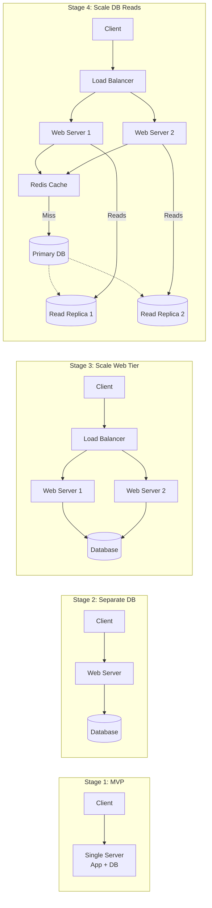

# The Scalability Interview Framework

## Why This Topic Exists

You are in a system design interview. The interviewer says: "Design a URL shortener that can scale to 1 billion users."

Your mind goes blank. Where do you start? Do you talk about the database first? The API? Do you draw a diagram immediately? Do you ask questions? And what does "scale to 1 billion users" even mean concretely?

Most candidates panic and either start drawing something random or dive too deep into one component and never come up for air. Both responses signal to the interviewer that you don't have a structured approach to the problem.

This file gives you a repeatable, reliable framework for approaching any scalability question. It is not a rigid script — it is a mental model. Once internalized, you can adapt it to any system design question in any interview.

The framework has five steps. Every system design answer you give should follow this structure.

---

## Learning Objectives

By the end of this file, you will be able to:

- Apply a 5-step framework to any "design a scalable X" interview question
- Gather requirements and estimate scale before designing
- Start with a simple design and evolve it as you identify bottlenecks
- Scale each component of a system independently and systematically
- Walk through the scaling journey of a URL shortener from 1 user to 1 billion

---

## Prerequisites

- [What is Scalability](./01.%20What%20is%20Scalability%20(BEGINNER).md)
- [Vertical vs Horizontal Scaling](./02.%20Vertical%20vs%20Horizontal%20Scaling%20(BEGINNER).md)
- [Load Balancing Basics](./03.%20Load%20Balancing%20Basics%20(BEGINNER).md)
- [Database Scaling](./04.%20Database%20Scaling%20(BEGINNER).md)
- [Stateless vs Stateful Architecture](./05.%20Stateless%20vs%20Stateful%20Architecture%20(INTERMEDIATE).md)
- [Caching for Scalability](./06.%20Caching%20for%20Scalability%20(BEGINNER).md)

---

## Introduction

The framework in five words: **Requirements, Estimate, Simple, Bottlenecks, Scale.**

Every great system design answer follows this arc:
1. What are we building and for whom? (Requirements)
2. How big does it need to be? (Estimate)
3. What does the simplest possible version look like? (Simple)
4. What breaks first as we grow? (Bottlenecks)
5. How do we fix each bottleneck? (Scale)

This is not just an interview technique. This is how real systems are designed and evolved in production. Start simple, measure, find bottlenecks, address them. Repeat.

---

## Real-World Analogy: Building a Restaurant

Imagine you are opening a restaurant.

**Step 1 (Requirements):** What kind of food? Fast food or fine dining? How many customers per day? Dine-in only or delivery too? These shape every other decision.

**Step 2 (Estimate):** How many customers at peak hour? How many tables do you need? How many cooks? If you expect 200 customers/hour, you design very differently than for 20 customers/hour.

**Step 3 (Simple):** Start with one small kitchen, one dining room, one set of staff. Open for business. Serve the early customers. This is your MVP.

**Step 4 (Bottlenecks):** As business grows, what breaks first? Maybe the kitchen is the bottleneck — too few cooks. Maybe the dining room — not enough tables. Maybe the parking lot — customers can't get in. You identify the constraint.

**Step 5 (Scale):** Fix the bottleneck. Hire more cooks (scale the kitchen). Add outdoor seating (scale the dining room). Open a second location (scale the whole operation). Then find the next bottleneck.

This is exactly how you should approach system design questions.

---

## Core Concepts: The Five Steps

### Step 1: Gather Requirements

Before drawing a single box, ask clarifying questions. This does two things: it ensures you design the right system, and it demonstrates to the interviewer that you think about context before diving into implementation.

Questions to ask:

**Functional requirements (what does the system do?):**
- What are the core features we need to support?
- Are there any features that are out of scope?
- Who are the users (consumers, businesses, internal engineers)?

**Non-functional requirements (how should it behave?):**
- What is the expected scale? Users, requests per second, data volume?
- What is the acceptable latency? (200ms? 2 seconds?)
- What is the availability requirement? (99.9%? 99.99%?)
- Does data need to be consistent in real-time, or is eventual consistency acceptable?
- What are the geographic requirements? Single region or global?

**Important:** Most interviewers expect you to spend 3-5 minutes on this. It is not a waste of time. A candidate who jumps straight to drawing is demonstrating that they do not think about requirements before designing — a red flag in a real engineering role.

### Step 2: Estimate Scale

Once you have requirements, do back-of-envelope calculations to understand the scale. This tells you what components you actually need and helps catch wrong assumptions.

Key numbers to estimate:

**Traffic:**
- Reads per second (RPS)
- Writes per second
- Peak traffic multiplier (peak is typically 2-10x average)

**Storage:**
- Data per record * number of records * retention period
- Growth rate per year

**Bandwidth:**
- Average request/response size * RPS

**Cache size:**
- How much of the hot data can you hold in memory? (20% of data = 80% of traffic rule of thumb)

You do not need to be precise. Orders of magnitude are sufficient. The goal is to know whether you're designing for 100 RPS or 100,000 RPS — because those require very different architectures.

### Step 3: Start Simple (One Server)

Draw the simplest possible architecture that works for a small number of users. This is usually:

```
Client → Single Web Server → Single Database
```

This is not the final design. It is the starting point. By starting simple, you:
- Establish a baseline that you can evolve (easier to explain scaling)
- Show you don't over-engineer prematurely
- Give yourself something to build on as you identify bottlenecks

At this step, define the core API endpoints and data model. What does the database schema look like? What do the main API calls look like? This establishes the fundamentals before scaling complexity is introduced.

### Step 4: Identify Bottlenecks

Given your scale estimates from Step 2, ask: which component breaks first?

The typical order of bottlenecks in a growing system (though it varies):
1. **Single server CPU** (the web server can't handle all the concurrent requests)
2. **Database** (every request hits the same DB; it saturates)
3. **Database reads** (DB is slow because too many read queries)
4. **Database storage** (dataset grows beyond a single machine's capacity)
5. **Network bandwidth** (serving large amounts of static content saturates the pipe)

Ask these questions explicitly:
- "Given our estimates of X requests/second, will a single server handle this? No — single servers typically max out at a few thousand concurrent connections."
- "How many reads/second? Will a single database handle this?"
- "What is the read/write ratio? Would read replicas help?"
- "How much storage do we need? Will it fit on one machine?"

Narrating this thought process out loud is critical in an interview. It demonstrates systematic thinking.

### Step 5: Scale Each Component

For each bottleneck identified in Step 4, apply the appropriate scaling technique:

| Bottleneck | Solution |
|------------|----------|
| Single web server CPU bound | Add more web servers + load balancer |
| Web servers storing sessions | Move to stateless (Redis for sessions or JWT) |
| Database overwhelmed by reads | Add read replicas |
| Database CPU bound by heavy queries | Add Redis caching layer |
| Database storage too large | Vertical scale DB first, then sharding |
| Connection limit exceeded | Add PgBouncer/connection pooler |
| Static content slowing responses | Move static files to CDN |
| Single region, global users | Multi-region deployment, global load balancing |
| Single point of failure everywhere | Add redundancy at each tier |

After addressing each bottleneck, check: "What breaks next?" Repeat until you reach the scale target from Step 2.

---

## Visual Diagram: The Scaling Journey



---

## Deep Explanation: The Framework in Practice

### The URL Shortener: From 1 User to 1 Billion

Let's apply all five steps to a URL shortener (a classic interview question).

A URL shortener converts long URLs into short codes. `https://very-long-url.com/with/many/params` becomes `https://short.ly/abc123`. When users visit the short URL, they are redirected to the original.

---

**STEP 1: REQUIREMENTS**

Functional:
- Given a long URL, generate a short code
- Given a short code, redirect to the original URL
- Short URLs should not expire (or optionally expire after a set period)
- Custom aliases should be optional ("vanity URLs")

Non-functional (confirmed with interviewer):
- 1 billion URLs created over the service lifetime
- 100:1 read/write ratio (redirects are far more common than creation)
- Redirects should complete in under 100ms
- 99.9% availability (about 8.7 hours downtime/year acceptable)
- No need for real-time analytics (eventual consistency acceptable)

---

**STEP 2: ESTIMATE SCALE**

Write operations (URL creation):
- Assume 100 million new URLs per year
- 100M / (365 * 24 * 3600) ≈ 3 writes/second
- Peak: ~30 writes/second

Read operations (redirects):
- 100:1 ratio means 300 reads/second average
- Peak: ~3,000 reads/second

Storage:
- 1 billion URLs * ~500 bytes per record (URL + metadata) = 500 GB over all time
- 500 GB is manageable on a single database for many years

Bandwidth:
- Each redirect response: ~200 bytes (HTTP 301 with Location header)
- 3,000 reads/second * 200 bytes = 600 KB/second — trivial

Conclusion: This is a read-heavy, moderate-scale system. 3,000 reads/second is very manageable. Storage is the main long-term concern (500 GB is fine now, but grows).

---

**STEP 3: START SIMPLE**

Core data model:
```
urls table:
  id         BIGINT PRIMARY KEY
  short_code VARCHAR(8) UNIQUE
  long_url   TEXT
  created_at TIMESTAMP
  user_id    BIGINT (optional, for user accounts)
```

Core API:
```
POST /shorten
  Body: { "long_url": "https://example.com/..." }
  Response: { "short_url": "https://short.ly/abc123" }

GET /{short_code}
  Response: HTTP 301 Redirect to long URL
```

Short code generation: hash the long URL (MD5 or SHA256), take the first 7 characters, encode in base62. If collision, increment and retry. Alternatively, use a random 7-character base62 string and verify uniqueness.

Simple architecture:
```
Client → Single Web Server → PostgreSQL Database
```

This handles our load (3,000 reads/second is actually quite manageable for a single modern server).

---

**STEP 4: IDENTIFY BOTTLENECKS**

Given our estimates:
- 3,000 reads/second on a single server: a single modern web server can handle 10,000+ requests/second for simple redirect logic. Web tier is fine.
- 3,000 DB lookups/second: PostgreSQL on reasonable hardware can handle 10,000+ simple primary-key lookups/second. Technically fine — but this is expensive for something so simple. The long_url for `abc123` doesn't change. Why look it up in the DB every time?
- Storage at 1 billion URLs: manageable on a single machine but approaching the "think about this" threshold for a heavily loaded database.
- Single server availability: any crash = downtime. If 99.9% availability is required, we need redundancy.

Main bottlenecks to address:
1. Single point of failure (availability requirement)
2. Redirect latency — database lookup on every redirect is unnecessary if we cache
3. Long-term storage growth

---

**STEP 5: SCALE EACH COMPONENT**

**Fix 1: High Availability**
Add a second web server. Add a load balancer in front. The app is stateless (no session data needed for redirects). Load balancer health checks ensure traffic only goes to healthy servers.

For the database: add a read replica. Redirects only need to read (not write), so route all redirect lookups to the replica. Primary handles URL creation (writes).

**Fix 2: Caching for Redirects**
The mapping `short_code → long_url` almost never changes. This is the ideal cache candidate.

Add Redis in front of the database for redirect lookups:
1. Redirect request arrives for `abc123`
2. Check Redis: `GET url:abc123`
3. Cache hit (~1ms): return the URL, redirect. Done.
4. Cache miss: query DB replica (~5ms), store in Redis with a 24-hour TTL, redirect.

Expected cache hit ratio: Very high. Popular short URLs will be in cache. A 95%+ hit ratio means only 5% of 3,000 redirects/second = 150 DB queries/second. Trivial.

**Fix 3: Short Code Uniqueness at Scale**
At 1 billion URLs, generating random 7-character codes and checking for collisions in the DB becomes slower (more collisions). Alternative: use a distributed ID generator (like Twitter's Snowflake) to generate unique IDs, then base62-encode the ID. This guarantees uniqueness without DB checks.

**Architecture at this scale:**

```
Client
  ↓
Load Balancer (AWS ALB)
  ↓                    ↓
Web Server 1      Web Server 2
  ↓                    ↓
         Redis Cache
              ↓ (cache miss)
         Read Replica
              ↓ (write path)
         Primary DB (PostgreSQL)
```

This architecture handles:
- 3,000+ reads/second (mostly served from Redis at 1ms)
- High availability (no single point of failure at web or DB tier)
- Future growth (add more web servers, more read replicas, larger Redis cluster)

**For 1 billion users / 100x growth:**
- Shard the database by short_code prefix (e.g., codes starting with a-m go to Shard 1, n-z to Shard 2)
- Use a CDN in front of the load balancer (edge caching of popular redirects)
- Consider a global deployment (servers in US, Europe, Asia) for users worldwide
- Use a dedicated URL ID generation service (distributed, guarantees uniqueness at scale)

---

## Advantages / Disadvantages / Trade-offs

| Framework Step | If Skipped | Impact |
|----------------|------------|--------|
| Requirements | Design the wrong system | Wasted design effort; interviewer marks it as a red flag |
| Estimation | Design for wrong scale | Under-design (system won't handle load) or over-engineer (wasted complexity) |
| Start Simple | Jump to complexity too fast | Hard to explain trade-offs; interviewer can't follow reasoning |
| Identify Bottlenecks | Apply solutions randomly | May fix the wrong problem; scaling effort wasted |
| Scale Components | Stop at single-server design | Doesn't answer the question; interviewer cannot assess scaling knowledge |

---

## When to Use / When NOT to Use

**Use this framework:**
- For all system design interviews (beginner to staff-level)
- When planning a real production system from scratch
- When diagnosing a production performance problem (requirements = what's breaking? estimate = what's the actual load? etc.)

**Adapt the framework:**
- For very small scale systems (internal tools, hobby projects): skip the estimation step. Start simple and stay simple.
- For very large scale systems: spend more time on estimation and make the bottleneck identification phase more rigorous.

---

## Common Interview Questions

1. **"How do you approach a system design problem?"**
   Gather functional and non-functional requirements. Estimate scale (RPS, storage, bandwidth). Design the simplest architecture that works. Identify bottlenecks given the scale. Scale each component to address bottlenecks. Repeat until you reach the target scale.

2. **"How do you estimate the scale of a system?"**
   Start with user/traffic numbers. Estimate writes/second and reads/second based on usage patterns. Calculate storage (records * size * retention). Calculate bandwidth (request size * RPS). Round to orders of magnitude — precision is less important than getting the right order of magnitude.

3. **"What is a bottleneck and how do you identify one?"**
   A bottleneck is the component that limits overall system throughput. Identify it by taking your scale estimates and checking which component would be first to saturate: the web server, the database, the network, the cache, etc.

4. **"How would you design a system to handle 10x its current load?"**
   Start by identifying the current bottleneck. Address it. Find the next bottleneck. Repeat. The answer always involves the same toolkit: horizontal scaling of stateless tiers, caching, read replicas, sharding, CDN, connection pooling.

---

## Common Beginner Mistakes

1. **Starting to draw immediately without asking questions.** This signals to interviewers that you don't think about requirements. Spend 3-5 minutes on requirements. Interviewers expect and appreciate this.

2. **Designing for maximum scale from the start.** Jumping straight to "we'll shard the database across 100 nodes" for a system that handles 100 requests/second is premature. Start simple, then evolve. This demonstrates appropriate pragmatism.

3. **Not narrating your thinking.** System design is a conversation. If you go silent and draw for 5 minutes, the interviewer has no idea what you're thinking. Talk through your reasoning: "I'm going to start with a single server because at this scale it's sufficient, but I can already see the database will become a bottleneck when we hit..."

4. **Focusing too much on one component.** A common trap: spending 30 minutes deep in the database schema and never getting to the scaling discussion. Keep a high level until you've covered the whole system, then dive into specifics where the interviewer shows interest.

5. **Forgetting about failure modes.** Every component you add can fail. At each step, note: "And to avoid a single point of failure here, we'd add a replica/secondary/fallback." This demonstrates production awareness.

6. **Not knowing the numbers.** Order-of-magnitude knowledge is essential. A single PostgreSQL server can handle ~10,000 simple queries/second. A single EC2 instance handles ~10,000-100,000 HTTP requests/second. Redis handles ~100,000 operations/second. Not having rough numbers makes estimation impossible.

---

## Summary

The Scalability Interview Framework — Requirements, Estimate, Simple, Bottlenecks, Scale — is a repeatable mental model for approaching any system design question. It mirrors how real systems are built: start small, measure, find constraints, address them. The URL shortener walkthrough demonstrates the framework in action: requirements told us it's read-heavy with moderate scale; estimation showed caching would be highly effective; the simple design established the fundamentals; bottleneck analysis pointed to the database lookup on every redirect; scaling added Redis caching and read replicas to address it. Apply this framework to any design question and you will always have a structured, credible answer.

---

## Key Takeaways

- Never start drawing before gathering requirements and estimating scale
- Start with the simplest possible design (one server, one database)
- Identify bottlenecks systematically based on your scale estimates, not randomly
- Scale each component with the appropriate tool: load balancer, stateless design, read replicas, caching, sharding
- Narrate your thinking throughout — system design is a collaborative conversation
- Know rough numbers: queries per second a DB handles, requests per second a web server handles, Redis throughput
- The URL shortener is a canonical example: read-heavy, cacheable, simple schema — know it cold

---

## Related Topics

- [What is Scalability](./01.%20What%20is%20Scalability%20(BEGINNER).md)
- [Vertical vs Horizontal Scaling](./02.%20Vertical%20vs%20Horizontal%20Scaling%20(BEGINNER).md)
- [Load Balancing Basics](./03.%20Load%20Balancing%20Basics%20(BEGINNER).md)
- [Database Scaling](./04.%20Database%20Scaling%20(BEGINNER).md)
- [Stateless vs Stateful Architecture](./05.%20Stateless%20vs%20Stateful%20Architecture%20(INTERMEDIATE).md)
- [Caching for Scalability](./06.%20Caching%20for%20Scalability%20(BEGINNER).md)
- [Chapter 04: Databases](../04.%20Databases/README.md)
- [Chapter 05: Caching](../05.%20Caching/README.md)
- [Chapter 06: Load Balancing](../06.%20Load%20Balancing/README.md)
- [Chapter 19: Case Studies](../19.%20Case%20Studies/README.md) — real-world scaling stories
- [Chapter 20: Interview Problems](../20.%20Interview%20Problems/README.md) — practice with the framework
