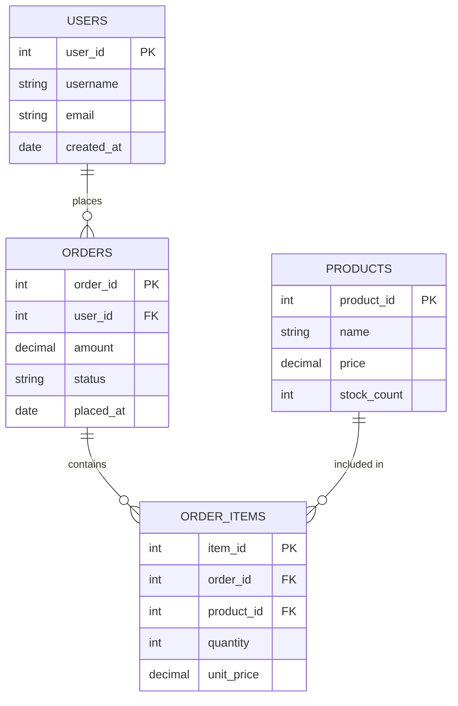

# Relational Databases and SQL

## Why This Topic Exists

Before databases, applications stored data in plain text files or custom binary formats. Finding a single record in a million-row file meant reading every line. Relational databases, invented by Edgar Codd at IBM in 1970, solved this by organizing data into tables with predictable structure, allowing fast lookups, safe concurrent writes, and consistent relationships between pieces of data. Today, relational databases power banks, hospitals, e-commerce sites, and government systems — anywhere correctness matters more than raw speed.

## Learning Objectives

- Understand what a table, row, column, primary key, and foreign key are
- Write basic SQL queries (SELECT, JOIN, WHERE, GROUP BY)
- Explain the four ACID properties with real-life analogies
- Know when an index helps and why
- Name popular relational databases and pick the right one for a given job

## Prerequisites

- Basic understanding of what a server is (Chapter 01)
- No prior SQL experience needed — we start from scratch

---

## Introduction

A **relational database** stores data in **tables**, which are just like spreadsheets. Each table has named **columns** (the fields) and **rows** (the actual records). The word "relational" does not mean the tables are related to each other — it actually comes from the mathematical term "relation," meaning a set of tuples. But in practice, the most powerful feature is that tables *can* be linked together through keys, letting you store data once and reference it many times.

SQL (Structured Query Language) is the language you use to talk to a relational database. You ask questions with `SELECT`, add data with `INSERT`, change data with `UPDATE`, and delete with `DELETE`.

---

## Real-World Analogy

Imagine a company that manages employees using **spreadsheets**.

- The **Employees** spreadsheet has columns: EmployeeID, Name, DepartmentID, Salary.
- The **Departments** spreadsheet has columns: DepartmentID, DepartmentName.

When you want to know "which department does Alice work in?", you look up Alice's DepartmentID in the Employees sheet, then find that ID in the Departments sheet. That lookup is exactly what a SQL JOIN does.

A relational database is simply a much smarter, much faster version of this spreadsheet system — with built-in safety guarantees.

---

## Core Concepts

### Tables, Rows, and Columns

A **table** holds one type of thing (users, orders, products). Each **row** is one instance of that thing. Each **column** is one attribute.

```
users table
+---------+----------+---------------------+
| user_id | username | email               |
+---------+----------+---------------------+
|       1 | alice    | alice@example.com   |
|       2 | bob      | bob@example.com     |
+---------+----------+---------------------+
```

### Primary Keys

A **primary key** is a column (or set of columns) that uniquely identifies each row. No two rows can have the same primary key. `user_id` above is a primary key. Databases often auto-generate these as incrementing integers (1, 2, 3…) or UUIDs.

### Foreign Keys

A **foreign key** is a column in one table that points to the primary key of another table. It enforces the relationship between tables and prevents orphaned records.

```
orders table
+----------+---------+--------+
| order_id | user_id | amount |
+----------+---------+--------+
|      101 |       1 |  59.99 |  ← user_id 1 = Alice
|      102 |       2 |  12.00 |  ← user_id 2 = Bob
+----------+---------+--------+
```

`orders.user_id` is a foreign key referencing `users.user_id`.

### ACID Properties

ACID is the set of four guarantees that make relational databases trustworthy:

| Property | What It Means | Real-Life Analogy |
|----------|---------------|-------------------|
| **Atomicity** | All operations in a transaction succeed, or none do | Sending a package: either it gets delivered or it comes back — it can't be half-delivered |
| **Consistency** | The database goes from one valid state to another valid state | A balance sheet must always add up to zero — you can't have credits without matching debits |
| **Isolation** | Concurrent transactions don't interfere with each other | Two bank tellers handling different customers simultaneously — each sees a clean view of accounts |
| **Durability** | Once committed, data survives crashes | When you write a check and the bank stamps it, that record exists even if the lights go out |

We will cover ACID in much more depth in [08. Transactions and ACID](./08.%20Transactions%20and%20ACID%20%28INTERMEDIATE%29.md).

### Indexes

An index is a separate data structure that the database maintains alongside a table to make lookups faster. Think of a book's index at the back — instead of reading every page to find "photosynthesis," you jump straight to page 234.

Without an index on `email`, finding a user by email means scanning every row. With an index, it is an O(log n) lookup. We cover indexes deeply in [04. Database Indexing](./04.%20Database%20Indexing%20%28INTERMEDIATE%29.md).

---

## Visual Diagram



This diagram models a simple e-commerce system. One user can place many orders. Each order contains many order items. Each order item references a product.

---

## Deep Explanation

### How SQL Queries Work

When you run a SQL query, the database engine parses it, creates an execution plan, and retrieves data. The engine tries to use indexes whenever possible.

**Basic SELECT**
```sql
SELECT username, email
FROM users
WHERE user_id = 42;
```
Find one user by their ID. If `user_id` is a primary key, this is an instant O(1) or O(log n) lookup.

**JOIN — combining two tables**
```sql
SELECT u.username, o.amount, o.status
FROM users u
JOIN orders o ON u.user_id = o.user_id
WHERE u.username = 'alice';
```
This combines rows from `users` and `orders` where the user_id matches. Without a JOIN, you would need two separate queries and handle the matching in your application code.

**Aggregate query**
```sql
SELECT u.username, COUNT(o.order_id) AS total_orders, SUM(o.amount) AS total_spent
FROM users u
LEFT JOIN orders o ON u.user_id = o.user_id
GROUP BY u.user_id, u.username
ORDER BY total_spent DESC;
```
This gives you a leaderboard of top spenders. The database handles the counting and summing — you get the answer in one round trip.

**Creating tables with constraints**
```sql
CREATE TABLE users (
    user_id    INT          PRIMARY KEY AUTO_INCREMENT,
    username   VARCHAR(50)  UNIQUE NOT NULL,
    email      VARCHAR(255) UNIQUE NOT NULL,
    created_at TIMESTAMP    DEFAULT CURRENT_TIMESTAMP
);

CREATE TABLE orders (
    order_id   INT          PRIMARY KEY AUTO_INCREMENT,
    user_id    INT          NOT NULL,
    amount     DECIMAL(10,2) NOT NULL,
    status     ENUM('pending','shipped','delivered') DEFAULT 'pending',
    placed_at  TIMESTAMP    DEFAULT CURRENT_TIMESTAMP,
    FOREIGN KEY (user_id) REFERENCES users(user_id)
);
```

Notice `FOREIGN KEY (user_id) REFERENCES users(user_id)`. The database will now refuse to insert an order with a `user_id` that does not exist in the `users` table. This is referential integrity.

### Normalization

Normalization is the process of organizing data to reduce redundancy. Instead of storing a user's email address in every order row, you store it once in the `users` table and reference it by `user_id`. This means:

- Updating an email requires changing one row, not thousands
- Storage is used efficiently
- Data cannot become inconsistent (two orders claiming different emails for the same user)

### Transactions in Practice

```sql
BEGIN TRANSACTION;

UPDATE accounts SET balance = balance - 500 WHERE account_id = 1;
UPDATE accounts SET balance = balance + 500 WHERE account_id = 2;

COMMIT;
```

If the second UPDATE fails (say, the database crashes between the two), the first UPDATE is automatically rolled back. Either both happen or neither happens. This is Atomicity.

---

## Step-by-Step Example

**Scenario:** Build a simple blog. Find all posts by a specific author, including the author's name.

**Step 1:** Design the tables.
```sql
CREATE TABLE authors (
    author_id INT PRIMARY KEY AUTO_INCREMENT,
    name      VARCHAR(100) NOT NULL,
    bio       TEXT
);

CREATE TABLE posts (
    post_id    INT PRIMARY KEY AUTO_INCREMENT,
    author_id  INT NOT NULL,
    title      VARCHAR(255) NOT NULL,
    body       TEXT,
    published_at TIMESTAMP,
    FOREIGN KEY (author_id) REFERENCES authors(author_id)
);
```

**Step 2:** Insert some data.
```sql
INSERT INTO authors (name, bio) VALUES ('Jane Doe', 'Tech writer and engineer');
INSERT INTO posts (author_id, title, body, published_at)
VALUES (1, 'Intro to SQL', 'SQL is a language for databases...', NOW());
```

**Step 3:** Query with a JOIN.
```sql
SELECT a.name AS author_name, p.title, p.published_at
FROM posts p
JOIN authors a ON p.author_id = a.author_id
WHERE a.name = 'Jane Doe'
ORDER BY p.published_at DESC;
```

**Step 4:** Add an index for performance when the table grows.
```sql
CREATE INDEX idx_posts_author_id ON posts(author_id);
```

Now the JOIN lookup on `author_id` is fast even with millions of posts.

---

## Advantages / Disadvantages / Trade-offs

| Aspect | Relational Databases |
|--------|---------------------|
| **Strength** | ACID guarantees — data is always consistent |
| **Strength** | Powerful query language (SQL) handles complex questions |
| **Strength** | Mature ecosystem — decades of tooling, knowledge, support |
| **Strength** | Enforced schema prevents bad data from entering |
| **Weakness** | Schema changes can be painful on large tables (adding a column to a 100M-row table) |
| **Weakness** | Vertical scaling hits a ceiling — you can only make one machine so big |
| **Weakness** | Object-relational mismatch — your code uses objects, the DB uses tables |
| **Weakness** | JOINs across huge tables can be slow without careful indexing |

---

## When to Use / When NOT to Use

**Use a relational database when:**
- Data has clear structure that does not change often
- You need complex queries with multiple conditions and aggregations
- ACID transactions are required (financial systems, medical records, inventory)
- Data has relationships that must be enforced (orders must reference real users)
- Your team knows SQL — it is the most widely understood database language

**Do NOT use a relational database when:**
- You need to store hundreds of millions of writes per second (social media firehose)
- Your data has wildly varying shape (one user has 2 fields, another has 200)
- You need to scale writes horizontally across many machines easily
- You are storing large blobs like images or videos (use object storage instead)

---

## Common Interview Questions

**Q: What is the difference between a primary key and a unique key?**
Both enforce uniqueness. A primary key cannot be NULL and each table has only one. A table can have multiple unique keys, and they can allow NULL (though behavior varies by DB).

**Q: What is a JOIN and what are the types?**
INNER JOIN: only rows with matches in both tables. LEFT JOIN: all rows from left table, NULLs where no match in right. RIGHT JOIN: opposite. FULL OUTER JOIN: all rows from both, NULLs where no match.

**Q: Explain ACID properties.**
See the table above. The key insight is that ACID prevents partial updates and data corruption under concurrent access and failure.

**Q: What is the N+1 query problem?**
Fetching a list of N users, then making 1 query per user to get their orders = N+1 queries. Solve with a JOIN or batch loading.

**Q: What is denormalization?**
Intentionally storing redundant data to speed up reads. Example: storing a user's name in the orders table alongside user_id. Trades storage and update complexity for faster reads.

---

## Common Beginner Mistakes

1. **Forgetting indexes** — writing queries on columns with no index, then wondering why the app is slow.
2. **SELECT *** — selecting every column when you only need two. Wastes bandwidth, breaks when columns are added.
3. **Storing arrays in a column** — putting "1,2,3" in a text column instead of using a junction table. Kills query performance and violates normalization.
4. **Not using transactions** — doing two related writes without a transaction. If the second fails, data is now inconsistent.
5. **Using the wrong data type** — storing phone numbers as INT (leading zeros vanish), storing money as FLOAT (floating point precision errors in financial calculations — use DECIMAL).

---

## Summary

Relational databases store data in tables with rows and columns. Tables link to each other through primary and foreign keys, enabling powerful JOIN queries. ACID properties ensure data remains correct even under concurrent access and server crashes. SQL is the universal language for querying this data. These databases are the backbone of most business applications and remain the right default choice for any system where data correctness is non-negotiable.

---

## Key Takeaways

- A relational database is like a collection of smart, connected spreadsheets
- Primary keys uniquely identify rows; foreign keys link tables together
- ACID = Atomicity, Consistency, Isolation, Durability — your four safety nets
- Indexes speed up reads at the cost of slower writes and extra storage
- SQL databases are the right default — only choose something else when you have a specific reason

---

## Related Topics

- [02. NoSQL Databases](./02.%20NoSQL%20Databases%20%28BEGINNER%29.md) — when relational databases are not the right fit
- [04. Database Indexing](./04.%20Database%20Indexing%20%28INTERMEDIATE%29.md) — deep dive into making queries fast
- [07. SQL vs NoSQL Decision Guide](./07.%20SQL%20vs%20NoSQL%20Decision%20Guide%20%28BEGINNER%29.md) — framework for choosing between them
- [08. Transactions and ACID](./08.%20Transactions%20and%20ACID%20%28INTERMEDIATE%29.md) — detailed look at ACID and isolation levels
- [Chapter 05: Caching](../05.%20Caching/README.md) — putting Redis in front of your SQL database
