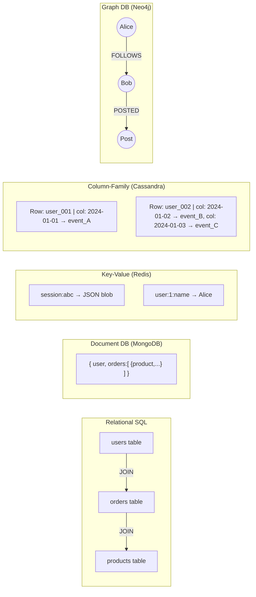

# NoSQL Databases

## Why This Topic Exists

By the mid-2000s, companies like Google, Amazon, and Facebook were hitting walls with traditional relational databases. They needed to store billions of rows and serve millions of requests per second. Relational databases are excellent at correctness, but scaling them to that level requires expensive hardware and complex engineering. NoSQL databases were born to answer a different question: "What if we relax some constraints in exchange for massive scale and flexibility?" The name "NoSQL" came to mean "Not Only SQL" — not a rejection of SQL, but an acknowledgment that SQL is not always the right tool.

## Learning Objectives

- Understand why NoSQL databases were created
- Know the four main types of NoSQL databases and what each is good for
- Explain the data model, strengths, and use cases for each type
- Compare SQL and each NoSQL type side by side
- Recognize which type fits a given real-world problem

## Prerequisites

- [01. Relational Databases (SQL)](./01.%20Relational%20Databases%20SQL%20%28BEGINNER%29.md) — understanding SQL first makes NoSQL's trade-offs clearer
- Basic understanding of what "scaling" means (Chapter 03)

---

## Introduction

NoSQL is not one thing. It is a family of database technologies, each designed to solve a specific kind of problem that relational databases handle poorly. The four major types are:

1. **Document databases** (MongoDB, Firestore) — store data as JSON-like documents
2. **Key-Value stores** (Redis, DynamoDB) — store data as simple key→value pairs
3. **Column-family databases** (Cassandra, HBase) — store data in wide rows grouped by columns
4. **Graph databases** (Neo4j, Amazon Neptune) — store data as nodes and edges (relationships)

Each type sacrifices something from the relational model — usually rigid schema, complex queries, or strict consistency — in exchange for something else: speed, scale, or flexibility.

---

## Real-World Analogy

Imagine you are moving to a new city and need to organize your belongings.

- **SQL database** = a filing cabinet with labeled folders. Everything has a fixed place. Finding anything is predictable. Adding a new type of document requires creating a new folder structure.
- **Document DB** = a pile of labeled envelopes. Each envelope can hold anything — a letter, a photo, a receipt. No two envelopes need to contain the same type of thing.
- **Key-Value store** = a coat check room. You give the attendant your coat, get a ticket number. To retrieve it, just show the ticket. Fast, simple, no complex queries.
- **Column-family DB** = a spreadsheet where each row can have completely different columns. Row 1 might have 3 columns, row 2 might have 300.
- **Graph DB** = a whiteboard with circles (people, places, things) connected by lines labeled with the type of relationship.

---

## Core Concepts

### The Problems NoSQL Solves

| SQL Pain Point | NoSQL Solution |
|----------------|----------------|
| Schema changes on huge tables are slow and risky | Schema-less or flexible schema — just add the new field |
| JOINs across billions of rows are expensive | Embed related data in a single document; no JOIN needed |
| Scaling writes requires complex master-slave setups | Many NoSQL DBs scale writes horizontally by design |
| All rows in a table must have the same columns | Each document/row can have unique fields |

---

## Type 1: Document Databases

### What They Are

Document databases store records as **documents** — usually JSON or BSON (binary JSON). Unlike a SQL row (which has fixed columns), a document can have any fields you want, and those fields can contain nested objects and arrays.

### The Filing Cabinet Analogy

Think of MongoDB as a filing cabinet. The cabinet is the **database**. Each drawer is a **collection** (like a table). Each folder inside a drawer is a **document** (like a row, but flexible). One folder might contain a typed letter. Another might contain a handwritten note with a photo attached. No two folders need to look alike.

### Example Data Structure (MongoDB)

A user document might look like this:
```json
{
  "_id": "user_001",
  "username": "alice",
  "email": "alice@example.com",
  "address": {
    "city": "New York",
    "zip": "10001"
  },
  "tags": ["admin", "beta-tester"],
  "preferences": {
    "theme": "dark",
    "notifications": true
  }
}
```

Compare this to SQL, where you would need a `users` table, an `addresses` table, a `user_tags` junction table, and a `preferences` table — four tables and four JOINs to reconstruct what MongoDB stores in one document.

### Use Cases

- Product catalogs (each product type has different attributes — a book has an ISBN, a shirt has a size)
- User profiles
- Content management systems (articles, blog posts)
- Mobile app backends where the data model changes frequently

### Popular Databases

MongoDB, Firestore (Google), Couchbase, Amazon DocumentDB

---

## Type 2: Key-Value Stores

### What They Are

A key-value store is the simplest data model possible: every piece of data has a unique **key**, and you store a **value** under that key. The value can be a string, a number, JSON, or even binary data — the database does not care. You can only look up data by its exact key.

### The Dictionary Analogy

A key-value store is literally a dictionary (or hash map). `SET session:user_001 "{'cart': [1,2,3]}"` stores data. `GET session:user_001` retrieves it. That is the entire API. No queries, no JOINs, just set and get.

### Example (Redis)

```
SET user:1:name "Alice"
GET user:1:name
→ "Alice"

SET session:abc123 '{"user_id":1,"cart":[101,205]}'
EXPIRE session:abc123 3600   # auto-delete after 1 hour

INCR page:views:homepage     # atomic counter increment
GET page:views:homepage
→ "4821"
```

Redis also supports more complex value types: lists, sets, sorted sets, and hashes — making it far more powerful than a simple key-value store.

### Use Cases

- **Session storage** — store logged-in user sessions, expire them automatically
- **Caching** — cache database query results for millisecond response times
- **Rate limiting** — count how many API calls a user made in the last minute
- **Leaderboards** — Redis sorted sets make real-time leaderboards trivial
- **Pub/Sub messaging** — Redis supports simple message publishing

### Popular Databases

Redis, Memcached, DynamoDB (also supports document model), AWS ElastiCache

---

## Type 3: Column-Family Databases

### What They Are

Column-family databases (also called wide-column stores) look superficially like a table, but they behave very differently. In a relational database, every row has the same columns. In a column-family store, each row can have a completely different set of columns. Rows are grouped into **column families** and identified by a **row key**.

### The Flexible Spreadsheet Analogy

Imagine a spreadsheet where column A (the row key) is fixed, but every other column is optional. Row 1 might have columns B, C, D. Row 2 might have columns C, E, F, G, with completely different data. Cassandra is optimized for writing millions of these rows per second and reading them back extremely fast — as long as you know the row key and the columns you want.

### Example (Cassandra)

```sql
CREATE TABLE user_activity (
    user_id    UUID,
    event_time TIMESTAMP,
    event_type TEXT,
    details    MAP<TEXT, TEXT>,
    PRIMARY KEY (user_id, event_time)
) WITH CLUSTERING ORDER BY (event_time DESC);

-- Insert an event
INSERT INTO user_activity (user_id, event_time, event_type, details)
VALUES (uuid(), toTimestamp(now()), 'page_view', {'page': '/home', 'duration': '5s'});

-- Retrieve last 100 events for a user
SELECT * FROM user_activity WHERE user_id = ? LIMIT 100;
```

Notice the `PRIMARY KEY (user_id, event_time)` — Cassandra is designed for queries that filter on the partition key (`user_id`). It stores all events for a given user physically together on disk, making time-range queries for one user extremely fast.

### Use Cases

- **Time-series data** — sensor readings, stock prices, metrics
- **Event/activity logging** — tracking what users do over time
- **Messaging platforms** — storing message history by conversation
- **IoT data** — billions of device events per day

### Popular Databases

Apache Cassandra, Apache HBase, Google Bigtable (the original), ScyllaDB

---

## Type 4: Graph Databases

### What They Are

Graph databases store data as **nodes** (entities) and **edges** (relationships between entities). Each edge has a type and can have properties. The key insight is that in a graph database, relationships are first-class citizens — they are stored and traversed efficiently, whereas in a SQL database, a "relationship" is an expensive JOIN across large tables.

### The Social Network Analogy

Think of a whiteboard filled with circles. Each circle is a person or a thing. Lines connect them: "Alice FOLLOWS Bob," "Bob LIKES post_123," "post_123 TAGGED_WITH topic_AI." A graph database stores and traverses these connections in O(1) per hop — regardless of how large the database gets — because each node directly stores pointers to its neighbors.

```
(Alice) --[FOLLOWS]--> (Bob)
(Alice) --[FOLLOWS]--> (Carol)
(Bob)   --[POSTED]-->  (Post: "Hello World")
(Carol) --[LIKED]-->   (Post: "Hello World")
```

### Use Cases

- **Social networks** — friend-of-friend queries, "people you may know"
- **Recommendation engines** — "users who bought X also bought Y"
- **Fraud detection** — finding suspicious patterns across transaction networks
- **Knowledge graphs** — how concepts relate to each other
- **Access control** — who can see what in a hierarchy

### Popular Databases

Neo4j, Amazon Neptune, TigerGraph, ArangoDB

### Graph Query Example (Cypher — Neo4j's query language)

```cypher
// Find all friends of Alice who also follow Carol
MATCH (alice:Person {name: 'Alice'})-[:FRIENDS_WITH]->(friend)-[:FOLLOWS]->(carol:Person {name: 'Carol'})
RETURN friend.name;

// Find products frequently bought together
MATCH (product:Product)<-[:PURCHASED]-(customer)-[:PURCHASED]->(other:Product)
WHERE product.name = 'Laptop'
RETURN other.name, COUNT(*) AS co_purchases
ORDER BY co_purchases DESC
LIMIT 5;
```

---

## Visual Diagram



---

## Deep Explanation

### Why NoSQL Scales Better for Writes

Most relational databases use a single primary node for all writes. To scale writes, you either buy a bigger machine (vertical scaling) or implement complex sharding manually. Many NoSQL databases (Cassandra, DynamoDB) are built from the ground up to distribute writes across many nodes automatically. You can add nodes and the database redistributes the load without downtime.

### The Schema Flexibility Trade-off

Schema flexibility sounds great, but it is also dangerous. In MongoDB, nothing stops a bug from writing `{"usrname": "alice"}` when the field should be `{"username": "alice"}`. Without a schema enforcing structure, you get "schema on read" — you only discover malformed data when you try to use it. Many teams use application-level validation or schema validation features (MongoDB has these) to get the best of both worlds.

### BASE vs ACID

Many NoSQL databases use the BASE model instead of ACID:
- **Basically Available** — the system is usually available, even during failures
- **Soft state** — the state of the system may change over time without input
- **Eventually consistent** — the system will eventually reach a consistent state

This means if you write data to one Cassandra node, another node might serve stale data for a few milliseconds before syncing. For most applications (social feeds, analytics) this is fine. For bank transfers, it is not.

---

## Comparison Table: SQL vs NoSQL Types

| Feature | SQL | Document | Key-Value | Column-Family | Graph |
|---------|-----|----------|-----------|---------------|-------|
| Data model | Tables/rows | JSON documents | Key→value pairs | Wide rows | Nodes+edges |
| Schema | Strict | Flexible | None | Semi-flexible | Flexible |
| Query power | Very high (SQL) | Medium (no JOINs) | Very low (key only) | Medium | High for traversals |
| Horizontal scale | Hard | Easy | Easy | Built-in | Medium |
| ACID transactions | Full | Partial (single doc) | No | No | Partial |
| Best for | Complex queries, relationships | Varied document types | Caching, sessions | Time-series, events | Relationship traversal |
| Examples | PostgreSQL, MySQL | MongoDB, Firestore | Redis, DynamoDB | Cassandra, HBase | Neo4j, Neptune |

---

## Step-by-Step Example: Choosing the Right NoSQL Type

**Scenario:** You are building a music streaming app like Spotify. What database fits each part?

1. **User accounts and subscriptions** → **SQL (PostgreSQL)** — structured data, billing requires ACID
2. **User listening history** (billions of events per day) → **Column-family (Cassandra)** — time-series events at massive write scale
3. **Music recommendations** ("users who liked X also like Y") → **Graph (Neo4j)** — relationship traversal between users and tracks
4. **Playback sessions** (what song is playing right now) → **Key-Value (Redis)** — fast ephemeral data, expires when session ends
5. **Podcast metadata** (each podcast has different fields) → **Document (MongoDB)** — flexible schema for varied content types

---

## Advantages / Disadvantages / Trade-offs

| Type | Advantage | Disadvantage |
|------|-----------|-------------|
| Document | Flexible schema, embeds related data | No multi-document transactions (historically), no JOINs |
| Key-Value | Extreme speed, simple API | Cannot query by value, only by key |
| Column-Family | Massive write throughput, time-series queries | No JOINs, limited query patterns, complex data modeling |
| Graph | Natural relationship queries, fast traversals | Not suitable for bulk analytics, small community |

---

## When to Use / When NOT to Use

**Use NoSQL when:**
- You are building for internet scale (millions of users, billions of events)
- Your data model is evolving rapidly (startup phase)
- You have a specific access pattern that a specialized DB handles perfectly (sessions, graphs, events)

**Do NOT use NoSQL when:**
- You need complex multi-table transactions (financial systems)
- Your team does not yet know the access patterns well (SQL's flexibility saves you)
- You are following hype, not solving a specific SQL limitation

---

## Common Interview Questions

**Q: What does "eventually consistent" mean?**
After a write, replicas will sync up "eventually" — there may be a short window where different nodes return different values. Usually milliseconds, but guaranteed to converge.

**Q: When would you choose MongoDB over PostgreSQL?**
When your documents have varying structure, when you want to avoid JOINs by embedding related data, or when you expect rapid schema changes during development.

**Q: Can you have transactions in MongoDB?**
Yes — since MongoDB 4.0, multi-document ACID transactions are supported, though they are less performant than single-document operations.

---

## Common Beginner Mistakes

1. **Using MongoDB "because it's easier"** — and then implementing your own broken version of JOIN in application code
2. **Ignoring schema entirely** — document databases with zero validation become data swamps in 6 months
3. **Using Redis as a primary database** — Redis data is in-memory; you will lose data on restart unless configured carefully
4. **Picking Cassandra for a small app** — Cassandra's complexity only pays off at large scale; it is overkill for most apps

---

## Summary

NoSQL databases are specialized tools, each designed for a specific type of data access problem. Document databases are filing cabinets with flexible folders. Key-value stores are lightning-fast coat checks. Column-family stores are built for time-series writes at scale. Graph databases excel when relationships are the most important part of your data. None of them is universally better than SQL — they are different tools for different jobs.

---

## Key Takeaways

- NoSQL = Not Only SQL — a family of specialized databases, not one thing
- Four main types: Document, Key-Value, Column-Family, Graph
- Each type trades away something (complex queries, strict schema, ACID) for something else (speed, scale, flexibility)
- Most large systems use multiple database types together (polyglot persistence)
- SQL is still the right default; switch to NoSQL only when you have a specific reason

---

## Related Topics

- [01. Relational Databases (SQL)](./01.%20Relational%20Databases%20SQL%20%28BEGINNER%29.md) — the foundation to compare against
- [03. CAP Theorem](./03.%20CAP%20Theorem%20%28INTERMEDIATE%29.md) — the theory explaining why NoSQL makes different consistency choices
- [07. SQL vs NoSQL Decision Guide](./07.%20SQL%20vs%20NoSQL%20Decision%20Guide%20%28BEGINNER%29.md) — a practical framework for choosing
- [Chapter 05: Caching](../05.%20Caching/README.md) — Redis as a caching layer
