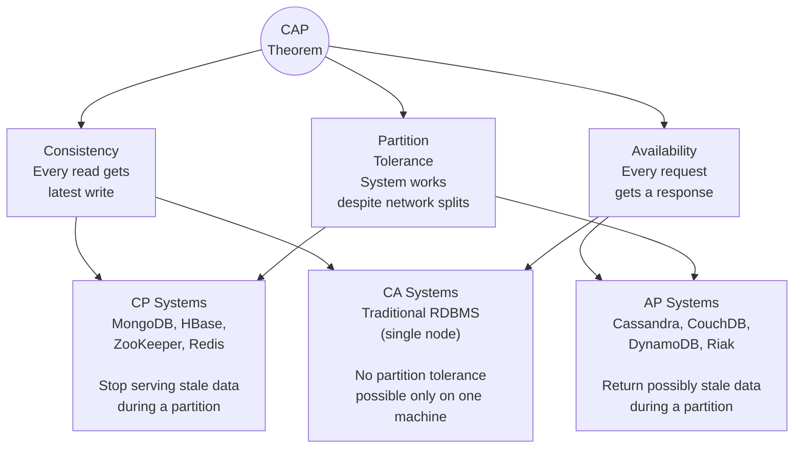

# CAP Theorem

## Why This Topic Exists

When you run a database on a single machine, life is simple. But when your data lives on multiple machines connected by a network, a fundamental tension appears. What happens when the network between those machines breaks? Do you keep serving requests with potentially stale data, or do you refuse to answer until you are certain the data is fresh? The CAP Theorem, proven by Eric Brewer in 2000 and formalized by Gilbert and Lynch in 2002, tells us there is no free lunch: a distributed system can guarantee at most two of three desirable properties. Understanding CAP is essential for reasoning about every distributed database ever built.

## Learning Objectives

- State the three CAP properties and explain each in plain English
- Understand why you can never have all three simultaneously
- Classify real databases as CP, AP, or CA
- Explain PACELC as a more nuanced extension of CAP
- Use CAP reasoning to justify database choices in a system design interview

## Prerequisites

- [01. Relational Databases (SQL)](./01.%20Relational%20Databases%20SQL%20%28BEGINNER%29.md)
- [02. NoSQL Databases](./02.%20NoSQL%20Databases%20%28BEGINNER%29.md)
- Basic understanding of what a distributed system is (Chapter 08 overview)

---

## Introduction

The CAP Theorem states that any distributed data store can provide at most two of the following three guarantees:

- **C — Consistency:** Every read receives the most recent write or an error
- **A — Availability:** Every request receives a (non-error) response, though it may not be the most recent data
- **P — Partition Tolerance:** The system continues operating even when network messages between nodes are dropped or delayed

The critical insight that many people miss: **partition tolerance is not optional**. In any real network, partitions happen. Cables break, switches fail, AWS availability zones lose connectivity. If you are building a distributed system, you must tolerate partitions. This means the real trade-off is always: **CP vs AP** — during a partition, do you prioritize consistency or availability?

---

## Real-World Analogy

Imagine your company has two offices — New York (NY) and London (LDN) — that share a document-editing system. The internet connection between them goes down (a **partition**).

**Scenario A: Sacrifice Availability (CP)**
You decide that no one can edit documents until the connection comes back. Both offices stop working. The upside: when the connection is restored, both offices have identical documents. Consistency is preserved, but availability is zero.

**Scenario B: Sacrifice Consistency (AP)**
Both offices keep working independently. NY edits the employee handbook. LDN also edits it. When the connection comes back, you have two conflicting versions and need to merge them. The system was always available, but consistency suffered.

**Why you cannot have all three:** If the internet connection goes down and you want both offices to keep working (availability) while always reading the latest data (consistency), you need a magical instant communication channel. Networks do not provide that. Something has to give.

---

## Core Concepts

### The Three Properties in Depth

**Consistency (C)**
In CAP, consistency means **linearizability** — a specific, strong form of consistency. If a write completes successfully, any subsequent read (from any node) must return that value or a newer one. There is no reading stale data.

*Not to be confused with the C in ACID*, which means "data stays valid according to defined rules." CAP consistency is about recency of reads across a distributed system.

**Availability (A)**
Every request made to a non-failing node must return a response. The response does not have to contain the most recent data — but the system cannot say "I cannot answer right now." If a node is up, it responds.

**Partition Tolerance (P)**
The system continues to work correctly even when the network between nodes drops messages. In practice, every distributed system must be partition tolerant — you cannot prevent network failures. Therefore, partition tolerance is the baseline, and the real choice is C vs A.

### The Proof of Why You Cannot Have All Three

Imagine two nodes, N1 and N2, sharing data.

1. A write comes to N1: "Set value = X"
2. Before N1 can sync to N2, the network partition occurs
3. A read comes to N2

Now you have to choose:
- **If you answer:** N2 returns the old value (violates Consistency)
- **If you refuse:** N2 returns an error (violates Availability)

There is no third option. The partition forces this choice.

---

## Visual Diagram

---

## Deep Explanation

### CP Systems: Consistency over Availability

During a network partition, a CP system will **refuse to answer** rather than return stale data. It prioritizes correctness.

**Example: ZooKeeper (distributed coordination)**
ZooKeeper stores configuration data that cluster nodes need to agree on (who is the current master?). If a partition means ZooKeeper cannot guarantee the data is current, it stops responding. It is better for a node to wait than to act on stale configuration and cause a split-brain situation.

**Example: MongoDB (with strong consistency settings)**
MongoDB's primary node handles all writes. If a partition isolates the primary, secondary nodes will not elect themselves as primary and serve writes (by default) — they wait. This preserves the single-writer guarantee but means the affected portion of the cluster is unavailable.

**Real-world fit:** Financial transactions, distributed locks, leader election, anything where acting on stale data causes serious harm.

### AP Systems: Availability over Consistency

During a network partition, an AP system will **keep responding** to requests, even if the response might be stale. It prioritizes uptime.

**Example: Cassandra**
Cassandra's "last-write-wins" conflict resolution means writes on both sides of a partition are accepted. When the partition heals, conflicts are resolved automatically (last timestamp wins). For a few seconds, two nodes may return different values for the same key — this is "eventual consistency."

**Example: DynamoDB**
By default, DynamoDB reads are "eventually consistent." You can request strongly consistent reads (which refuse stale data), but this costs more and can fail during partitions.

**Real-world fit:** Social media feeds, product catalogs, shopping carts, DNS — scenarios where showing slightly stale data is acceptable and unavailability is unacceptable.

### CA Systems: Consistency and Availability, No Partitions

A CA system guarantees both consistency and availability but cannot tolerate network partitions. In practice, this is only possible on a single machine — or in a system where all nodes are on the same LAN and partitions are considered impossible (they never truly are).

Traditional relational databases on a single server are CA: they are consistent and available because there is no network partition to worry about. But once you distribute them across data centers, they become CP or AP systems.

**Important clarification:** Calling a distributed database "CA" is technically misleading. All distributed systems that must be partition tolerant — which is all of them in practice — must choose between C and A during a partition.

### Real Database Classification

| Database | Type | Reasoning |
|----------|------|-----------|
| ZooKeeper | CP | Stops serving during partition to avoid stale coordination data |
| HBase | CP | Returns errors during region server failures rather than stale data |
| MongoDB (default) | CP | Primary-based writes; secondaries refuse writes during partition |
| Redis (Sentinel/Cluster) | CP | Will not elect a new primary if quorum is not reachable |
| Cassandra | AP | Accepts writes on both sides of partition; eventual consistency |
| CouchDB | AP | Multi-master; resolves conflicts on merge |
| DynamoDB | AP (by default) | Eventually consistent reads; strongly consistent reads available |
| Riak | AP | Designed explicitly for high availability over consistency |
| Traditional RDBMS (single node) | CA | No network partition to handle |

---

## Step-by-Step Example

**Scenario:** You are designing a ride-sharing app. There are two data needs:

**Billing records (charges to users)**
- If a user is charged twice, they are furious — incorrect data is very harmful
- Brief unavailability ("try again in a second") is acceptable
- **Choose CP** — use a consistent system like PostgreSQL. During a partition, refuse the charge rather than risk double-billing.

**Driver location updates (showing where the nearest driver is)**
- Showing a driver 10 seconds off-position is acceptable — it is a live approximation
- Unavailability is terrible — the app becomes useless if drivers are invisible
- **Choose AP** — use Cassandra. During a partition, serve the last-known location. It will sync when the network recovers.

This is **polyglot persistence**: using different database types for different data based on their CAP requirements.

---

## PACELC — The Extension of CAP

CAP only talks about behavior during a **partition**. But what about normal operation, when there is no partition? PACELC (pronounced "pass-elk") extends the model:

> **PAC-ELC:** If there is a **P**artition, choose between **A**vailability and **C**onsistency. **E**lse (when running normally), choose between **L**atency and **C**onsistency.

Even without partitions, there is a trade-off: to be strongly consistent, a write must be acknowledged by multiple nodes (replicas) before returning success. This takes more time — higher latency. If you allow writes to return after just one node confirms (lower latency), other nodes may briefly return stale data.

| Database | During Partition | Normal Operation |
|----------|-----------------|------------------|
| DynamoDB | Prefers Availability | Prefers low Latency |
| Cassandra | Prefers Availability | Prefers low Latency (configurable) |
| MongoDB | Prefers Consistency | Prefers Consistency (higher latency) |
| MySQL (single node) | Consistency + Availability | Consistency |
| Google Spanner | Prefers Consistency | Prefers Consistency (atomic clocks minimize latency penalty) |

PACELC is more useful for architects than CAP alone, because most of the time systems are not experiencing partitions — so the normal-operation trade-off matters more day-to-day.

---

## Advantages / Disadvantages / Trade-offs

| Choice | Advantage | Disadvantage | When to Use |
|--------|-----------|-------------|-------------|
| **CP** | Data is always correct | System may refuse requests during partition | Financial data, distributed locks, leader election |
| **AP** | System stays online even during failures | May serve stale data temporarily | Social feeds, caches, DNS, shopping carts |

---

## When to Use / When NOT to Use

**CP (Consistency + Partition Tolerance) when:**
- Incorrect data causes real harm (financial transactions, medical records, inventory deductions)
- Brief unavailability is acceptable ("please try again")
- Strong audit trail is required

**AP (Availability + Partition Tolerance) when:**
- Showing slightly stale data is acceptable
- Downtime costs more than stale data (e-commerce catalog, social media)
- You need to scale writes across many geographic regions

**Do NOT mix up CAP's C with ACID's C.** They are different things. A Cassandra cluster is AP at the CAP level but still makes its stored data internally consistent (a row is never half-written).

---

## Common Interview Questions

**Q: Can you always pick all three of CAP?**
No. During a network partition, you must choose between C and A. You cannot have both. Partition tolerance is mandatory in any real distributed system.

**Q: Is Cassandra CP or AP?**
AP. Cassandra accepts writes on all nodes even during partitions and resolves conflicts via last-write-wins. It trades consistency for high availability.

**Q: Why is CA not realistic for a distributed system?**
Because network partitions always happen eventually. A CA system that encounters a partition has no defined behavior — it must either become CP (refuse requests) or AP (return stale data).

**Q: What is eventual consistency?**
A weaker consistency model where all replicas will eventually converge to the same value, but may temporarily return different values. Used by AP systems like Cassandra and DynamoDB.

**Q: What is the difference between CAP and PACELC?**
CAP only models behavior during partitions. PACELC also models the latency/consistency trade-off during normal (non-partition) operation, making it more complete for design decisions.

---

## Common Beginner Mistakes

1. **Thinking you can pick CA for a distributed system** — partitions are a fact of life in any multi-machine system. CA only applies to a single machine.
2. **Confusing CAP Consistency with ACID Consistency** — they are completely different concepts.
3. **Treating CAP as binary** — most modern databases let you tune the trade-off. Cassandra can be made more consistent at the cost of availability. DynamoDB has strongly consistent read modes.
4. **Thinking AP means "broken"** — eventual consistency is correct behavior, just weaker. Many highly successful systems (Amazon shopping cart, Facebook feed) are AP.

---

## Summary

The CAP Theorem is the lens through which distributed database trade-offs are understood. Because network partitions are unavoidable, the real choice is always between Consistency (CP) and Availability (AP). CP systems refuse requests rather than serve stale data. AP systems keep serving but might serve slightly outdated information. PACELC extends this to also capture the latency/consistency trade-off during normal operation. Every distributed database ever built reflects one of these choices, and understanding which you need is essential for system design.

---

## Key Takeaways

- CAP = Consistency, Availability, Partition Tolerance — pick at most two
- Partition tolerance is not optional in real networks — the real choice is CP vs AP
- CP systems prefer correctness over uptime (ZooKeeper, MongoDB, Redis)
- AP systems prefer uptime over perfect freshness (Cassandra, DynamoDB, CouchDB)
- PACELC extends CAP to also capture the latency vs consistency trade-off during normal operation
- Most databases let you tune the trade-off — CAP is a spectrum, not just two buckets

---

## Related Topics

- [02. NoSQL Databases](./02.%20NoSQL%20Databases%20%28BEGINNER%29.md) — the databases classified by CAP
- [05. Database Replication](./05.%20Database%20Replication%20%28INTERMEDIATE%29.md) — replication is where CP vs AP choices live
- [08. Transactions and ACID](./08.%20Transactions%20and%20ACID%20%28INTERMEDIATE%29.md) — ACID consistency vs CAP consistency
- [09. Distributed Databases](./09.%20Distributed%20Databases%20%28ADV%29.md) — systems like Spanner that push the boundaries of CAP
- [Chapter 10: Consistency and Consensus](../10.%20Consistency%20and%20Consensus/README.md) — deep dive into consistency models and consensus algorithms
