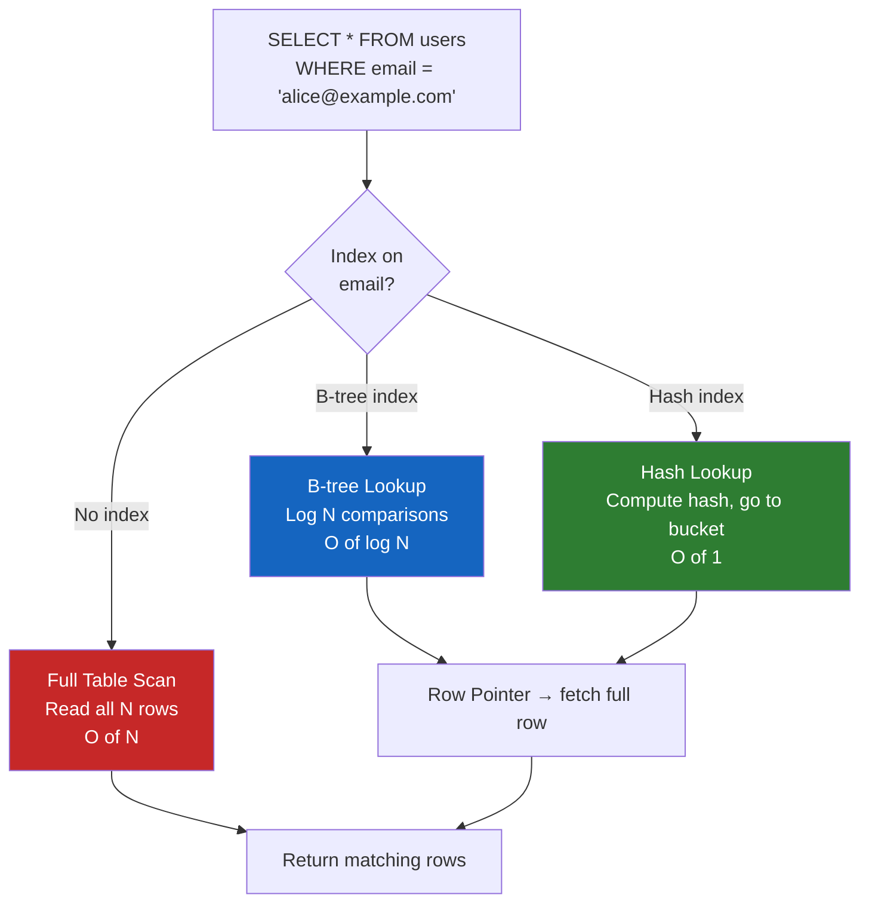

# Database Indexing

## Why This Topic Exists

A database without indexes is like a library where all books are thrown randomly into piles. Finding a specific book means going through every single book one by one. The bigger the library, the longer it takes. Indexes are the card catalog system that allows a librarian — or a database engine — to jump directly to the right location. Indexing is one of the most impactful performance optimizations available to any developer. A single missing index on a key column can turn a 1-millisecond query into a 10-second one as data grows.

## Learning Objectives

- Understand what a database index is and how it works internally
- Distinguish B-tree indexes from hash indexes and know when to use each
- Explain composite indexes, covering indexes, and their rules
- Understand the cost of indexes (write slowdown, storage overhead)
- Read a query execution plan and identify missing indexes
- Know when adding an index makes things worse

## Prerequisites

- [01. Relational Databases (SQL)](./01.%20Relational%20Databases%20SQL%20%28BEGINNER%29.md) — tables, queries, primary keys
- Basic understanding of Big O notation (O(n), O(log n))

---

## Introduction

When you run `SELECT * FROM users WHERE email = 'alice@example.com'`, the database has two options:

1. **Full table scan (no index):** Read every row in the `users` table, check if the email matches. If the table has 10 million rows, that means 10 million comparisons. This is O(n).
2. **Index lookup:** Jump directly to the row(s) with that email using an index. This takes O(log n) for a B-tree index — for 10 million rows, that is about 23 comparisons instead of 10 million.

Indexes make lookups fast by maintaining a separate, sorted data structure that maps column values to row locations.

---

## Real-World Analogy

Think of a textbook with 1,000 pages.

**Without an index:** To find every mention of "photosynthesis," you read every page from 1 to 1,000. This is a full table scan.

**With an index (the book's back-of-book index):** You flip to the index section, find "photosynthesis: pages 124, 287, 501," and go directly to those pages. This is an indexed lookup.

The back-of-book index is maintained separately from the book's content. It is sorted alphabetically (so you can find any word in O(log n) time). But if the book's content changes, the index must be updated too — just like a database index adds overhead to INSERT, UPDATE, and DELETE operations.

---

## Core Concepts

### What an Index Contains

A database index is a data structure that stores:
- The **indexed column value(s)**
- A **pointer** (row ID or primary key) to the actual row in the table

When you query by an indexed column, the database finds the value in the index and uses the pointer to fetch the full row. This is called a "lookup" or "seek."

### B-tree Index (The Default)

The B-tree (Balanced Tree) is the most common index type, used by default in PostgreSQL, MySQL, and most relational databases.

**How it works:**
- Values are stored in sorted order in a tree structure
- The tree is balanced — every path from root to leaf is the same length
- Each internal node contains key values and pointers to child nodes
- Leaf nodes contain the actual indexed values and row pointers

**Why it is good:**
- Supports **equality lookups** (`WHERE email = 'alice@example.com'`) in O(log n)
- Supports **range queries** (`WHERE age BETWEEN 25 AND 35`) efficiently — walk the sorted tree
- Supports **ORDER BY** using the index's natural sort order
- Supports **prefix matching** (`WHERE name LIKE 'Al%'`)

**B-tree index structure:**
```
                    [M]
                   /   \
              [G, J]   [R, T]
             /  |  \   /  |  \
           [A-F][G-I][J-L][M-Q][R-S][T-Z]
```

Each lookup starts at the root and descends to the correct leaf — O(log n) comparisons.

### Hash Index

A hash index uses a hash function to map column values to bucket locations.

**How it works:**
- Compute `hash(value)` → get a bucket number → find the row
- Lookup is O(1) for an exact equality match

**When it is better than B-tree:**
- Pure equality lookups: `WHERE user_id = 42` — constant time, faster than B-tree
- Hash functions distribute values evenly, making hot-spot issues rarer for random lookups

**When it is worse than B-tree:**
- Range queries: `WHERE age > 30` — hash indexes cannot help. There is no ordering in a hash structure
- Prefix matching: `WHERE name LIKE 'Al%'` — no support
- Sorting: Hash indexes do not help `ORDER BY`

**In practice:** PostgreSQL supports hash indexes explicitly. MySQL's InnoDB engine does not persist hash indexes to disk (it has an adaptive hash index in memory). Most of the time, B-tree is the right default.

### Composite Index (Multi-column Index)

A composite index covers multiple columns. It is critical to understand the **left-prefix rule**.

```sql
CREATE INDEX idx_orders_user_status ON orders(user_id, status);
```

This index can be used for:
- `WHERE user_id = 1` (leftmost column — full index benefit)
- `WHERE user_id = 1 AND status = 'pending'` (both columns — full index benefit)
- `WHERE user_id = 1 ORDER BY status` (range on first, order on second)

This index CANNOT help with:
- `WHERE status = 'pending'` (skips the leftmost column — index unusable)
- `WHERE status = 'pending' AND user_id = 1` (same issue — order in index matters, not query)

Think of a phone book sorted by (last name, first name). You can look up "Smith, John" directly. But to find all "Johns" regardless of last name, the phone book is useless — you must read every page.

### Covering Index

A covering index contains all the columns needed by a query, so the database never needs to go back to the main table.

```sql
-- Query: find order amounts for user 1
SELECT amount FROM orders WHERE user_id = 1;

-- Non-covering index on user_id:
-- Step 1: Find all row IDs in the index where user_id = 1
-- Step 2: Fetch each row from the main table to get `amount`

-- Covering index on (user_id, amount):
-- Step 1: Find all entries in the index where user_id = 1
-- Step 2: Read `amount` directly from the index — no table fetch needed
CREATE INDEX idx_orders_user_amount ON orders(user_id, amount);
```

Covering indexes can be dramatically faster for read-heavy queries because they eliminate the second "table lookup" step. The trade-off is larger index storage.

---

## Visual Diagram



---

## Deep Explanation

### How the Query Planner Works

The database **query planner** (also called the optimizer) decides HOW to execute your query before running it. It considers:

- Which indexes exist on the queried columns
- The estimated number of rows the query will return (selectivity)
- Whether an index lookup + row fetch is cheaper than a full scan

**In PostgreSQL, use EXPLAIN ANALYZE to see the plan:**

```sql
EXPLAIN ANALYZE
SELECT * FROM users WHERE email = 'alice@example.com';
```

**Without index:**
```
Seq Scan on users  (cost=0.00..18334.00 rows=1 width=64)
                   (actual time=82.340..82.341 rows=1 loops=1)
  Filter: (email = 'alice@example.com')
  Rows Removed by Filter: 999999
Planning time: 0.4 ms
Execution time: 82.5 ms
```
"Seq Scan" = sequential scan = full table scan. 999,999 rows read, 1 returned.

**After `CREATE INDEX idx_users_email ON users(email)`:**
```
Index Scan using idx_users_email on users  (cost=0.42..8.44 rows=1 width=64)
                                           (actual time=0.031..0.033 rows=1 loops=1)
  Index Cond: (email = 'alice@example.com')
Planning time: 0.2 ms
Execution time: 0.1 ms
```
"Index Scan" = index used. 82 ms dropped to 0.1 ms. An 820x speedup.

### Why Indexes Slow Down Writes

Every time a row is inserted, updated, or deleted, the database must also update every index on that table.

- **INSERT:** Add a new entry to every index. For a table with 5 indexes, that is 5 additional data structure updates per insert.
- **UPDATE:** If an indexed column changes value, remove the old entry and add the new one in every relevant index.
- **DELETE:** Remove the row's entry from every index.

For read-heavy systems (most web apps), this overhead is worth it. For write-heavy systems (logging, event streaming), indexes can become a serious bottleneck.

### When NOT to Add an Index

- **Low-cardinality columns** — a column with only 2 values (e.g., `is_active: true/false`) is a bad index candidate. If 60% of rows have `is_active = true`, the database may decide a full scan is faster than using the index.
- **Small tables** — a table with 1,000 rows is fast to scan. Adding an index adds overhead without meaningful benefit.
- **Write-heavy tables** — event logs, analytics ingestion tables, message queues. The write cost outweighs the read benefit.
- **Columns never used in WHERE, JOIN, or ORDER BY** — the index will never be used.

---

## Step-by-Step Example

**Scenario:** An e-commerce app has 10 million orders. Queries are slow. Let us fix them.

**Step 1:** Identify slow queries using PostgreSQL's slow query log or `pg_stat_statements`.

```sql
SELECT query, mean_exec_time, calls
FROM pg_stat_statements
ORDER BY mean_exec_time DESC
LIMIT 10;
```

**Step 2:** Examine the worst offender.
```sql
EXPLAIN ANALYZE
SELECT * FROM orders WHERE user_id = 12345 AND status = 'pending';
```
Output shows: `Seq Scan` on 10 million rows. Problem found.

**Step 3:** Create a composite index.
```sql
CREATE INDEX idx_orders_user_status ON orders(user_id, status);
```

**Step 4:** Verify improvement.
```sql
EXPLAIN ANALYZE
SELECT * FROM orders WHERE user_id = 12345 AND status = 'pending';
```
Output now shows: `Index Scan using idx_orders_user_status`. Query time drops from 4.2 seconds to 0.8 milliseconds.

**Step 5:** Consider a covering index if only specific columns are needed.
```sql
-- If this is the only query that uses this pattern:
SELECT order_id, amount, placed_at FROM orders WHERE user_id = 12345 AND status = 'pending';

-- Add amount and placed_at to the index to avoid table fetches:
CREATE INDEX idx_orders_user_status_cover ON orders(user_id, status, amount, placed_at);
```

---

## Advantages / Disadvantages / Trade-offs

| Aspect | Detail |
|--------|--------|
| **Read speed** | Dramatically faster — O(log n) vs O(n) for most queries |
| **Range queries** | B-tree indexes make range queries fast |
| **Write overhead** | Every INSERT/UPDATE/DELETE must update all indexes |
| **Storage cost** | Each index is a separate data structure that consumes disk space |
| **Lock contention** | Index updates can increase lock duration under heavy writes |
| **Query planner dependency** | A poorly chosen index can mislead the planner (though modern planners are smart) |

---

## When to Use / When NOT to Use

**Add an index when:**
- The column appears in `WHERE`, `JOIN ON`, `ORDER BY`, or `GROUP BY` clauses
- The column has high cardinality (many distinct values) — `email`, `user_id`, `order_id`
- The table has more than ~10,000 rows
- Queries are slow and EXPLAIN shows a full table scan on that column

**Do NOT add an index when:**
- The table is small (full scan is fine)
- The column has very low cardinality (boolean, status with 2-3 values used by 50%+ of rows)
- The table receives far more writes than reads
- You are adding indexes "just in case" — every unused index still costs write performance

---

## Common Interview Questions

**Q: How does a B-tree index work?**
It stores indexed values in a balanced tree sorted order. Lookups traverse the tree from root to leaf — O(log n). Range queries walk adjacent leaf nodes. Updates rebalance the tree.

**Q: What is the difference between a clustered and a non-clustered index?**
A clustered index determines the physical order of rows on disk (each table can have one — MySQL InnoDB clusters by primary key by default). A non-clustered index is a separate structure with pointers back to the actual rows. Clustered index lookups avoid a second row fetch; non-clustered lookups require it.

**Q: Why can an index make queries slower?**
For very low-selectivity queries (returning 60% of the table), the index lookup + row fetches may be slower than a sequential scan. The query planner estimates this and may ignore the index. A poorly designed composite index where the left-prefix rule is violated also goes unused.

**Q: What is an index scan vs a bitmap index scan?**
An index scan fetches rows one by one following index pointers. A bitmap index scan is used when many rows match — it builds a bitmap of matching row locations, sorts them, then fetches all rows in disk order (much more efficient for multi-condition queries on large result sets).

---

## Common Beginner Mistakes

1. **Indexing every column** — adds write overhead without benefit for columns that are never queried
2. **Wrong column order in composite index** — `(status, user_id)` is not the same as `(user_id, status)`. If your queries filter by `user_id` first, the leftmost column should be `user_id`
3. **Not using EXPLAIN** — guessing which queries are slow instead of measuring
4. **Index on a function call** — `WHERE UPPER(email) = 'ALICE@EXAMPLE.COM'` cannot use a regular index on `email`. You need a functional index: `CREATE INDEX ON users(UPPER(email))`
5. **Forgetting that NULL values are indexed** — B-tree indexes include NULLs, but `IS NULL` and `IS NOT NULL` queries have varying behavior across databases

---

## Summary

Indexes are the single most impactful tool for database query performance. A B-tree index turns an O(n) full table scan into an O(log n) lookup by maintaining a sorted data structure of column values and row pointers. Hash indexes offer O(1) equality lookups but cannot handle range queries. Composite indexes are powerful but must follow the left-prefix rule. Every index costs write performance and storage. The art of indexing is knowing exactly which queries matter most and designing indexes that serve them efficiently without burdening writes unnecessarily.

---

## Key Takeaways

- An index is a sorted data structure mapping column values to row locations — like a book's back index
- B-tree index: default, supports equality, range, sorting — O(log n)
- Hash index: only equality, O(1) — but no range queries, no sorting
- Composite indexes must match the left-prefix rule: (user_id, status) helps `WHERE user_id = ?` but NOT `WHERE status = ?` alone
- Every index slows down writes — only add indexes you know will be used
- Always use EXPLAIN / EXPLAIN ANALYZE to verify your index is actually being used

---

## Related Topics

- [01. Relational Databases (SQL)](./01.%20Relational%20Databases%20SQL%20%28BEGINNER%29.md) — tables and queries that indexes accelerate
- [05. Database Replication](./05.%20Database%20Replication%20%28INTERMEDIATE%29.md) — indexes exist on replicas too; write amplification matters
- [06. Database Sharding](./06.%20Database%20Sharding%20%28ADVANCED%29.md) — choosing the right shard key is similar to choosing an index
- [08. Transactions and ACID](./08.%20Transactions%20and%20ACID%20%28INTERMEDIATE%29.md) — indexes affect lock contention during transactions
