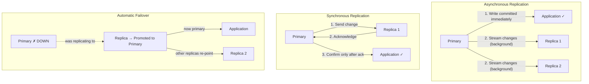

# Database Replication

## Why This Topic Exists

Every production database eventually faces two threats: the single server goes down (hardware failure, network outage, software crash), and the single server cannot keep up with read traffic. Replication addresses both. By keeping identical copies of data on multiple servers, you gain fault tolerance (if one copy dies, others are still serving) and read scalability (spread read queries across many replicas). Replication is one of the most universally applied techniques in production database infrastructure — Instagram, GitHub, Airbnb, and virtually every scaled web application uses it.

## Learning Objectives

- Explain why replication exists and the two main problems it solves
- Describe master-slave (primary-replica) replication and how it works
- Describe master-master (multi-primary) replication and its trade-offs
- Understand synchronous vs asynchronous replication
- Explain replication lag and the read-your-own-writes problem
- Know how to handle stale reads in application code

## Prerequisites

- [01. Relational Databases (SQL)](./01.%20Relational%20Databases%20SQL%20%28BEGINNER%29.md) — understanding what a database server is
- [03. CAP Theorem](./03.%20CAP%20Theorem%20%28INTERMEDIATE%29.md) — helpful for understanding consistency vs availability in replication

---

## Introduction

Replication means keeping a **copy of the same data on multiple database servers**. The servers involved are called **nodes** or **replicas**. The primary (master) node receives all writes. The replica (slave) nodes receive a stream of changes from the primary and apply them to stay in sync.

Two primary reasons to replicate:

1. **High Availability:** If the primary server crashes, one of the replicas can be promoted to primary (failover). Users experience at most a few seconds of downtime instead of hours waiting for the primary to be repaired.

2. **Read Scaling:** Web applications typically have far more reads than writes (reading a tweet vs posting a tweet is 100:1 or higher). By directing read queries to replicas, you can serve 10x the read traffic without upgrading the primary server.

---

## Real-World Analogy

Think of a popular newspaper. The original printing press (primary) produces the newspaper. Copies are distributed to thousands of newsstands (replicas) across the city. Everyone reads from their local newsstand — not from the one printing press. If the printing press breaks, newsstands still have yesterday's copies and can keep selling until it is repaired. When the press is fixed, it prints again and the newsstands receive the new copies.

The key insight: the printing press is the single source of truth for new content. Newsstands only distribute; they do not create. This maps exactly to primary-replica replication.

---

## Core Concepts

### Primary-Replica (Master-Slave) Replication

This is the most common replication topology.

- **Primary (master):** Accepts all write operations (INSERT, UPDATE, DELETE). Maintains a **binary log** (binlog in MySQL, WAL — Write-Ahead Log — in PostgreSQL) that records every change.
- **Replica (slave):** Connects to the primary, reads the binary log, and replays the same operations on its own copy of the data.
- **Read queries** are routed to replicas by the application or a load balancer. This is called **read scaling** or **read offloading**.

```
Application
    │
    ├── Write → [PRIMARY]
    │               │ replication stream
    │           ┌───┴───────────┐
    │           ▼               ▼
    ├── Read → [REPLICA 1]   [REPLICA 2]
    └── Read → [REPLICA 1]   [REPLICA 2]
```

**Failover:** If the primary fails, a human or automated tool (like MySQL Group Replication, Patroni for PostgreSQL) promotes one replica to primary. The other replicas then point to the new primary.

### Master-Master (Multi-Primary) Replication

Both nodes can accept writes. Changes made on node A are replicated to node B, and vice versa.

**Why you might want this:**
- Geographic distribution — route writes to the nearest data center
- No downtime during primary failure — both nodes are always writable

**Why it is dangerous:**
- **Write conflicts:** What happens if two nodes simultaneously update the same row in different ways? You need a conflict resolution strategy (last-write-wins, custom merge logic, application-level locks). Conflict resolution is complex and error-prone.
- **Divergence:** Without careful design, the two nodes can slowly diverge into inconsistent states.

Multi-master is only used when you have a very specific need (multi-region writes) and the engineering team understands the conflict implications. For most apps, primary-replica is the right choice.

### Synchronous vs Asynchronous Replication

This determines when the primary considers a write "committed."

**Asynchronous Replication (most common):**
1. Primary writes the data to its own disk
2. Primary immediately confirms success to the application
3. Primary sends the change to replicas in the background
4. Replicas apply the change (possibly milliseconds to seconds later)

Pros: Low write latency (the application does not wait for replicas)
Cons: If the primary crashes between steps 2 and 3, the replica never gets the write. When the replica is promoted to primary, that write is lost. This is called **replication lag data loss**.

**Synchronous Replication:**
1. Primary writes the data to its own disk
2. Primary sends the change to replicas and waits for at least one replica to acknowledge
3. Only then does the primary confirm success to the application

Pros: No data loss — if the primary fails after confirming, at least one replica has the data
Cons: Higher write latency (must wait for network round-trip to replica + replica disk write). If the replica is slow or unreachable, the primary blocks.

**Semi-synchronous (hybrid, used by MySQL):**
The primary waits for at least one replica to acknowledge before confirming. The other replicas catch up asynchronously. This balances safety and performance.

---

## Visual Diagram



---

## Deep Explanation

### Replication Lag

Replication lag is the delay between a write being committed on the primary and that write becoming visible on a replica. In asynchronous replication, this is always non-zero. Under normal conditions, lag may be a few milliseconds. Under heavy write load or a slow network, lag can grow to seconds or even minutes.

**Why lag matters:**
If a user updates their profile on the primary and then immediately reads their profile (from a replica), they might see the old data. From the user's perspective, their save "did not work."

**Measuring lag in MySQL:**
```sql
SHOW SLAVE STATUS\G
-- Seconds_Behind_Master: 0  ← no lag
-- Seconds_Behind_Master: 45 ← 45 seconds behind! Problem.
```

**Measuring lag in PostgreSQL:**
```sql
SELECT
    client_addr,
    state,
    sent_lsn,
    write_lsn,
    flush_lsn,
    replay_lsn,
    (sent_lsn - replay_lsn) AS replication_lag_bytes
FROM pg_stat_replication;
```

### The Read-Your-Own-Writes Problem

This is the most common manifestation of replication lag in application code.

**Scenario:**
1. User submits a form — POST request goes to the primary and writes data
2. Browser redirects to a confirmation page — GET request goes to a replica
3. The replica has not yet caught up — the confirmation page shows old data or nothing
4. User thinks their submission failed and submits again → duplicate data

**Solutions:**

| Solution | How it works | Trade-off |
|----------|-------------|-----------|
| Read from primary for 1 second after write | Track last write timestamp per user; if within 1s, read from primary | Increased primary load |
| Always read from primary for this user's own writes | Send reads to primary if the data was written by the current user | Reduces benefit of replicas |
| Wait for replication | After write, poll until replica has the data before redirecting | Adds latency to writes |
| Sticky session | Route each user's requests to the same node | Defeats read scaling for that user |
| Monotonic reads | Guarantee a user always reads from the same replica | One replica handles all reads for a user |

In practice, most apps use a combination: route critical "after-write reads" to the primary, and send all other reads to replicas.

### Real Example: Instagram's MySQL Replication

Instagram famously scaled to hundreds of millions of users on PostgreSQL, but many large systems use MySQL with extensive replication. A typical production MySQL setup at a mid-sized company:

- 1 primary, 3 replicas in the same data center (for read scaling)
- 1 replica in a secondary data center (for disaster recovery)
- Replication is asynchronous (low latency writes)
- A tool like Orchestrator or MHA monitors the primary and triggers automatic failover within 30 seconds of primary failure
- Application uses a connection pool that knows which queries are read-only and routes them to replicas

This single pattern handles most traffic for most web applications.

---

## Step-by-Step Example

**Scenario:** A blogging platform starts with one database server. It is getting slow. Let us add read replicas.

**Step 1: Identify the read/write ratio.**
Using monitoring (e.g., slow query log, Datadog), you find 95% of queries are SELECTs (reads), and 5% are INSERTs/UPDATEs (writes). Reads are the bottleneck.

**Step 2: Add two replicas.**
```sql
-- On the primary (MySQL), enable binary logging
-- my.cnf:
[mysqld]
server-id = 1
log_bin = mysql-bin
binlog_format = ROW

-- On each replica:
CHANGE MASTER TO
  MASTER_HOST='primary-db.internal',
  MASTER_USER='replication_user',
  MASTER_PASSWORD='secret',
  MASTER_LOG_FILE='mysql-bin.000001',
  MASTER_LOG_POS=107;
START SLAVE;
```

**Step 3: Update application to route reads to replicas.**
Using a library like HikariCP (Java) or SQLAlchemy (Python) with read/write splitting, or simply two database connection strings:
```python
# Write connection — primary
db_write = create_engine("mysql://primary-db.internal/myapp")
# Read connection — load balancer across replicas
db_read  = create_engine("mysql://read-lb.internal/myapp")

def get_user(user_id):
    return db_read.execute("SELECT * FROM users WHERE id = ?", user_id)

def update_user(user_id, data):
    return db_write.execute("UPDATE users SET ... WHERE id = ?", user_id)
```

**Step 4: Monitor lag.**
Set up alerts: if `Seconds_Behind_Master > 30`, page on-call. This indicates a replica is falling dangerously behind.

**Step 5: Add failover automation.**
Set up Orchestrator or Patroni to monitor the primary. If the primary does not respond for 30 seconds, automatically promote Replica 1 to primary and redirect application traffic.

---

## Advantages / Disadvantages / Trade-offs

| Aspect | Primary-Replica | Multi-Primary |
|--------|----------------|---------------|
| **Read scaling** | Excellent — N replicas = N× read capacity | Good |
| **Write scaling** | None — all writes go to one primary | Better — writes distributed |
| **Consistency** | Strong (reads from primary) or eventual (reads from replicas) | Weak — conflict resolution needed |
| **Complexity** | Low-medium | High |
| **Failover** | Automated tools available (Orchestrator, Patroni) | Complex |
| **Risk** | Replication lag data loss (async) | Write conflicts, data divergence |

---

## When to Use / When NOT to Use

**Use primary-replica replication when:**
- Your read/write ratio is high (most web apps: 80-95% reads)
- You need high availability with automatic failover
- You want disaster recovery (offsite replica in a second data center)
- Your writes easily fit on a single server

**Use multi-primary replication when:**
- You have multiple geographic regions that all need low-latency writes
- Your team is experienced with conflict resolution
- You cannot tolerate any write downtime during failover

**Do NOT use replication to scale writes** — replication copies every write to every node. The primary still handles all writes. For write scaling, use [sharding](./06.%20Database%20Sharding%20%28ADVANCED%29.md) instead.

---

## Common Interview Questions

**Q: What is replication and why is it used?**
Replication keeps copies of data on multiple servers for high availability (failover if primary fails) and read scaling (spread reads across replicas).

**Q: What is the difference between synchronous and asynchronous replication?**
Synchronous waits for at least one replica to acknowledge the write before confirming success — no data loss, but higher latency. Asynchronous confirms immediately and replicates in the background — lower latency, but brief data loss window if the primary crashes.

**Q: What is replication lag and how do you handle it?**
Replication lag is the delay between a write on the primary and its visibility on a replica. Handle it by: reading from primary after writes, using monotonic reads, or using synchronous replication for critical data.

**Q: What is the read-your-own-writes problem?**
A user writes data, then immediately reads it. If the read goes to a replica that has not yet replicated the write, the user sees stale data. Solve by routing post-write reads to the primary for a short window.

**Q: How does failover work?**
A monitoring agent (Orchestrator, Patroni, AWS RDS) detects primary failure, promotes a replica to primary, updates DNS or a virtual IP, and other replicas re-point to the new primary. The process takes 10-60 seconds in well-configured systems.

---

## Common Beginner Mistakes

1. **Reading from replicas for all queries** — forgetting that replicas may have lag; critical reads (bank balance, inventory count) should go to the primary
2. **Not monitoring replication lag** — lag can silently grow for hours before users notice
3. **Using replication to scale writes** — replication does not help with write bottlenecks; all writes still go to one primary
4. **No failover automation** — relying on manual promotion means hours of downtime per incident instead of 30 seconds
5. **Replicating to a single data center** — if the data center goes down, all replicas go down together. Always have one replica in a separate physical location.

---

## Summary

Database replication keeps identical copies of data on multiple servers. Primary-replica replication sends all writes to one primary and all reads (optionally) to replicas — providing fault tolerance and read scalability. Multi-primary allows writes on multiple nodes at the cost of conflict resolution complexity. Asynchronous replication is fast but risks brief data loss; synchronous replication is safe but slower. Replication lag causes the read-your-own-writes problem, which must be handled explicitly in application code. Replication is the foundation of every highly available production database setup.

---

## Key Takeaways

- Replication copies data across multiple servers for availability and read scaling
- Primary handles all writes; replicas handle reads (primary-replica model)
- Asynchronous: fast writes, tiny data loss window. Synchronous: safe, slower writes
- Replication lag causes stale reads — route critical reads to the primary
- Replication solves read bottlenecks and failure recovery — NOT write bottlenecks
- Always have at least one replica in a separate physical location for disaster recovery

---

## Related Topics

- [03. CAP Theorem](./03.%20CAP%20Theorem%20%28INTERMEDIATE%29.md) — CP vs AP choices in replication setups
- [05. Database Replication](./05.%20Database%20Replication%20%28INTERMEDIATE%29.md) — this file
- [06. Database Sharding](./06.%20Database%20Sharding%20%28ADVANCED%29.md) — when replication alone is not enough for writes
- [07. SQL vs NoSQL Decision Guide](./07.%20SQL%20vs%20NoSQL%20Decision%20Guide%20%28BEGINNER%29.md) — replication affects the choice
- [Chapter 03: Scalability](../03.%20Scalability/README.md) — replication as a horizontal scaling strategy
