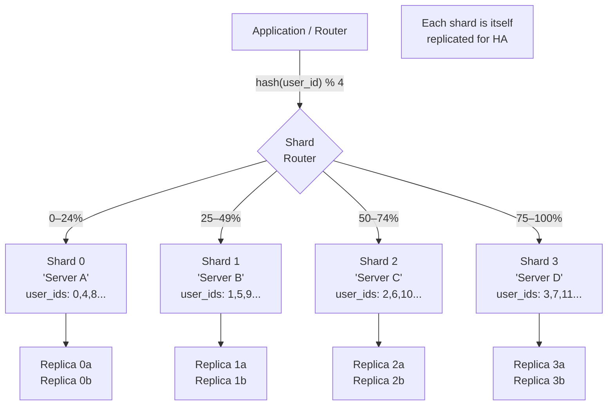

# Database Sharding

## Why This Topic Exists

Replication solves read bottlenecks and single-server failure. But what happens when you have so much data that no single server can store it all? Or so many writes that one primary server cannot process them fast enough? That is where sharding comes in. Sharding is the technique of splitting a large dataset across multiple database servers so each server holds only a portion of the data. It is one of the most complex and consequential architectural decisions in large-scale systems, with trade-offs that affect every query and every future schema change. Facebook, Twitter, Pinterest, and every large-scale web platform uses some form of sharding.

## Learning Objectives

- Explain what sharding is and why it is needed
- Distinguish horizontal from vertical partitioning
- Describe and compare three sharding strategies: range-based, hash-based, and directory-based
- Understand the hotspot problem and how to avoid it
- Explain why cross-shard queries are expensive
- Understand the resharding challenge and consistent hashing as a solution
- Name real-world examples of sharding in production systems

## Prerequisites

- [01. Relational Databases (SQL)](./01.%20Relational%20Databases%20SQL%20%28BEGINNER%29.md)
- [05. Database Replication](./05.%20Database%20Replication%20%28INTERMEDIATE%29.md) — replication is complementary to sharding
- Chapter 03 (Scalability) — vertical vs horizontal scaling concepts

---

## Introduction

A **shard** is a horizontal partition of data. Instead of one giant database table with 5 billion rows, you split it into 10 shards, each holding 500 million rows on its own server. Each server is called a **shard** or **database node**. The application (or a routing layer) must know which shard a particular piece of data lives on and route queries accordingly.

Sharding is sometimes called **horizontal partitioning** (splitting rows across servers) as opposed to **vertical partitioning** (splitting columns, or splitting tables into different databases).

---

## Real-World Analogy

Imagine the phone book for a city of 10 million people. That phone book would be impossibly thick — too heavy to lift, impossible to search quickly. The city decides to split it into multiple volumes:

- **Volume 1:** A – D
- **Volume 2:** E – K
- **Volume 3:** L – Q
- **Volume 4:** R – Z

Each volume is a **shard**. To find "Smith, John," you immediately know to go to Volume 4 (R-Z). You do not need to check the other three volumes at all. But if you need to find "everyone who lives on Elm Street" — a **cross-shard query** — you must search all four volumes.

This illustrates the core trade-off: sharding makes targeted lookups fast but makes queries that cross shard boundaries expensive.

---

## Core Concepts

### Horizontal vs Vertical Partitioning

**Vertical Partitioning (splitting by column or table):**
Moving different tables or columns to different servers.

```
Server A: users, accounts tables
Server B: orders, payments tables
Server C: product_catalog, inventory tables
```

This is simpler than sharding and is often a good first step. You essentially decompose a monolithic database by domain — similar to microservices for databases. The limitation: each individual table can still grow beyond what one server can handle.

**Horizontal Partitioning / Sharding (splitting by row):**
The `users` table with 5 billion rows is split across 10 servers, each holding 500 million rows.

```
Shard 0: user_id 0–499,999,999
Shard 1: user_id 500,000,000–999,999,999
...
Shard 9: user_id 4,500,000,000–4,999,999,999
```

Every shard has the same schema but different data. This is true sharding.

### Sharding Strategies

#### Strategy 1: Range-Based Sharding

Divide the data into contiguous ranges of the shard key.

```
user_id 0–1,000,000      → Shard 0
user_id 1,000,001–2,000,000 → Shard 1
user_id 2,000,001–3,000,000 → Shard 2
```

**Pros:**
- Simple routing — you can compute the shard just by looking at the key range
- Range queries within one shard are efficient (e.g., "all users registered in 2023" if sharding by registration date)
- Easy to reshard: add a new shard and move the upper range to it

**Cons:**
- **Hotspot problem:** If new users always get the highest user_id, they always land on the last shard — which receives all new write traffic. The other shards sit idle.
- Uneven distribution — some ranges may be more active than others

#### Strategy 2: Hash-Based Sharding

Apply a hash function to the shard key and map the result to a shard.

```
shard_number = hash(user_id) % number_of_shards
```

For 4 shards:
- `hash(user_001) % 4 = 2` → Shard 2
- `hash(user_002) % 4 = 0` → Shard 0
- `hash(user_003) % 4 = 3` → Shard 3

**Pros:**
- Even distribution of data and load across shards — hash functions spread values uniformly
- Eliminates hotspots for write traffic

**Cons:**
- **Range queries are impossible** — logically adjacent user_ids land on different shards. "Users registered in January" requires querying all shards.
- **Resharding is painful** — if you go from 4 to 5 shards, almost every row must move. `hash(x) % 4` and `hash(x) % 5` give completely different shard assignments.

#### Strategy 3: Directory-Based Sharding (Lookup Service)

Maintain a separate **shard map** — a lookup table that records which shard each entity lives on.

```
Directory Service:
user_001 → Shard 2
user_002 → Shard 0
user_003 → Shard 1
...
```

Before every query, the application consults the directory service to find the right shard.

**Pros:**
- Maximum flexibility — you can move any entity to any shard at any time without changing the routing logic
- Easy to handle irregular distributions — put heavy users on dedicated shards

**Cons:**
- The directory service becomes a **single point of failure** and performance bottleneck — every query hits it first
- The directory itself must be highly available and fast (typically cached in Redis)

---

## Visual Diagram



Note: each shard typically has its own replicas for high availability. Sharding and replication are complementary — sharding for write capacity and data volume, replication for read scaling and fault tolerance within each shard.

---

## Deep Explanation

### The Hotspot Problem

A hotspot is when one shard receives a disproportionate share of reads or writes, while others sit idle. This defeats the purpose of sharding.

**Example 1: Range sharding by timestamp**
If you shard messages by timestamp range, all new messages always land on the "current" shard. That shard is hot; all others are cold.

**Example 2: A famous user**
If you shard by user_id but one user (say, a celebrity on a social platform) has 50 million followers, all operations related to that user land on one shard. That shard is hot.

**Solutions:**
- Use hash-based sharding to distribute writes evenly
- Add a random prefix to the key for hot entities (but this complicates reads)
- Use a separate dedicated shard or read-replica farm for known hot entities
- Shard at a more granular key level (e.g., shard by post_id instead of user_id for social feeds)

### Cross-Shard Queries: The Biggest Pain Point

A query that must aggregate data from multiple shards requires the application to:
1. Send the query to every shard in parallel
2. Collect all the results
3. Merge, sort, and paginate the combined results in application code

**Example:** `SELECT COUNT(*) FROM users WHERE country = 'India'`

With 4 shards, you run this query on all 4 shards, get 4 counts, and add them together. Simple enough.

But `SELECT * FROM users WHERE country = 'India' ORDER BY created_at LIMIT 10 OFFSET 100` is brutal. You cannot push the `OFFSET` to each shard — you must fetch large amounts of data from all shards and sort/paginate in memory. This is called **scatter-gather** and it is O(shards × data) instead of O(data / shards).

**Mitigation strategies:**
- Choose your shard key so the most common queries only need one shard (e.g., shard by user_id if most queries are "get data for this user")
- Maintain a global index (e.g., Elasticsearch) for queries that must cross shard boundaries
- Accept that global aggregate queries will be slow

### Resharding: The Nightmare Scenario

You start with 4 shards using hash-based sharding (`hash(id) % 4`). Your data grows. You need 6 shards.

The problem: `hash(id) % 4` and `hash(id) % 6` give completely different results. Nearly every row ends up on a different shard. You must move the majority of your data while the system is live.

**Consistent Hashing** solves this. Instead of mapping `hash(id) % N`, you imagine a ring (a hash ring). Both data keys and server nodes are hashed onto this ring. Each key is owned by the nearest server clockwise on the ring. When you add a new server, only the keys between it and its predecessor move — typically 1/N of the total data.

```
Hash Ring (0 to 2^32):
      0
   7    1
  6      2      Shard A at position 1
   5    3      Shard B at position 4
      4         Shard C at position 6

Key → hash → find nearest shard clockwise
Adding Shard D between positions 1 and 4 only moves keys in that arc
```

Consistent hashing is used by Cassandra, DynamoDB, and many distributed caching systems. We cover it in depth in [Chapter 08: Distributed Systems](../08.%20Distributed%20Systems/README.md).

### Real Example: Facebook User Data Sharding

Facebook stores user data in MySQL, sharded horizontally. The general approach:

- Shard key: `user_id`
- Routing: a custom lookup service (similar to directory-based) maps user_id → shard
- Each shard is a MySQL instance with its own replicas
- A user's friends, posts, and messages all shard by that user's user_id — so most operations for one user touch only one shard
- The News Feed is a separate system that must aggregate across shards — it uses a pre-computation approach (fan-out on write) to avoid cross-shard queries at read time

The key design insight: **choose your shard key to match your access pattern**. Facebook's access pattern is "give me everything about user X" — so sharding by user_id ensures that "everything about user X" lives on one shard.

---

## Step-by-Step Example

**Scenario:** A social media platform has 500 million users. The users table has grown to 8 TB — too large for one MySQL server. Let us shard it.

**Step 1: Choose the shard key.**
Almost all queries are "get user by user_id" or "get user by username." We will shard by `user_id` using hash-based sharding.

**Step 2: Decide on the number of shards.**
Start with 256 logical shards (this is a common pattern — many logical shards mapped to fewer physical servers). 256 logical shards on 16 physical servers = 16 shards per server. Adding a physical server just means migrating 16 logical shards.

**Step 3: Implement the shard router.**
```python
NUM_LOGICAL_SHARDS = 256
SHARD_MAP = {
    # logical_shard_id → physical_db_host
    0: 'db-host-01', 1: 'db-host-01', ...,
    16: 'db-host-02', 17: 'db-host-02', ...
}

def get_shard(user_id: int) -> str:
    logical_shard = hash(user_id) % NUM_LOGICAL_SHARDS
    return SHARD_MAP[logical_shard]

def get_user(user_id: int):
    host = get_shard(user_id)
    conn = get_connection(host)
    return conn.execute("SELECT * FROM users WHERE user_id = ?", user_id)
```

**Step 4: Handle the cross-shard "search by username" case.**
Username search cannot use the shard key. Maintain a separate lookup table (possibly in a search service like Elasticsearch) that maps `username → user_id`. Queries first look up `user_id` by username, then use the shard router.

**Step 5: Add a physical server.**
Reassign 16 logical shards (from db-host-01's 16 shards) to the new server. Migrate those shards' data. Update SHARD_MAP. No reshuffling of hash values needed.

---

## Advantages / Disadvantages / Trade-offs

| Aspect | Detail |
|--------|--------|
| **Write scalability** | Each shard handles writes for its subset of data — massive write throughput possible |
| **Storage scalability** | Data can grow beyond any single server's capacity |
| **Read performance** | Queries for a known shard key are fast — only one shard is queried |
| **Cross-shard queries** | Expensive scatter-gather operations; best avoided |
| **Operational complexity** | Backups, schema changes, monitoring all multiply by number of shards |
| **Schema migrations** | Must run on all shards; must be coordinated carefully |
| **Resharding cost** | Adding shards requires data migration — use consistent hashing to minimize |
| **Transaction complexity** | Transactions across shards require distributed transactions (extremely complex) |

---

## When to Use / When NOT to Use

**Use sharding when:**
- Your dataset exceeds the capacity of the largest available single server
- Write throughput exceeds what one primary can handle
- You have a clear shard key with high cardinality that matches your access patterns

**Do NOT use sharding when:**
- Your data fits on one server with room to grow — sharding adds enormous complexity
- You frequently need cross-shard queries or complex JOINs — these become nightmares
- Your team is not experienced with distributed systems — operational errors on sharded databases are catastrophic
- Replication + read replicas + vertical scaling can handle your load — always try those first

The rule of thumb: **shard as late as possible**. Every month you avoid sharding is a month of simpler operations.

---

## Common Interview Questions

**Q: What is the difference between sharding and replication?**
Replication copies the same data to multiple servers (for availability and read scaling). Sharding splits different data across multiple servers (for write scaling and storage capacity). They are complementary — each shard typically has its own replicas.

**Q: What is a hotspot in sharding?**
When one shard receives a disproportionate share of reads or writes because of a poor shard key choice. Solved by choosing a high-cardinality shard key and using hash-based sharding.

**Q: What is consistent hashing?**
A technique that maps both data keys and server nodes onto a hash ring. Adding or removing a server only requires moving 1/N of the data (keys in the arc adjacent to the new/removed node), instead of remapping everything.

**Q: How would you handle a cross-shard query?**
Option 1: Scatter-gather — query all shards in parallel, merge results in application code. Option 2: Maintain a global secondary index (e.g., Elasticsearch) for non-shard-key queries. Option 3: Pre-compute and denormalize the results.

**Q: How does Facebook shard user data?**
By user_id, with a lookup service routing user_id to the physical shard. Related data (posts, messages) is also partitioned by user_id, so most operations for one user are confined to one shard.

---

## Common Beginner Mistakes

1. **Sharding too early** — adding complexity before you hit the limits of a single server
2. **Choosing a bad shard key** — low cardinality (e.g., sharding users by country gives you only ~200 shards max, with massive hot shards for large countries) or a key that creates hotspots
3. **Using simple modulo sharding** — `hash(id) % N` means adding any servers requires rehashing nearly everything. Use consistent hashing or logical shards.
4. **Not testing cross-shard queries** — they work in development (single shard) but explode in production
5. **Forgetting schema migrations** — `ALTER TABLE` on 256 shards requires careful orchestration. One shard with the wrong schema causes subtle bugs.

---

## Summary

Sharding splits a large dataset across multiple database servers, with each server holding a subset of the rows. It solves write bottlenecks and storage limits that replication cannot. The three main strategies — range, hash, and directory-based — each have different trade-offs around hotspots, query flexibility, and migration complexity. Cross-shard queries are expensive and should be minimized by choosing a shard key that aligns with the most common access patterns. Consistent hashing makes adding new shards less disruptive. Sharding is a last resort — try every other technique first, because the operational complexity is substantial.

---

## Key Takeaways

- Sharding = splitting rows across multiple servers (horizontal partitioning)
- Range-based: simple routing, risk of hotspots. Hash-based: even distribution, no range queries. Directory-based: flexible, requires a lookup service
- The hotspot problem occurs when one shard gets all the traffic — use hash-based sharding to prevent it
- Cross-shard queries require scatter-gather: query all shards, merge results in app code — design your shard key to avoid this
- Consistent hashing minimizes data movement when adding/removing shards
- Shard as late as possible — it multiplies operational complexity by the number of shards

---

## Related Topics

- [05. Database Replication](./05.%20Database%20Replication%20%28INTERMEDIATE%29.md) — complementary to sharding; each shard has replicas
- [03. CAP Theorem](./03.%20CAP%20Theorem%20%28INTERMEDIATE%29.md) — sharding affects CP vs AP choices
- [09. Distributed Databases](./09.%20Distributed%20Databases%20%28ADV%29.md) — systems that automate sharding
- [Chapter 08: Distributed Systems](../08.%20Distributed%20Systems/README.md) — consistent hashing and distributed algorithms in detail
- [Chapter 10: Consistency and Consensus](../10.%20Consistency%20and%20Consensus/README.md) — cross-shard transactions and consensus
