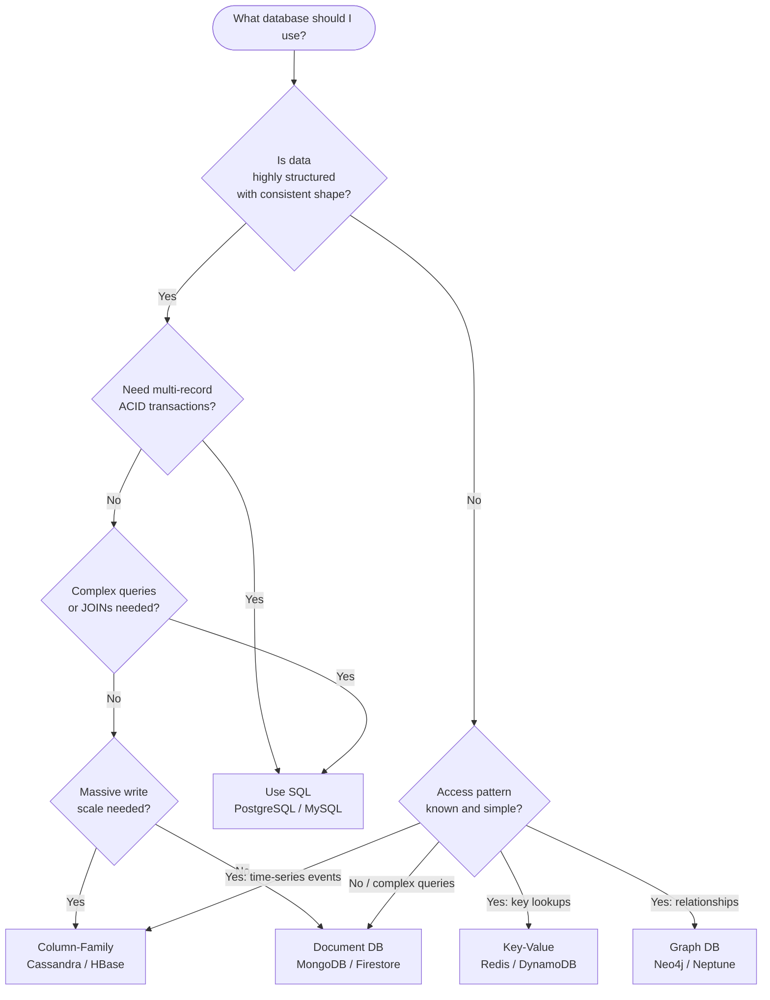

# SQL vs NoSQL Decision Guide

## Why This Topic Exists

One of the most common and consequential decisions in system design is choosing between a relational (SQL) database and a NoSQL database. This choice gets made incorrectly far too often — engineers pick MongoDB "because it's flexible," or they stick with MySQL "because that's what we know." Both lead to pain. This guide gives you a practical, principled framework for making the right choice based on the actual requirements of your system. It will also help you explain and defend that choice in a system design interview.

## Learning Objectives

- Apply a structured decision framework to choose SQL vs NoSQL
- Match specific real-world scenarios to the right database type
- Recognize the common mistakes that lead to bad database choices
- Explain the trade-offs confidently in an interview setting
- Understand when "it depends" is actually the right answer

## Prerequisites

- [01. Relational Databases (SQL)](./01.%20Relational%20Databases%20SQL%20%28BEGINNER%29.md) — what SQL databases are and what they are good at
- [02. NoSQL Databases](./02.%20NoSQL%20Databases%20%28BEGINNER%29.md) — the four NoSQL types and their strengths

---

## Introduction

SQL and NoSQL are not opposites. They are different tools optimized for different problems. A hammer and a screwdriver are both useful; choosing the wrong one does not make the tool bad — it makes the choice bad.

The question is never "which is better?" The question is: **which tool fits my specific requirements?**

To answer that, you need to be clear on your requirements. This guide walks you through the six questions that determine the right choice.

---

## Real-World Analogy

Think of SQL as a **professional filing system** — every document has a predefined form with labeled fields. Finding documents by any field is easy because everything is organized the same way. Adding a new field requires updating the form template for every document.

NoSQL is like a **flexible notebook** — each page can contain anything you want. Adding new information is trivial. But searching for all pages that mention a specific term requires reading every page, unless you build a separate index.

The professional filing system is better for compliance, reporting, and complex queries. The flexible notebook is better for capturing varied, rapidly changing information quickly.

---

## Core Concepts: The Six Decision Questions

### Question 1: How structured is your data?

**Highly structured, consistent shape → SQL**

If every record of a type has the same fields — every order has order_id, user_id, amount, status — a relational table is a perfect fit. The rigid schema is a feature: it enforces that every row is valid.

**Variable, flexible, or evolving shape → NoSQL (Document)**

If a "product" in your catalog might be a book (with ISBN, author, pages), a shirt (with sizes, colors), or an electronic (with voltage, compatibility) — each with completely different fields — forcing them into one SQL table means either many nullable columns or complex EAV (Entity-Attribute-Value) tables. A document database handles this naturally.

---

### Question 2: Do you need ACID transactions?

**Yes, multiple related operations must succeed or fail together → SQL**

Bank transfers, order placement (deduct inventory AND create order AND charge payment), medical records. If any step fails, the entire operation must roll back. ACID guarantees this. Most SQL databases provide full ACID; most NoSQL databases provide ACID only within a single document/record.

**No, each write is independent or eventual consistency is acceptable → NoSQL**

Logging user events, updating a social feed, tracking page views — each write is independent. If one write fails, it does not corrupt other data. NoSQL's lack of multi-record ACID transactions is not a problem here.

---

### Question 3: How complex are your queries?

**Complex queries with JOINs, aggregations, filtering on many dimensions → SQL**

"Find all orders placed by users in California in the last 30 days where the total is over $100, grouped by product category." This is SQL at its best — multi-table, multi-condition, aggregated.

**Simple, well-defined access patterns → NoSQL**

"Get all messages for conversation_id X, sorted by timestamp." Cassandra handles this beautifully. The access pattern is simple and known in advance. NoSQL databases require you to design your data model around your access patterns — if you know those patterns, NoSQL shines.

---

### Question 4: How much scale do you need?

**Moderate scale, or writes that fit on one server → SQL with replication**

The vast majority of applications — including many with millions of users — run fine on a single PostgreSQL primary with read replicas. Do not assume you need NoSQL scale until you have measured that you need it.

**Massive write throughput or data volume beyond one server's capacity → NoSQL (especially Column-Family) or sharded SQL**

100,000 writes per second, petabytes of data across hundreds of servers — Cassandra was designed for exactly this. DynamoDB scales horizontally without configuration. MySQL can be sharded, but it is painful (see [06. Database Sharding](./06.%20Database%20Sharding%20%28ADVANCED%29.md)).

---

### Question 5: How do you access the data?

**By primary key / shard key only → Key-Value or Column-Family**

If every query looks like "get X for user Y," you know the primary key and nothing else matters. Redis gives you sub-millisecond lookups. Cassandra gives you scalable time-range lookups by partition key.

**By relationships / graph traversal → Graph Database**

"Find all users who are friends of friends of Alice and live in Seattle." This is trivial in Neo4j and requires expensive multi-JOINs in SQL.

**Full-text search → Elasticsearch**

Not covered in this chapter, but worth noting: if your primary access pattern is "find documents containing this phrase," use a search engine, not a general-purpose database.

---

### Question 6: How stable is your data model?

**Stable, well-understood schema → SQL**

You know exactly what fields your data will have. The SQL schema enforces this and protects you from bugs that write malformed data.

**Rapidly evolving schema (startup phase, prototyping) → NoSQL**

You are building a new product and are not sure what fields you will need in 3 months. Adding a column to a 10-million-row SQL table requires an `ALTER TABLE` that can lock the table for minutes. Adding a field to MongoDB documents requires changing only application code — existing documents are unaffected.

---

## Visual Diagram



---

## Deep Explanation

### Real Scenario Comparisons

| Scenario | Best Database Type | Why |
|----------|-------------------|-----|
| E-commerce orders and payments | **SQL (PostgreSQL)** | ACID transactions needed; order + inventory + payment must be atomic |
| User sessions (logged-in state) | **Key-Value (Redis)** | Simple key→value, fast TTL expiry, no relationships |
| Social graph (friends, followers) | **Graph (Neo4j)** | Relationship traversal is the primary operation |
| IoT sensor readings | **Column-Family (Cassandra)** | Massive write throughput; time-series access by device + timestamp |
| Product catalog with varying attributes | **Document (MongoDB)** | Books, shoes, electronics each have different fields |
| Financial ledger / accounting | **SQL (PostgreSQL)** | ACID, audit trail, decimal precision |
| Real-time leaderboard | **Key-Value (Redis sorted set)** | Sub-millisecond updates and reads, sorted data type built-in |
| User analytics / clickstream | **Column-Family (Cassandra)** | Billions of events; append-only write pattern; time-range reads by user |
| Recommendation engine | **Graph (Neo4j)** | "Users who liked X also liked Y" = graph traversal |
| Chat messages history | **Column-Family (Cassandra)** | Partition by conversation_id; cluster by timestamp; high write volume |
| Configuration data | **Key-Value (Redis) or SQL** | Simple key-value if config is flat; SQL if config has relationships |

### The Polyglot Persistence Pattern

Large systems almost never use a single database type. They use multiple databases for different parts of the system — this is called **polyglot persistence**.

**Example: A streaming music app like Spotify**

```
User accounts & subscriptions → PostgreSQL (ACID, complex billing queries)
Listening history (billions of events) → Cassandra (time-series, massive write scale)
Music recommendations → Neo4j (user-track graph traversal)
Active playback sessions → Redis (ephemeral, fast key-value)
Podcast metadata (flexible schema) → MongoDB (varying document shapes)
Full-text search (artist, track, album) → Elasticsearch
```

Each database is chosen for its specific strength. This is the professional approach.

---

## Step-by-Step Example

**Scenario:** You are designing a URL shortener (like bit.ly).

**Requirements:**
- Store long URL → short code mapping
- Look up a short code to redirect
- Count how many times each short URL was clicked
- No complex queries needed

**Analysis using the six questions:**

1. **Structure:** Simple key-value shape (short_code → long_url). Consistent.
2. **ACID needed:** No — each redirect is independent.
3. **Query complexity:** Just "given short_code, get long_url." Extremely simple.
4. **Scale:** Potentially billions of redirects per day.
5. **Access pattern:** Pure key lookup by short_code.
6. **Schema stability:** Does not change.

**Decision:**
- Core URL mapping → **Redis** (primary) or **DynamoDB** — key-value lookup, sub-millisecond
- Click counting → **Redis INCR** command or **Cassandra** time-series for analytics
- Backup / persistence → **PostgreSQL** as a backing store (Redis is in-memory; you want the data to survive restarts)

Even a "simple" system like a URL shortener benefits from multiple databases.

---

## Advantages / Disadvantages / Trade-offs

| | SQL | NoSQL |
|-|-----|-------|
| **Data integrity** | Enforced by schema and ACID | Application-level only |
| **Query flexibility** | Any query imaginable with SQL | Limited to access patterns you designed for |
| **Scaling writes** | Hard (one primary) | Easy (most NoSQL horizontal by design) |
| **Scaling reads** | Read replicas | Usually built-in |
| **Schema evolution** | ALTER TABLE can be painful | Add fields freely |
| **Maturity** | 50+ years, enormous ecosystem | 15-20 years, maturing rapidly |
| **ACID transactions** | Full support | Partial or single-record only |
| **Learning curve** | SQL is universal knowledge | Each NoSQL type has a unique model |

---

## When to Use / When NOT to Use

**Use SQL when:**
- You are building a new product and are not sure of your access patterns
- Data has relationships that must be enforced
- You need complex ad-hoc queries (reporting, analytics on business data)
- ACID is required (financial, medical, inventory)
- Your team knows SQL (switching to NoSQL has a real learning cost)

**Use NoSQL when:**
- You have measured (not assumed) that SQL cannot handle your scale
- Your data model genuinely does not fit tables (social graph, flexible documents, time-series events)
- Your access patterns are simple and well-defined
- You need schema flexibility during rapid development

**Never pick NoSQL because:**
- "It scales better" — SQL scales fine for most apps
- "It's more modern" — MongoDB is 15 years old; PostgreSQL is excellent in 2025
- You want to avoid learning SQL — SQL is one of the most valuable skills to know

---

## Common Interview Questions

**Q: How do you decide between SQL and NoSQL?**
Walk through the six questions: structure, ACID need, query complexity, scale, access pattern, schema stability. Match those to the strengths of each type. Mention polyglot persistence for large systems.

**Q: Can you use both SQL and NoSQL in the same system?**
Absolutely — this is polyglot persistence and is the standard approach at scale. Use SQL for billing, NoSQL for caching and events, and so on.

**Q: What is wrong with using MongoDB for everything?**
MongoDB lacks multi-collection ACID transactions (or they are expensive). You lose SQL's ability to express complex queries. And if your data is structured and relational, you end up re-implementing JOIN logic in application code — badly.

---

## Common Beginner Mistakes

1. **"NoSQL is better because it scales"** — SQL scales perfectly for 99% of applications, including companies with millions of users. Instagram ran on PostgreSQL for years.
2. **Choosing NoSQL to avoid schema design** — you still need a data model. Schemaless does not mean design-less; it means you get no help enforcing it.
3. **Using a document DB for relational data** — if you keep embedding `user_id` in documents and then querying by `user_id`, you wanted a relational database.
4. **Picking a database based on its "cool factor"** — Redis, Neo4j, and Cassandra are fascinating technologies. Use them when they fit, not because they are interesting.
5. **Not considering operational complexity** — Cassandra requires significant expertise to operate well. PostgreSQL has a much larger pool of experienced operators.

---

## Summary

The SQL vs NoSQL decision is not about which is better — it is about which fits your specific requirements. SQL is the right default: mature, powerful, ACID-compliant, and scales further than most people think. NoSQL wins when you have specific needs: massive write scale (column-family), flexible document shapes (document), pure key lookups (key-value), or relationship traversal (graph). Large systems use multiple databases together — polyglot persistence. The most common mistake is picking NoSQL for hype reasons rather than requirement-driven reasons.

---

## Key Takeaways

- SQL is the right default; pick NoSQL only when you have a specific reason
- Six questions: structure, ACID, query complexity, scale, access pattern, schema stability
- Real scenarios: orders (SQL), sessions (key-value), social graph (graph DB), events (column-family), varied products (document)
- Polyglot persistence: use multiple database types in one system, each for its strength
- Never choose a database based on hype — choose based on requirements

---

## Related Topics

- [01. Relational Databases (SQL)](./01.%20Relational%20Databases%20SQL%20%28BEGINNER%29.md) — SQL fundamentals
- [02. NoSQL Databases](./02.%20NoSQL%20Databases%20%28BEGINNER%29.md) — NoSQL types and their use cases
- [03. CAP Theorem](./03.%20CAP%20Theorem%20%28INTERMEDIATE%29.md) — the theoretical basis for NoSQL trade-offs
- [08. Transactions and ACID](./08.%20Transactions%20and%20ACID%20%28INTERMEDIATE%29.md) — deep dive into ACID for SQL decision-making
- [Chapter 05: Caching](../05.%20Caching/README.md) — Redis as a caching layer, not just a primary database
