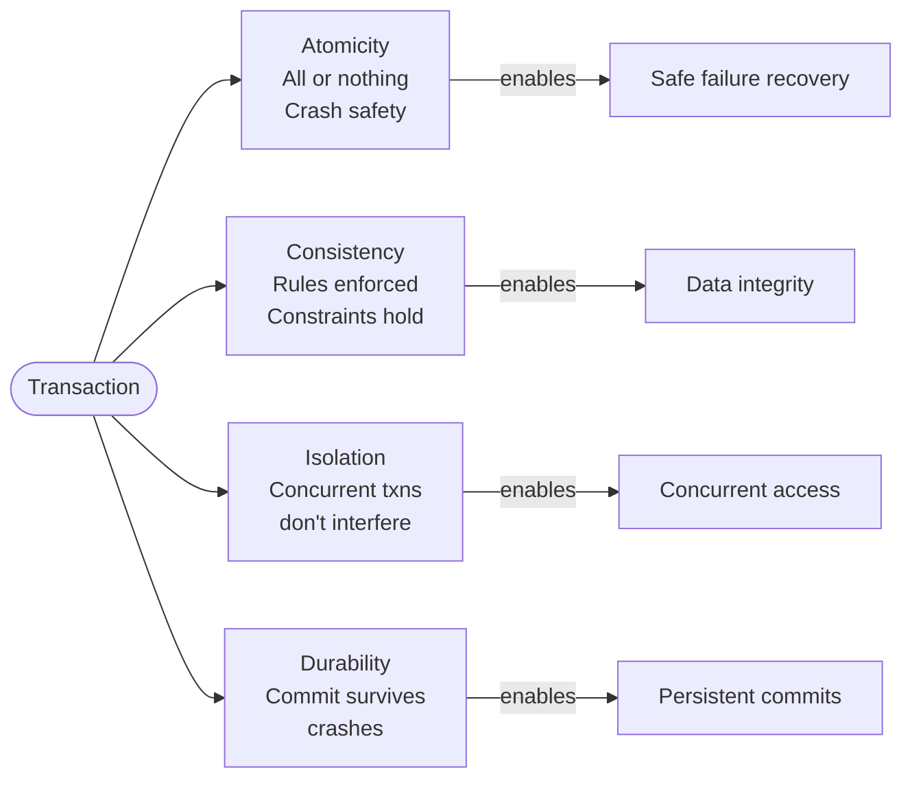

# Transactions and ACID

## Why This Topic Exists

A database that loses your bank transfer halfway through — deducting money from one account but never adding it to another — is worse than useless. It is actively dangerous. Transactions are the mechanism that prevents this. The ACID properties are the specific guarantees that transactions provide. Understanding transactions deeply separates a developer who can build any system from one who can build systems that are correct under pressure. ACID is tested in virtually every software engineering interview, and it is a concept that separates junior developers from senior ones in practice.

## Learning Objectives

- Explain what a database transaction is and why it exists
- Define each of the four ACID properties with concrete examples
- Distinguish between the four SQL isolation levels
- Understand what dirty reads, non-repeatable reads, and phantom reads are
- Know the performance trade-offs of strict isolation
- Have a conceptual understanding of distributed transactions

## Prerequisites

- [01. Relational Databases (SQL)](./01.%20Relational%20Databases%20SQL%20%28BEGINNER%29.md) — basic SQL queries and table concepts
- [03. CAP Theorem](./03.%20CAP%20Theorem%20%28INTERMEDIATE%29.md) — helpful context on consistency in distributed systems

---

## Introduction

A **transaction** is a sequence of one or more database operations (reads and writes) that are treated as a single logical unit of work. The key contract: either ALL operations in the transaction succeed, or NONE of them take effect. There is no in-between.

Transactions were invented to solve two fundamental problems:

1. **Failures:** What happens if the system crashes in the middle of a multi-step operation?
2. **Concurrency:** What happens when multiple users or processes access and modify the same data at the same time?

ACID is the set of four properties that define what "correctly implemented transactions" means.

---

## Real-World Analogy

A bank transfer is the perfect analogy.

**Operation:**
- Deduct $500 from Alice's account
- Add $500 to Bob's account

**Without transactions:**
If the system crashes after the deduction but before the addition, $500 vanishes from the world. Alice is poorer, Bob is no richer. This is catastrophic.

**With transactions:**
Both operations are wrapped in a transaction. If anything fails before the `COMMIT`, the entire operation is rolled back — Alice's $500 is returned. The transfer is all-or-nothing.

```sql
BEGIN TRANSACTION;
    UPDATE accounts SET balance = balance - 500 WHERE account_id = 'alice';
    UPDATE accounts SET balance = balance + 500 WHERE account_id = 'bob';
COMMIT;
-- If any error occurs before COMMIT, execute ROLLBACK instead
```

---

## Core Concepts: The Four ACID Properties

### Atomicity — "All or Nothing"

Atomicity guarantees that every operation within a transaction is treated as a single unit. Either all operations execute and are committed, or none of them are.

**Analogy:** An online purchase is atomic — you pay AND your order is created. If payment fails, no order is created. You cannot end up with an order and no payment, or a charge and no order.

**How it works technically:**
The database writes all changes to a transaction log (Write-Ahead Log) before applying them to the actual data. If a crash occurs, the database replays the log on recovery. If a transaction was not committed before the crash, its changes are discarded (rolled back).

```sql
BEGIN;
    INSERT INTO orders (user_id, total) VALUES (1, 99.99);
    -- Crash here? Neither INSERT commits.
    UPDATE inventory SET stock = stock - 1 WHERE product_id = 42;
COMMIT;
```

### Consistency — "Rules Are Enforced"

Consistency guarantees that a transaction brings the database from one valid state to another valid state. All defined rules (constraints, triggers, cascades) must hold before and after the transaction.

**Analogy:** A double-entry accounting system must always balance — total debits equal total credits. A transaction that would violate this (add a debit without a corresponding credit) is rejected.

**Examples of consistency rules:**
- A `NOT NULL` constraint — a transaction inserting a row without a required field fails
- A `FOREIGN KEY` constraint — a transaction creating an order for a non-existent user fails
- A `CHECK` constraint — `CHECK (balance >= 0)` prevents a transaction that would make a balance negative
- Business logic encoded as a trigger

**Important:** Consistency in ACID is different from Consistency in CAP. ACID consistency is about enforcing database invariants. CAP consistency is about whether reads return the latest write.

### Isolation — "Concurrent Transactions Don't Interfere"

Isolation guarantees that concurrent transactions execute as if they were serial — as if each transaction ran one at a time, with no interleaving. The effects of an incomplete transaction are invisible to other transactions.

**Analogy:** Two bank tellers serving customers simultaneously. Each teller sees a clean, consistent view of the accounts. The first teller's half-completed transfer is invisible to the second teller until it is committed.

Isolation is the most complex ACID property because strict isolation (full serializability) has high performance costs. Different databases offer different isolation levels — a trade-off between correctness and performance.

### Durability — "Committed Data Survives Crashes"

Durability guarantees that once a transaction is committed (the database returns success to the application), the changes are permanent. A subsequent crash, power failure, or restart will not undo committed transactions.

**Analogy:** When a bank teller stamps a transaction as complete, that record exists even if the office burns down — there are off-site backups and audit logs.

**How it works technically:**
Before a `COMMIT` returns success, the database writes the transaction data to **durable storage** — usually a Write-Ahead Log (WAL) on disk. Even if the database process crashes immediately after, the WAL allows full recovery. This is why database commits to SSD are slower than to RAM — they must wait for the physical write to complete.

---

## Visual Diagram



---

## Deep Explanation: Isolation Levels

Full isolation (serializability) means all transactions appear to run one at a time. This is safe but slow — transactions must often wait for each other. Most databases offer four standard isolation levels, trading some safety for performance:

### Isolation Level 1: READ UNCOMMITTED (lowest isolation)

A transaction can read data that another transaction has modified but not yet committed (a **dirty read**).

**Example:**
- T1 starts and sets Alice's balance to $0 (not yet committed)
- T2 reads Alice's balance → sees $0
- T1 rolls back — Alice's balance is restored to $500
- T2 made a decision based on data that never actually existed

**Problem:** Dirty reads. Almost never acceptable. No real-world financial system uses this level.

### Isolation Level 2: READ COMMITTED (default in many DBs, including PostgreSQL)

A transaction can only read data that has been committed by other transactions. No dirty reads. But two reads of the same data in the same transaction may return different values if another transaction commits in between.

**Non-repeatable read example:**
- T1 reads Alice's balance → $500
- T2 commits a transfer: Alice's balance becomes $0
- T1 reads Alice's balance again → $0 (different value!)
- T1 made a decision based on $500 but now the balance is $0

**Problem:** Non-repeatable reads. Acceptable for most web application reads, not acceptable for multi-step analytical transactions.

### Isolation Level 3: REPEATABLE READ (default in MySQL/InnoDB)

A transaction sees a consistent snapshot of the database as of the moment it started. If T1 reads a row, T2 cannot modify that row until T1 completes. No dirty reads, no non-repeatable reads.

**Phantom read example:**
- T1 counts orders WHERE user_id = 1 → 5 orders
- T2 inserts a new order for user_id = 1 and commits
- T1 counts orders WHERE user_id = 1 again → 6 orders (a "phantom" row appeared!)

**Problem:** Phantom reads. Acceptable for most transactional workloads.

### Isolation Level 4: SERIALIZABLE (highest isolation)

Transactions appear to execute in some serial order. No dirty reads, no non-repeatable reads, no phantom reads. The database uses locks or multi-version concurrency control (MVCC) to ensure this.

**Cost:** Significantly higher lock contention, lower throughput, longer transaction times. Some transactions are rolled back with a serialization failure error and must be retried.

**When to use:** Financial transactions where absolute correctness is required (seat booking, ticket sales, inventory deduction where overselling is unacceptable).

### Isolation Level Summary

| Level | Dirty Read | Non-Repeatable Read | Phantom Read | Performance Cost |
|-------|-----------|---------------------|--------------|-----------------|
| READ UNCOMMITTED | Possible | Possible | Possible | Lowest |
| READ COMMITTED | Prevented | Possible | Possible | Low |
| REPEATABLE READ | Prevented | Prevented | Possible | Medium |
| SERIALIZABLE | Prevented | Prevented | Prevented | Highest |

---

## Step-by-Step Example

**Scenario:** An airline booking system. Two users try to book the last seat on a flight simultaneously.

**Without correct isolation (READ COMMITTED):**
```sql
-- Both transactions run simultaneously:

-- Transaction 1 (User A)
BEGIN;
SELECT count FROM seats WHERE flight_id = 101 AND class = 'economy';
-- Returns: 1 (one seat left)
-- ... application code decides to book ...
UPDATE seats SET count = count - 1 WHERE flight_id = 101 AND class = 'economy';
INSERT INTO bookings (user_id, flight_id) VALUES (1, 101);
COMMIT;

-- Transaction 2 (User B) — runs concurrently
BEGIN;
SELECT count FROM seats WHERE flight_id = 101 AND class = 'economy';
-- Also returns: 1 (T1 has not committed yet)
-- ... application code decides to book ...
UPDATE seats SET count = count - 1 WHERE flight_id = 101 AND class = 'economy';
INSERT INTO bookings (user_id, flight_id) VALUES (2, 101);
COMMIT;
-- Result: seat count = -1. Both users booked. OVERBOOKING.
```

**With SERIALIZABLE isolation or optimistic locking:**

**Option A: SERIALIZABLE**
```sql
SET TRANSACTION ISOLATION LEVEL SERIALIZABLE;
BEGIN;
SELECT count FROM seats WHERE flight_id = 101 AND class = 'economy' FOR UPDATE;
-- The FOR UPDATE lock prevents T2 from reading until T1 commits
-- Only one transaction proceeds, the other waits or aborts
```

**Option B: Optimistic locking with a version column**
```sql
-- Seats table has a `version` column
SELECT count, version FROM seats WHERE flight_id = 101;
-- Gets: count=1, version=42

-- Application code checks count, then updates with version check:
UPDATE seats
SET count = count - 1, version = version + 1
WHERE flight_id = 101 AND version = 42 AND count > 0;
-- Returns rows_affected = 0 if version changed (another transaction got there first)
-- Application retries or returns "sold out"
```

---

## Distributed Transactions

What happens when a transaction spans multiple databases or services? For example:
- Deduct money from the payments database
- Update the order status in the orders database
- Reserve inventory in the inventory database

These three operations must be atomic across three different systems.

### Two-Phase Commit (2PC)

The classic approach involves a **coordinator** that manages all participants:

**Phase 1 (Prepare):**
- Coordinator asks all participants: "Are you ready to commit?"
- Each participant writes changes to its local log and replies "YES" or "NO"

**Phase 2 (Commit/Abort):**
- If all replied YES: Coordinator sends COMMIT to all participants
- If any replied NO: Coordinator sends ROLLBACK to all participants

**Problems:**
- **Blocking:** If the coordinator crashes after Phase 1 but before Phase 2, all participants are stuck with locked resources, waiting indefinitely
- **Performance:** Multiple network round trips make it slow
- **Single point of failure:** The coordinator is critical

### SAGA Pattern (Modern Alternative)

Instead of a distributed transaction, break the operation into a series of local transactions. Each step publishes an event that triggers the next step. If a step fails, compensating transactions (undo operations) run in reverse order.

```
1. PaymentService: Charge credit card → success → emit PaymentSucceeded
2. OrderService: Create order → success → emit OrderCreated
3. InventoryService: Reserve items → success → emit ItemsReserved
-- All success: done.

-- If InventoryService fails:
3. InventoryService: Reserve items → failure → emit InventoryFailed
2. OrderService: Cancel order (compensating transaction)
1. PaymentService: Refund charge (compensating transaction)
```

The SAGA pattern trades strict atomicity for availability and performance — it accepts that the system may be in an inconsistent state for a short time while compensation runs. This is the standard approach for microservices.

---

## Advantages / Disadvantages / Trade-offs

| ACID Property | Performance Cost | What You Lose Without It |
|---------------|-----------------|--------------------------|
| Atomicity | Moderate (WAL overhead) | Partial writes, data corruption on crashes |
| Consistency | Low (constraint checks) | Invalid data slips in |
| Isolation | High (locking, blocking) | Dirty reads, phantom reads, race conditions |
| Durability | Moderate (fsync on commit) | Committed data lost on crash |

**Relaxing isolation for performance:**
Most web apps use READ COMMITTED (PostgreSQL default) or REPEATABLE READ (MySQL default). Only switch to SERIALIZABLE when you have proven that lower levels cause correctness bugs for your specific workload.

---

## When to Use / When NOT to Use

**Use full ACID transactions when:**
- Financial operations (money transfers, billing, refunds)
- Inventory management where overselling is unacceptable
- Medical records, legal records, audit trails
- Any operation where partial completion causes serious harm

**Use weaker isolation (not SERIALIZABLE) when:**
- Reading data for display (user profiles, product listings) — dirty reads unlikely and their impact is low
- High-throughput write workloads where serialization conflicts would cause too many retries
- Analytics queries that scan large datasets (REPEATABLE READ is usually sufficient)

**Consider the SAGA pattern over 2PC when:**
- Transactions span multiple microservices or databases
- You need high availability and cannot tolerate 2PC's blocking behavior

---

## Common Interview Questions

**Q: What are the four ACID properties?**
Atomicity (all or nothing), Consistency (rules enforced), Isolation (concurrent transactions don't interfere), Durability (committed data survives crashes).

**Q: What is the difference between READ COMMITTED and REPEATABLE READ?**
READ COMMITTED: a transaction reads only committed data, but two reads in the same transaction may see different values (non-repeatable read). REPEATABLE READ: a transaction sees a consistent snapshot — the same row read twice always returns the same value within the transaction.

**Q: What is a dirty read?**
Reading data written by another transaction that has not yet committed. If that transaction rolls back, you read data that "never existed."

**Q: What is the difference between ACID and BASE?**
ACID: strong consistency guarantees used by relational databases. BASE: Basically Available, Soft state, Eventually consistent — used by many NoSQL systems. BASE trades strict consistency for availability and performance.

**Q: How do you handle distributed transactions without 2PC?**
The SAGA pattern: break the transaction into local steps with compensating transactions (undo operations) if any step fails.

---

## Common Beginner Mistakes

1. **Forgetting to COMMIT** — opening a transaction, doing operations, and not committing. The transaction is automatically rolled back when the connection closes, and no changes are saved.
2. **Long-running transactions** — keeping a transaction open for seconds or minutes holds locks, blocking other operations. Keep transactions short.
3. **Not handling rollback in application code** — when a transaction fails and is rolled back, the application must handle this case (retry, show error) rather than assuming success.
4. **Using READ UNCOMMITTED** — almost never correct. Do not lower isolation to improve performance without understanding what correctness you are sacrificing.
5. **Confusing ACID Consistency with CAP Consistency** — completely different concepts that happen to share a letter.

---

## Summary

A transaction is a group of operations that succeed or fail together. ACID provides four guarantees: Atomicity (all-or-nothing), Consistency (rules enforced), Isolation (concurrent transactions do not interfere), and Durability (committed data persists). Isolation levels trade correctness for performance — READ COMMITTED allows non-repeatable reads; SERIALIZABLE prevents all anomalies at a higher cost. Distributed transactions spanning multiple systems are handled via Two-Phase Commit (blocking, fragile) or the SAGA pattern (compensating transactions, eventual consistency). Understanding these trade-offs is essential for building correct, performant systems.

---

## Key Takeaways

- A transaction is all-or-nothing: either everything commits or nothing does
- ACID: Atomicity, Consistency, Isolation, Durability — the four pillars of database correctness
- Isolation levels: READ UNCOMMITTED < READ COMMITTED < REPEATABLE READ < SERIALIZABLE
- Higher isolation = better correctness, lower throughput
- Distributed transactions: 2PC is blocking and fragile; SAGAs are the modern alternative
- Never confuse ACID Consistency (data validity rules) with CAP Consistency (latest write visible)

---

## Related Topics

- [01. Relational Databases (SQL)](./01.%20Relational%20Databases%20SQL%20%28BEGINNER%29.md) — where transactions are implemented
- [03. CAP Theorem](./03.%20CAP%20Theorem%20%28INTERMEDIATE%29.md) — ACID vs BASE, consistency models
- [06. Database Sharding](./06.%20Database%20Sharding%20%28ADVANCED%29.md) — cross-shard transactions and their complexity
- [09. Distributed Databases](./09.%20Distributed%20Databases%20%28ADV%29.md) — distributed ACID transactions in Spanner and CockroachDB
- [Chapter 10: Consistency and Consensus](../10.%20Consistency%20and%20Consensus/README.md) — Paxos/Raft underpinning distributed transaction coordination
