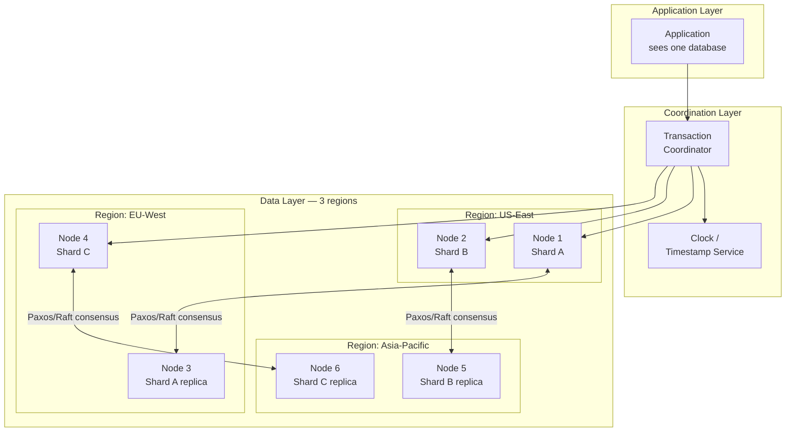

# Distributed Databases

## Why This Topic Exists

When a single database server can no longer hold all your data or process all your transactions — even with replication and sharding — you need a database that is itself distributed at its core. These systems manage data across hundreds or thousands of machines while appearing as a single database to the application. Building one is one of the hardest problems in computer science. Understanding how Google Spanner, CockroachDB, and Amazon Aurora approach this problem reveals the state of the art in database engineering and gives you the vocabulary to reason about large-scale data systems.

## Learning Objectives

- Understand what problems distributed databases solve (beyond replication and sharding)
- Explain the Two-Phase Commit protocol and its limitations
- Describe Google Spanner's approach to external consistency using TrueTime
- Explain what NewSQL is and why it matters
- Have a conceptual understanding of consensus algorithms (Paxos/Raft)
- Know the names and characteristics of major distributed database systems

## Prerequisites

- [05. Database Replication](./05.%20Database%20Replication%20%28INTERMEDIATE%29.md)
- [06. Database Sharding](./06.%20Database%20Sharding%20%28ADVANCED%29.md)
- [08. Transactions and ACID](./08.%20Transactions%20and%20ACID%20%28INTERMEDIATE%29.md)
- [03. CAP Theorem](./03.%20CAP%20Theorem%20%28INTERMEDIATE%29.md)

---

## Introduction

Manual sharding (Chapter 06) and replication (Chapter 05) solve parts of the scale problem, but they push complexity onto the application developer. The application must know which shard to query. Cross-shard transactions require custom logic. Adding or removing shards requires manual data migration. Schema changes must be orchestrated across all shards manually.

A **distributed database** automates all of this. It distributes data across many machines automatically, provides ACID transactions that span all those machines transparently, and handles node failures, shard rebalancing, and schema migrations — all without the application developer knowing which physical machines are involved. From the application's perspective, it looks like one giant database.

Building this correctly is extraordinarily hard. It requires solving: distributed transactions, clock synchronization, fault-tolerant replication, automatic failover, and consistent snapshots across machines — simultaneously. This is why only a handful of teams in the world have done it well.

---

## Real-World Analogy

Think of a single branch of a bank vs a nationwide bank.

**Single branch (traditional database):** All transactions happen at one desk. The teller always has the complete, current state of every account. Fast and consistent, but limited to one location.

**Nationwide bank (distributed database):** Thousands of branches, each with some data. When you deposit money in New York and your partner withdraws in San Francisco simultaneously, the bank must ensure the total never goes below zero — a coordination problem across locations. The nationwide bank solves this through a combination of central records, messaging between branches, and protocols for what to do when communication breaks down.

A distributed database is the engineering equivalent of this nationwide bank, except it must make thousands of decisions per second, across hundreds of machines, with no human intervention.

---

## Core Concepts

### Why Distributed Databases Are Hard

Building a distributed database means solving several hard problems simultaneously:

**1. Distributed Transactions**
A transaction that modifies data on 10 different nodes must be atomic — all 10 commit or all 10 rollback. But what if 3 nodes succeed, then a network partition occurs, and the other 7 cannot be reached? The system is now in an uncertain state.

**2. Clock Synchronization**
In a single-server database, "time" is simple — the server's clock determines the order of events. In a distributed database, each machine has its own clock, and no two clocks are perfectly synchronized. If Node A commits a transaction at "timestamp 100" and Node B commits a conflicting transaction at "timestamp 99" (but Node B's clock is behind), which wins? Getting ordering right without perfect clocks is an unsolved problem without engineering tricks (like Google's TrueTime).

**3. Consensus — Who is the Authority?**
When nodes disagree about the state of the system (a split-brain scenario), they must reach consensus. Consensus algorithms (Paxos, Raft) provide a formal way to reach agreement among a majority of nodes even when some nodes fail or become unreachable. These algorithms are theoretically elegant but operationally complex.

**4. Snapshot Isolation Across Nodes**
If you are running a read-only transaction that scans 100 shards, you need to read a consistent snapshot — the state at one point in time — not a mix of data from different times. Achieving this globally requires a global notion of "now," which brings us back to the clock problem.

---

## Visual Diagram

---

## Deep Explanation

### Two-Phase Commit (2PC) — The Classic Approach

When a transaction must commit across multiple nodes, the standard protocol is Two-Phase Commit:

**Phase 1 — Prepare:**
The coordinator sends a `PREPARE` message to all participant nodes. Each participant:
- Acquires all necessary locks
- Writes the transaction to its local Write-Ahead Log
- Replies `YES` (ready to commit) or `NO` (cannot commit, e.g., constraint violation)

**Phase 2 — Commit or Abort:**
If all participants replied `YES`: coordinator sends `COMMIT` to all. Participants apply the transaction and release locks.
If any participant replied `NO`: coordinator sends `ABORT` to all. Participants discard the transaction and release locks.

**The fatal flaw — coordinator failure:**
If the coordinator crashes after Phase 1 but before Phase 2, all participants are stuck. They have locked resources and do not know whether to commit or abort. They must wait for the coordinator to recover. This is called the **blocking problem** — 2PC is not fault-tolerant to coordinator failures.

**Performance cost:**
2PC requires 2 round trips (at minimum) between coordinator and all participants, plus disk writes. For a transaction touching 10 shards across 3 continents, this adds hundreds of milliseconds of latency.

### Consensus: Paxos and Raft

Consensus algorithms solve the problem of getting a cluster of nodes to agree on a value (or a sequence of values) even when some nodes fail.

**The problem:**
5 nodes need to agree that the new primary is Node 3. If Node 1 crashes during the vote, can the other 4 still reach a decision? If 2 nodes are partitioned from the other 3, can either side make progress?

**Raft (easier to understand):**
Raft elects a single **leader** node. All writes go to the leader. The leader replicates writes to a majority of followers. Once a majority acknowledge the write, it is committed. If the leader fails, followers elect a new leader. As long as a majority of nodes are reachable, the cluster makes progress.

**Why this matters for distributed databases:**
Each shard in a distributed database uses a consensus group (often called a Paxos or Raft group) to replicate data. A write to a shard is only committed when a majority of the shard's replicas acknowledge it. This provides fault tolerance: a shard group of 5 nodes can tolerate 2 failures.

### Google Spanner — The Gold Standard

Google Spanner (published 2012) was the first system to provide:
- External consistency (a form of serializability) across a globally distributed system
- Full SQL semantics
- Automatic sharding and rebalancing

**How Spanner handles time:**
The core insight: if two transactions have non-overlapping time windows, they can be ordered correctly. Spanner uses **TrueTime** — an API backed by atomic clocks and GPS receivers in every Google data center. TrueTime does not return an exact timestamp; it returns an interval `[earliest, latest]` within which the true time is guaranteed to lie. The uncertainty is typically ±4 milliseconds.

When Spanner wants to commit a transaction at time T, it waits until the `earliest` bound of TrueTime's current interval is past T. This ensures that any read happening after T, on any node anywhere in the world, will see this transaction's writes. This is called **commit wait**.

**Result:** External consistency — if transaction T1 commits before T2 starts (in real time), every observer sees T1's effects before T2's. This is the strongest possible consistency guarantee for a distributed system.

**Spanner's architecture:**
- Data is stored in Colossus (Google's distributed file system), not local disks
- Each row is assigned to a directory (a Paxos group)
- Transactions touching one directory use local Paxos for fast commits
- Transactions crossing directories use 2PC, coordinated between Paxos group leaders
- TrueTime bounds the uncertainty needed for ordering global transactions

### CockroachDB — Open-Source Spanner

CockroachDB is inspired by Spanner but runs on commodity hardware without atomic clocks. It provides:
- Full SQL (PostgreSQL-compatible)
- Serializable isolation by default
- Multi-region distribution
- Automatic sharding (called "ranges" — similar to Spanner's directories)
- Raft for replication within each range

**Clock synchronization without TrueTime:**
CockroachDB uses hybrid logical clocks (HLC) — a combination of physical time and logical counters. HLC cannot provide the sub-5ms certainty of TrueTime, so CockroachDB uses uncertainty intervals and retry logic for transactions that fall within the uncertainty window. This is slightly less efficient than Spanner's commit wait but correct and practical on commodity hardware.

### Amazon Aurora — A Different Approach

Aurora is not a fully distributed database in the Spanner sense. It is a cloud-native MySQL/PostgreSQL-compatible engine that separates the storage layer from the compute layer.

**Architecture:**
- The compute layer (query processing, transaction management) runs on a standard primary instance
- The storage layer is a distributed, replicated volume spread across 6 storage nodes in 3 availability zones
- Writes go to all 6 storage nodes; a quorum of 4 must acknowledge before the write is committed
- Replicas read from the shared storage (no replication lag for storage reads — only metadata lag)

**Why it is clever:**
Traditional MySQL replication copies the query log and replays it on replicas. Aurora copies only the redo log (much smaller) and uses the shared storage architecture so replicas see updates without a replica lag on the actual data. Failover takes seconds instead of minutes.

**Limitation:** Aurora still has one primary for writes. It does not scale writes horizontally like Cassandra or Spanner.

### NewSQL — The Best of Both Worlds?

NewSQL is a category of databases that aim to provide:
- SQL semantics and ACID transactions (like relational databases)
- Horizontal scalability (like NoSQL)

The term was coined around 2011. The hypothesis: the NoSQL world gave up SQL and ACID unnecessarily. With the right architecture (Raft-based replication, distributed MVCC, automatic sharding), you can have SQL semantics at NoSQL scale.

**Major NewSQL systems:**

| System | Architecture | Notes |
|--------|-------------|-------|
| Google Spanner | Paxos groups, TrueTime | Proprietary, highest consistency guarantees |
| CockroachDB | Raft groups, HLC | Open-source Spanner-inspired, PostgreSQL-compatible |
| TiDB | Raft-based, separate storage and compute | Open-source, MySQL-compatible, popular in China |
| YugabyteDB | Raft-based, PostgreSQL-compatible | Open-source, multi-cloud |
| VoltDB | In-memory, partitioned | Designed for high-throughput OLTP |
| Amazon Aurora | Shared storage, not truly distributed writes | Managed, MySQL/PostgreSQL compatible |

**The honest assessment:**
NewSQL systems make real trade-offs too. Distributed ACID transactions have higher latency than single-node transactions. Consistency comes at the cost of cross-region write latency (you must wait for a majority of nodes globally to acknowledge). For truly global systems where write latency matters more than perfect consistency, AP systems like Cassandra may still win.

---

## Step-by-Step Example

**Scenario:** Google Spanner processing a global bank transfer.

1. User in Tokyo initiates transfer: "Move $1000 from Account A to Account B."
2. Account A data lives in Spanner's Asia-Pacific Paxos group. Account B data lives in the US-East Paxos group.
3. Spanner assigns a transaction ID. The coordinator starts 2PC across the two Paxos groups.
4. Both Paxos groups run Phase 1 (Prepare), acquiring locks and writing to their local WAL. Both reply YES.
5. Spanner reads TrueTime: `[T - 4ms, T + 4ms]`. The coordinator assigns commit timestamp T.
6. **Commit wait:** Spanner waits until TrueTime's `earliest` bound exceeds T (at most ~8ms).
7. Coordinator sends COMMIT to both Paxos groups.
8. Both groups release locks and mark the transaction committed.
9. Any read anywhere in the world with a snapshot timestamp >= T will see this transaction's effects.

The entire process takes roughly 10-100ms depending on geographic distance. For a global distributed ACID transaction, this is remarkably fast.

---

## Advantages / Disadvantages / Trade-offs

| System Type | Advantage | Disadvantage |
|-------------|-----------|-------------|
| Manual sharding (Ch 06) | Full control, proven | High application complexity |
| Spanner / CockroachDB | SQL + ACID + auto-scale | Higher write latency, complex operations |
| Aurora | Managed, fast failover, low lag replicas | Single write primary, cloud-vendor lock-in |
| Cassandra (AP) | Extreme write throughput, multi-region | No ACID, limited query model |

---

## When to Use / When NOT to Use

**Use a distributed SQL database (Spanner, CockroachDB, TiDB) when:**
- You need SQL and ACID at a scale that a single server cannot handle
- Global consistency matters and you can tolerate some write latency
- You want to avoid the operational burden of manual sharding

**Use Aurora when:**
- You are on AWS and want managed PostgreSQL/MySQL with better scaling than standard RDS
- Read scaling is your bottleneck (Aurora's read replicas use shared storage, not replication lag)
- You do not need multi-master writes

**Stick with standard PostgreSQL/MySQL + manual sharding when:**
- Your team is experienced with manual sharding and has it working
- Latency requirements are extremely tight (distributed ACID transactions add overhead)
- Cost is a constraint (distributed database licenses and cloud instances are expensive)

---

## Common Interview Questions

**Q: What is the difference between replication and a distributed database?**
Replication copies the same data to multiple nodes. A distributed database automatically splits (shards) data across nodes AND handles cross-shard transactions, failover, and rebalancing transparently.

**Q: What is Two-Phase Commit and what is its main weakness?**
2PC is a protocol for committing a transaction across multiple nodes. Phase 1 asks all nodes to prepare. Phase 2 commits or aborts. The main weakness: if the coordinator fails between phases, participants hold locks indefinitely — the blocking problem.

**Q: How does Google Spanner achieve global consistency?**
TrueTime — an API backed by atomic clocks that provides bounded time uncertainty. Spanner uses commit wait (delay committing until the clock uncertainty passes) to ensure any read with a later timestamp always sees this transaction.

**Q: What is NewSQL?**
Databases that provide SQL semantics and ACID transactions with horizontal scalability — trying to combine the best of relational and NoSQL. Examples: Spanner, CockroachDB, TiDB, YugabyteDB.

---

## Common Beginner Mistakes

1. **Thinking distributed databases are always better** — they add latency, complexity, and cost. Use them only when you cannot manage with a single well-tuned server plus read replicas.
2. **Underestimating write latency** — a distributed ACID transaction requires at least 2 network round trips across all participants. For global systems, this is 100-300ms. Know your latency budget.
3. **Treating CockroachDB as "free Spanner"** — it is close, but without TrueTime, it has different edge-case behaviors under high contention.
4. **Confusing Aurora with a truly distributed write system** — Aurora still has one write primary. Its innovation is in the storage layer, not in distributed writes.

---

## Summary

Distributed databases automate what manual sharding and replication do by hand: they split data across machines, maintain consistency across those machines, handle failures, and present a single database interface to the application. The hard problems are distributed transactions (2PC's blocking problem), clock synchronization (solved by TrueTime in Spanner), and consensus (Paxos/Raft). Google Spanner is the gold standard, providing external consistency globally via atomic clocks. CockroachDB brings similar concepts to open-source commodity hardware. NewSQL is the category attempting to deliver SQL + ACID at NoSQL scale. These systems represent the frontier of database engineering and are increasingly accessible as managed cloud services.

---

## Key Takeaways

- Distributed databases automate sharding, replication, and failover — hiding distributed complexity from the application
- Two-Phase Commit provides distributed atomicity but has a blocking failure mode if the coordinator dies
- Google Spanner uses TrueTime (atomic clocks + GPS) to achieve external consistency globally
- CockroachDB achieves similar guarantees on commodity hardware using hybrid logical clocks and Raft
- NewSQL = SQL semantics + ACID + horizontal scaling
- Distributed ACID always has higher write latency than single-node — know your trade-offs before adopting

---

## Related Topics

- [06. Database Sharding](./06.%20Database%20Sharding%20%28ADVANCED%29.md) — manual sharding that distributed DBs automate
- [08. Transactions and ACID](./08.%20Transactions%20and%20ACID%20%28INTERMEDIATE%29.md) — the ACID guarantees distributed DBs must preserve
- [03. CAP Theorem](./03.%20CAP%20Theorem%20%28INTERMEDIATE%29.md) — the consistency/availability trade-offs underlying these systems
- [Chapter 08: Distributed Systems](../08.%20Distributed%20Systems/README.md) — Paxos, Raft, and consensus algorithms in depth
- [Chapter 10: Consistency and Consensus](../10.%20Consistency%20and%20Consensus/README.md) — linearizability, causal consistency, and formal consistency models
