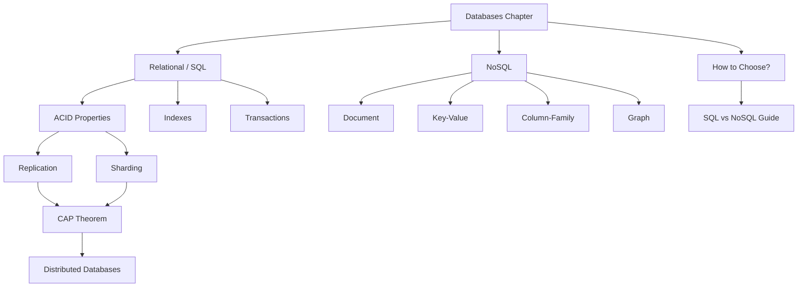

# Chapter 04: Databases

## Why This Chapter Exists

Every application that stores and retrieves data uses a database. Whether you are building a simple blog or a global payments platform, your database choices shape performance, reliability, and how easily your system scales. This chapter takes you from the basics of storing data in tables all the way through the challenges that Google and Facebook face when managing petabytes of data across hundreds of machines.

## Learning Objectives

By the end of this chapter you will be able to:

- Choose between SQL and NoSQL databases for a given problem
- Explain ACID properties in a job interview without hesitation
- Understand why distributed databases are fundamentally hard
- Recognize sharding, replication, and indexing trade-offs
- Discuss CAP theorem and what it means for real systems

## Prerequisites

Before diving in, make sure you are comfortable with:

- Chapter 01 (Basics) — what a server is, client-server model
- Chapter 03 (Scalability) — vertical vs horizontal scaling
- Basic familiarity with SQL (SELECT, INSERT, WHERE) is helpful for the SQL chapters

---

## Topics at a Glance

| File | Topic | Difficulty | Why It Matters |
|------|-------|------------|----------------|
| [01. Relational Databases (SQL)](./01.%20Relational%20Databases%20SQL%20%28BEGINNER%29.md) | SQL, tables, JOIN, ACID, indexes | Beginner | Foundation of 90% of business applications |
| [02. NoSQL Databases](./02.%20NoSQL%20Databases%20%28BEGINNER%29.md) | Document, Key-Value, Column-family, Graph | Beginner | Essential for scale and flexible data shapes |
| [03. CAP Theorem](./03.%20CAP%20Theorem%20%28INTERMEDIATE%29.md) | Consistency, Availability, Partition Tolerance | Intermediate | The framework for reasoning about distributed data |
| [04. Database Indexing](./04.%20Database%20Indexing%20%28INTERMEDIATE%29.md) | B-tree, hash indexes, query planning | Intermediate | Turns a 10-second query into a 1-millisecond query |
| [05. Database Replication](./05.%20Database%20Replication%20%28INTERMEDIATE%29.md) | Master-slave, master-master, replication lag | Intermediate | High availability and read scaling |
| [06. Database Sharding](./06.%20Database%20Sharding%20%28ADVANCED%29.md) | Horizontal partitioning, consistent hashing | Advanced | Handling data that no single server can hold |
| [07. SQL vs NoSQL Decision Guide](./07.%20SQL%20vs%20NoSQL%20Decision%20Guide%20%28BEGINNER%29.md) | Practical decision framework | Beginner | Stop picking databases by hype |
| [08. Transactions and ACID](./08.%20Transactions%20and%20ACID%20%28INTERMEDIATE%29.md) | Atomicity, isolation levels, distributed txns | Intermediate | Correctness under concurrent and failure conditions |
| [09. Distributed Databases](./09.%20Distributed%20Databases%20%28ADV%29.md) | Spanner, CockroachDB, 2PC, consensus | Advanced | Where SQL meets planet-scale distribution |

---

## Recommended Reading Order

```
Beginners (no DB experience)
  └── 01 SQL → 02 NoSQL → 07 Decision Guide

Intermediate (comfortable with SQL)
  └── 04 Indexing → 05 Replication → 08 Transactions → 03 CAP Theorem

Advanced (preparing for staff interviews)
  └── 06 Sharding → 03 CAP Theorem (revisit) → 09 Distributed Databases
```

---

## Chapter 04 Concept Map



---

## Key Vocabulary for This Chapter

| Term | One-sentence definition |
|------|------------------------|
| Schema | The structure/shape of your data (columns, types) |
| Query | A question you ask the database |
| Index | A data structure that speeds up lookups |
| Transaction | A group of operations that succeed or fail together |
| Replica | A copy of a database on another server |
| Shard | A horizontal slice of a database stored on its own server |
| Consistency | Every read sees the most recent write |
| Partition | A network split between database servers |

---

## Real-World Companies and Their Database Choices

| Company | Use Case | Database(s) |
|---------|----------|-------------|
| Instagram | User posts, follows | PostgreSQL + Redis |
| Uber | Trips, geolocation | MySQL + Cassandra |
| Netflix | User profiles, content | MySQL + Cassandra + DynamoDB |
| Twitter/X | Tweets, social graph | MySQL + Manhattan (custom) |
| LinkedIn | Professional graph | MySQL + Espresso (document) |
| Google | Global transactions | Spanner (distributed SQL) |
| Airbnb | Listings, bookings | MySQL + HBase |

---

## Related Topics

- [Chapter 03: Scalability](../03.%20Scalability/README.md) — understanding scaling before choosing a database
- [Chapter 05: Caching](../05.%20Caching/README.md) — caching sits in front of databases
- [Chapter 08: Distributed Systems](../08.%20Distributed%20Systems/README.md) — the theory underlying distributed databases
- [Chapter 10: Consistency and Consensus](../10.%20Consistency%20and%20Consensus/README.md) — deep dive into the CAP and PACELC ideas introduced here
