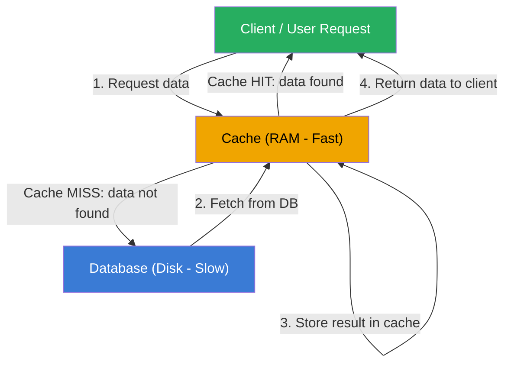

# What is Caching

## Why This Topic Exists

Every time your application needs data — a user's profile, a product price, a list of tweets — it goes somewhere to get it. Usually, that "somewhere" is a database. Databases are reliable, but they are slow compared to memory, and they get overwhelmed when millions of requests arrive per second.

Caching solves this. It is the single most powerful technique for making applications faster and databases survive. Before you design any system at scale, you must understand caching. Without it, your architecture will collapse under load.

---

## Learning Objectives

- Define a cache and explain what it stores
- Explain cache hit, cache miss, and cache hit ratio
- Describe the memory hierarchy (CPU cache → RAM → disk)
- List at least four real-world examples of caches
- Explain why caching reduces latency, reduces database load, and reduces cost

---

## Prerequisites

- Basic idea of what a database is
- Basic understanding of what latency means (slower vs faster)
- No code experience required for this file

---

## Introduction

A cache is a fast storage layer that holds a copy of data so future requests for that data can be served faster. Instead of doing the same expensive work twice, you save the result and return it directly next time.

The word "cache" comes from the French word for a hiding place. In computing, it has the same spirit — you hide a copy of something close to where you need it, so you do not have to travel far to get it.

Caching is everywhere. Your browser caches images so it does not re-download them. Your phone caches map tiles so Google Maps works offline. Your CPU caches instructions so it does not wait on slow RAM. The DNS system caches IP addresses so you do not look up `google.com` on a root server every time.

This file explains the fundamentals. Every other file in this chapter builds on top of what you learn here.

---

## Real-World Analogy

Imagine you are a student studying for exams. You need to look up the formula for the area of a circle. You could:

**Option A:** Walk to the library, find the math textbook, open to the right page, read the formula, walk back. This takes 10 minutes.

**Option B:** Write the formula on a sticky note and put it on your desk. Next time you need it, you glance at your desk. This takes 2 seconds.

Your sticky note is a cache. The library is the database. The sticky note is small (limited space), close to you (fast), and holds only what you specifically need.

Now extend the analogy:
- If the formula is on your sticky note — that is a **cache hit** (fast path).
- If it is not on your sticky note — that is a **cache miss** (you have to go to the library again, and you might write it on a new sticky note for next time).
- Your sticky note can only hold a few things — so eventually you throw away old ones to make room. That is **cache eviction**.

---

## Core Concepts

### Cache Hit

A cache hit happens when the requested data is found in the cache. This is the fast path. The application returns data immediately without touching the database or doing expensive computation.

Example: A user requests their profile. The profile is already in Redis. Response time: 1ms.

### Cache Miss

A cache miss happens when the requested data is NOT in the cache. The application must go to the slower source (database, API, disk) to get it. Often the result is then stored in the cache so the next request is a hit.

Example: A user requests a product page. The product data is not cached yet. The app queries the database (50ms), returns the result, and stores it in cache.

### Cache Hit Ratio

Cache hit ratio is the percentage of requests that result in a cache hit.

```
Cache Hit Ratio = Cache Hits / (Cache Hits + Cache Misses)
```

A hit ratio of 95% means 95 out of 100 requests are served from cache. Only 5 hit the database. This is excellent.

A hit ratio of 50% means half your requests are still hitting the database — you are not caching effectively.

**Target hit ratios in production:**
- Good: above 80%
- Excellent: above 95%
- World-class: above 99% (companies like Facebook achieve this)

### Cache Size and Eviction

Caches live in RAM, which is fast but limited and expensive. You cannot store everything. When the cache fills up, old entries must be removed to make space for new ones. This is called **eviction**. Chapter 03 covers eviction policies in detail.

### TTL (Time To Live)

Most cached data has an expiry time. A TTL of 300 seconds means the cached value is deleted after 5 minutes, and the next request will go to the database to get fresh data. This prevents stale data from living forever in the cache.

---

## Visual Diagram (Mermaid)



**Reading the diagram:** On a cache miss, the request falls through to the database. The result is saved in the cache before returning to the client. Next time the same data is requested, it is served directly from cache (cache hit) — the database is never touched.

---

## Deep Explanation

### The Memory Hierarchy

Modern computers have a hierarchy of storage. Each layer is faster and smaller than the one below it:

| Storage Layer | Speed | Size | Example |
|---------------|-------|------|---------|
| CPU Registers | ~0.3 ns | bytes | Variables in a CPU core |
| L1 Cache | ~1 ns | 32–64 KB | CPU on-chip cache |
| L2 Cache | ~4 ns | 256 KB–1 MB | CPU on-chip cache |
| L3 Cache | ~40 ns | 4–32 MB | Shared CPU cache |
| RAM | ~100 ns | 8–512 GB | Application memory, Redis |
| SSD | ~100 µs | 256 GB–8 TB | Local disk, database files |
| HDD | ~10 ms | 1–20 TB | Spinning disk storage |
| Network Storage | ~1–50 ms | Unlimited | Cloud database, S3 |

Every level in this hierarchy is a cache for the one below it. Your CPU's L1 cache is a cache for RAM. RAM is a cache for SSD. SSD is a cache for the network.

When you think about application-level caching (the kind you design in system design interviews), you are typically adding an in-memory layer (Redis, Memcached, application memory) in front of your database (SSD/HDD or cloud storage).

The speed difference is enormous. RAM access is roughly **100x faster** than SSD access, and **1000x faster** than a network database call. Caching one hot query in Redis can save 50ms on every request. At 10,000 requests per second, that is 500 seconds of CPU time saved per second.

### Types of Caches You Will Encounter

**CPU Cache (L1/L2/L3)**
Managed entirely by the CPU hardware. You do not write code for it. But you benefit from it — well-organized data structures (arrays over linked lists) are more cache-friendly because adjacent memory is pre-loaded into CPU cache.

**Browser Cache**
When you visit a website, the browser saves images, CSS files, and JavaScript files to disk. The next visit, the browser serves these assets locally instead of downloading them again. Controlled by HTTP headers like `Cache-Control` and `ETag`.

**DNS Cache**
When you type `google.com`, your operating system first checks its DNS cache. If the IP address was recently looked up, it uses the cached result. If not, it asks a DNS resolver. Without DNS caching, the internet would be slower and DNS servers would be overloaded.

**CDN Cache**
A CDN (Content Delivery Network) stores copies of static assets (images, videos, CSS) at servers around the world. A user in London gets the file from a London CDN node, not from your origin server in Virginia. Covered in depth in Chapter 07 of this chapter.

**Application Cache (the one you design)**
Your application stores frequently accessed data in a fast in-memory store like Redis or Memcached. This is what most system design interviews are about. When someone says "add a caching layer," this is what they mean.

**Database Query Cache**
Some databases (like MySQL) have a built-in query cache — they remember the result of recent SQL queries. If the same query runs again and the data has not changed, the database returns the cached result. This is being deprecated in newer MySQL versions because it has scaling problems.

---

## Step-by-Step Example

**Scenario:** A social media app displays a user's follower count. This count is read millions of times per day but updated rarely.

**Without caching:**
1. User A opens the app
2. App runs: `SELECT COUNT(*) FROM followers WHERE user_id = 123`
3. Database scans the followers table
4. Returns count: 52,000
5. This takes 40ms and uses database CPU

This happens 1,000,000 times per day. The database does the same count query 1 million times.

**With caching (Cache-Aside pattern):**
1. User A opens the app
2. App checks Redis: `GET follower_count:123`
3. Redis returns `52000` (cache hit) — takes 0.5ms
4. App returns result immediately

On the first request (cold cache):
1. Redis returns nil (cache miss)
2. App queries the database (40ms)
3. App stores result: `SET follower_count:123 52000 EX 300` (expires in 5 minutes)
4. Returns the count

**Result:** 99.9% of requests take 0.5ms instead of 40ms. The database gets ~1 query per 5 minutes per user instead of millions of queries.

---

## Advantages / Disadvantages / Trade-offs

| Aspect | Detail |
|--------|--------|
| **Advantage: Speed** | RAM access is 100–1000x faster than disk/network. Latency drops dramatically. |
| **Advantage: Reduced DB load** | 95% cache hit ratio means 95% fewer queries hit your database. Your database can handle 20x more users. |
| **Advantage: Cost savings** | Database reads are often charged per query (DynamoDB, BigQuery). Caching reduces your bill. |
| **Disadvantage: Stale data** | Cached data can be out of date. A user might see old follower counts. |
| **Disadvantage: Complexity** | You now have two sources of truth. When data changes, you must decide how to handle the cache. |
| **Disadvantage: Memory cost** | RAM is more expensive than disk. You cannot cache everything. |
| **Disadvantage: Cold start** | When the cache is empty (after a restart), all requests miss and hit the database at once. |

---

## When to Use / When NOT to Use

**Use caching when:**
- Data is read much more often than it is written (read-heavy workload)
- The computation or query is expensive
- You can tolerate slightly stale data (e.g., showing a follower count that is 5 minutes old is fine)
- You need to reduce database load or latency

**Do NOT use caching when:**
- Data changes on every write and must always be fresh (e.g., bank balance that must be exact to the cent)
- Data is unique per user and read only once (caching would just waste memory)
- Your bottleneck is not the database (sometimes the problem is your application code itself)
- Consistency guarantees require every read to see the latest write

---

## Common Interview Questions

1. **"What is a cache hit ratio and why does it matter?"**
   It is the percentage of requests served from cache. A high ratio means most requests never touch the database — your system is fast and your database is protected.

2. **"What is the difference between a cache miss and a cache hit?"**
   A hit means the data was in the cache. A miss means it was not, and you had to go to the slower source. After a miss, you typically populate the cache.

3. **"What is a TTL and why do you need it?"**
   Time To Live — an expiry time on cached data. Without TTL, cached data lives forever and becomes stale. TTL ensures data stays reasonably fresh.

4. **"Where would you add a cache in a web application?"**
   Typically between the application layer and the database. A separate Redis/Memcached cluster that the application servers talk to before falling back to the database.

---

## Common Beginner Mistakes

**Mistake 1: Caching everything**
Not all data benefits from caching. A unique one-time report query does not benefit. Cache data that is read repeatedly and changes infrequently.

**Mistake 2: Forgetting TTL**
Without a TTL, cached data never expires. If the underlying data changes, users see stale results forever. Always set a TTL appropriate to how fast the data changes.

**Mistake 3: Not handling cache misses gracefully**
If your cache goes down and your code does not fall back to the database, your entire app breaks. Design for cache failure — treat the cache as an optimization, not a requirement.

**Mistake 4: Caching highly dynamic data**
A stock price that changes every millisecond should not be cached for 5 minutes. The TTL must match the acceptable staleness of the data.

**Mistake 5: Not measuring hit ratio**
If you add a cache and never check the hit ratio, you do not know if it is actually helping. Always monitor your cache hit ratio in production.

---

## Summary

A cache is a fast storage layer that holds copies of data so future requests can be served faster without repeating expensive work. A cache hit returns data instantly. A cache miss falls through to the slower data source.

The cache hit ratio tells you how effective your cache is. The memory hierarchy explains why caching works — RAM is orders of magnitude faster than disk or network. Caches trade off some data freshness for massive gains in speed and reduced load.

Caches exist everywhere: CPU registers, browser storage, DNS, CDNs, and application-level Redis/Memcached instances you design yourself.

---

## Key Takeaways

- A cache stores results of expensive work so you do not repeat it
- Cache hit = fast path (data found in cache)
- Cache miss = slow path (must fetch from source, then populate cache)
- Cache hit ratio = hits / (hits + misses). Aim for 80%+ in production
- RAM is 100–1000x faster than disk — that is the entire reason caching works
- Always set a TTL to prevent stale data from living forever
- Caching reduces latency, reduces database load, and reduces cost
- The trade-off: speed vs freshness vs complexity

---

## Related Topics (relative markdown links)

- [Chapter Overview: Caching](./README.md)
- [Caching Strategies — how to read and write to the cache](./02.%20Caching%20Strategies%20(INTERMEDIATE).md)
- [Cache Eviction Policies — what happens when the cache fills up](./03.%20Cache%20Eviction%20Policies%20(INTERMEDIATE).md)
- [Redis Deep Dive — the most popular cache in the world](./04.%20Redis%20Deep%20Dive%20(INTERMEDIATE).md)
- [CDN as a Cache — global edge caching](./07.%20CDN%20as%20a%20Cache%20(BEGINNER).md)
- [Chapter 04: Databases](../04.%20Databases/) — what you are caching in front of
