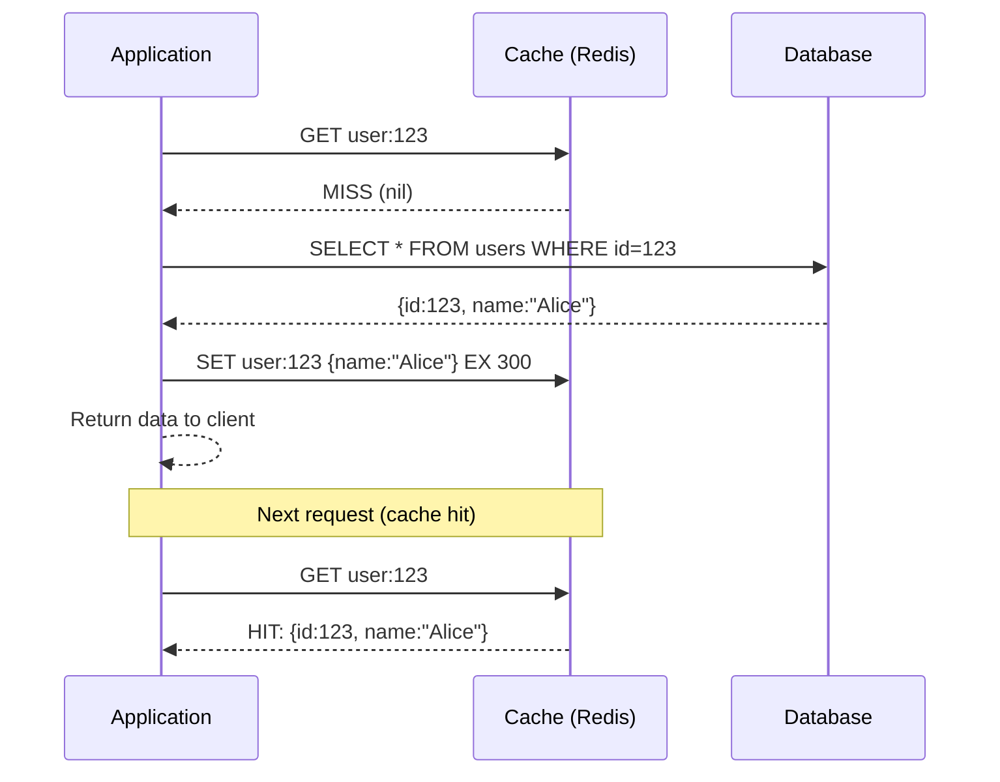
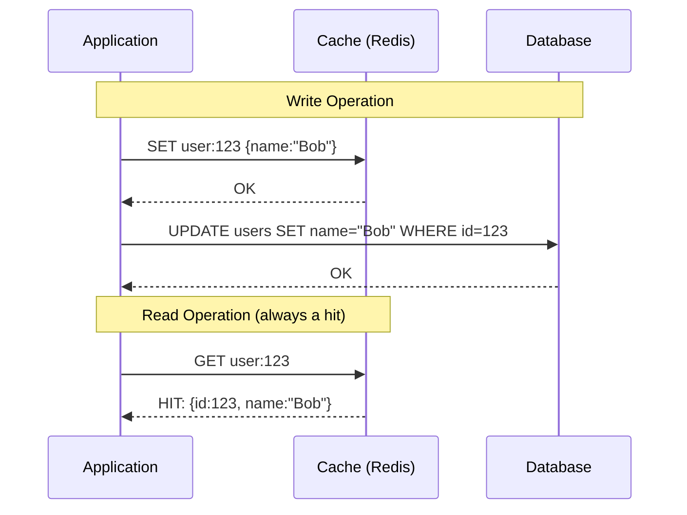
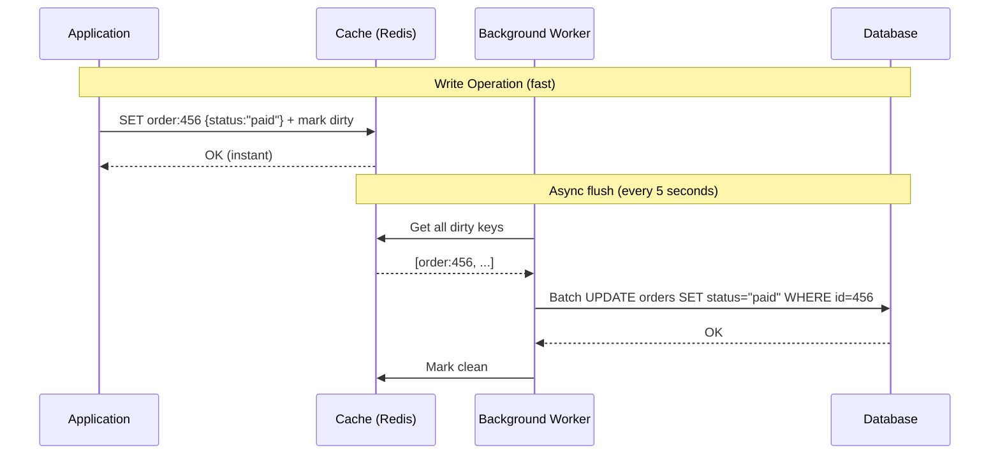
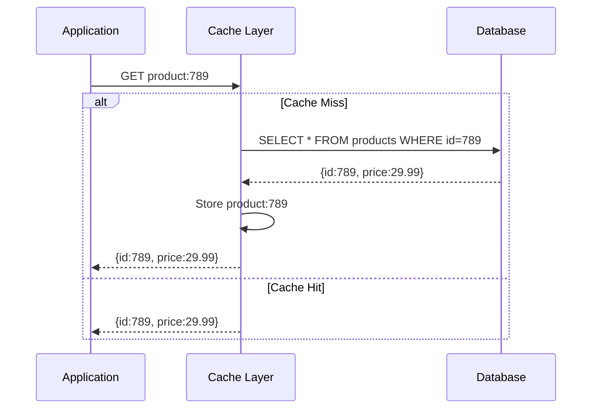
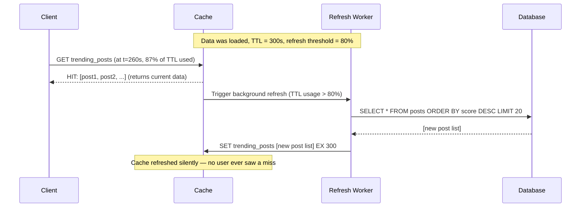

# Caching Strategies

## Why This Topic Exists

Adding a cache to your system is easy. Deciding HOW the cache interacts with your database is hard. Do you write to the cache and the database at the same time? Do you write to the cache and delay the database write? Do you let the cache handle everything automatically?

Each answer is a different caching strategy. Getting this wrong causes either stale data (users see old information) or data loss (writes never reach the database). This is the topic that separates candidates who have just used Redis from candidates who understand how caching systems are actually designed.

---

## Learning Objectives

- Name and explain all five main caching strategies
- Draw the data flow for each strategy
- Identify the trade-offs of each strategy (especially stale data risk and write complexity)
- Choose the right strategy for a given use case
- Explain the "stale data" problem and why it is central to every caching decision

---

## Prerequisites

- [What is Caching](./01.%20What%20is%20Caching%20(BEGINNER).md) — cache hits, misses, and TTL
- Basic understanding of databases (reads and writes)

---

## Introduction

When you introduce a cache, every read and write operation becomes more complex. You now have two places where data lives: the cache and the database. The question is: how do you keep them in sync?

There are five standard patterns for this. Each was invented to solve a specific problem. You need to know all five, their trade-offs, and when each one is appropriate.

The central tension in all of them is this: **speed vs. freshness vs. data safety**.

---

## Real-World Analogy

Think of a whiteboard in a busy office. The whiteboard shows the company's current headcount (data). The official record is in an HR database.

- **Cache-Aside:** People check the whiteboard. If it's blank, they call HR, write the number on the whiteboard.
- **Write-Through:** Every time HR updates the database, they also immediately update the whiteboard.
- **Write-Behind:** People update the whiteboard instantly. HR gets a batch of updates at the end of the day.
- **Read-Through:** The whiteboard itself calls HR automatically when it's blank.
- **Refresh-Ahead:** A dedicated person checks the whiteboard every hour and proactively updates it before anyone asks.

---

## Core Concepts

### The Stale Data Problem

Stale data means the cache holds old information that no longer matches the database. This happens whenever:
- Data is updated in the database but the cache is not invalidated
- TTL has not expired yet but the underlying data changed

Every caching strategy makes a choice about how to handle stale data.

---

## Strategy 1: Cache-Aside (Lazy Loading)

**The most common pattern. Used in the majority of production systems.**

The application is in charge of the cache. When reading data:
1. Check the cache first
2. If it is a hit — return it
3. If it is a miss — fetch from database, store in cache, return it

The application writes directly to the database. The cache is updated only on reads (lazily).



**On writes (update user profile):**
```
App writes to DB directly.
App either:
  - Deletes the cache key (invalidation) → next read causes a miss and refreshes
  - Updates the cache key directly
```

**Pros:**
- Simple to implement — the application controls everything
- Only loads data that is actually requested (lazy = no waste)
- Cache failure does not break the application (falls back to DB)
- Works with any database

**Cons:**
- Three round trips on a cache miss (check cache, fetch DB, write cache) adds latency for cold data
- Stale data window: after a write to DB, the old cache entry lives until TTL expires
- Cache and database can be inconsistent

**Best for:** Most web applications. User profiles, product pages, blog posts — anything that is read often and updates are tolerable with slight delay.

---

## Strategy 2: Write-Through

**Writes go to cache AND database simultaneously. The cache is always up to date.**

Every time your application writes data, it writes to both the cache and the database in the same operation. Reads always hit the cache, which is guaranteed to be fresh.



**Pros:**
- Cache is always consistent with the database (no stale data on reads)
- Read performance is excellent — almost always a cache hit
- No need to handle cache misses in normal operation

**Cons:**
- Write latency increases — every write must touch both cache and DB
- Lots of data written to cache that may never be read (cache pollution)
- If the database write fails after the cache write, they become inconsistent
- More complex error handling required

**Best for:** Systems where you cannot tolerate stale reads. A user's shopping cart, account balance display, or any data where the user must see their own writes immediately.

---

## Strategy 3: Write-Behind (Write-Back)

**Writes go to cache first. The database is updated asynchronously later.**

The application writes only to the cache. A background process batches these cache writes and flushes them to the database asynchronously (every few seconds, or when the cache entry is evicted).



**Pros:**
- Extremely fast writes — the app only waits for cache, not DB
- Reduces database write load — multiple updates can be batched into one
- Great for write-heavy workloads (logging, analytics counters, metrics)

**Cons:**
- Risk of data loss: if the cache crashes before the background flush, writes are lost
- Complexity is high — you need a reliable background worker and a way to track dirty keys
- Cache and DB can be temporarily very inconsistent
- Debugging production issues is harder

**Best for:** Write-heavy data where some data loss is acceptable. Page view counters, real-time analytics, game scores, temporary session data. NOT for financial transactions.

---

## Strategy 4: Read-Through

**The cache itself handles misses. The application only ever talks to the cache.**

In Read-Through, the application sends all read requests to the cache layer. If the cache misses, the cache itself fetches the data from the database and populates itself. The application never directly queries the database.



**How it differs from Cache-Aside:** In Cache-Aside, the application fetches from DB on a miss and populates the cache itself. In Read-Through, the cache layer does that automatically.

**Pros:**
- Cleaner application code — the app only talks to one layer (the cache)
- Cache is self-healing — misses are handled transparently
- Can be combined with Write-Through for a fully managed cache tier

**Cons:**
- First request for any key is always slow (cold miss)
- Requires a cache that supports this pattern natively (some caching libraries support it, raw Redis does not)
- Less control — harder to customize miss behavior

**Best for:** Systems using a caching library that supports it (like Spring Cache, Hibernate 2nd-level cache). E-commerce product catalogs, content management systems.

---

## Strategy 5: Refresh-Ahead

**The cache proactively refreshes data before it expires.**

Instead of waiting for a TTL expiry to cause a cache miss, the system predicts when data will expire and refreshes it in the background before the expiry happens. The user never sees a miss because the data is always warm.



**Pros:**
- Zero latency on reads — users never experience a cache miss
- Great for predictably popular data (trending pages, leaderboards)
- Smooth user experience — no spikes in latency when TTL expires

**Cons:**
- Can refresh data that is never requested again (wasted DB queries)
- Complex to implement correctly — requires background jobs and TTL monitoring
- Still has a small window of stale data between refresh and actual update

**Best for:** High-traffic read-heavy content that must always be fast. News front pages, social media trending lists, leaderboards. Anywhere you cannot afford even a single slow request.

---

## Comparison Table

| Strategy | Read Latency | Write Latency | Stale Data Risk | Data Loss Risk | Complexity | Best Use Case |
|----------|-------------|---------------|-----------------|----------------|------------|---------------|
| Cache-Aside | Fast (hit) / Slow (miss) | Fast (DB only) | Medium (TTL window) | None | Low | General purpose, most web apps |
| Write-Through | Always fast | Slow (cache + DB) | Very low | Very low | Medium | User-facing writes that must be fresh |
| Write-Behind | Always fast | Very fast (cache only) | High (async lag) | Medium (crash risk) | High | Write-heavy, loss-tolerant data |
| Read-Through | Fast (hit) / Slow (miss) | Fast (DB only) | Medium | None | Medium | Managed cache tier, library-backed |
| Refresh-Ahead | Always fast | Fast (DB only) | Low (proactive refresh) | None | High | Predictable hot data, trending content |

---

## Real Use Cases Per Strategy

**Cache-Aside:** Instagram uses this for user profiles. When you view someone's profile, the app checks cache first. Profile updates invalidate the cache key.

**Write-Through:** Online banking portals use this for account summary pages. Every transaction updates both the cache and the database simultaneously — you always see your latest balance.

**Write-Behind:** Gaming leaderboards. When a player scores points, the cache is updated instantly (fast feedback), and the database is updated in batches every few seconds. Losing 5 seconds of game scores in a crash is acceptable.

**Read-Through:** Hibernate ORM's second-level cache works this way. The application asks Hibernate for an entity, Hibernate checks the cache, and fetches from DB and caches it automatically on a miss.

**Refresh-Ahead:** Netflix's "Top 10 in Your Country" list. This list is precomputed and cached. A background job refreshes it every hour. No user ever triggers the DB query — the cache is always warm.

---

## Step-by-Step Example: Choosing a Strategy

**Scenario:** You are designing a product catalog for an e-commerce site. Products are updated by sellers occasionally (maybe once a week). Products are read by millions of shoppers every day.

Ask yourself:
1. Is this read-heavy or write-heavy? **Read-heavy** (millions of reads, few writes)
2. Can I tolerate slightly stale data? **Yes** — if a product price is 5 minutes old, that is fine
3. Is data loss acceptable? **No** — product info must eventually be consistent

**Best choice: Cache-Aside.**

Why? Read-heavy → caching reads is high value. Slight staleness is tolerable → no need for Write-Through's expensive dual writes. No data loss risk → no need for Write-Behind's complexity.

TTL of 5–10 minutes. On product update, invalidate the cache key. Simple and effective.

---

## Common Interview Questions

1. **"What is the difference between Cache-Aside and Read-Through?"**
   In Cache-Aside, the application fetches from the DB on a miss and populates the cache. In Read-Through, the cache layer handles misses automatically. The application only talks to the cache.

2. **"When would you use Write-Behind over Write-Through?"**
   Write-Behind when write speed is critical and you can tolerate some data loss (analytics, counters). Write-Through when you need strong consistency and cannot lose writes (financial data).

3. **"What is the danger of Write-Behind caching?"**
   If the cache crashes before data is flushed to the database, those writes are permanently lost. You need crash-safe queues (like Redis AOF or a message queue) to mitigate this.

4. **"Why is Cache-Aside the most popular pattern?"**
   It is simple to implement in any language, works with any database, and gives the application full control. It gracefully handles cache failures by falling back to the database.

---

## Common Beginner Mistakes

**Mistake 1: Using Write-Behind for financial data**
Write-Behind risks data loss. Never use it for anything where data loss is unacceptable (money, orders, medical records).

**Mistake 2: Forgetting to invalidate on writes in Cache-Aside**
If you update the database but forget to delete or update the cache key, users see stale data until TTL expires. Always pair database writes with cache invalidation.

**Mistake 3: Using Write-Through for all data**
Write-Through adds latency to every write. Do not use it for data that is rarely read — you are paying a write penalty for no benefit.

**Mistake 4: Confusing Cache-Aside with Read-Through**
The difference is who handles the miss — the application (Cache-Aside) or the cache layer itself (Read-Through). Stating the wrong one in an interview signals shallow understanding.

---

## Summary

Five strategies define how a cache interacts with a database. Cache-Aside is the most common and most flexible. Write-Through guarantees fresh reads at the cost of slower writes. Write-Behind maximizes write speed at the risk of data loss. Read-Through keeps application code clean by delegating miss handling to the cache. Refresh-Ahead eliminates latency spikes by proactively refreshing popular data.

Every strategy makes a trade-off between speed, freshness, complexity, and data safety.

---

## Key Takeaways

- There is no single best caching strategy — choose based on your read/write ratio, freshness requirements, and risk tolerance
- Cache-Aside is the default choice for most web applications
- Write-Through for writes that must be immediately consistent
- Write-Behind for write-heavy workloads where some loss is acceptable
- Read-Through for clean application code backed by a smart cache library
- Refresh-Ahead for predictably hot data that must always return instantly
- Every caching strategy has a stale data window — design around it

---

## Related Topics (relative markdown links)

- [What is Caching — fundamentals](./01.%20What%20is%20Caching%20(BEGINNER).md)
- [Cache Eviction Policies — when the cache fills up](./03.%20Cache%20Eviction%20Policies%20(INTERMEDIATE).md)
- [Cache Invalidation — the hardest problem](./05.%20Cache%20Invalidation%20(INTERMEDIATE).md)
- [Redis Deep Dive — implementing these strategies](./04.%20Redis%20Deep%20Dive%20(INTERMEDIATE).md)
- [Chapter 04: Databases](../04.%20Databases/) — what the cache is in front of
