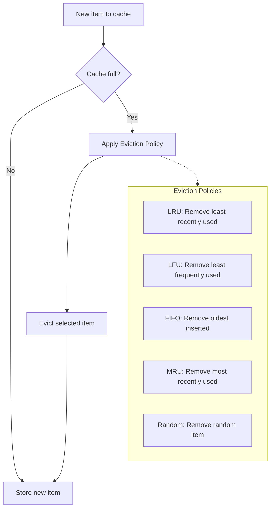

# Cache Eviction Policies

## Why This Topic Exists

A cache lives in RAM. RAM is limited and expensive. You cannot store everything in it forever. At some point, the cache fills up. When a new item needs to be stored but there is no space, the cache must throw something out to make room.

The question is: which item do you throw out?

If you evict the wrong thing, you create unnecessary cache misses and hurt performance. If you evict the right thing, you maximize your cache hit ratio. This decision is governed by eviction policies — the rules that determine what gets removed when space runs out.

This is a common interview question and a real engineering decision every time you configure Redis, Memcached, or any in-memory store.

---

## Learning Objectives

- Explain at least five cache eviction policies by name and behavior
- Understand the conceptual implementation of LRU using a doubly linked list and hashmap
- Choose the right eviction policy for a given access pattern
- Explain why LRU is the most commonly used policy
- Describe TTL and how it differs from size-based eviction

---

## Prerequisites

- [What is Caching](./01.%20What%20is%20Caching%20(BEGINNER).md) — cache hits, misses, cache size
- Basic data structures knowledge (linked lists, hashmaps) for the LRU section

---

## Introduction

Imagine you have a shelf with 10 spots. It is full. Someone brings you an 11th book. You must remove one book to make space.

Which book do you remove? You could remove:
- The one you have not touched in the longest time
- The one you read the least often
- The first one you put on the shelf
- The one you just read (sounds crazy, but sometimes useful)
- The one that has been there the longest according to its expiry date

Each of these is a different eviction policy. In caching, the "shelf" is RAM, and the "books" are cached data entries.

---

## Real-World Analogy

Think about your internet browser tabs. You have 30 tabs open (your browser's "cache" of pages). Your computer is slowing down (running out of memory). You need to close some tabs.

- **LRU:** Close the tab you have not switched to in the longest time
- **LFU:** Close the tab you have visited the fewest times this session
- **FIFO:** Close the tab you opened first, regardless of how often you use it
- **MRU:** Close the tab you just switched away from (odd, but useful in specific patterns)
- **TTL:** Tabs automatically close after 30 minutes of inactivity

---

## Core Concepts

### Size-Based vs. Time-Based Eviction

Eviction policies fall into two categories:

**Size-based eviction:** Triggered when the cache is full. An algorithm picks which item to remove to make space for a new one. LRU, LFU, FIFO, and MRU are all size-based.

**Time-based eviction (TTL):** Items expire after a fixed time period, regardless of how full the cache is. TTL is not strictly an eviction policy (it is expiration), but it achieves a similar result: removing items to keep data fresh.

In practice, both are used together. Redis, for example, uses TTL for expiration AND a size-based policy (configurable) for when maxmemory is reached.

---

## Visual Diagram (Mermaid)



---

## Deep Explanation

### Policy 1: LRU (Least Recently Used)

**Remove the item that has not been accessed for the longest time.**

The idea: if you have not used something recently, you probably will not need it soon. This is the most popular eviction policy because it matches real-world access patterns — recently used data tends to be used again (temporal locality).

**How it works conceptually:**
Every time an item is accessed, it moves to the "most recently used" end of an ordered list. When eviction is needed, remove the item at the "least recently used" end.

**LRU Implementation: Doubly Linked List + HashMap**

A naive implementation (scanning all items to find the LRU one) would be O(n). The classic O(1) implementation uses:
- A **doubly linked list** that maintains access order (head = most recent, tail = least recent)
- A **hashmap** that maps keys to linked list nodes (for O(1) lookup)

```
HashMap: { key → node_pointer }
LinkedList: [most_recent ↔ ... ↔ least_recent]

On GET(key):
  1. Hashmap lookup → O(1)
  2. Move that node to head of list → O(1)

On SET(key, value) when cache is full:
  1. Remove tail node (LRU item) → O(1)
  2. Delete from hashmap → O(1)
  3. Create new node at head → O(1)
  4. Add to hashmap → O(1)
```

This is a classic coding interview question: "Implement an LRU cache in O(1) time."

**Real-world use:** Redis's default eviction policy is `allkeys-lru` or `volatile-lru`. Most in-memory caches default to LRU.

**When to use:** Most general-purpose caching scenarios. Works well when recent access is a good predictor of future access (most applications).

---

### Policy 2: LFU (Least Frequently Used)

**Remove the item that has been accessed the fewest times.**

The idea: if something has been requested 10,000 times this week and something else has been requested twice, the second item is less valuable to keep around.

**How it works:** Track an access count per item. On eviction, remove the item with the lowest count.

**The problem with naive LFU:** An item accessed 1,000 times last year but zero times this month will never be evicted, even though it is no longer hot. This is called **cache pollution by historical frequency**.

**Improved LFU:** Use a time-decay function — frequency is weighted toward recent access. This is called LFU with aging.

**When to use LFU over LRU:**
- Long-term access patterns matter more than recent access
- You have highly skewed access (some items are always popular: think "top 10 viral videos")
- Preventing recently popular but one-time-burst items from displacing long-term regulars

**When NOT to use LFU:**
- Workloads with shifting popularity (yesterday's top item becomes irrelevant today)
- Higher implementation complexity (and memory overhead for tracking counts)

---

### Policy 3: FIFO (First In First Out)

**Remove the item that has been in the cache the longest, regardless of how often it has been used.**

The idea is simple: treat the cache like a queue. New items go in one end. When eviction is needed, remove from the other end.

**The problem:** FIFO ignores usage patterns entirely. An item added 10 minutes ago but accessed 10,000 times since then could get evicted while a recently added item that was never accessed stays.

**When FIFO makes sense:**
- Data has a natural time-to-relevance (e.g., log entries or events — old ones are less useful regardless of access)
- You want extreme simplicity and predictability
- Sequential streaming data where you will not re-access old items

**Real-world use:** Rarely used in production caching as a primary policy. More common in hardware buffers and streaming pipelines.

---

### Policy 4: MRU (Most Recently Used)

**Remove the item that was used MOST recently.**

This sounds counterintuitive. Why would you remove the thing you just used?

**When MRU is actually correct:** In sequential scan workloads. Imagine you are scanning through a 100GB database file sequentially. Every page is accessed exactly once and never again. In this case, the most recently accessed page is the least likely to be needed in the future — you are moving forward, not backward. LRU would be terrible here because it keeps the items you just read, which you will never read again.

**Practical reality:** MRU is rare in application-level caches. It is more relevant in database buffer pool management for specific access patterns (like full table scans in PostgreSQL).

---

### Policy 5: TTL (Time To Live)

**Items expire after a fixed time, regardless of how often they are accessed.**

TTL is not just a size-based eviction policy — it is also a data freshness mechanism. You set a TTL of 300 seconds on a cached user profile. After 300 seconds, Redis automatically deletes that key. The next request causes a cache miss and fetches fresh data from the database.

**Two uses of TTL:**
1. **Freshness:** Ensure stale data does not live forever. Every business has a "how old is too old" threshold.
2. **Memory management:** If access patterns are unpredictable, TTL ensures the cache turns over automatically.

**Choosing a TTL value:**
- User session data: 30–60 minutes
- User profile data: 5–15 minutes
- Product catalog: 10–30 minutes
- Real-time stock prices: 1–5 seconds
- Static configuration: 1–24 hours

**The danger of uniform TTL:** If all your cache entries have the same TTL, they all expire at the same moment. This is the **cache stampede** problem — covered in Chapter 05 of this chapter. Add random jitter (TTL ± 20%) to spread out expiration times.

---

### Policy 6: Random Replacement

**Evict a random item when the cache is full.**

Surprisingly, Random Replacement is sometimes competitive with LRU in practice, especially when access patterns are themselves somewhat random. It has the advantage of being trivially simple to implement.

Redis has a `allkeys-random` option for this reason. When you cannot afford to track access order or frequency but just need something simple, Random works acceptably.

---

## Comparison Table

| Policy | Core Idea | Time Complexity | Memory Overhead | Best For | Weakness |
|--------|-----------|-----------------|-----------------|----------|----------|
| LRU | Remove least recently used | O(1) with DLL+HashMap | Moderate (pointers) | Most web apps (temporal locality) | Scan pollution — one full scan evicts useful items |
| LFU | Remove least frequently used | O(log n) typically | High (frequency counts) | Long-term popular data, viral content | Stale popularity bias |
| FIFO | Remove oldest inserted | O(1) | Low | Sequential / time-based data | Ignores access frequency |
| MRU | Remove most recently used | O(1) | Low | Sequential scan workloads | Wrong for most apps |
| TTL | Expire after fixed time | O(1) | None | Freshness control | All-at-once expiry (stampede) |
| Random | Remove random item | O(1) | None | Simple systems, random access | Unpredictable performance |

---

## Redis Eviction Policy Configuration

Redis allows you to set `maxmemory-policy` in `redis.conf`:

```
# Maximum memory limit
maxmemory 2gb

# Eviction policy
maxmemory-policy allkeys-lru
```

Available Redis policies:

| Policy Name | Behavior |
|-------------|----------|
| `noeviction` | Return error when memory limit reached (default) |
| `allkeys-lru` | LRU on all keys |
| `volatile-lru` | LRU only on keys with TTL set |
| `allkeys-lfu` | LFU on all keys |
| `volatile-lfu` | LFU only on keys with TTL set |
| `allkeys-random` | Random eviction on all keys |
| `volatile-random` | Random eviction on keys with TTL |
| `volatile-ttl` | Evict keys with shortest TTL first |

**Recommendation for most production Redis caches:** `allkeys-lru`. It handles the common case well and is well-tested at scale.

---

## Step-by-Step Example: LRU Cache Trace

Cache capacity: 3 items. Sequence of requests: A, B, C, A, D, B, E

| Step | Request | Cache State (MRU → LRU) | Event |
|------|---------|-------------------------|-------|
| 1 | A | [A] | Cold miss, insert A |
| 2 | B | [B, A] | Cold miss, insert B |
| 3 | C | [C, B, A] | Cold miss, insert C. Cache full. |
| 4 | A | [A, C, B] | HIT! Move A to front |
| 5 | D | [D, A, C] | MISS, evict B (LRU), insert D |
| 6 | B | [B, D, A] | MISS, evict C (LRU), insert B |
| 7 | E | [E, B, D] | MISS, evict A (LRU), insert E |

Notice step 5: B was the LRU item because it was used at step 2 but not since. A was used at step 4 (recently), so it stays.

---

## Advantages / Disadvantages / Trade-offs

**LRU Advantages:** Works well for most workloads, O(1) implementation, widely supported. **Disadvantage:** Sequential scan attack — scanning all items in order thrashes the cache.

**LFU Advantages:** Better for stable popularity distributions. **Disadvantage:** Higher overhead, biased toward historical access.

**TTL Advantages:** Simple, ensures freshness. **Disadvantage:** Synchronized expiry causes stampedes without jitter.

---

## When to Use / When NOT to Use

**Use LRU when:** You have a general-purpose web application where recently accessed data is likely to be accessed again soon.

**Use LFU when:** You have a stable catalog of "always hot" items (popular products, viral posts) and you want to protect them from eviction by new items.

**Use TTL when:** Data freshness matters and you need cached entries to refresh periodically regardless of access pattern.

**Use Write-Behind with short TTL when:** Your data changes frequently and you need both freshness and performance.

**Do NOT use FIFO for general caches:** It ignores access patterns entirely and produces poor hit ratios in almost all real workloads.

---

## Common Interview Questions

1. **"How would you implement an LRU cache?"**
   Use a doubly linked list (ordered by recency) and a hashmap (key to node pointer). GET and SET are both O(1). Head = most recent, tail = LRU. On GET: move node to head. On SET when full: remove tail, insert at head.

2. **"What is the difference between LRU and LFU?"**
   LRU removes the least recently accessed item. LFU removes the least frequently accessed item. LRU is better for temporal locality (recently used things get reused). LFU is better for stable popularity (always-popular items stay cached).

3. **"What Redis eviction policy would you choose for a product catalog cache?"**
   `allkeys-lru` — product pages that are frequently viewed stay cached; rarely viewed products get evicted. TTL of 10–30 minutes ensures freshness.

---

## Common Beginner Mistakes

**Mistake 1: Confusing TTL with size-based eviction**
TTL is about data freshness (time-based). Size-based policies (LRU, LFU) are about memory management. A full cache with LRU policy AND TTLs set on entries uses both mechanisms — TTL expires entries periodically, LRU handles full-cache situations.

**Mistake 2: Not adding TTL jitter**
Setting the same TTL on all cache entries causes a synchronized expiry (cache stampede). Add ± 10–20% random jitter to spread out expirations.

**Mistake 3: Using LFU without accounting for aging**
If you use basic LFU without aging, items that were popular in the past but are no longer accessed will never be evicted. Their historical frequency count keeps them alive, polluting the cache.

**Mistake 4: Defaulting to `noeviction` in Redis**
The Redis default (`noeviction`) causes errors when memory is full. This brings your application down. Always explicitly configure `maxmemory` and `maxmemory-policy` in production.

---

## Summary

When a cache fills up, an eviction policy determines what gets removed. LRU (Least Recently Used) is the gold standard for most applications — it works because recently used data tends to be used again. LFU is better for stable popularity distributions. FIFO is simple but ignores usage. MRU is counterintuitive but correct for sequential scan workloads. TTL is about freshness — items expire after a fixed time whether or not the cache is full.

In practice, LRU is the default choice. Redis uses it by default. Add TTLs for freshness control and jitter to prevent stampedes.

---

## Key Takeaways

- Eviction is needed because caches have limited memory
- LRU: evict least recently used — best for most web apps
- LFU: evict least frequently used — best for stable popular content
- FIFO: evict oldest inserted — simple but ignores access patterns
- MRU: evict most recently used — correct for sequential scans only
- TTL: time-based expiry — use for freshness, always add jitter
- LRU implementation: doubly linked list + hashmap = O(1) GET and SET
- Configure Redis `maxmemory-policy` explicitly — never leave it as `noeviction` in production

---

## Related Topics (relative markdown links)

- [What is Caching — fundamentals](./01.%20What%20is%20Caching%20(BEGINNER).md)
- [Caching Strategies — how reads and writes interact with the cache](./02.%20Caching%20Strategies%20(INTERMEDIATE).md)
- [Cache Invalidation — when eviction is not enough](./05.%20Cache%20Invalidation%20(INTERMEDIATE).md)
- [Redis Deep Dive — configuring eviction in Redis](./04.%20Redis%20Deep%20Dive%20(INTERMEDIATE).md)
- [Chapter 08: Distributed Systems](../08.%20Distributed%20Systems/) — distributed LRU across nodes
