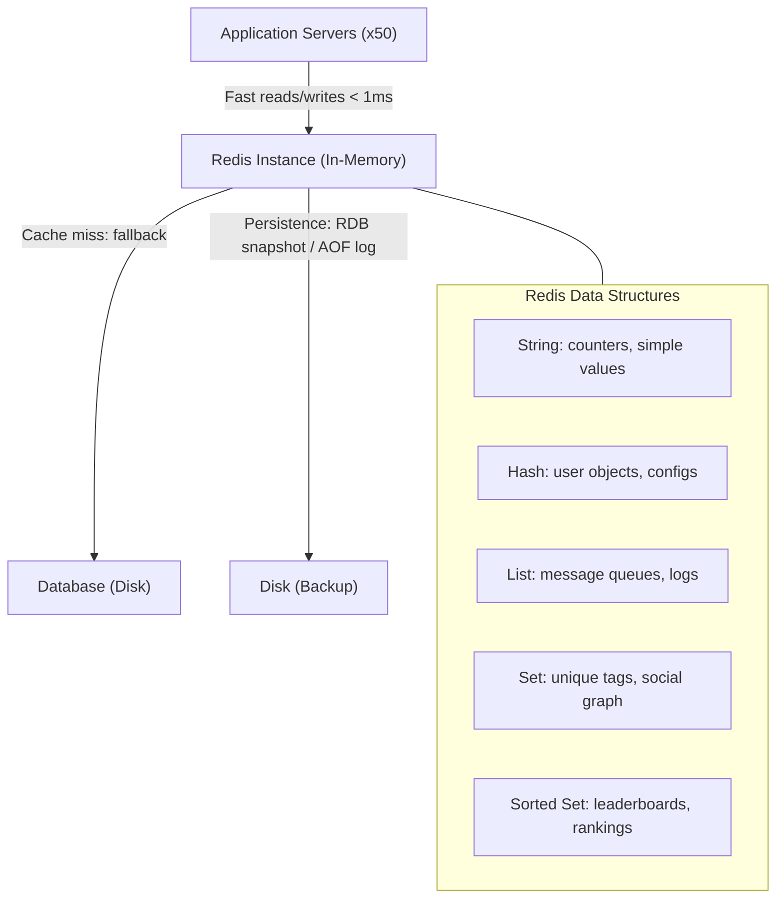

# Redis Deep Dive

## Why This Topic Exists

You will encounter Redis in almost every non-trivial system design interview. It is used at Twitter, Uber, GitHub, Stack Overflow, Snapchat, Pinterest, and thousands of other companies. It is the world's most popular in-memory data store.

But Redis is not just a simple key-value cache. It has rich data structures, persistence options, pub/sub messaging, and clustering. Knowing Redis deeply means you can propose specific, concrete solutions in interviews instead of vaguely saying "add a caching layer."

This file gives you what you need: the data structures, when to use each one, how persistence works, and how Redis is used in real production systems.

---

## Learning Objectives

- Describe what Redis is and what makes it different from other caches
- Explain all five main Redis data structures with use cases
- Understand Redis persistence options (RDB vs AOF)
- Describe Redis's roles: cache, session store, message broker, leaderboard, rate limiter
- Know how real companies (Twitter, Uber) use Redis in production
- Describe Redis Cluster and replication at a high level

---

## Prerequisites

- [What is Caching](./01.%20What%20is%20Caching%20(BEGINNER).md)
- [Caching Strategies](./02.%20Caching%20Strategies%20(INTERMEDIATE).md)
- Basic idea of what key-value stores are

---

## Introduction

Redis stands for **Remote Dictionary Server**. It was created by Salvatore Sanfilippo in 2009 and is now sponsored by Redis Ltd. The core promise: store your data in memory so access is blazing fast — typically under 1 millisecond.

What makes Redis special compared to a simple in-memory hashmap in your application?

1. **It is a separate process** — shared across multiple application servers. All 50 of your web servers can talk to one Redis instance and share the same cached data.
2. **It has rich data structures** — not just strings. Lists, sets, sorted sets, hashes, and more.
3. **It is persistent** — you can configure Redis to survive restarts by writing to disk.
4. **It is fast** — Redis processes 100,000+ operations per second on a single instance.
5. **It supports pub/sub and streams** — beyond caching, it can act as a lightweight message broker.

---

## Real-World Analogy

Think of Redis as a super-fast office filing system kept in a room right next to you (memory), compared to a regular database which is a warehouse across town (disk).

The filing system has different types of folders:
- A simple sticky note (String)
- A folder of fields and values (Hash)
- A stack of papers in order (List)
- A bag of unique tokens (Set)
- A ranked leaderboard with scores (Sorted Set)

Each type of folder has different rules and operations. You use the right folder type for the right job.

---

## Core Concepts

### Redis is Single-Threaded (for commands)

Redis processes one command at a time using a single thread. This sounds like a limitation, but it is actually a feature: no lock contention, no race conditions, fully atomic operations. Redis is so fast that a single thread can handle hundreds of thousands of operations per second.

(Note: Since Redis 6.0, I/O is multi-threaded, but command processing is still single-threaded.)

---

## Visual Diagram (Mermaid)



---

## Deep Explanation

### Redis Data Structure 1: Strings

**The simplest data type. A key maps to a single value (text, number, or binary data).**

```redis
SET user:123:name "Alice"
GET user:123:name
# → "Alice"

SET page_views 0
INCR page_views
# → 1
INCRBY page_views 100
# → 101

SET session:abc123 "user_data_json" EX 3600
# Set with TTL of 1 hour
```

**Use cases for Strings:**
- Caching serialized objects (JSON blobs): `SET product:456 "{id:456, price:29.99}"`
- Counters and rate limiters: `INCR api_calls:user:123`
- Session tokens: store a session ID that maps to a user
- Distributed locks: `SET lock:resource_x "holder" NX EX 30` (set only if not exists, with TTL)
- Feature flags: `SET feature:dark_mode "true"`

**Real example:** Twitter caches tweet content as a serialized string. The key is `tweet:{tweet_id}`, the value is the JSON-encoded tweet object. TTL of a few minutes.

---

### Redis Data Structure 2: Hashes

**A key maps to a collection of field-value pairs. Like a JSON object stored natively.**

```redis
HSET user:123 name "Alice" email "alice@example.com" age 30
HGET user:123 name
# → "Alice"

HGETALL user:123
# → {name: "Alice", email: "alice@example.com", age: "30"}

HSET user:123 age 31
# Update just one field
```

**Why use Hash instead of a String (JSON)?**
With a Hash, you can update a single field without deserializing and re-serializing the entire object. `HSET user:123 age 31` changes just the age. With a String, you would need to GET the whole JSON, parse it, change the age, and SET it back.

**Use cases for Hashes:**
- User objects: store profile fields without a separate key per field
- Configuration objects: `HSET config:app theme "dark" max_connections 100`
- Session data: store multiple session fields under one key
- Shopping cart: `HSET cart:user:123 product:456 2` (product → quantity)

**Real example:** GitHub stores repository metadata as a Redis Hash — stars, forks, open issues. Individual fields can be incremented atomically (`HINCRBY repo:456 stars 1`) without fetching the whole object.

---

### Redis Data Structure 3: Lists

**An ordered sequence of strings. Supports push/pop from both ends. Think of it as a double-ended queue.**

```redis
LPUSH notifications:user:123 "You have a new follower"
LPUSH notifications:user:123 "Your post got 100 likes"

LRANGE notifications:user:123 0 9
# → ["Your post got 100 likes", "You have a new follower"]
# Returns the 10 most recent notifications (LIFO order with LPUSH)

RPUSH queue:emails "send_welcome_email:user:456"
BLPOP queue:emails 0
# Blocking pop — waits until an item is available (queue consumer)
```

**Use cases for Lists:**
- Activity feeds: push new events, read the last N
- Task queues: RPUSH to enqueue, BLPOP for workers to consume
- Message inboxes: last 100 messages for a chat room
- Log aggregation: push log entries, periodically drain them

**Real example:** Instagram uses Redis Lists for user notification feeds. When someone likes your photo, an event is LPUSH'd to your notification list. The app reads LRANGE to display the last 20 notifications.

---

### Redis Data Structure 4: Sets

**An unordered collection of unique strings. No duplicates.**

```redis
SADD post:123:tags "python" "redis" "backend"
SADD post:123:tags "python"
# Duplicate ignored — still 3 members

SMEMBERS post:123:tags
# → {"python", "redis", "backend"}

SISMEMBER post:123:tags "redis"
# → 1 (true)

SUNION post:123:tags post:456:tags
# → union of tags from both posts

SINTERSTORE common:tags post:123:tags post:456:tags
# → intersection of tags (tags that appear in both posts)
```

**Use cases for Sets:**
- Unique visitors per page: `SADD visitors:page:home user:123` — SCARD gives unique count
- User relationships: `SADD following:user:123 user:456 user:789`
- Mutual friends: SINTER of two following sets
- Tags / categories: efficiently find intersection of tagged items
- Bloom filter approximation: membership testing

**Real example:** Uber uses Redis Sets to track which drivers are in a geographic zone. A zone's Set contains all active driver IDs in that region. When you open the Uber app, it queries the Set for your zone to show nearby drivers.

---

### Redis Data Structure 5: Sorted Sets (ZSets)

**A Set where every member has a floating-point score. Members are automatically ordered by score.**

```redis
ZADD leaderboard 9800 "player:alice"
ZADD leaderboard 12500 "player:bob"
ZADD leaderboard 7200 "player:charlie"

ZREVRANGE leaderboard 0 9 WITHSCORES
# → ["player:bob" 12500, "player:alice" 9800, "player:charlie" 7200]
# Top 10 players, descending score

ZSCORE leaderboard "player:alice"
# → 9800

ZRANK leaderboard "player:alice"
# → 1 (0-indexed rank in ascending order)

ZINCRBY leaderboard 500 "player:alice"
# → 10300 (atomically add 500 to Alice's score)
```

**Use cases for Sorted Sets:**
- Leaderboards: score-ordered rankings with O(log n) insert and O(log n + k) range query
- Rate limiting with sliding windows: use timestamps as scores
- Priority queues: items with priorities as scores, pop lowest/highest
- Feed ranking: social media posts ranked by engagement score
- Geographic proximity (with latitude/longitude encoded in score)

**Real example:** Twitter's timeline cache uses Redis Sorted Sets. Each user's home timeline is a Sorted Set where the score is the tweet timestamp. The most recent 800 tweets are stored. `ZREVRANGE` fetches the latest N tweets in O(log n + N) time.

Stack Overflow's "Hot Network Questions" is maintained as a Sorted Set updated every hour. Questions are ranked by a composite score (votes, views, age).

---

## Redis Persistence Options

Redis is in-memory, which means data is lost on restart — unless you configure persistence.

### RDB (Redis Database Backup — Snapshots)

Redis periodically writes a point-in-time snapshot of all data to a binary file (`dump.rdb`).

```
# redis.conf
save 900 1      # save if 1 key changed in 900 seconds
save 300 10     # save if 10 keys changed in 300 seconds
save 60 10000   # save if 10000 keys changed in 60 seconds
```

**Pros:** Small file size, fast restarts (single file to load), minimal I/O overhead during normal operation.

**Cons:** You lose data between snapshots. If Redis crashes at 11:59 and the last snapshot was at 11:55, you lose 4 minutes of writes.

**Best for:** Caches where occasional data loss is acceptable. If you are only caching data from a database (not the source of truth), losing 5 minutes of cache is fine — you just repopulate from the DB.

### AOF (Append-Only File)

Every write command is logged to a file in real time. On restart, Redis replays the log to reconstruct state.

```
# redis.conf
appendonly yes
appendfsync everysec   # flush to disk every second (balance of safety vs performance)
# appendfsync always   # flush every command (safest, slowest)
# appendfsync no       # let OS decide (fastest, least safe)
```

**Pros:** Much better durability. With `appendfsync always`, you lose at most one command on crash. `everysec` loses at most 1 second of writes.

**Cons:** Larger file size (grows without bound), slower restarts (must replay entire log), higher I/O overhead.

**Best for:** Redis as a primary data store (sessions, queues, anything where you cannot lose data).

### RDB + AOF Combined

You can enable both. Redis uses AOF on restart (more complete), and RDB for faster backup transfers. This is recommended for production setups that need both durability and fast restores.

---

## Redis Roles Beyond Caching

### Session Store

HTTP is stateless. Web applications store user session data (login state, shopping cart) in Redis. Every web server reads from and writes to the same Redis instance — so sessions are shared across all servers.

```redis
SET session:abc123 "{user_id: 456, cart: [...], logged_in: true}" EX 3600
```

### Rate Limiter

```redis
INCR rate:user:123:api
EXPIRE rate:user:123:api 60
# Check if > 100 → reject request
```

Increment a counter per user per minute. If it exceeds the limit, reject the request. This is the most common way to implement API rate limiting.

### Pub/Sub Message Broker

```redis
# Publisher
PUBLISH notifications:channel "{event: 'new_message', to: 'user:123'}"

# Subscriber (another server)
SUBSCRIBE notifications:channel
```

Redis Pub/Sub allows servers to broadcast messages. It is simpler than Kafka but does not persist messages — if a subscriber is offline, it misses the message.

### Distributed Lock

```redis
SET lock:payment:order:456 "server1" NX EX 30
# NX = only set if not exists
# EX 30 = auto-release after 30 seconds
```

This is the Redlock algorithm's basis. Used to ensure only one server processes a payment at a time.

---

## Redis Clustering and Replication (Brief Overview)

### Replication (Leader-Follower)

One Redis master handles writes. One or more replicas handle reads. Replicas asynchronously receive all writes from the master.

```
Master (writes) → Replica 1 (reads)
                → Replica 2 (reads)
```

If the master dies, a replica can be promoted to master (manual or using Redis Sentinel).

**Use case:** Read-heavy workloads. Replicas handle the read traffic, master handles writes.

### Redis Cluster

For horizontal scaling beyond a single instance, Redis Cluster shards data across multiple nodes. Data is divided into 16,384 hash slots. Each node owns a range of slots.

```
Node 1: slots 0–5460
Node 2: slots 5461–10922
Node 3: slots 10923–16383
```

A key's slot is determined by `CRC16(key) mod 16384`. The client routes the request to the correct node.

Covered in more detail in [Distributed Caching](./06.%20Distributed%20Caching%20(INTERMEDIATE).md).

---

## Step-by-Step Example: Twitter Timeline Cache

**Problem:** Twitter has 300 million active users. Loading a user's home timeline requires aggregating tweets from all the people they follow. Doing this on-demand from the database is too slow.

**Solution: Redis Sorted Set timeline cache**

```redis
# When user A (id: 101) posts a tweet (id: 9001):
# 1. Store the tweet content
SET tweet:9001 "{id:9001, text:'Hello world', author:101, ts:1720000000}"

# 2. For each of A's followers (users 200, 201, 202...):
ZADD timeline:200 1720000000 9001
ZADD timeline:201 1720000000 9001
ZADD timeline:202 1720000000 9001
# Score = Unix timestamp, member = tweet_id

# 3. When user 200 loads their timeline:
ZREVRANGE timeline:200 0 19
# → [9001, 8950, 8899, ...] (20 most recent tweet IDs)

# 4. Fetch tweet content for each ID (pipeline for batch fetch)
MGET tweet:9001 tweet:8950 tweet:8899 ...
```

**Result:** Reading the timeline is a Redis range query (sub-millisecond). Twitter stores up to 800 tweet IDs per user's timeline cache. Most reads never touch the database.

---

## Advantages / Disadvantages / Trade-offs

| Aspect | Detail |
|--------|--------|
| Speed | Sub-millisecond reads/writes, 100k+ ops/second on single instance |
| Rich structures | Strings, Hashes, Lists, Sets, Sorted Sets cover most caching patterns |
| Persistence | Configurable RDB/AOF — choose between performance and durability |
| Single-threaded | No lock contention, but also bounded by one CPU core for commands |
| Memory limit | Everything in RAM — expensive at large scale |
| Cluster complexity | Redis Cluster adds operational overhead |

---

## When to Use / When NOT to Use

**Use Redis when:**
- You need sub-millisecond response times
- You need data structures beyond simple key-value
- You need a shared cache across multiple application servers
- You need rate limiting, session storage, or distributed locking
- You need a lightweight pub/sub system

**Do NOT use Redis when:**
- Your dataset is larger than your available RAM budget (use a disk-based store)
- You need strong ACID transactions across multiple keys (use a relational database)
- You need complex queries (JOINs, aggregations) — Redis is not a query engine
- You need message durability guarantees (use Kafka instead of Redis Pub/Sub)

---

## Common Interview Questions

1. **"Why is Redis fast?"**
   All data is in RAM (no disk I/O). Single-threaded command processing (no lock contention). Simple data structures with O(1) or O(log n) operations.

2. **"What is the difference between RDB and AOF persistence?"**
   RDB is periodic snapshots — fast restart, but data loss between snapshots. AOF logs every write command — durable, but larger file and slower restart.

3. **"How would you use Redis for a leaderboard?"**
   Use a Sorted Set. Player scores are the ZSet scores. `ZINCRBY` atomically updates a player's score. `ZREVRANGE ... WITHSCORES` returns the top N players. O(log n) insert, O(log n + k) range query.

4. **"What Redis data structure would you use for a social graph?"**
   Sets. `SADD following:user:123 user:456`. `SINTER following:user:123 following:user:456` gives mutual friends. O(1) membership test, O(n) set operations.

---

## Common Beginner Mistakes

**Mistake 1: Storing everything as a String (JSON)**
Serializing objects to JSON strings works, but you lose the ability to update individual fields. Use Hashes for objects you need to partially update.

**Mistake 2: Not setting TTLs**
Keys without TTLs live forever. A Redis instance that slowly fills up until it crashes (or triggers eviction) is usually caused by keys without TTLs.

**Mistake 3: Not configuring maxmemory**
Without a memory limit, Redis will use all available RAM and potentially cause the server to swap or crash. Always set `maxmemory` and `maxmemory-policy`.

**Mistake 4: Using Redis Pub/Sub for durable messaging**
Redis Pub/Sub does not persist messages. If a subscriber goes offline, it misses all messages published while it was down. For durable messaging, use Kafka, RabbitMQ, or Redis Streams.

**Mistake 5: Storing large values**
Storing megabyte-sized values in Redis (like binary files or large JSON blobs) is inefficient. Redis is optimized for small-to-medium-sized values. Store large files in object storage (S3) and cache only the metadata in Redis.

---

## Summary

Redis is an in-memory data store with rich data structures. Strings for simple values and counters. Hashes for objects. Lists for queues and feeds. Sets for unique memberships and intersections. Sorted Sets for leaderboards and ranked data.

Persistence via RDB (snapshots) or AOF (write log) — choose based on your durability requirements. Redis serves as a cache, session store, rate limiter, distributed lock, and lightweight message broker. It is the most widely used in-memory store in production systems worldwide.

---

## Key Takeaways

- Redis = in-memory, sub-millisecond, with rich data structures
- String: counters, simple cached values, session tokens
- Hash: objects with updatable fields (user profiles, configs)
- List: queues, notification feeds, activity logs
- Set: unique memberships, social graph, tag intersections
- Sorted Set: leaderboards, ranked timelines, priority queues
- RDB = snapshot (performance) vs AOF = log (durability)
- Always set `maxmemory` + `maxmemory-policy` and TTLs in production
- Redis is used at Twitter (timeline), Uber (driver locations), GitHub (session store), and nearly every major web company

---

## Related Topics (relative markdown links)

- [Caching Strategies — Cache-Aside, Write-Through with Redis](./02.%20Caching%20Strategies%20(INTERMEDIATE).md)
- [Cache Eviction Policies — Redis maxmemory-policy](./03.%20Cache%20Eviction%20Policies%20(INTERMEDIATE).md)
- [Cache Invalidation — keeping Redis data fresh](./05.%20Cache%20Invalidation%20(INTERMEDIATE).md)
- [Distributed Caching — Redis Cluster](./06.%20Distributed%20Caching%20(INTERMEDIATE).md)
- [Chapter 08: Distributed Systems](../08.%20Distributed%20Systems/) — distributed consistency
- [Chapter 09: Message Queues](../09.%20Message%20Queues/) — Redis Streams vs Kafka
