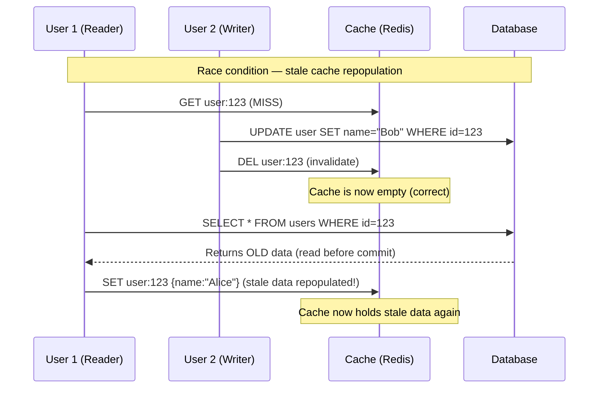
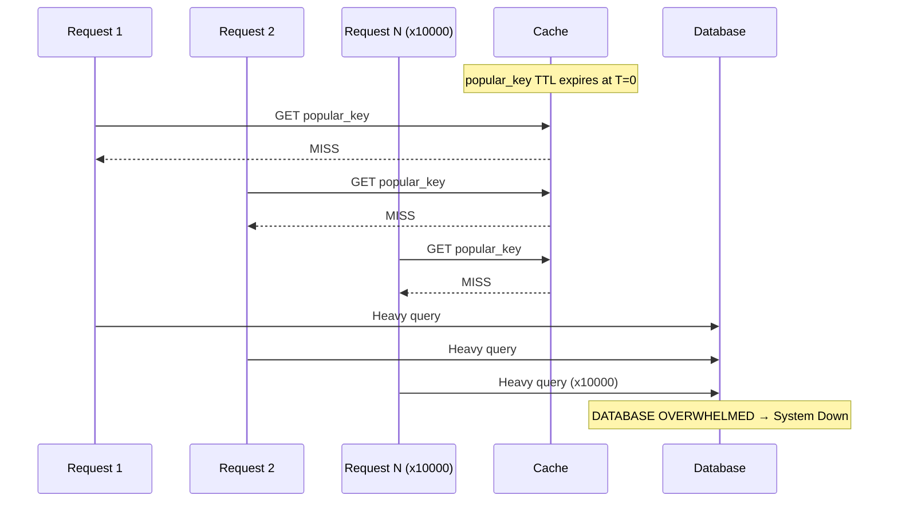

# Cache Invalidation

## Why This Topic Exists

Phil Karlton, a software engineer at Netscape, famously said:

> "There are only two hard things in Computer Science: cache invalidation and naming things."

This quote has been repeated for 30 years because it is true. Getting data into a cache is easy. Knowing when to remove or update that data — without breaking consistency or overloading your database — is one of the genuinely hard problems in distributed systems.

If you get cache invalidation wrong, your users see stale data. If your invalidation logic is too aggressive, you overload your database. If your TTLs all expire at the same time, your system crashes under a sudden flood of database queries. This file covers all of these problems and their solutions.

---

## Learning Objectives

- Explain why cache invalidation is difficult in distributed systems
- Describe the three main invalidation strategies: TTL, event-driven, and version-based
- Define the cache stampede (thundering herd) problem and explain two solutions: jitter and mutex locking
- Explain the thundering herd vs cache stampede distinction
- Describe write invalidation vs write update and when to use each

---

## Prerequisites

- [What is Caching](./01.%20What%20is%20Caching%20(BEGINNER).md)
- [Caching Strategies](./02.%20Caching%20Strategies%20(INTERMEDIATE).md)
- [Redis Deep Dive](./04.%20Redis%20Deep%20Dive%20(INTERMEDIATE).md) — helpful for code examples

---

## Introduction

Cache invalidation means deciding when to remove or update a cached entry so that users do not see data that is out of date.

It sounds simple: when the data changes, update the cache. But in a real production system:

- You might have 50 application servers, each potentially holding a local cache
- Your cache might be partitioned across 10 Redis nodes
- Multiple users might be updating the same piece of data simultaneously
- A bug in your invalidation logic might silently serve stale data for weeks
- Your cache might expire all entries at the exact same moment, crashing your database

This is why it is hard. Let us go through the problems and the solutions one by one.

---

## Real-World Analogy

Imagine a whiteboard in your office that displays the company's stock price. The "real" price is in a financial database. You update the whiteboard every morning when you arrive.

**Invalidation problems:**
- You wrote the price at 9am. By 11am the price has changed, but you have not updated the board. Visitors see stale data.
- You decide to erase the board every hour. At 10am, 100 people simultaneously crowd around your desk asking for the price. You can only answer one at a time. That is a stampede.
- Your colleague in another office has their own whiteboard with a different cached price. Now you have two caches to keep in sync.

These are the core cache invalidation problems.

---

## Core Concepts

### Why Invalidation is Hard in Distributed Systems

In a single-server app, invalidation is straightforward: update the database, delete the cache key. But production systems are distributed:

1. **Multiple app servers with local caches:** If server A caches user:123 locally, and server B processes the update, server A's local cache is now stale. You need a shared cache (Redis) to avoid this.

2. **Race conditions:** User A reads cache (stale), User B writes new data to DB and deletes cache, User A writes stale data back into cache. You now have a freshly populated cache with old data. This is called the **stale read/write race condition**.

3. **Concurrent updates:** Two users update the same item simultaneously. Which one wins? Does the cache reflect the actual latest state?

4. **Cascade invalidation:** Updating one object invalidates others. A user profile update might invalidate the profile cache, the follower feed cache, the search index cache, and the recommendation cache all at once.

---

## Visual Diagram (Mermaid)



**This is the classic stale-set race.** The writer deletes the cache, but the reader fetches from DB at the wrong moment and repopulates the cache with old data. Solution: use a short TTL so this window is bounded, or use versioned cache keys.

---

## Invalidation Strategy 1: TTL (Time To Live)

The simplest strategy: every cache entry has an expiry time. After the TTL, the entry is automatically deleted. The next request gets fresh data from the database.

**How to choose TTL:**

| Data Type | Acceptable Staleness | Recommended TTL |
|-----------|---------------------|-----------------|
| User profile | 5–10 minutes | 5–10 min |
| Product price | 1–5 minutes | 1–2 min |
| Social media post content | 10–30 minutes | 15 min |
| Trending topics | 1–5 minutes | 1 min |
| Static config | Hours | 1–24 hours |
| User session | Until logout | 30–60 min (sliding) |

**Pros:** Simple, requires no change to write paths, data is eventually consistent.

**Cons:**
- Data can be stale for up to TTL duration
- TTL expiry causes latency spikes (cache miss + DB query)
- Synchronized TTLs cause stampedes (covered below)

**The jitter solution:** Instead of `TTL = 300`, use `TTL = random_between(270, 330)`. This spreads out expiration times and prevents synchronized mass expiry.

```python
import random
ttl = 300 + random.randint(-30, 30)  # 270 to 330 seconds
redis.set(key, value, ex=ttl)
```

---

## Invalidation Strategy 2: Event-Driven Invalidation

When data changes in the database, immediately invalidate the corresponding cache key. No waiting for TTL.

**Pattern: Delete-on-write (Cache-Aside)**

```python
def update_user(user_id, new_data):
    db.update("UPDATE users SET ... WHERE id = ?", user_id, new_data)
    cache.delete(f"user:{user_id}")  # Invalidate immediately
```

The next read causes a cache miss and fetches fresh data. This is the most common approach in practice.

**Pattern: Update-on-write**

```python
def update_user(user_id, new_data):
    db.update("UPDATE users SET ... WHERE id = ?", user_id, new_data)
    cache.set(f"user:{user_id}", new_data, ex=300)  # Update immediately
```

**Delete vs Update — which is better?**

| Approach | Pros | Cons |
|----------|------|------|
| Delete (invalidate) | Safe — next read gets fresh DB data | Causes cache miss on next read (latency spike for one user) |
| Update (write) | No cache miss after write | Risk of stale write: concurrent transactions may mean your "new_data" is already outdated |

**General rule:** Prefer delete over update. It is simpler and avoids the stale write race. The small latency cost of one cache miss is worth the correctness guarantee.

**Using database change events:** More advanced systems use database CDC (Change Data Capture) — tools like Debezium watch the database transaction log and emit events whenever data changes. A downstream service listens to these events and invalidates the appropriate cache keys. This decouples invalidation from your application code.

---

## Invalidation Strategy 3: Version Numbers (Cache Keys with Versions)

Instead of invalidating by key name, change the key itself when data changes.

```python
# V1: user profile stored at "user:123:v1"
# After update: store at "user:123:v2"
# v1 entry becomes orphaned (will expire via TTL)
```

This is often used for static assets: `style.v3.css` instead of `style.css`. When the CSS changes, you deploy `style.v4.css`. Old cache entries for `v3` naturally expire without any active invalidation.

**Pros:** Zero race conditions — old and new versions coexist harmlessly. Very safe.

**Cons:** Orphaned old versions accumulate until TTL expires. Requires version tracking.

**Real use:** CDN cache invalidation (covered in Chapter 07). Browser cache busting. Feature flag versioning.

---

## The Cache Stampede (Thundering Herd) Problem

This is the most important cache invalidation failure mode to understand.

**What happens:**
1. A popular cache key expires (TTL reaches zero)
2. At that exact moment, 10,000 requests arrive (heavy traffic site)
3. All 10,000 see a cache miss
4. All 10,000 simultaneously fire a database query
5. The database is hit with 10,000 concurrent queries for the same data
6. The database collapses under load
7. Your system goes down



**Solution 1: TTL Jitter**

As mentioned above, randomize TTLs so not all copies of the same data expire at the exact same moment across different cache nodes.

**Solution 2: Mutex / Lock-Based Cache Refresh**

Only one request is allowed to fetch from the database. All others wait.

```python
def get_data(key):
    value = cache.get(key)
    if value is not None:
        return value  # Cache hit

    # Cache miss — try to acquire a lock
    lock_key = f"lock:{key}"
    acquired = cache.set(lock_key, "1", nx=True, ex=5)  # NX = only if not exists

    if acquired:
        # We got the lock — we are responsible for fetching
        value = db.query(key)
        cache.set(key, value, ex=300)
        cache.delete(lock_key)
        return value
    else:
        # Another request is already fetching — wait briefly and retry
        time.sleep(0.1)
        return get_data(key)  # Retry (will hit cache after the lock holder populates it)
```

With a mutex, only one of 10,000 requests goes to the database. The other 9,999 wait ~100ms and then hit the cache.

**Solution 3: Probabilistic Early Expiration (PER)**

Before the TTL expires, randomly decide to refresh early. The probability of refreshing increases as the TTL decreases:

```python
def should_refresh(ttl_remaining, beta=1.0):
    # As TTL shrinks, probability of early refresh increases
    # Prevents synchronized mass expiry
    return (time.time() - beta * math.log(random.random())) > (expiry_time - ttl_remaining)
```

This technique is used in systems that cannot afford any latency spike, like game servers and trading platforms.

---

## The Thundering Herd vs Cache Stampede

These terms are often used interchangeably, but they describe slightly different scenarios:

| Problem | Cause | Solution |
|---------|-------|----------|
| **Cache Stampede** | Single popular key expires simultaneously | TTL jitter, mutex lock, PER |
| **Thundering Herd** | Cache goes offline entirely (restart, failure), all traffic hits DB | Graceful startup, circuit breaker, pre-warming |

**Thundering Herd** specifically refers to what happens when a cache server restarts from scratch — the entire cache is cold and every request floods the database. Solution: **cache pre-warming** (populate the cache from the database before routing traffic to the server) and **circuit breakers** (automatically reduce traffic to the database when it is under strain).

---

## Real Production Incident Example

**Facebook, 2010 — The Thundering Herd During Deployments**

Facebook's Memcache cluster is one of the largest caches in the world. When they deployed new code, some deployments would restart cache servers. A cold cache server meant all traffic for its key range hit the database simultaneously.

Their solution: **gutter pools** — a secondary pool of cache servers that handled traffic during the brief window when a primary server was restarting. If the primary missed, the request went to the gutter pool. This acted as a buffer, preventing the thundering herd from reaching the database.

Facebook published this in their landmark paper "Scaling Memcache at Facebook" (2013). It is required reading for any senior engineer working on large-scale caching.

---

## Write Invalidation vs Write Update

When your application updates the database, you have two choices for the cache:

**Write Invalidation (Delete):**
```
DB updated → cache key deleted → next read causes miss → fresh data loaded from DB
```
Simpler. Safer. One cache miss after each write. The application that reads next bears the DB query cost.

**Write Update (Upsert):**
```
DB updated → cache key updated with new value → next read is a hit with fresh data
```
No cache miss after write. But you need to be careful — if two servers update the same key simultaneously, the cache might hold a value from an earlier write due to network reordering.

**Recommendation:** Use write invalidation (delete) unless you have a specific reason to use write update. The safety of delete outweighs the small latency cost of one cache miss.

---

## Advantages / Disadvantages / Trade-offs

| Strategy | Staleness Window | Complexity | DB Load on Miss | Risk |
|----------|-----------------|------------|-----------------|------|
| TTL only | Up to TTL duration | Very low | Gradual (spread by jitter) | Stampede if no jitter |
| Event-driven (delete on write) | Near-zero | Medium | Occasional single miss | Race condition (stale write) |
| Version-based | Near-zero | Medium-high | Occasional single miss | Orphan key accumulation |
| Mutex + TTL | Minimal | High | Single request only | Implementation bugs |

---

## When to Use / When NOT to Use

**Use TTL-only invalidation when:** Data changes infrequently and slight staleness is acceptable (product descriptions, blog posts, configuration). Always add jitter.

**Use event-driven invalidation when:** Data changes frequently and you need near-real-time consistency (user profiles, inventory counts, order status).

**Use version-based keys when:** You are deploying static assets, feature flags, or any content where you want zero risk of serving old data after a release.

**Do NOT rely on TTL alone for financial data.** Showing a stale account balance is a serious bug. Use event-driven invalidation with short TTLs as a fallback.

---

## Common Interview Questions

1. **"What is a cache stampede and how do you prevent it?"**
   A cache stampede happens when a popular cache key expires and thousands of simultaneous requests all miss and flood the database. Prevent it with TTL jitter (randomize expiry times), a mutex lock (only one request fetches from DB), or probabilistic early expiration.

2. **"What is the difference between cache invalidation and cache eviction?"**
   Eviction is removing an item because the cache is full (memory management). Invalidation is removing an item because the underlying data has changed (data freshness). Both remove items but for different reasons.

3. **"How would you handle a cache stampede on a key with 1 million requests per second?"**
   Jitter alone is not sufficient at that scale — it prevents synchronized expiry but does not help if traffic is constant. Use a combination: background refresh (Refresh-Ahead strategy) to keep the key warm, and a distributed mutex (Redis SET NX) as a fallback if the background job fails.

---

## Common Beginner Mistakes

**Mistake 1: Setting the same TTL for all keys of the same type**
All user profiles cached at 5 minutes will expire in a synchronized wave. Add randomness.

**Mistake 2: Forgetting to invalidate on delete (not just on update)**
If you delete a user account in the database but forget to delete the cache entry, that user can still appear in your app until TTL expires.

**Mistake 3: Updating the cache before the database commit is confirmed**
If the database write fails after you update the cache, the cache has newer data than the database — the opposite of what you want.

**Mistake 4: Not testing cold cache behavior**
Many teams test their app with a warm cache. When the cache is cold (server restart, new deployment), the app behaves differently. Always test cold-cache performance.

---

## Summary

Cache invalidation is hard because distributed systems have races, multiple cache copies, and high concurrency. Three strategies address different needs: TTL for simplicity and automatic freshness, event-driven delete for near-real-time consistency, and version numbers for safe deployments.

The cache stampede is the biggest operational risk: when popular TTLs expire simultaneously, thousands of requests flood the database. Prevent it with TTL jitter, mutex locks, or proactive refresh. Always test your invalidation logic under realistic traffic — bugs here cause production incidents.

---

## Key Takeaways

- "Cache invalidation is hard" is not a joke — it is a real distributed systems problem
- TTL + jitter is the simplest effective strategy for most applications
- Event-driven delete (invalidate on write) is best for near-real-time freshness
- Cache stampede = simultaneous TTL expiry under heavy traffic → database floods
- Jitter: randomize TTL by ±10–20% to prevent synchronized expiry
- Mutex: only one request fetches from DB on a miss, others wait and retry
- Prefer delete over update when writing through the cache
- Test cold cache behavior before deploying to production

---

## Related Topics (relative markdown links)

- [Caching Strategies — how writes interact with the cache](./02.%20Caching%20Strategies%20(INTERMEDIATE).md)
- [Cache Eviction Policies — eviction vs invalidation](./03.%20Cache%20Eviction%20Policies%20(INTERMEDIATE).md)
- [Redis Deep Dive — implementing invalidation in Redis](./04.%20Redis%20Deep%20Dive%20(INTERMEDIATE).md)
- [Distributed Caching — invalidation across multiple cache nodes](./06.%20Distributed%20Caching%20(INTERMEDIATE).md)
- [Chapter 10: Consistency and Consensus](../10.%20Consistency%20and%20Consensus/) — strong vs eventual consistency
