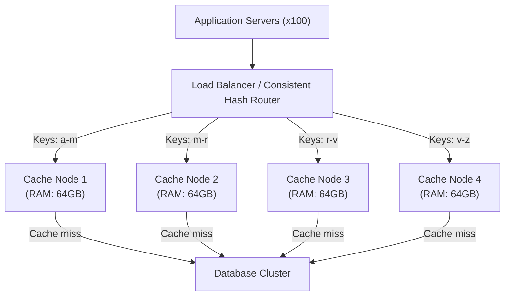

# Distributed Caching

## Why This Topic Exists

A single Redis server can handle hundreds of thousands of operations per second and store gigabytes of data. That sounds like a lot — until you are building a system that serves 100 million users.

At that scale, a single cache server is:
- A **single point of failure** — when it goes down, your entire cache is gone
- A **bottleneck** — one server cannot handle the traffic
- **Memory-limited** — one server can only hold so much data

The solution is distributing the cache across many nodes. But that introduces new problems: how do you decide which node holds which data? What happens when a node fails? What if one key gets 10 million requests while others get 100?

This file covers the architecture and engineering decisions behind distributed caching — the kind used at companies like Facebook, Twitter, and Netflix.

---

## Learning Objectives

- Explain why a single cache server is insufficient at large scale
- Describe consistent hashing and how it distributes keys across nodes
- Explain the difference between Redis Cluster and Memcached cluster
- Describe how cache replication works and why it matters
- Define the hot key problem and explain three solutions
- Understand cache node failure scenarios and recovery

---

## Prerequisites

- [What is Caching](./01.%20What%20is%20Caching%20(BEGINNER).md)
- [Redis Deep Dive](./04.%20Redis%20Deep%20Dive%20(INTERMEDIATE).md)
- [Cache Invalidation](./05.%20Cache%20Invalidation%20(INTERMEDIATE).md)
- Basic understanding of hashing functions

---

## Introduction

Distributed caching means spreading your cache data across multiple servers (nodes) so that:
1. The total cache capacity is the sum of all nodes' memory
2. Traffic is distributed across nodes (no single bottleneck)
3. If one node fails, only a fraction of the data is lost (not everything)

The key challenge is **data placement**: given a cache key, which node stores it? The answer must be consistent — every application server asking for the same key must route to the same cache node. And it must be efficient — ideally no extra network hops to find the right node.

---

## Real-World Analogy

Imagine a library with 10 branches across the city. Every book needs to be stored somewhere.

The librarian could use **simple modular hashing**: `branch = book_id % 10`. Book 47 goes to branch 7. Simple and consistent.

But what if you close branch 7? Now `book_id % 9` means almost every book moves to a different branch. Every librarian has to completely reorganize their shelves. That is catastrophic.

**Consistent hashing** solves this: books are assigned to branches on a circular ring. Closing one branch only disrupts the books that were in that branch — all other books stay where they are.

---

## Core Concepts

### Why Simple Hashing Fails

The naive approach to distributing keys across N cache nodes:

```
node_index = hash(key) % N
```

This works until the number of nodes changes (adding a node or one fails). If N changes from 4 to 5:
- `hash("user:123") % 4 = 3` (was on node 3)
- `hash("user:123") % 5 = 2` (now on node 2)

Almost every key moves to a different node. The entire cache becomes invalid. All traffic floods your database simultaneously — the ultimate thundering herd.

This is exactly why consistent hashing was invented.

---

## Visual Diagram (Mermaid)



---

## Deep Explanation

### Consistent Hashing

Consistent hashing places both keys and nodes on a virtual ring (a circular space of hash values, typically 0 to 2^32).

1. Each cache node is hashed to a position on the ring
2. Each key is hashed to a position on the ring
3. A key is stored on the first node encountered when moving clockwise from the key's position

**Adding a node:** Only the keys between the new node and its predecessor move. All other keys are unaffected. ~1/N of keys are remapped.

**Removing a node:** Only the keys on the failed node need to be re-fetched from the database. All other keys remain on their nodes.

**Virtual nodes (vnodes):** To prevent uneven distribution, each physical node is mapped to multiple positions on the ring (e.g., 150 virtual nodes per physical node). This creates a more uniform distribution of keys.

```
Physical Node A → Hashed to positions [23, 201, 456, 789, ...]  (150 vnodes)
Physical Node B → Hashed to positions [11, 89, 344, 612, ...]   (150 vnodes)
Physical Node C → Hashed to positions [55, 178, 501, 901, ...]  (150 vnodes)
```

When Node A fails, its 150 vnodes' key ranges are distributed across B and C — not just one of them. Load is spread evenly.

Redis Cluster uses a simpler variant: 16,384 **hash slots** instead of a full ring. Each key maps to `CRC16(key) mod 16384`, and each node owns a range of slots. Adding/removing nodes means redistributing slot ownership.

---

### Redis Cluster Architecture

Redis Cluster is Redis's built-in distributed caching solution. It provides:

- **Horizontal sharding** across up to 1000 nodes
- **Automatic failover** via a primary-replica model
- **16,384 hash slots** for key distribution

```
Cluster of 6 nodes (3 primaries + 3 replicas):

Primary 1: slots 0–5460      ← Replica 1 (hot standby)
Primary 2: slots 5461–10922  ← Replica 2 (hot standby)
Primary 3: slots 10923–16383 ← Replica 3 (hot standby)
```

**How a request works:**
1. Client computes `slot = CRC16("user:123") mod 16384` → slot 3822
2. Client knows node 1 owns slots 0–5460
3. Client connects directly to node 1

If the client is wrong about which node owns a slot, the node replies with a `MOVED` redirect pointing to the correct node. The client caches this routing table.

**Limitations of Redis Cluster:**
- Multi-key operations (`MGET`, `MSET`) only work if all keys hash to the same slot. Use hash tags to force co-location: `user:{123}:profile` and `user:{123}:settings` both hash the `{123}` part, so they land on the same node.
- Transactions (`MULTI/EXEC`) only work within a single node.
- More operational complexity than a single Redis instance.

---

### Memcached Cluster

Memcached is an alternative to Redis for pure caching (no persistence, simpler data model). Memcached is stateless — it does not have built-in clustering. The client is responsible for key distribution.

**Memcached architecture:**
- Client libraries use consistent hashing to route keys to the right Memcached node
- Nodes do not communicate with each other
- Adding/removing nodes is handled entirely by the client

**Redis Cluster vs Memcached Cluster:**

| Feature | Redis Cluster | Memcached Cluster |
|---------|---------------|-------------------|
| Data Structures | Full Redis support | Strings only |
| Clustering Built-in | Yes | No (client-side) |
| Replication | Yes (primary-replica per shard) | No |
| Persistence | Optional (RDB/AOF) | No |
| Memory efficiency | Moderate | Excellent |
| Operational complexity | High | Low |

**When to choose Memcached:** Very large deployments where you only need simple string caching, maximum memory efficiency, and want to avoid Redis Cluster's complexity. Facebook's original TAO system used Memcached for this reason.

---

### Cache Replication

Each shard in a distributed cache can have replicas (copies). A primary node handles writes, and one or more replica nodes handle reads and serve as hot standbys.

**Why replication:**
1. **Read scaling:** Replicas handle read traffic, reducing load on the primary
2. **High availability:** If the primary fails, a replica is promoted. Cache data is not lost.
3. **Disaster recovery:** Cross-region replicas protect against datacenter failure

**Replication lag:** Replicas are updated asynchronously. There is a brief window where a replica holds slightly older data than the primary. For caches, this is usually acceptable — the data is "close enough."

**Redis Sentinel:** For single-instance Redis with replication, Redis Sentinel monitors the primary and automatically promotes a replica if the primary fails. This provides automatic failover without the full complexity of Redis Cluster.

---

### Cache Node Failure

What happens when a cache node fails in a distributed cache?

**Scenario:** Node 2 (holding 25% of your cache data) goes down.

**Immediate effect:**
- All requests for keys on Node 2 are cache misses
- 25% of your traffic suddenly hits the database
- If your database can handle a 25% traffic spike — acceptable
- If not — cascading failure

**Mitigation strategies:**

1. **Replication:** Each node has a replica. On failure, the replica serves traffic with minimal disruption.

2. **Consistent hashing minimizes remap:** Only the keys on the failed node miss. The other 75% of traffic is unaffected. Compare this to simple modular hashing where all keys would be affected.

3. **Circuit breaker:** If a cache node is slow or unavailable, do not wait for timeouts. Detect failure fast and either use a replica or fall back to the database with rate limiting.

4. **Cache warm-up:** When a replacement node comes online, pre-populate it from the database or from a replica before routing traffic to it.

---

### The Hot Key Problem

In a distributed cache, consistent hashing distributes keys evenly — in theory. But in practice, some keys are much hotter than others.

**Example:** Justin Bieber's Twitter account has 100 million followers. Every tweet he posts triggers 100 million notifications — all routing to the cache key for his account. Meanwhile, an average user's key gets hit a few hundred times per day.

A single hot key can receive 90% of all cache traffic on one specific node, while other nodes sit idle. The hot node becomes a bottleneck.

**Solution 1: Key replication (local caching)**

On application servers, maintain a small in-process cache (a simple HashMap in memory). Cache the most popular keys locally for 1–5 seconds. This absorbs hot key traffic at the application layer before it even reaches Redis.

```python
local_cache = {}  # In-process cache on each app server

def get_user(user_id):
    key = f"user:{user_id}"
    
    # L1: local in-process cache (1 second TTL)
    if key in local_cache and local_cache[key]['ts'] > time.time() - 1:
        return local_cache[key]['data']
    
    # L2: Redis distributed cache
    value = redis.get(key)
    if value:
        local_cache[key] = {'data': value, 'ts': time.time()}
        return value
    
    # L3: Database
    value = db.query(key)
    redis.set(key, value, ex=300)
    local_cache[key] = {'data': value, 'ts': time.time()}
    return value
```

If you have 100 app servers and each caches the hot key locally for 1 second, the hot key receives 1 Redis read per app server per second — 100 total — instead of millions.

**Solution 2: Sharding the hot key**

Distribute a single hot key across multiple nodes using a suffix:

```python
def get_hot_key(key, shard_count=10):
    shard = random.randint(0, shard_count - 1)
    sharded_key = f"{key}:shard:{shard}"
    return redis.get(sharded_key)
```

Now `user:bieber` traffic is split across 10 different nodes. Each node gets 1/10 of the traffic.

**Solution 3: CDN for extremely hot read-only data**

If the hot key is read-only (a configuration value, a global setting, a famous user's profile), push it to the CDN. CDN serves it from edge nodes worldwide, completely bypassing your cache cluster.

---

### Facebook's TAO — The World's Largest Cache

Facebook's "The Associations and Objects" (TAO) system is a distributed caching system built on top of Memcache that serves Facebook's social graph. At its peak, it processed billions of reads per second.

**Key design decisions:**
- **Two-level hierarchy:** Regional caches (per-country) backed by a master cluster. Reads go to the regional cache first.
- **Leader-follower replication:** Changes propagate from master to regional caches asynchronously. Slight staleness is acceptable on Facebook ("eventual consistency" — you might see a like count that is 1 second old).
- **Read-heavy optimization:** Facebook's social graph is 99.9% reads. TAO is designed almost entirely around read performance.
- **Gutter pools:** When a primary cache server fails, requests fall through to a "gutter pool" — a smaller backup cache cluster that absorbs the traffic while the primary recovers. This prevents thundering herd against the database.

This is the reference architecture for large-scale distributed caching. The paper "Scaling Memcache at Facebook" (USENIX NSDI 2013) is essential reading.

---

## Step-by-Step Example: Adding a Cache Node

**Setup:** You have 4 Redis Cluster nodes. Node 3 is consistently 90% memory utilized. You need to add Node 5.

**Before adding Node 5:**
```
Node 1: slots 0–4095
Node 2: slots 4096–8191
Node 3: slots 8192–12287  ← 90% memory, needs relief
Node 4: slots 12288–16383
```

**Adding Node 5 (takes slots from Node 3 and Node 4):**
```
Node 1: slots 0–4095     (unchanged)
Node 2: slots 4096–8191  (unchanged)
Node 3: slots 8192–10239 (reduced, relief achieved)
Node 4: slots 10240–13311 (reduced)
Node 5: slots 13312–16383 (new node receives slots)
```

**What happens during the migration:**
1. Redis moves keys in the affected slot range from old nodes to Node 5
2. Clients receive `MOVED` or `ASK` redirects during the transition
3. After migration, clients update their routing table
4. Traffic distributes to Node 5 automatically

Only the keys in the migrated slots are affected. All other keys continue to be served normally with no interruption.

---

## Advantages / Disadvantages / Trade-offs

| Aspect | Single Cache Node | Distributed Cache Cluster |
|--------|-------------------|--------------------------|
| Capacity | Limited to one machine's RAM | Scales horizontally (add nodes) |
| Throughput | Limited to one machine | Scales with node count |
| Failure impact | Total cache loss | Partial cache loss (1/N data) |
| Latency | Single hop | Single hop (consistent hashing) |
| Operational complexity | Very simple | High (monitoring, rebalancing, failover) |
| Cost | Low | High (multiple machines) |

---

## When to Use / When NOT to Use

**Use distributed caching when:**
- Your dataset exceeds one server's RAM
- Your request volume exceeds one server's throughput (~100k ops/sec for Redis)
- You need high availability (the cache must survive node failures)
- You are building a system for millions of concurrent users

**Do NOT use distributed caching when:**
- Your cache fits comfortably on a single server (start simple, scale when needed)
- You are early-stage (distributed caches add massive operational complexity)
- You need strong cross-key transactions (Redis Cluster does not support multi-key operations across slots)

---

## Common Interview Questions

1. **"Why is consistent hashing better than modular hashing for distributed caches?"**
   With modular hashing, adding or removing one node remaps nearly all keys. With consistent hashing, only the keys on the affected node (~1/N of total keys) need to be re-fetched. This prevents the thundering herd that would otherwise hit your database.

2. **"What is the hot key problem and how do you solve it?"**
   A hot key is one key that receives disproportionately high traffic, overwhelming the single node that holds it. Solutions: local in-process caching on app servers (absorbs traffic before Redis), key sharding (distribute across multiple nodes with a suffix), or CDN for read-only hot data.

3. **"How does Redis Cluster shard data?"**
   Redis Cluster uses 16,384 hash slots. Each key maps to `CRC16(key) mod 16384`. Each node owns a range of slots. Clients route requests directly to the correct node using a cached routing table. If a request goes to the wrong node, the node replies with a `MOVED` redirect.

---

## Common Beginner Mistakes

**Mistake 1: Using modular hashing for a dynamic cluster**
`hash(key) % N` is fine for a fixed-size cluster. Any change to N invalidates your entire cache. Use consistent hashing for any cluster that might grow or shrink.

**Mistake 2: Ignoring the hot key problem**
Assuming consistent hashing distributes load evenly is wrong. Access patterns are skewed. Always monitor per-node traffic and have a hot key mitigation strategy ready.

**Mistake 3: Not planning for node failure**
A distributed cache with no replication means a node failure causes an instantaneous 1/N-sized thundering herd. Always replicate each shard.

**Mistake 4: Multi-key operations across slots in Redis Cluster**
`MGET user:123 user:456` fails in Redis Cluster if those keys hash to different slots. Use hash tags (`user:{123}:profile` and `user:{123}:cart`) to co-locate related keys.

---

## Summary

A single cache server cannot scale to production traffic at large companies. Distributed caching spreads data across many nodes using consistent hashing, which minimizes disruption when nodes are added or removed. Redis Cluster provides built-in sharding with 16,384 hash slots and per-shard replication. The hot key problem — where one key receives disproportionate traffic — is solved with local caching, key sharding, or CDN offloading. Facebook's TAO system exemplifies these patterns at extreme scale.

---

## Key Takeaways

- Modular hashing (`% N`) breaks when N changes — use consistent hashing instead
- Consistent hashing: only ~1/N keys remapped on node change vs nearly 100% for modular hashing
- Redis Cluster: 16,384 slots, each node owns a slot range, clients route directly
- Replication per shard ensures high availability — one node failure ≠ total cache loss
- Hot key problem: one key overwhelms one node. Solve with local caching, key sharding, or CDN
- Distributed caching adds significant operational complexity — only use it when you need it
- Facebook TAO: two-tier regional caching, gutter pools, eventual consistency — the reference for extreme-scale caching

---

## Related Topics (relative markdown links)

- [Redis Deep Dive — Redis Cluster details](./04.%20Redis%20Deep%20Dive%20(INTERMEDIATE).md)
- [Cache Invalidation — invalidation across distributed nodes](./05.%20Cache%20Invalidation%20(INTERMEDIATE).md)
- [Cache Eviction Policies — eviction in distributed context](./03.%20Cache%20Eviction%20Policies%20(INTERMEDIATE).md)
- [Chapter 06: Load Balancing](../06.%20Load%20Balancing/) — routing to the right cache node
- [Chapter 08: Distributed Systems](../08.%20Distributed%20Systems/) — consistency in distributed caches
- [Chapter 11: Reliability and Fault Tolerance](../11.%20Reliability%20and%20Fault%20Tolerance/) — handling node failures
