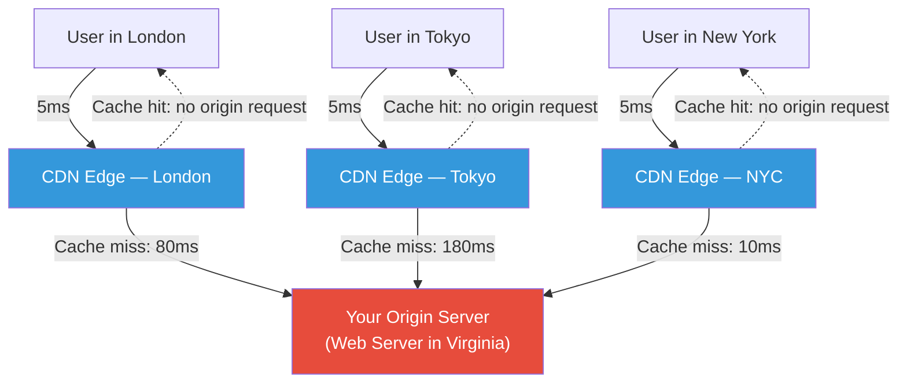

# CDN as a Cache

## Why This Topic Exists

You have learned about caching in front of databases. But what about caching in front of your web servers themselves? What if the bottleneck is not your database, but the fact that users in Tokyo are downloading images from your servers in Virginia?

A CDN (Content Delivery Network) is a globally distributed cache. It stores copies of your content at servers around the world — called edge nodes — so users get files from a server near them, not from your origin server halfway around the globe.

This file explains how CDNs work as a caching layer, how to control CDN caching behavior, and how to think about CDN strategy in system design.

---

## Learning Objectives

- Explain what a CDN is and why it reduces latency
- Describe how CDN edge nodes cache content
- Explain the difference between Push CDN and Pull CDN
- Use HTTP Cache-Control headers to control CDN caching behavior
- Explain why CDN cache invalidation is expensive and how versioned filenames solve it
- Know when a CDN is not enough and what to do instead
- Name real CDN providers and where they are used

---

## Prerequisites

- [What is Caching — cache hits, misses, TTL](./01.%20What%20is%20Caching%20(BEGINNER).md)
- Basic HTTP knowledge — request/response, headers (Chapter 02: Networking)
- Understanding of what a web server does

---

## Introduction

When a user in London visits your website hosted in New York, their browser sends a request across the Atlantic Ocean. That round trip takes about 80–100ms just for the network — before your server even processes the request.

Now multiply this by every image, every CSS file, every JavaScript bundle. A modern webpage can make 50–100 requests. Each one crosses the ocean. This is slow.

A CDN solves this by placing copies of your content at servers around the world. When a user in London requests your logo, they get it from a CDN node in London, not your server in New York. Network latency drops from 100ms to 5ms. The file arrives 20x faster.

CDNs are one of the most impactful and cost-effective optimizations you can make for a globally distributed application.

---

## Real-World Analogy

Imagine you run a bookstore in New York. Customers all over the world order your books. Shipping from New York to Tokyo takes two weeks.

Now you set up warehouse partnerships with stores in London, Tokyo, Sydney, and São Paulo. You send your inventory to each warehouse in advance. When a Tokyo customer orders, they get the book from the Tokyo warehouse in 2 days, not from New York in 2 weeks.

Your CDN nodes are the regional warehouses. Your origin server is your New York headquarters. The content cached at edge nodes is your inventory.

---

## Core Concepts

### CDN Edge Nodes (Points of Presence)

A CDN has a network of servers called **Points of Presence (PoPs)** or **edge nodes** distributed around the world. Cloudflare has over 300 PoPs. Akamai has over 4,000.

When a user requests a file, their ISP's DNS resolves it to the nearest CDN edge node. The edge node checks its cache:
- **Cache hit:** Returns the file immediately from local storage
- **Cache miss:** Fetches the file from your origin server (your web server), caches it, and returns it to the user

Every subsequent user in the same region gets the cached version from the edge node.

---

## Visual Diagram (Mermaid)



**Reading this diagram:** Users connect to their nearest edge node. If the content is cached there, it is returned instantly. Only cache misses travel back to the origin server. Once an edge node caches the content, all users in that region benefit.

---

## Pull CDN vs Push CDN

There are two fundamental models for getting content onto CDN edge nodes.

### Pull CDN

The CDN is lazy. It only fetches content from your origin server when a user requests it for the first time. Edge nodes pull content on demand.

**How it works:**
1. First user in Tokyo requests `logo.png`
2. Tokyo edge node does not have it (cache miss)
3. Edge node fetches `logo.png` from your origin server
4. Edge node caches `logo.png` with a TTL
5. All subsequent users in Tokyo get it from the edge (cache hits)

**Pros:**
- Zero upfront work — you do not need to push anything
- CDN only stores content that is actually requested
- Works for any content automatically

**Cons:**
- First user in each region experiences the full origin latency (cold start)
- If content is large and rarely accessed, CDN wastes space fetching it once and barely using it

**Best for:** Most websites. Websites with unpredictable traffic patterns. Content that is different per region.

**Used by:** Cloudflare (Pull CDN by default), AWS CloudFront, Fastly.

### Push CDN

You proactively push content to CDN edge nodes. You control exactly what is cached where.

**How it works:**
1. You upload `logo.png` to the CDN management API
2. The CDN distributes it to all (or selected) edge nodes immediately
3. First user in any region gets it from the edge — no cold start

**Pros:**
- No first-user origin hit — content is warm everywhere immediately
- You control exactly what is cached and for how long
- Good for large files that you know will be globally popular

**Cons:**
- You must manage what is in the CDN (more operational work)
- CDN stores everything you push, even if some regions never request it
- Storage costs at CDN can be higher for rarely accessed content

**Best for:** Large static files that are globally popular from day one (software downloads, mobile app binary updates, game patches). Content with predictable global demand.

**Used by:** Akamai NetStorage, AWS CloudFront (with explicit file upload).

### Comparison Table

| Feature | Pull CDN | Push CDN |
|---------|---------|---------|
| Setup complexity | Low (configure once) | High (manage uploads) |
| First request latency | High (cache miss hits origin) | Low (pre-cached) |
| Storage efficiency | High (only stores what's requested) | Potentially wasteful |
| Control | Low (CDN decides what to cache) | Full control |
| Best for | Most websites, unpredictable traffic | Large files, known popular content |

---

## HTTP Cache-Control Headers

CDNs respect HTTP cache headers to decide how long to cache content and under what conditions.

### The `Cache-Control` Header

```http
Cache-Control: public, max-age=86400
```

- `public`: This response can be cached by the CDN and browsers
- `private`: Only the browser can cache this, not the CDN (used for user-specific responses)
- `max-age=86400`: Cache this for 86,400 seconds (24 hours)
- `no-store`: Never cache this (sensitive data)
- `no-cache`: Cache it, but always check with the origin before serving

### `s-maxage` for CDN-Specific TTL

```http
Cache-Control: public, max-age=3600, s-maxage=86400
```

`s-maxage` is for shared caches (like CDNs). `max-age` is for the browser. Here, the CDN caches for 24 hours, but browsers only cache for 1 hour. Useful when you want users to occasionally check for updates but want CDNs to cache aggressively.

### `ETag` and `Last-Modified` (Conditional Requests)

```http
ETag: "abc123xyz"
Last-Modified: Tue, 07 Jul 2026 12:00:00 GMT
```

The browser or CDN can send a conditional request:
```http
If-None-Match: "abc123xyz"
```

If the content has not changed, the server returns `304 Not Modified` (no body — very small response). The CDN or browser keeps its cached copy.

### Real-World Cache-Control Examples

```http
# Static images (rarely change) — cache for 1 year
Cache-Control: public, max-age=31536000, immutable

# HTML pages (change with deployments)
Cache-Control: public, max-age=0, s-maxage=3600, must-revalidate

# User-specific API response (never cache at CDN)
Cache-Control: private, no-store

# Public API response (cache at CDN briefly)
Cache-Control: public, max-age=60, s-maxage=300
```

---

## CDN Cache Invalidation (The Expensive Problem)

CDN cache invalidation — removing a cached file before its TTL expires — is expensive and complex. Most CDN providers charge for it, and it can take minutes to propagate to all edge nodes worldwide.

**Why it is expensive:**
- You have 300+ edge nodes globally
- Each holds its own copy of the file
- Telling all of them "delete this file" requires a message to each node
- Even then, propagation is not instantaneous

**The wrong way:** Cache `logo.png` with a 1-year TTL. When you need to update it, send an invalidation request to the CDN. Wait 5–10 minutes for it to propagate. Users in some regions see the old logo, users in others see the new one. Inconsistency window.

**The right way: Versioned filenames (Cache Busting)**

Instead of `logo.png`, deploy `logo.v3.png`. Next release: `logo.v4.png`. Set a 1-year TTL on both.

When you update your HTML to reference `logo.v4.png`, users automatically get the new file. `logo.v3.png` simply sits in the CDN cache until it naturally expires. No invalidation needed.

```html
<!-- OLD deployment -->

<link rel="stylesheet" href="/assets/style.v12.css">
<script src="/assets/app.v27.js"></script>

<!-- NEW deployment (new hash or version in filename) -->

<link rel="stylesheet" href="/assets/style.v13.css">
<script src="/assets/app.v28.js"></script>
```

Modern build tools (Webpack, Vite) do this automatically using content hashes: `app.3f7a8b.js`. If the file content changes, the hash changes, the filename changes, and the CDN gets a brand new file with a fresh TTL.

**When you must invalidate anyway:**
- Security incidents (a compromised script file must be removed immediately)
- Incorrect content that causes user harm
- Legal requirements (GDPR content removal)

CDN providers offer invalidation APIs. AWS CloudFront charges $0.005 per path invalidation (first 1,000 free per month). Cloudflare offers free cache purging but recommends versioned filenames as a best practice.

---

## CDN for API Responses (Advanced)

CDNs are typically associated with static assets (images, CSS, JS). But modern CDNs can also cache API responses — a pattern called **API caching at the edge**.

**Example:** Your `/api/trending-products` endpoint returns a list of top 10 products. This list changes every 10 minutes. With 10 million users hitting your app, that is potentially 10 million API calls per 10 minutes.

With CDN API caching:
```http
Cache-Control: public, s-maxage=600, stale-while-revalidate=60
```

The CDN caches the API response for 600 seconds. Millions of users receive the cached response from the nearest edge node. Your origin server receives only a few requests total — one per edge node per 10 minutes.

`stale-while-revalidate=60`: The CDN can serve a slightly stale response while it fetches a fresh one in the background. Users never experience a cold miss.

**When NOT to use CDN API caching:**
- User-specific responses (your cart, your profile) — use `Cache-Control: private`
- Responses that must be current to the second (stock prices, ride availability)
- Responses requiring authentication checks (the CDN cannot perform auth)

**Cloudflare Workers and edge computing** take this further — running custom code at CDN edge nodes to handle logic that would normally require an origin server call.

---

## Deep Explanation

### The Anatomy of a CDN Request

1. **DNS resolution:** User's browser resolves `cdn.example.com`. The CDN's DNS server uses Anycast routing to return the IP address of the nearest edge node.
2. **TCP connection:** User connects to the edge node. TLS handshake happens at the edge (much faster than connecting to a distant origin server).
3. **Cache lookup:** Edge node checks its local disk/memory cache.
4. **Cache hit:** File returned directly from edge node. Response time: 5–20ms.
5. **Cache miss:** Edge node opens a connection to the origin server, fetches the file, stores it in cache, returns it to user.

The TLS handshake alone over a transatlantic connection can add 200ms. By terminating TLS at the CDN edge, this latency is eliminated for all but the first request to each edge node.

### CDN and Bandwidth Costs

Your hosting bill has a line item for **egress bandwidth** — data transferred out of your servers. Images, videos, and JS bundles can be gigabytes per day. CDNs cache and serve this content, so your origin server's egress bill drops dramatically.

CDN egress is often cheaper than cloud egress. AWS CloudFront prices vary by region but are generally $0.009–$0.085/GB. S3 egress is $0.09/GB. Serving through CloudFront instead of directly from S3 costs the same or less, while being faster.

### When CDN is Not Enough

CDN excels at static content. But dynamic, personalized, or real-time content is difficult or impossible to cache at the CDN level:

| Content Type | CDN Cacheable? | Alternative |
|-------------|----------------|-------------|
| Static images, CSS, JS | Yes (long TTL) | CDN |
| Public API responses | Yes (short TTL) | CDN |
| User-specific data | No | Application cache (Redis) |
| Real-time data (stock prices) | No | WebSocket, server-push |
| Search results | Partially (shared queries) | Application cache |
| Authentication responses | No | Session store (Redis) |

For dynamic content, CDN is complemented by application-level caching (Redis) in front of your database.

---

## Step-by-Step Example: Deploying a Static Site with CDN

**Scenario:** You deploy a marketing website. It has images, CSS, and JS files.

**Setup:**
1. Host static files in AWS S3
2. Put CloudFront in front of S3
3. Point your domain to CloudFront

**Cache-Control headers on S3 objects:**
```
HTML files:     Cache-Control: public, max-age=0, s-maxage=3600
CSS/JS files:   Cache-Control: public, max-age=31536000, immutable
Images:         Cache-Control: public, max-age=31536000, immutable
```

**Your build tool generates versioned filenames:**
```
style.a3f7.css
app.b2d9.js
logo.c1e4.png
```

**Result:**
- HTML is cached at the CDN for 1 hour. After 1 hour, edge nodes re-fetch from origin. Your new deployment goes live.
- CSS/JS/images are cached for 1 year. No invalidation needed — new deployments use new filenames.
- Users worldwide get files from their nearest PoP. Latency: 5–15ms instead of 100–200ms.

---

## Advantages / Disadvantages / Trade-offs

| Aspect | Detail |
|--------|--------|
| **Advantage: Latency** | 5ms from nearby edge vs 100–200ms from distant origin |
| **Advantage: Origin offload** | 95%+ of requests served from CDN; your servers handle very little static traffic |
| **Advantage: Availability** | CDN continues serving cached content even if your origin is down |
| **Advantage: DDoS protection** | CDN absorbs traffic spikes and filters malicious requests at the edge |
| **Disadvantage: Cache invalidation cost** | Invalidating files before TTL expiry is expensive and slow to propagate |
| **Disadvantage: Dynamic content** | User-specific or real-time data cannot be CDN-cached |
| **Disadvantage: Cost** | CDN adds a cost layer (though usually offset by reduced bandwidth costs) |
| **Disadvantage: Debugging** | Stale content issues can be hard to diagnose — "it's cached somewhere in the CDN" |

---

## When to Use / When NOT to Use

**Use a CDN when:**
- You serve users globally and care about latency
- You have significant static asset traffic (images, video, CSS, JS)
- You want to reduce origin server load and bandwidth costs
- You want DDoS protection and rate limiting at the edge

**Do NOT rely on CDN alone when:**
- Your content is dynamic and user-specific
- You need guaranteed immediate consistency (CDN has propagation delays)
- Your users are all in one geographic region with fast access to your origin

---

## Common Interview Questions

1. **"What is a CDN and how does it reduce latency?"**
   A CDN stores copies of your content at servers around the world (edge nodes). Users get content from the nearest edge node instead of a distant origin server. Network round-trip drops from 100–200ms to 5–15ms.

2. **"How do you handle CDN cache invalidation when you deploy new CSS files?"**
   Use content-hashed filenames (`style.a3f7.css`). Each deployment generates new filenames. Old files naturally expire via TTL. No explicit invalidation needed.

3. **"What is the difference between Pull CDN and Push CDN?"**
   Pull CDN fetches content from your origin on the first request and caches it. Push CDN requires you to proactively upload content to the CDN. Pull is simpler and works for most websites. Push is better for large files with known global demand.

4. **"Can you cache API responses at the CDN? What headers do you use?"**
   Yes, for public API responses. Use `Cache-Control: public, s-maxage=300`. For user-specific responses, use `Cache-Control: private` to prevent CDN caching.

---

## Common Beginner Mistakes

**Mistake 1: Not setting Cache-Control headers**
Without explicit Cache-Control headers, CDNs use their default behavior (which varies by provider and may be too aggressive or too conservative). Always set explicit headers.

**Mistake 2: Caching HTML with long TTLs**
If your HTML has a 1-year TTL, users will not see your new deployment for a year. Set short TTLs (0–1 hour) on HTML. Use long TTLs only for versioned static assets.

**Mistake 3: Setting `Cache-Control: private` on public content**
This prevents CDN caching of content that has no user-specific information. Your images and CSS are served from origin for every request, defeating the CDN's purpose.

**Mistake 4: Expecting instant CDN invalidation**
CDN invalidation can take 5–15 minutes to propagate globally. Do not depend on instant invalidation in your deployment strategy. Use versioned filenames instead.

**Mistake 5: Using CDN for dynamic content without understanding the risks**
Caching an API response at the CDN that contains user-specific data could expose one user's data to another. Always verify that responses are truly public before caching at the CDN.

---

## Summary

A CDN is a globally distributed cache for static assets and public content. It stores copies at edge nodes worldwide, delivering content to users from nearby servers instead of a distant origin. This reduces latency from hundreds of milliseconds to single digits.

Pull CDN is simpler (CDN fetches on demand). Push CDN is better for large, globally popular files. HTTP Cache-Control headers control caching behavior at CDN nodes and browsers. Cache invalidation is expensive — use versioned filenames to avoid it. CDN cannot replace application-level caching for dynamic or user-specific content.

---

## Key Takeaways

- CDN = globally distributed cache for static assets and public content
- Edge nodes serve content from nearby geographic locations (5ms vs 100ms+)
- Pull CDN: edge fetches from origin on first miss (simpler, default choice)
- Push CDN: you proactively push content to edges (better for large known-popular files)
- Use `Cache-Control: public, max-age=...` to enable CDN caching
- Use `Cache-Control: private` for user-specific responses (never CDN-cache these)
- Versioned filenames (`style.abc123.css`) eliminate CDN invalidation headaches
- CDN is not a replacement for Redis — dynamic, personalized content still needs app-level caching
- Major CDN providers: Cloudflare, Akamai, AWS CloudFront, Fastly

---

## Related Topics (relative markdown links)

- [What is Caching — fundamentals of caching](./01.%20What%20is%20Caching%20(BEGINNER).md)
- [Caching Strategies — for dynamic content behind the CDN](./02.%20Caching%20Strategies%20(INTERMEDIATE).md)
- [Cache Invalidation — invalidation challenges (CDN applies too)](./05.%20Cache%20Invalidation%20(INTERMEDIATE).md)
- [Distributed Caching — caching infrastructure behind the CDN](./06.%20Distributed%20Caching%20(INTERMEDIATE).md)
- [Chapter 02: Networking](../02.%20Networking/) — HTTP headers, DNS, TLS — all relevant to CDN
- [Chapter Overview: Caching](./README.md)
