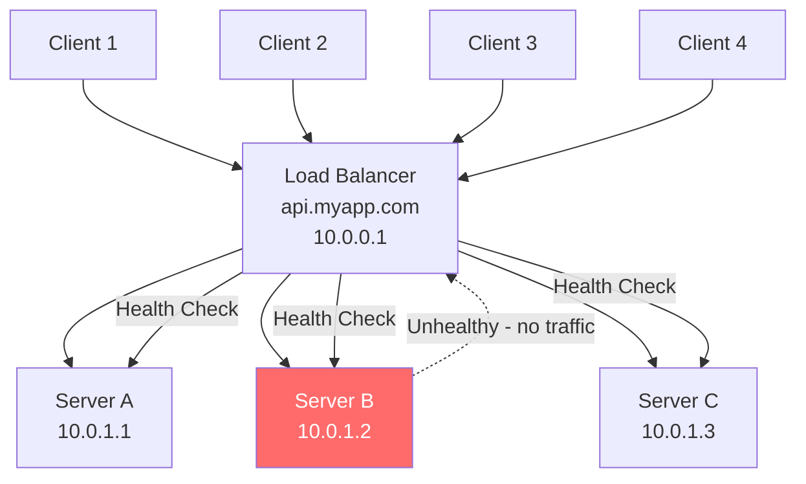

# What is a Load Balancer

## Why This Topic Exists

Imagine you open a popular e-commerce website on a sale day. Millions of people hit the site at the same time. If all of those requests go to a single server, that server runs out of memory, CPU, and network bandwidth. It slows to a crawl, then crashes. The entire website goes down, and the company loses money every second.

The fix is simple in concept: use more than one server. But how do you decide which server gets which request? You need something sitting in front of all the servers that can intelligently send each request to a server that is available and not overloaded. That something is a **load balancer**.

Load balancers are one of the first topics that come up in every system design interview because nearly every production system at scale uses one. Understanding what they do and how they work is foundational to everything else in this chapter.

---

## Learning Objectives

By the end of this file you will be able to:

- Explain what a load balancer does in plain English
- Describe why a single server is not enough for high-traffic systems
- Explain what a health check is and why it matters
- Distinguish between hardware and software load balancers
- Describe SSL termination and why it is commonly done at the load balancer
- Draw a simple architecture diagram with clients, a load balancer, and a server pool

---

## Prerequisites

- Basic understanding of what a web server is
- Know that HTTP requests travel over TCP/IP
- Comfortable with the idea of "scaling out" (adding more servers)

---

## Introduction

A load balancer is a component that sits between clients (browsers, mobile apps, other services) and your backend servers. Its job is to receive incoming requests and forward each one to one of the available backend servers. After the server processes the request, the response travels back through the load balancer to the client.

From the client's perspective, it looks like there is only one server. The client never sees the pool of backend machines behind the load balancer. The load balancer is a single point of entry, but it is not a single point of failure — that distinction is important and is covered in detail in file 06 of this chapter.

---

## Real-World Analogy

Think about the check-in area at a busy airport. There are twenty check-in counters, and hundreds of passengers arrive at the same time. Without any direction, everyone would crowd around counter 1 and ignore counters 2 through 20.

An airport agent stands at the entrance and directs each passenger: "Counter 5 is free, please go there." The agent keeps an eye on which counters are busy and which are free. If a counter attendant goes on break (the server goes down), the agent stops sending passengers there and redirects them elsewhere. When the attendant comes back, the agent starts sending passengers to that counter again.

The airport agent is the **load balancer**. The check-in counters are the **backend servers**. The passengers are the **client requests**.

---

## Core Concepts

### 1. Single Point of Entry

Clients connect to a single IP address or domain (e.g., `api.myapp.com`). The load balancer owns that IP. Clients do not know or care how many servers sit behind it.

### 2. Traffic Distribution

The load balancer uses an algorithm to decide which server gets each request. Chapter 02 covers all the algorithms in detail. The simplest algorithm is Round Robin — send request 1 to server A, request 2 to server B, request 3 to server C, then repeat.

### 3. Health Checks

The load balancer periodically sends a small probe request (called a health check) to each backend server. If a server responds correctly, it is marked as healthy and continues to receive traffic. If it fails to respond (or returns an error), the load balancer marks it as unhealthy and stops sending traffic to it. When the server recovers, health checks pass again and the load balancer adds it back.

Health checks are what make load balancers so important for **high availability**. A failing server is automatically removed without any human intervention.

### 4. High Availability

Because the load balancer distributes across multiple servers and removes unhealthy ones, the system can survive individual server failures without users noticing. One server can crash, restart, or be taken offline for maintenance while the others continue serving traffic.

### 5. SSL Termination

HTTPS connections are encrypted using SSL/TLS. Encrypting and decrypting is computationally expensive. A common pattern is to **terminate SSL at the load balancer** — the load balancer handles the encryption with the client, then communicates with the backend servers over plain HTTP on the internal network (which is trusted). This offloads the CPU cost from every backend server and centralizes certificate management in one place.

---

## Visual Diagram (Mermaid)

In this diagram, Server B has failed its health check (shown in red). The load balancer stops sending traffic to it and distributes all requests between Server A and Server C. When Server B recovers, it gets re-added to the pool.

---

## Deep Explanation

### How a Request Flows Through a Load Balancer

1. A user types `api.myapp.com` in their browser. DNS resolves this to the load balancer's IP address, say `10.0.0.1`.
2. The browser opens a TCP connection to `10.0.0.1` on port 443 (HTTPS).
3. The load balancer performs the TLS handshake (SSL termination). The connection is now encrypted between the client and the LB.
4. The load balancer reads the incoming HTTP request.
5. It consults its algorithm and selects a healthy backend server, say Server A at `10.0.1.1`.
6. It opens a new TCP connection to Server A on port 80 (plain HTTP on the internal network).
7. It forwards the request to Server A.
8. Server A processes the request and sends the HTTP response back to the load balancer.
9. The load balancer encrypts the response and sends it back to the client over the original TLS connection.
10. The client sees the response. It has no idea that the actual work was done by Server A.

### What Load Balancers Also Do

Beyond traffic distribution, modern load balancers often provide:

- **Connection pooling**: Maintain a pool of open connections to backend servers so they do not have to be re-established for every request.
- **Request queuing**: In high-traffic bursts, hold excess requests in a queue rather than immediately rejecting them.
- **Rate limiting**: Throttle clients that are sending too many requests.
- **Logging and metrics**: Record which server handled which request, response times, error rates.
- **Compression**: Compress responses (gzip) before sending them to clients.
- **Sticky sessions**: Route a client to the same server on subsequent requests (more on this in file 02).

---

## Hardware vs Software Load Balancers

| Aspect | Hardware Load Balancer | Software Load Balancer |
|--------|----------------------|----------------------|
| What it is | A dedicated physical appliance (e.g., F5 BIG-IP, Citrix NetScaler) | Software running on a commodity server (e.g., Nginx, HAProxy, AWS ELB) |
| Performance | Extremely high throughput, specialized ASICs | High performance, but limited by commodity hardware |
| Cost | Very expensive ($10k–$100k+) | Cheap or free (open source) |
| Flexibility | Limited to vendor features | Highly configurable |
| Scalability | Fixed hardware capacity | Scale by adding more instances |
| Who uses it | Large enterprises, telcos | Startups, cloud-native applications |
| Examples | F5 BIG-IP, Radware, Citrix ADC | Nginx, HAProxy, AWS ELB/ALB/NLB, GCP Load Balancer |

In modern cloud-native systems, software load balancers dominate. Hardware load balancers are mostly found in legacy enterprise environments or industries with extreme compliance requirements.

---

## Step-by-Step Example

### Scenario: Deploy a load balancer for a REST API

**Setup:**
- 3 application servers running on EC2: `10.0.1.1:8080`, `10.0.1.2:8080`, `10.0.1.3:8080`
- 1 AWS Application Load Balancer in front

**Steps:**

1. Create the ALB in the AWS console. Assign it a DNS name: `myapp-alb-123456.us-east-1.elb.amazonaws.com`.
2. Create a **target group** containing the 3 EC2 instances.
3. Configure a **health check** — the ALB will `GET /health` every 30 seconds. If a server returns anything other than HTTP 200 twice in a row, it is marked unhealthy.
4. Create a **listener** on port 443 (HTTPS). Upload your SSL certificate so the ALB does SSL termination.
5. Create a CNAME record in DNS: `api.myapp.com → myapp-alb-123456.us-east-1.elb.amazonaws.com`.
6. Traffic flows in. The ALB distributes requests across all 3 servers using Round Robin by default.
7. Server `10.0.1.2` crashes. The health check fails. The ALB removes it from the rotation. Traffic continues flowing to the remaining 2 servers without interruption.
8. The server is replaced and starts passing health checks. The ALB adds it back.

---

## Advantages / Disadvantages / Trade-offs

### Advantages

- **Scalability**: Add or remove servers without changing client configuration.
- **High availability**: Unhealthy servers are automatically removed.
- **Centralized SSL**: One certificate to manage, offloads TLS from app servers.
- **Observability**: Single place to collect request logs and metrics.
- **DDoS mitigation**: Can rate-limit and block malicious IPs before they hit application servers.

### Disadvantages

- **Added latency**: Every request goes through an extra hop. In practice this is microseconds, but it is nonzero.
- **Single point of failure**: If the load balancer itself crashes, all traffic stops. (Solved by making the LB highly available — see file 06.)
- **Stateful applications are harder**: If a server stores session data in memory, the next request from the same user might go to a different server that does not have that data. Solved with sticky sessions or by storing session data in a shared cache like Redis.
- **Cost**: Managed load balancers like AWS ALB are not free.

### Trade-offs

| Trade-off | Explanation |
|-----------|-------------|
| Simplicity vs Flexibility | Hardware LBs are simple to use but rigid. Software LBs require configuration but are very flexible. |
| Performance vs Features | Layer 4 LBs are faster but dumb. Layer 7 LBs are slower but can make smart routing decisions. |
| Stateless vs Stateful | Stateless apps work perfectly with load balancers. Stateful apps require extra work (sticky sessions or external session stores). |

---

## When to Use / When NOT to Use

### Use a Load Balancer When:

- Your application receives more traffic than one server can handle.
- You need zero-downtime deployments (take servers out of rotation one at a time).
- You need automatic failover if a server crashes.
- You want to centralize SSL termination and certificate management.
- You want to A/B test by sending a percentage of traffic to a new version.

### Do NOT Rely on a Load Balancer When:

- Your application has a single-instance bottleneck that cannot be parallelized (e.g., a single writable database — the LB does not help there, you need database-level solutions).
- You have a very low-traffic internal tool where the overhead is not worth it.
- Your backend is not horizontally scalable (stateful app that cannot share state between instances).

---

## Common Interview Questions

**Q: What is a load balancer and why do we need it?**
A: A load balancer distributes incoming traffic across multiple servers to prevent any single server from being overwhelmed. It also performs health checks to remove unhealthy servers from rotation, enabling high availability.

**Q: What is a health check in the context of load balancing?**
A: A periodic probe sent by the load balancer to each backend server. If the server responds correctly, it stays in rotation. If it fails, the LB stops sending traffic to it.

**Q: What is SSL termination at the load balancer?**
A: The load balancer handles the TLS encryption/decryption on behalf of the backend servers. This reduces CPU load on backend servers and centralizes certificate management.

**Q: What is a sticky session and why can it be a problem?**
A: Sticky sessions always route a client to the same backend server. This breaks if that server goes down and also causes uneven load distribution.

---

## Common Beginner Mistakes

- **Treating the LB as infinitely scalable**: The load balancer itself can become a bottleneck. File 06 covers how to make the LB itself highly available.
- **Forgetting session state**: Moving to multiple servers breaks in-memory sessions. Always externalize session state to Redis or a database.
- **Skipping health checks**: Without health checks, the LB keeps sending traffic to dead servers. Always configure health checks.
- **Assuming the LB solves all scaling problems**: The LB helps with stateless layers. Databases, message queues, and other stateful systems need their own scaling strategies.
- **Not accounting for the LB in latency budgets**: The extra network hop is small but not zero.

---

## Summary

A load balancer sits in front of your backend servers and distributes incoming requests across them. It acts as a single point of entry for clients. It performs health checks to keep unhealthy servers out of rotation. It enables high availability, horizontal scaling, and zero-downtime deployments. SSL termination at the load balancer offloads encryption from backend servers. Hardware load balancers are expensive and inflexible; software load balancers (Nginx, HAProxy, AWS ELB) are the modern standard.

---

## Key Takeaways

- A load balancer is a traffic cop that distributes requests across multiple servers.
- Health checks automatically remove failing servers from the pool.
- SSL termination at the LB centralizes certificate management and reduces backend CPU load.
- Sticky sessions solve stateful app problems but introduce uneven load and reduced fault tolerance.
- The load balancer itself must be made highly available (covered in file 06).
- Software load balancers (Nginx, HAProxy, AWS ELB) are standard in modern systems.

---

## Related Topics

- [02. Load Balancing Algorithms](./02.%20Load%20Balancing%20Algorithms%20(INTERMEDIATE).md) — How the LB decides which server gets each request
- [03. Layer 4 vs Layer 7 Load Balancing](./03.%20Layer%204%20vs%20Layer%207%20Load%20Balancing%20(INTERMEDIATE).md) — Two fundamentally different types of load balancers
- [04. Reverse Proxy](./04.%20Reverse%20Proxy%20(BEGINNER).md) — A closely related concept often confused with load balancing
- [06. Load Balancer High Availability](./06.%20Load%20Balancer%20High%20Availability%20(INTERMEDIATE).md) — How to prevent the LB from being a single point of failure
- [Chapter 03: Scalability](../03.%20Scalability/README.md) — The broader context in which load balancers operate
