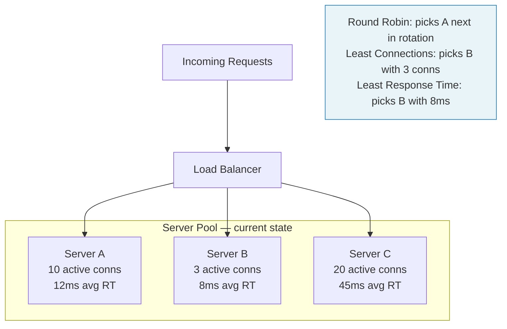

# Load Balancing Algorithms

## Why This Topic Exists

A load balancer distributes traffic across multiple servers. But how does it decide which server gets each new request? The answer is the **load balancing algorithm**. Choosing the wrong algorithm can lead to some servers being overwhelmed while others sit idle, or it can break stateful applications. Understanding each algorithm — its logic, its strengths, and its weaknesses — is essential for making the right choice in a given scenario.

This topic comes up in interviews constantly. Interviewers ask you to compare algorithms, explain trade-offs, and justify your choice for a specific workload.

---

## Learning Objectives

By the end of this file you will be able to:

- Explain at least six load balancing algorithms in plain English
- Describe the use case where each algorithm performs best
- Compare algorithms using a structured trade-off table
- Identify which algorithm to avoid for long-lived connections (like WebSockets)
- Explain what IP Hash does and why it is used as an alternative to sticky sessions with cookies

---

## Prerequisites

- [01. What is a Load Balancer](./01.%20What%20is%20a%20Load%20Balancer%20(BEGINNER).md) — You need to know what a load balancer is and what a server pool is before studying how requests are distributed.

---

## Introduction

Once a load balancer receives a request, it must make a decision in milliseconds: which of the N backend servers should process this request? The algorithm it uses determines:

- How evenly load is distributed
- Whether the same client always reaches the same server
- How the system responds to servers with different capacities
- How it handles requests that take very different amounts of time to complete

No single algorithm is perfect for all situations. The right choice depends on your specific workload, whether your servers have equal capacity, and whether your application requires session affinity.

---

## Real-World Analogy

Imagine a bank with multiple tellers. Different algorithms reflect different ways a manager might direct customers:

- **Round Robin**: "Next customer goes to teller 1, then teller 2, then teller 3, then back to teller 1."
- **Weighted Round Robin**: "Teller 3 is a senior teller and twice as fast, so send two customers to teller 3 for every one you send to tellers 1 and 2."
- **Least Connections**: "Look at how many customers each teller currently has and send the next one to whoever has the fewest."
- **Least Response Time**: "Track how long each teller takes and send new customers to the fastest one."
- **IP Hash**: "Always send the same customer to the same teller so the teller already knows their account history."
- **Random**: "Pick a teller at random."

---

## Core Concepts

Before diving into each algorithm, three concepts are important:

**Active connections**: The number of requests a server is currently processing. A server with 100 active connections is busier than one with 5.

**Response time**: How long a server takes to process a request and send back a response. A healthy, fast server responds in 5ms; an overloaded one might take 500ms.

**Session affinity (sticky sessions)**: The requirement that all requests from the same client go to the same server, typically because the server holds session state in memory.

---

## Visual Diagram (Mermaid)

---

## Deep Explanation

### Algorithm 1: Round Robin

**How it works**: Requests are distributed to servers in a fixed cyclic order. If you have servers A, B, and C, the sequence is A → B → C → A → B → C → ...

**Example**: 9 requests come in. Servers A, B, C each get 3 requests regardless of how long each request takes.

**Strengths**:
- Dead simple to implement and understand
- Zero overhead — no need to track server state
- Works perfectly when all requests take roughly the same time and servers have equal capacity

**Weaknesses**:
- Completely ignores server load. If request 1 takes 10 seconds and request 2 takes 0.1 seconds, server A gets swamped with the slow request while server B finishes quickly and sits idle.
- Assumes all servers have equal capacity. If one server has half the RAM and CPU, it will struggle.

**Best for**: Stateless applications with uniform request cost, homogeneous server fleets.

**Avoid for**: Long-running requests (video encoding, large file uploads), heterogeneous server fleets.

---

### Algorithm 2: Weighted Round Robin

**How it works**: Each server is assigned a weight proportional to its capacity. A server with weight 3 receives three times as many requests as a server with weight 1.

**Example**: Server A has weight 1, Server B has weight 2, Server C has weight 1. Out of every 4 requests, A gets 1, B gets 2, C gets 1. The sequence is: A → B → B → C → A → B → B → C → ...

**Strengths**:
- Handles heterogeneous fleets well — beefy servers get more traffic
- Still simple, still stateless
- Works well when you are incrementally upgrading your fleet (mix of old and new hardware)

**Weaknesses**:
- Weights are static — they do not adapt to runtime conditions. If Server B is temporarily slow due to a database query, it still gets double the traffic.
- Same problem as Round Robin when request durations vary widely.

**Best for**: Heterogeneous server fleets with predictable, relatively uniform request durations. Blue-green deployments where you want to gradually shift traffic.

**Avoid for**: Long-running requests where actual load matters more than request count.

---

### Algorithm 3: Least Connections

**How it works**: The load balancer tracks how many active (in-flight) connections each server currently has. Each new request goes to the server with the fewest active connections.

**Example**:
- Server A: 50 active connections
- Server B: 10 active connections
- Server C: 80 active connections

The next request goes to Server B.

**Strengths**:
- Adapts to actual server load in real time
- Works very well when request durations vary widely — a server processing one long request will not get more traffic until it finishes
- Naturally handles heterogeneous fleets over time (faster servers finish requests sooner, so they have fewer connections and get more new requests)

**Weaknesses**:
- Requires the load balancer to track connection counts — slightly more overhead than Round Robin
- Connection count is an imperfect proxy for load. A server might have 5 connections all doing heavy CPU work and be more loaded than a server with 20 connections doing lightweight reads.

**Best for**: Workloads with variable request durations (API calls that sometimes hit cache and sometimes do heavy DB queries, WebSocket connections, video streaming).

**Avoid for**: Very short-lived requests where the overhead of tracking connections outweighs the benefit.

---

### Algorithm 4: Least Response Time

**How it works**: The load balancer tracks the average response time of each server over a recent time window. New requests go to the server with the lowest response time. Some implementations combine this with least connections: pick the server with both the fewest connections and the best response time.

**Example**:
- Server A: avg response time 12ms
- Server B: avg response time 8ms
- Server C: avg response time 45ms

The next request goes to Server B.

**Strengths**:
- Directly measures what matters — how fast is the server responding
- Automatically routes away from slow or struggling servers
- Considers both server load and network latency

**Weaknesses**:
- More complex to implement — requires continuous measurement of response times
- Historical averages can lag behind sudden changes in server performance
- Can cause oscillation: the LB sends all traffic to the fastest server, which then slows down, then the LB switches to the second server, which then slows down, and so on.

**Best for**: Performance-sensitive applications where latency is a primary concern. Useful when servers are geographically distributed and network latency varies.

**Avoid for**: Simple internal APIs where the added complexity is not worth it.

---

### Algorithm 5: IP Hash

**How it works**: The load balancer hashes the client's IP address and uses the hash to deterministically select a server. The same IP always maps to the same server, as long as the server pool does not change.

**Formula**: `server_index = hash(client_ip) % number_of_servers`

**Example**: Client at `203.0.113.45` always goes to Server B. Client at `198.51.100.22` always goes to Server A.

**Strengths**:
- Provides session affinity without cookies — useful when you cannot use cookie-based sticky sessions (e.g., non-HTTP protocols, clients that block cookies)
- Stateless on the load balancer side — no need to store a session-to-server mapping
- Deterministic — you can predict which server any IP will hit

**Weaknesses**:
- Adding or removing servers changes the hash output for most IPs. All existing sessions break. (Consistent hashing solves this — covered in a separate chapter.)
- Uneven distribution if traffic comes from a small number of IP addresses (e.g., all traffic from a corporate proxy with one IP). One server could get all the traffic.
- NAT and IPv6 can complicate IP-based hashing (many users behind the same NAT share one external IP).

**Best for**: Applications that need session affinity but cannot use cookies. Cases where clients cannot store cookies (certain IoT devices, non-browser HTTP clients).

**Avoid for**: Traffic that comes from a small number of source IPs (corporate offices, cloud functions). Systems where servers are frequently added or removed.

---

### Algorithm 6: Random

**How it works**: The load balancer picks a server at random for each request, with uniform probability.

**Example**: 3 servers. Each request has a 33.3% chance of going to any server.

**Strengths**:
- Extremely simple
- With a large number of requests, produces near-uniform distribution (law of large numbers)
- No state to track

**Weaknesses**:
- With small numbers of requests, distribution can be very uneven
- Ignores server health and load (though health-aware random picks only from healthy servers)
- Worse than Round Robin for small request counts

**Best for**: Distributed systems where each node runs its own load balancer (Power of Two Choices — pick 2 random servers, then pick the one with fewer connections — is a notable improvement used by systems like Twitter).

**Avoid for**: Production systems where predictable, even distribution matters.

---

## Comparison Table

| Algorithm | Tracks State | Handles Varying Request Durations | Handles Heterogeneous Servers | Session Affinity | Complexity |
|-----------|-------------|-----------------------------------|-----------------------------|-----------------|-----------|
| Round Robin | No | Poor | Poor | No | Very Low |
| Weighted Round Robin | No (static weights) | Poor | Good | No | Low |
| Least Connections | Yes (conn count) | Good | Good (naturally) | No | Medium |
| Least Response Time | Yes (response times) | Excellent | Excellent | No | High |
| IP Hash | No (stateless) | Poor | Poor | Yes (by IP) | Low |
| Random | No | Poor | Poor | No | Very Low |

---

## Step-by-Step Example

### Choosing an Algorithm for a Real System

**Scenario**: You are designing the load balancing layer for a chat application. Clients open long-lived WebSocket connections. Connections last anywhere from 5 minutes to 8 hours. Some users are very active (many messages), others are idle.

**Analysis**:
- Round Robin is poor here. Once a WebSocket connection is established, it stays on that server. Round Robin distributes new connections evenly, but over time some servers accumulate many long-lived connections while others have fewer.
- Weighted Round Robin has the same problem.
- Least Connections is a strong choice. Since WebSocket connections are long-lived, the connection count directly reflects how loaded each server is. New connections go to the server with the most free capacity.
- IP Hash provides session affinity (same client always connects to same server). This is useful if server-side state is stored per connection. But if you add or remove servers, all existing connections are disrupted.
- Least Response Time could work but adds complexity without clear benefit for WebSockets where response time per message is not the primary bottleneck.

**Best choice**: Least Connections, with session state stored externally (Redis) so any server can handle reconnections.

---

## Advantages / Disadvantages / Trade-offs

### Key Trade-offs

**Simplicity vs Accuracy**: Round Robin is simplest but ignores actual load. Least Response Time is most accurate but adds overhead and complexity.

**Session Affinity vs Even Distribution**: IP Hash provides affinity but can cause hotspots. Round Robin distributes evenly but breaks stateful apps.

**Reactive vs Proactive**: Least Connections and Least Response Time react to current conditions. Round Robin and Weighted Round Robin are proactive (fixed rules) and cannot adapt.

---

## When to Use / When NOT to Use

| Scenario | Recommended Algorithm | Reason |
|----------|----------------------|--------|
| Simple REST API, uniform request size | Round Robin | Simple, low overhead, even distribution |
| Mixed fleet (some servers 2x more powerful) | Weighted Round Robin | Directs more traffic to powerful servers |
| API with highly variable response times | Least Connections | Avoids overloading slow servers |
| Performance-critical, latency-sensitive | Least Response Time | Routes to fastest server |
| Session-heavy app without a shared session store | IP Hash | Session affinity without cookies |
| Microservice mesh, very high request volume | Random (Power of Two Choices) | Low overhead, good distribution at scale |

---

## Common Interview Questions

**Q: What is the difference between Round Robin and Least Connections?**
A: Round Robin cycles through servers in order, ignoring how loaded they are. Least Connections tracks active connections per server and always sends to the least loaded one. Least Connections handles variable request durations much better.

**Q: Which algorithm would you use for WebSocket connections?**
A: Least Connections. Since WebSocket connections are long-lived, the number of active connections directly measures server load better than request count does.

**Q: What is IP Hash and when would you use it?**
A: IP Hash deterministically maps a client IP to a server using a hash function. It provides session affinity without cookies, useful for non-browser clients or protocols that do not support cookies. Its weakness is that adding or removing servers disrupts existing sessions.

**Q: How does Weighted Round Robin differ from regular Round Robin?**
A: Each server is assigned a weight. Higher-weight servers receive proportionally more requests. This handles heterogeneous server fleets where some machines have more capacity than others.

---

## Common Beginner Mistakes

- **Defaulting to Round Robin for everything**: It is the simplest but not the best for most real-world workloads where request durations vary.
- **Using IP Hash and then scaling the server fleet**: Adding a server causes the hash to change for many clients, breaking all existing sessions. Consistent hashing mitigates this.
- **Ignoring session state**: Choosing a non-sticky algorithm for a stateful app that stores sessions in memory will break the app. Either use IP Hash, use cookie-based sticky sessions, or externalize session state.
- **Forgetting health checks affect the algorithm**: If a server is removed because it fails health checks, IP Hash breaks affinity for the clients that were mapped to it.
- **Thinking Least Connections is always better**: It adds tracking overhead and can be overkill for uniform, fast requests where Round Robin works fine.

---

## Summary

Load balancing algorithms are the decision-making logic inside every load balancer. Round Robin is simple and stateless. Weighted Round Robin handles heterogeneous fleets. Least Connections adapts to real-time load and is excellent for variable request durations. Least Response Time directly measures server performance. IP Hash provides deterministic session affinity without cookies. Random is simple and effective at very high scale. Choose based on your request duration variability, server homogeneity, and session affinity requirements.

---

## Key Takeaways

- Round Robin is simple but blind to actual server load — fine for uniform short requests.
- Least Connections is the best general-purpose algorithm for workloads with variable request durations.
- IP Hash gives session affinity without cookies but breaks when the server pool changes.
- Weighted Round Robin is ideal for heterogeneous fleets where some servers are more powerful.
- Least Response Time is the most accurate but adds the most overhead.
- No algorithm is perfect — choose based on your specific workload characteristics.

---

## Related Topics

- [01. What is a Load Balancer](./01.%20What%20is%20a%20Load%20Balancer%20(BEGINNER).md) — Foundation: what the algorithm is deciding
- [03. Layer 4 vs Layer 7 Load Balancing](./03.%20Layer%204%20vs%20Layer%207%20Load%20Balancing%20(INTERMEDIATE).md) — The type of LB affects which algorithms are available
- [05. Global Load Balancing and Anycast](./05.%20Global%20Load%20Balancing%20and%20Anycast%20(INTERMEDIATE).md) — Global LB uses geographic algorithms to route between datacenters
- [Chapter 04: Consistent Hashing](../04.%20Consistent%20Hashing/README.md) — Solves the "server pool change breaks IP Hash" problem
