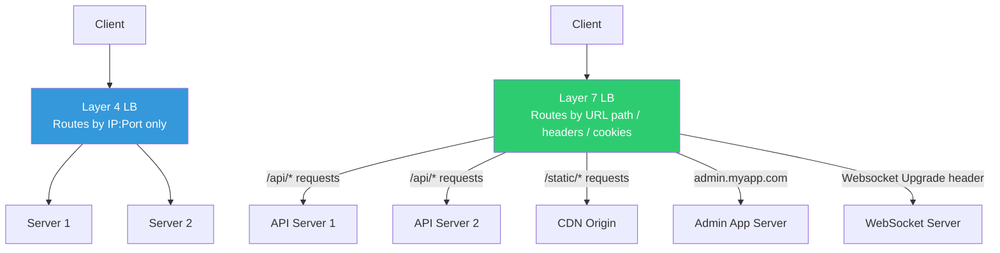

# Layer 4 vs Layer 7 Load Balancing

## Why This Topic Exists

Not all load balancers are built the same. Some work at a very low level — they look only at network packets and route them based on IP addresses and ports. Others work at a higher level — they read the full HTTP request, inspect headers, cookies, and URL paths, and make smart routing decisions based on that information.

The difference matters because it directly affects performance, flexibility, cost, and what routing logic you can implement. In interviews for intermediate to senior roles, you will almost certainly be asked to compare Layer 4 and Layer 7 load balancing, or to choose between AWS NLB and ALB. This file gives you everything you need.

---

## Learning Objectives

By the end of this file you will be able to:

- Briefly explain what the OSI model is and why layers matter
- Describe what Layer 4 (Transport Layer) load balancing does and how it works
- Describe what Layer 7 (Application Layer) load balancing does and how it works
- Compare L4 and L7 using a structured table covering performance, flexibility, and cost
- Give real examples of each (AWS NLB vs ALB, Nginx TCP mode vs HTTP mode)
- Design a routing rule that sends `/api` requests to API servers and `/static` requests to a CDN using L7 routing

---

## Prerequisites

- [01. What is a Load Balancer](./01.%20What%20is%20a%20Load%20Balancer%20(BEGINNER).md) — You need to know what a load balancer is before comparing types.
- [02. Load Balancing Algorithms](./02.%20Load%20Balancing%20Algorithms%20(INTERMEDIATE).md) — Helpful context for understanding why algorithm choice matters at each layer.
- Basic understanding of TCP/IP and HTTP

---

## Introduction

To understand Layer 4 and Layer 7 load balancing, you need a brief understanding of the OSI (Open Systems Interconnection) model. The OSI model divides network communication into 7 abstract layers, each with a specific responsibility. You do not need to memorize all 7 for this topic, but you need to know three:

- **Layer 3 (Network Layer)**: Handles IP addresses. Routers operate here.
- **Layer 4 (Transport Layer)**: Handles TCP and UDP. Deals with ports, connections, and flow control.
- **Layer 7 (Application Layer)**: Handles application protocols like HTTP, HTTPS, gRPC, WebSocket. This is where your web application lives.

A **Layer 4 load balancer** operates at layers 3 and 4. It sees IP addresses and port numbers. It does not open or inspect the content of TCP packets. It routes at the connection level.

A **Layer 7 load balancer** operates at layer 7. It fully understands the HTTP protocol. It opens TCP connections, reads HTTP requests, inspects headers, URLs, cookies, and body content, then makes a routing decision based on that information.

---

## Real-World Analogy

**Layer 4 LB** is like a postal sorting facility. The facility looks at the address on the envelope (IP + port) and puts it in the right bin for delivery. It does not open the envelope. It does not care what is inside. It is fast and handles enormous volumes.

**Layer 7 LB** is like a concierge at a hotel who actually reads your request. "You want to visit the restaurant? That's floor 2. You want the spa? That's floor 5. You have a platinum membership, so I'll upgrade your table." The concierge understands the content of your request and makes intelligent decisions. Slower than the postal facility for simple routing, but far more capable.

---

## Core Concepts

### Layer 4 Load Balancing

At Layer 4, the load balancer operates on TCP/UDP flows. When a client connects, the LB establishes a TCP connection, then passes the TCP stream to a backend server (or uses NAT to rewrite destination IP/port). The LB does not read or modify the content of the TCP stream. It only knows:

- Source IP and port
- Destination IP and port
- Protocol (TCP or UDP)

Because it never needs to parse HTTP, it is extremely fast and has very low latency. It can handle millions of connections per second and is ideal for high-throughput, low-latency requirements.

**What it can do**:
- Route based on IP address and port
- Distribute TCP and UDP connections across servers
- Perform health checks at the TCP level (can a connection be established? Does a server respond to a TCP SYN?)

**What it cannot do**:
- Route based on URL path, HTTP headers, or cookies
- Perform SSL termination (it does not understand HTTPS)
- Inspect or rewrite HTTP headers
- Make routing decisions based on request content

### Layer 7 Load Balancing

At Layer 7, the load balancer is a full HTTP proxy. It terminates the client's TCP connection, reads the full HTTP request, makes a routing decision, then opens a new TCP connection to the chosen backend server and forwards the request.

Because it fully understands HTTP, it can make intelligent routing decisions based on:

- **URL path**: Route `/api/*` to API servers, `/static/*` to a CDN origin.
- **HTTP headers**: Route `Host: admin.myapp.com` to the admin application.
- **Cookies**: Route requests with a specific session cookie to a specific server (sticky sessions).
- **Query parameters**: Route requests with `?version=beta` to the new server fleet.
- **HTTP method**: Route `GET` requests to read replicas, `POST/PUT/DELETE` to the primary server.
- **Request body**: Some advanced LBs can inspect the body (rarely done due to performance cost).

**What it can do**:
- Everything L4 can do, plus all of the above
- SSL termination (required since it needs to read HTTP)
- HTTP header inspection and modification (add/remove headers)
- Content-based routing (by path, host, header, cookie)
- Rate limiting per user or per endpoint
- A/B testing by routing a percentage of traffic to new servers
- WAF (Web Application Firewall) integration

**What it cannot do**:
- Handle non-HTTP TCP/UDP traffic efficiently (you need L4 for raw TCP protocols like databases, SMTP, custom binary protocols)
- Match the raw throughput of L4 (higher latency due to HTTP parsing)

---

## Visual Diagram (Mermaid)



---

## Deep Explanation

### How Layer 4 LB Processes a Request

1. Client sends a TCP SYN to the LB's IP on port 443.
2. LB selects a backend server using its algorithm (e.g., Round Robin).
3. LB either:
   - **NAT mode**: Rewrites the destination IP in the packet headers to the backend server's IP, forwards the packet. The backend server sees the original client IP as the source. The LB rewrites the response's source IP back to its own IP before sending to the client.
   - **Proxy mode**: Terminates the TCP connection, opens a new one to the backend.
4. All subsequent packets in the TCP flow are forwarded to the same backend server (connection affinity at the TCP level).
5. The entire operation is done on IP/port information only — no HTTP parsing.

### How Layer 7 LB Processes a Request

1. Client sends a TCP SYN to the LB on port 443.
2. LB completes the TCP handshake and performs TLS termination (required to read HTTP).
3. LB reads the full HTTP request: method, URL, headers, cookies.
4. LB evaluates routing rules (e.g., "if path starts with `/api`, send to target group `api-servers`").
5. LB selects a specific backend server from the matched target group using its algorithm.
6. LB opens a TCP connection to the backend server (often reusing a connection pool).
7. LB forwards the HTTP request, potentially modifying headers (e.g., adding `X-Forwarded-For: <client-ip>`).
8. Backend sends the HTTP response back to the LB.
9. LB forwards the response to the client over the original TLS connection.

The key difference: **L7 LB opens TWO TCP connections** (client-to-LB and LB-to-backend). L4 LB in NAT mode works at the packet level without two full TCP stacks.

### Path-Based Routing Example (Layer 7)

This is one of the most common L7 features. Suppose you have:

- API servers handling business logic at `/api/*`
- Static asset servers (or CDN) for `/static/*`
- Admin application for `admin.myapp.com`

With an L7 LB (like AWS ALB), you can configure rules like:

```
Rule 1: IF path starts with /api   → Forward to Target Group: api-servers
Rule 2: IF path starts with /static → Forward to Target Group: static-servers
Rule 3: IF host header = admin.myapp.com → Forward to Target Group: admin-servers
Rule 4: Default → Forward to Target Group: web-servers
```

This lets you run different backend services under a single domain name and single load balancer, routing based on request content. An L4 LB cannot do this — it would need a separate IP/port for each backend service.

---

## Comparison Table

| Feature | Layer 4 LB | Layer 7 LB |
|---------|-----------|-----------|
| OSI Layer | 3-4 (Network + Transport) | 7 (Application) |
| Protocol awareness | TCP/UDP only | HTTP, HTTPS, gRPC, WebSocket |
| Routing basis | IP address + port | URL, path, headers, cookies, host |
| SSL termination | No (passes SSL through) | Yes (required to read HTTP) |
| Performance | Very high (nanosecond decision) | High (microsecond to millisecond decision) |
| Latency overhead | Near zero | Small but nonzero (HTTP parsing) |
| Content inspection | No | Yes |
| Header modification | No | Yes |
| A/B testing | No | Yes |
| Sticky sessions (cookies) | No | Yes |
| WAF integration | No | Yes |
| Rate limiting by path | No | Yes |
| Handles non-HTTP protocols | Yes (databases, SMTP, etc.) | No |
| Cost (cloud managed) | Lower (AWS NLB cheaper than ALB) | Higher |
| AWS equivalent | NLB (Network Load Balancer) | ALB (Application Load Balancer) |
| Open source examples | HAProxy TCP mode, Nginx stream | Nginx HTTP, Envoy, Traefik |

---

## Step-by-Step Example

### Design: Route `/api` and `/static` at the ALB

**Requirements**:
- `GET /api/users` → API server fleet (3 servers, port 8080)
- `GET /static/logo.png` → Static file server fleet (2 servers, port 9090)
- All other paths → Default web server fleet

**AWS ALB Configuration**:

1. Create Target Group `api-servers`: 3 EC2 instances on port 8080, health check on `GET /api/health`.
2. Create Target Group `static-servers`: 2 EC2 instances on port 9090, health check on `GET /static/health`.
3. Create Target Group `default-web`: Web servers on port 80.
4. Create ALB Listener on port 443 (HTTPS) with rules:
   - Rule 1: Path pattern `/api/*` → Forward to `api-servers`
   - Rule 2: Path pattern `/static/*` → Forward to `static-servers`
   - Default: Forward to `default-web`
5. Upload SSL certificate to ALB (SSL termination at LB).
6. Backend servers receive plain HTTP on their internal ports.

An NLB cannot implement step 4 — it has no path-pattern rules.

---

## Advantages / Disadvantages / Trade-offs

### Layer 4 LB Advantages
- Extremely fast — minimal CPU overhead
- Handles any TCP/UDP protocol, not just HTTP
- Lower cost on cloud platforms

### Layer 4 LB Disadvantages
- No content-based routing
- Cannot do SSL termination
- No application-level features (rate limiting, header rewriting, A/B testing)

### Layer 7 LB Advantages
- Rich routing logic based on request content
- SSL termination
- Application-level features: rate limiting, WAF, A/B testing, header manipulation

### Layer 7 LB Disadvantages
- Higher latency than L4 (still microseconds, but measurable)
- Higher cost on cloud platforms
- Only works with application-layer protocols (HTTP/HTTPS/gRPC)

### Key Trade-off

**Performance vs Intelligence**: L4 is faster but dumb. L7 is slightly slower but far more capable. For most web applications, the latency difference is irrelevant (microseconds vs milliseconds matter only in ultra-low-latency trading systems). For everything else, L7's routing intelligence is worth the tiny overhead.

---

## When to Use / When NOT to Use

### Use Layer 4 When:
- You need to load balance non-HTTP protocols (e.g., MySQL, Redis, custom binary protocols, game servers)
- You need the absolute lowest latency (financial trading, real-time telemetry)
- You need to handle extreme connection volumes (millions of concurrent connections)
- Cost is a concern and you do not need content-based routing

### Use Layer 7 When:
- You are building a web application or REST API
- You need to route based on URL path, hostname, or HTTP headers
- You need SSL termination
- You need A/B testing, canary deployments, or traffic splitting
- You need WAF or rate limiting per endpoint
- You need session stickiness via cookies

### Use Both (Layered Architecture):
Some systems use L4 at the outer edge (for DDoS protection and raw throughput) with L7 behind it (for intelligent routing). AWS Global Accelerator (L4) in front of ALB (L7) is a common pattern.

---

## Common Interview Questions

**Q: What is the difference between a Layer 4 and Layer 7 load balancer?**
A: L4 routes based on IP address and port only, without inspecting request content. L7 inspects the full HTTP request including URL, headers, and cookies, enabling content-based routing. L4 is faster; L7 is smarter.

**Q: When would you use AWS NLB instead of ALB?**
A: NLB (L4) for non-HTTP protocols, extreme low latency, or very high connection volumes. ALB (L7) for HTTP/HTTPS applications with path-based routing, SSL termination, and application-level features.

**Q: Can you route `/api` requests to one server group and `/static` to another using a load balancer?**
A: Yes, but only with a Layer 7 load balancer. It reads the URL path and applies routing rules accordingly. A Layer 4 LB does not see URLs.

**Q: Which layer handles SSL termination?**
A: Layer 7. Because SSL termination requires reading HTTP, which is an application-layer concept. L4 LBs in transparent/pass-through mode can forward encrypted traffic to backend servers for SSL termination there (called SSL passthrough).

---

## Common Beginner Mistakes

- **Thinking L7 is always better**: For non-HTTP protocols or ultra-low-latency requirements, L4 is the right choice.
- **Confusing SSL termination with SSL passthrough**: SSL termination decrypts at the LB. SSL passthrough forwards encrypted traffic to the backend unchanged. L4 LBs can only do passthrough; L7 LBs do termination.
- **Using ALB for a database connection**: ALB speaks HTTP. You cannot put an ALB in front of a MySQL database. Use NLB or HAProxy in TCP mode.
- **Not knowing that AWS ALB adds a small per-request cost**: At very high volumes, the per-request cost of ALB (L7) versus NLB (L4) becomes significant.

---

## Summary

Layer 4 load balancers operate on IP and port, are extremely fast, and handle any TCP/UDP protocol. Layer 7 load balancers speak HTTP, can inspect full request content, enable path-based and header-based routing, do SSL termination, and support application-level features like rate limiting and A/B testing. L4 is faster but limited; L7 is slightly slower but far more powerful. For most web applications, L7 (AWS ALB, Nginx, Envoy) is the right choice. For high-throughput non-HTTP protocols or extreme latency requirements, use L4 (AWS NLB, HAProxy TCP mode).

---

## Key Takeaways

- L4 sees IP + port only. L7 sees the full HTTP request.
- L7 enables content-based routing: by path, host, header, cookie, or query param.
- L4 is faster and cheaper; L7 is smarter and more flexible.
- AWS NLB is L4; AWS ALB is L7.
- SSL termination requires L7 (the LB must decrypt to read HTTP).
- For databases, game servers, and custom TCP protocols, use L4.

---

## Related Topics

- [01. What is a Load Balancer](./01.%20What%20is%20a%20Load%20Balancer%20(BEGINNER).md) — Foundation for this topic
- [02. Load Balancing Algorithms](./02.%20Load%20Balancing%20Algorithms%20(INTERMEDIATE).md) — Algorithms apply differently at L4 and L7
- [04. Reverse Proxy](./04.%20Reverse%20Proxy%20(BEGINNER).md) — A Layer 7 LB is essentially a reverse proxy with routing intelligence
- [05. Global Load Balancing and Anycast](./05.%20Global%20Load%20Balancing%20and%20Anycast%20(INTERMEDIATE).md) — Global LB often uses L4 Anycast at the edge and L7 routing internally
- [Chapter 08: API Gateway](../08.%20API%20Gateway/README.md) — API gateways extend L7 LB with authentication, transformation, and API management
