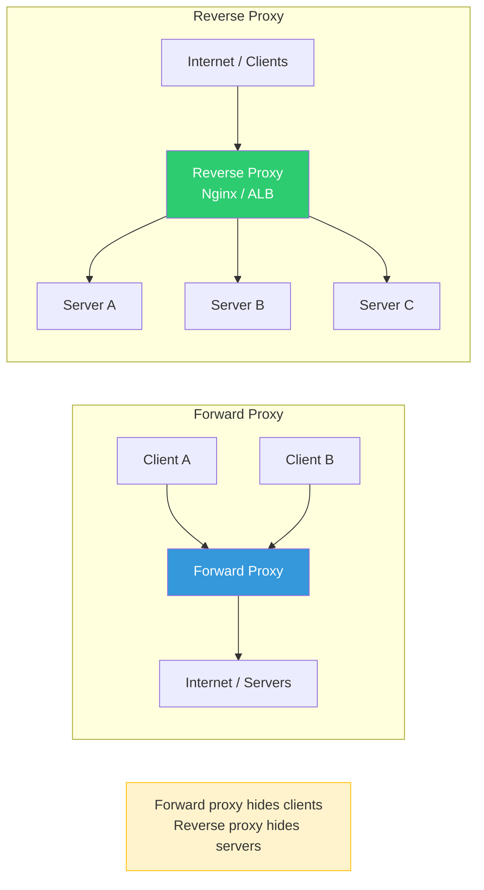

# Reverse Proxy

## Why This Topic Exists

The term "reverse proxy" appears in almost every system design discussion. Nginx, the most popular web server in the world, is most commonly used as a reverse proxy, not as a web server. Load balancers, API gateways, and CDNs are all types of reverse proxies. Yet many developers are fuzzy on what a reverse proxy actually is, how it differs from a forward proxy, and how it relates to a load balancer.

This file gives you a clear, foundational understanding of reverse proxies — what they do, why they exist, and what features they provide beyond simple load distribution.

---

## Learning Objectives

By the end of this file you will be able to:

- Explain what a reverse proxy is and what problem it solves
- Describe the difference between a forward proxy and a reverse proxy
- List at least five benefits that a reverse proxy provides
- Explain why Nginx is often used as a reverse proxy
- Explain how a reverse proxy differs from a load balancer
- Describe SSL termination, compression, caching, and logging as reverse proxy features

---

## Prerequisites

- [01. What is a Load Balancer](./01.%20What%20is%20a%20Load%20Balancer%20(BEGINNER).md) — A load balancer is a specialized reverse proxy. Understanding what an LB does makes the reverse proxy concept easier.
- Basic understanding of HTTP requests and DNS

---

## Introduction

A **proxy** is an intermediary — something that sits between two parties and acts on their behalf. When it comes to computer networks, a proxy receives requests from one side and forwards them to the other side.

There are two types of proxies in networking:

- A **forward proxy** sits in front of **clients**. It intercepts requests going out from a group of clients to the internet.
- A **reverse proxy** sits in front of **servers**. It intercepts requests coming in from the internet to a group of servers.

The "forward" and "reverse" terminology refers to which side the proxy is hiding. A forward proxy hides the clients from the internet. A reverse proxy hides the servers from the internet.

In system design, when people say "proxy" without qualification, they almost always mean a reverse proxy.

---

## Real-World Analogy

Imagine you stay at a luxury hotel. You want coffee, a restaurant reservation, and a taxi — three different services handled by three different teams. You do not call each team directly. You call the hotel concierge.

The concierge takes your request, figures out who to contact internally, calls the right team, and reports back to you with the result. From your perspective, the concierge is the hotel. You do not know or care how many internal teams exist, which team handled your coffee, or what their phone numbers are.

The concierge is the **reverse proxy**. You (the client) only ever interact with the concierge. The internal teams (the backend servers) are hidden from you. The concierge also provides extra services: they track all requests in a log, they handle communication in a standard format regardless of which team is involved, and they can prioritize VIP guests (rate limiting).

---

## Core Concepts

### What a Reverse Proxy Does

When a client makes a request:
1. The request goes to the reverse proxy (the client connects to the proxy's IP/domain).
2. The proxy receives the full request.
3. The proxy forwards the request to the appropriate backend server.
4. The backend server processes the request and sends the response to the proxy.
5. The proxy forwards the response back to the client.

From the client's perspective, it is talking directly to the server. The proxy is transparent. The client does not know there is a proxy, does not know how many servers exist behind it, and does not know which specific server handled its request.

### Forward Proxy vs Reverse Proxy

This comparison trips up a lot of candidates. Study this table carefully:

| Aspect | Forward Proxy | Reverse Proxy |
|--------|--------------|---------------|
| Sits in front of | Clients | Servers |
| Hides | Clients from the internet | Servers from clients |
| Configured by | The client (or the client's network admin) | The server-side infrastructure team |
| Client awareness | Client knows it is using a proxy | Client does NOT know a proxy exists |
| Common uses | Corporate internet filtering, anonymity (VPNs, Tor), bypassing geo-restrictions | Load balancing, SSL termination, caching, security |
| Examples | Squid proxy, corporate web gateway, VPN | Nginx, HAProxy, AWS ALB, Cloudflare |
| Who knows the real server's IP? | The proxy knows; the client may not | The proxy knows; the client never does |

**Memory trick**: A forward proxy is a proxy for the **client** (forward = going forward, out to the internet). A reverse proxy is a proxy for the **server** (reverse = going backward, receiving from the internet).

---

## Visual Diagram (Mermaid)



---

## Deep Explanation

### Benefits of a Reverse Proxy

A reverse proxy does much more than simply forwarding requests. Here are the key capabilities:

#### 1. Load Balancing

A reverse proxy can distribute requests across multiple backend servers. This is such a common use case that many people conflate "reverse proxy" with "load balancer." In reality, a load balancer is a **specialized reverse proxy** whose primary function is traffic distribution. A reverse proxy is a broader concept that includes load balancing as one of its features.

#### 2. SSL Termination

Clients connect to the reverse proxy over HTTPS (encrypted). The proxy decrypts the request and forwards it to backend servers over plain HTTP on the internal network. This means:
- Backend servers do not need to manage SSL certificates
- Certificate renewal happens in one place
- Backend servers save CPU cycles by not doing encryption/decryption

#### 3. Compression

The reverse proxy can compress HTTP responses (using gzip or Brotli) before sending them to clients. This reduces bandwidth usage and speeds up page loads. Backend servers return uncompressed responses; the proxy handles compression transparently. You configure compression once at the proxy, not on each backend server.

#### 4. Caching

The reverse proxy can cache backend responses. If 100 users request the same product image or static HTML page, the proxy can serve the cached version without hitting the backend server for requests 2 through 100. This reduces backend load dramatically.

Caching at the reverse proxy is different from caching at a CDN. A reverse proxy cache is typically a single location serving users who connect to that proxy. A CDN cache is distributed globally.

#### 5. Security and DDoS Protection

The reverse proxy is the only component that receives direct connections from the internet. Backend servers are never exposed to the public. This means:
- The proxy can block malicious IPs before they reach the application
- Backend servers do not need public IP addresses
- The attack surface is reduced to the proxy
- WAF (Web Application Firewall) rules can be applied at the proxy
- Rate limiting can stop brute-force attacks before they hit the app

#### 6. Logging and Observability

Every request passes through the reverse proxy. This makes it the ideal place to log all traffic: who requested what, when, how long it took, what response was returned. You get centralized access logs without modifying each backend application.

#### 7. Header Manipulation

The reverse proxy can add, remove, or modify HTTP headers. Common uses:
- Add `X-Forwarded-For: <real-client-ip>` so backends know the original client IP (since from the backend's view, all requests come from the proxy's IP)
- Add `X-Request-ID: <uuid>` for request tracing across microservices
- Remove sensitive internal headers before sending responses to clients
- Add CORS headers centrally without modifying each backend

#### 8. A/B Testing and Canary Deployments

By routing a percentage of traffic to a new version of the application, the reverse proxy enables gradual rollouts. "Send 5% of traffic to v2, 95% to v1" is a single configuration change at the proxy. If v2 is stable, shift to 50/50, then 100% v2.

---

### Nginx as a Reverse Proxy

Nginx is the most widely used reverse proxy in the world. Originally built as a high-performance web server, it is now most commonly deployed as a reverse proxy. Here is a minimal Nginx configuration that acts as a reverse proxy:

```nginx
server {
    listen 443 ssl;
    server_name api.myapp.com;

    # SSL termination
    ssl_certificate /etc/nginx/certs/myapp.crt;
    ssl_certificate_key /etc/nginx/certs/myapp.key;

    # Enable gzip compression
    gzip on;

    location / {
        # Forward requests to backend servers (load balancing)
        proxy_pass http://backend_pool;

        # Pass real client IP to backend
        proxy_set_header X-Forwarded-For $remote_addr;
        proxy_set_header Host $host;

        # Cache static responses for 10 minutes
        proxy_cache_valid 200 10m;
    }
}

upstream backend_pool {
    server 10.0.1.1:8080;
    server 10.0.1.2:8080;
    server 10.0.1.3:8080;
}
```

This single Nginx configuration does: SSL termination, load balancing, compression, caching, and header forwarding. All of these features work without any changes to the backend application code.

---

### Reverse Proxy vs Load Balancer

This is one of the most common points of confusion:

| | Reverse Proxy | Load Balancer |
|--|--------------|---------------|
| Primary purpose | Intermediary between clients and servers | Distribute traffic across multiple servers |
| Can do load balancing? | Yes (most reverse proxies support it) | Yes (that's its primary job) |
| Can do SSL termination? | Yes | Often yes (especially L7 LBs) |
| Can do caching? | Yes | Rarely (LBs don't usually cache) |
| Can do compression? | Yes | Rarely |
| Can do header modification? | Yes | L7 LBs can, L4 LBs cannot |
| Is a load balancer a reverse proxy? | A load balancer IS a specialized reverse proxy | Yes |
| Is a reverse proxy a load balancer? | Not necessarily — it could forward to just one server | A dedicated LB is not a general reverse proxy |

**The clean answer**: Every load balancer is a type of reverse proxy. Not every reverse proxy is a load balancer. A reverse proxy with only one backend server is not doing load balancing, but it is still providing SSL termination, compression, caching, and security.

---

## Step-by-Step Example

### Setting Up Nginx as a Reverse Proxy for a Node.js Application

**Scenario**: You have a Node.js API running on port 3000. You want it accessible on port 443 with SSL, compression, and request logging.

**Without Nginx**: Clients connect directly to Node.js on port 3000. No SSL, no compression, no centralized logging. The Node.js port must be publicly accessible.

**With Nginx**:

1. Nginx listens on port 443. Node.js listens on port 3000 (localhost only, not public).
2. Client connects to Nginx on port 443. Nginx performs TLS handshake.
3. Nginx decrypts the request and forwards it to `localhost:3000`.
4. Node.js processes the request and responds with plain HTTP.
5. Nginx receives the response, compresses it with gzip, and sends it to the client over TLS.
6. Nginx logs the request: timestamp, IP, URL, status code, response time.

The Node.js app is never exposed directly to the internet. Port 3000 is only accessible locally.

---

## Advantages / Disadvantages / Trade-offs

### Advantages

- **Security**: Backend servers are never directly exposed to the internet
- **Centralized SSL**: One place to manage certificates
- **Performance**: Caching and compression improve response times and reduce backend load
- **Observability**: Centralized access logs without touching application code
- **Flexibility**: A/B testing, canary deployments, header manipulation — all without app changes
- **Protocol translation**: Can translate HTTPS to HTTP, HTTP/2 to HTTP/1.1, etc.

### Disadvantages

- **Single point of failure**: If the reverse proxy crashes, all traffic stops (mitigated by running multiple proxy instances)
- **Added latency**: One extra network hop (typically under 1ms for local network)
- **Configuration complexity**: Nginx and HAProxy configs can be complex and error-prone
- **Debugging difficulty**: When something goes wrong, is the bug in the app or the proxy?

### Trade-offs

**Caching at the proxy vs Application caching**: Proxy caching is fast and easy to configure but gives you less control. Application-level caching (Redis) is more flexible but requires code changes.

**Centralized vs Distributed**: A single reverse proxy is simple but is a single point of failure. Running multiple proxy instances adds resilience but requires a mechanism to distribute traffic between them (see file 06).

---

## When to Use / When NOT to Use

### Use a Reverse Proxy When:

- You want to hide backend server IPs and reduce attack surface
- You need SSL termination in a single place
- You need caching of static or semi-static responses
- You need compression (gzip/Brotli) for bandwidth savings
- You want centralized access logging
- You want to do A/B testing or canary deployments without application changes

### Do NOT Use a Reverse Proxy When:

- You are building a very simple system where the overhead is not justified (e.g., internal tool with 10 users)
- Your application already handles SSL, compression, and caching — adding a proxy just for the sake of it adds unnecessary complexity
- You are dealing with non-HTTP protocols that the proxy does not support

---

## Common Interview Questions

**Q: What is the difference between a forward proxy and a reverse proxy?**
A: A forward proxy sits in front of clients and hides them from the internet (e.g., corporate filtering proxy). A reverse proxy sits in front of servers and hides them from clients (e.g., Nginx in front of a web application). The client knows it is using a forward proxy; it does not know a reverse proxy exists.

**Q: Is a load balancer a reverse proxy?**
A: Yes. A load balancer is a specialized reverse proxy whose primary function is distributing traffic across multiple servers. Not every reverse proxy is a load balancer — a reverse proxy with one backend server is not load balancing.

**Q: What is SSL termination and why do it at the reverse proxy?**
A: SSL termination is when the reverse proxy handles the HTTPS encryption/decryption, allowing backend servers to communicate over plain HTTP. This offloads TLS CPU overhead from application servers and centralizes certificate management.

**Q: What does the `X-Forwarded-For` header do?**
A: It carries the original client IP address in proxied requests. Since the backend sees all requests coming from the proxy's IP, `X-Forwarded-For` tells it who the real client is.

---

## Common Beginner Mistakes

- **Confusing forward and reverse proxies**: Remember — forward proxy hides clients, reverse proxy hides servers.
- **Assuming a reverse proxy is only useful with multiple backend servers**: Even with a single backend, a reverse proxy provides SSL termination, compression, caching, security, and logging.
- **Forgetting the `X-Forwarded-For` header**: Without it, backend servers think all traffic comes from the proxy's IP, breaking IP-based logic, logging, and rate limiting.
- **Not making the reverse proxy itself highly available**: If the proxy is a single instance, it is a single point of failure. Run at least two and use DNS or an upstream L4 LB to distribute between them.
- **Conflating Nginx-as-web-server with Nginx-as-proxy**: Nginx can serve static files directly OR act as a proxy. In most production setups, it does both. Know which mode you are using.

---

## Summary

A reverse proxy sits in front of backend servers and acts as the single point of contact for clients. The client has no visibility into the servers behind the proxy. A forward proxy hides clients from the internet; a reverse proxy hides servers from clients. Reverse proxies provide SSL termination, compression, caching, security, logging, and header manipulation — all without modifying backend application code. Nginx is the most popular reverse proxy. Every load balancer is a type of reverse proxy, but not every reverse proxy is a load balancer.

---

## Key Takeaways

- A reverse proxy hides servers; a forward proxy hides clients.
- Reverse proxies provide SSL termination, caching, compression, logging, and DDoS protection.
- Every load balancer is a type of reverse proxy.
- Nginx and HAProxy are the most popular open-source reverse proxies.
- The `X-Forwarded-For` header preserves the real client IP through a proxy.
- Backend servers behind a reverse proxy never need public IP addresses.

---

## Related Topics

- [01. What is a Load Balancer](./01.%20What%20is%20a%20Load%20Balancer%20(BEGINNER).md) — Load balancers are a type of reverse proxy
- [03. Layer 4 vs Layer 7 Load Balancing](./03.%20Layer%204%20vs%20Layer%207%20Load%20Balancing%20(INTERMEDIATE).md) — Layer 7 LBs are full reverse proxies; Layer 4 LBs are not
- [05. Global Load Balancing and Anycast](./05.%20Global%20Load%20Balancing%20and%20Anycast%20(INTERMEDIATE).md) — CDNs use reverse proxies at edge locations worldwide
- [06. Load Balancer High Availability](./06.%20Load%20Balancer%20High%20Availability%20(INTERMEDIATE).md) — Making the reverse proxy itself highly available
- [Chapter 05: Caching](../05.%20Caching/README.md) — Reverse proxy caching is one layer in a broader caching strategy
