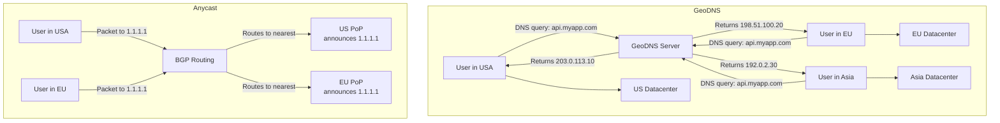

# Global Load Balancing and Anycast

## Why This Topic Exists

A single load balancer in one datacenter can distribute traffic across many servers — but all of those servers are in the same physical location. If a user in Tokyo connects to a datacenter in Virginia, their requests travel across the Pacific Ocean on every single round trip. That is 150–200ms of latency added to every API call, just from physics.

Global load balancing solves this by routing each user to the datacenter or region that is physically closest to them. It also solves the bigger problem of regional failures — if an entire AWS region goes down, global load balancing can automatically redirect all traffic to another region.

This topic is essential for designing globally distributed systems like Netflix, Cloudflare, Google, and any product that serves users in multiple countries.

---

## Learning Objectives

By the end of this file you will be able to:

- Explain why single-region load balancing is insufficient for global applications
- Describe DNS-based load balancing and its limitations
- Explain GeoDNS and how it routes users based on geographic location
- Explain Anycast routing and how it differs from DNS-based routing
- Describe what Global Server Load Balancing (GSLB) is
- Compare active-active and active-passive multi-datacenter setups
- Explain how cross-region failover works
- Describe how Netflix and Cloudflare use global routing in production

---

## Prerequisites

- [01. What is a Load Balancer](./01.%20What%20is%20a%20Load%20Balancer%20(BEGINNER).md) — You need to understand single-region LB first.
- [03. Layer 4 vs Layer 7 Load Balancing](./03.%20Layer%204%20vs%20Layer%207%20Load%20Balancing%20(INTERMEDIATE).md) — Global LB uses both L4 and L7 concepts.
- Basic DNS knowledge — understand that a domain name resolves to an IP address via DNS.

---

## Introduction

Every major internet service uses multiple datacenters spread across the world. This serves two purposes:

1. **Latency reduction**: Put servers physically close to users so requests travel shorter distances.
2. **Fault tolerance**: If one datacenter fails, others continue serving traffic.

To achieve both, you need a mechanism that answers the question: "For this specific user, which datacenter should receive their traffic?" The answer involves Global Server Load Balancing, DNS-based techniques, and at the network infrastructure level, Anycast routing.

---

## Real-World Analogy

Imagine you are a global fast food chain. A customer in London and a customer in Tokyo both call the same customer service number. Rather than routing both calls to a single call center in New York, you have call centers in London, Tokyo, and New York. When the London customer calls, the phone company automatically connects them to the London center. When the Tokyo customer calls, they go to the Tokyo center.

This is exactly what global load balancing does. The "phone company routing logic" is DNS or Anycast. The "call centers" are datacenters. The "same phone number" is your single domain name (e.g., `api.myapp.com`).

---

## Core Concepts

### 1. The Latency Problem

The speed of light is roughly 200,000 km per second through fiber optic cable. A request from a user in Tokyo to a server in Virginia travels roughly 11,000 km each way. That is:

- One-way trip: ~55ms
- Round-trip: ~110ms minimum (and real-world routing adds more)

For a web page that makes 20 API calls, that is 2,200ms of pure latency. Adding a datacenter in Tokyo reduces that round-trip to ~10ms — a 10x improvement.

### 2. DNS-Based Load Balancing

The simplest form of global load balancing is returning different IP addresses from DNS based on the user's location.

**Standard DNS** returns the same IP to everyone:
```
api.myapp.com → 203.0.113.10  (Virginia datacenter, returned to all users)
```

**DNS-based load balancing** returns multiple IPs and clients rotate through them:
```
api.myapp.com → 203.0.113.10, 203.0.113.11, 203.0.113.12
```

This distributes load but does not consider geography or server health.

**Limitations of basic DNS LB**:
- DNS responses are cached by clients and intermediate resolvers (TTL problem). If a server goes down, it takes TTL seconds for the DNS change to propagate. With TTLs of 5 minutes, clients can be directed to a dead server for up to 5 minutes.
- Clients pick an IP from the list in order (or randomly) — they do not pick based on proximity.
- DNS has no health awareness — it does not know if a server is down.

### 3. GeoDNS (Geographic DNS)

GeoDNS is an extension of DNS that returns different IP addresses based on the geographic location of the DNS resolver making the query.

```
User in US (resolving via 8.8.8.8 in US) → api.myapp.com → 203.0.113.10  (US datacenter)
User in EU (resolving via 1.1.1.1 in Germany) → api.myapp.com → 198.51.100.20  (EU datacenter)
User in Asia (resolving via resolver in Tokyo) → api.myapp.com → 192.0.2.30  (Asia datacenter)
```

The same domain name returns different IPs depending on where the query comes from. From the user's perspective, it all just works.

**Important limitation**: GeoDNS routes based on the **resolver's** location, not the user's exact location. A user in rural France using a resolver in London gets routed to the European datacenter. This is usually fine, but it means geographic routing is approximate, not exact.

**GeoDNS with health checks**: Advanced providers like AWS Route 53 Latency Routing, Cloudflare, and NS1 combine GeoDNS with health checks. If the US datacenter fails its health check, the DNS provider stops returning the US IP and routes US users to the next-best datacenter (say, EU) until the US datacenter recovers.

### 4. Anycast Routing

Anycast is a network routing technique where the **same IP address is announced from multiple physical locations**. The internet's routing protocols (BGP) automatically route each user to the closest location announcing that IP.

**How it works**:
- Cloudflare has 300+ datacenters worldwide.
- All of them announce the same IP address: `1.1.1.1`.
- When a user in Tokyo sends a packet to `1.1.1.1`, BGP routers around the internet automatically choose the path to the closest Cloudflare datacenter (likely in Tokyo or Singapore).
- When a user in London sends a packet to `1.1.1.1`, BGP routes them to the closest European Cloudflare datacenter.
- Neither user needed to do anything special. The IP address is the same for both.

**Key difference from GeoDNS**: Anycast operates at the **network layer (Layer 3)**, not the DNS layer. The routing decision is made by internet routers, not by DNS. There is no DNS TTL delay — routing adjusts instantly when a datacenter goes down, because BGP withdraws the route announcement for that location.

**Anycast failover**: If a datacenter fails, it stops announcing the IP via BGP. Within seconds, internet routers update their routing tables and start sending traffic to the next closest location. This is much faster than DNS-based failover.

**Cloudflare's architecture**: When you use Cloudflare, your domain resolves to a Cloudflare Anycast IP. Users worldwide are automatically routed to the nearest Cloudflare Point of Presence (PoP). Cloudflare then proxies the request from that PoP to your origin server. This is how Cloudflare provides both DDoS protection and latency reduction globally.

---

## Visual Diagram (Mermaid)



---

## Deep Explanation

### Global Server Load Balancing (GSLB)

GSLB is a comprehensive solution that combines DNS routing, health checks, geographic awareness, and load balancing across multiple datacenters. It is typically implemented by:

- **Cloud providers**: AWS Global Accelerator, AWS Route 53 with latency routing, Azure Traffic Manager, GCP Cloud Load Balancing
- **CDN/security providers**: Cloudflare, Akamai, Fastly
- **Dedicated appliances**: F5 GSLB, Citrix GSLB

GSLB continually monitors:
- Is each datacenter healthy? (health checks)
- What is the latency from various regions to each datacenter? (latency measurements)
- What is the capacity of each datacenter? (to avoid overloading one region)

It then dynamically adjusts DNS responses or BGP announcements to route users to the optimal datacenter for their location and for the current health/capacity situation.

### Active-Active vs Active-Passive Datacenters

When running multiple datacenters, you must decide whether all of them serve traffic simultaneously or whether some are on standby.

**Active-Active**:
- All datacenters serve live traffic simultaneously
- Users are distributed across all regions
- If one region fails, its traffic is redistributed among the remaining active regions
- Higher utilization — you are using all your capacity all the time
- More complex — you need data replication, conflict resolution, and session handling across all regions
- Example: Netflix routes users to the nearest AWS region but all regions are active

**Active-Passive**:
- One (or more) regions serve all traffic; others are on standby with minimal traffic
- If the primary fails, traffic is switched to the standby
- Simpler — less data synchronization needed
- Lower utilization — standby capacity is idle most of the time
- Higher cost per unit of traffic served
- Longer failover time — seconds to minutes depending on how quickly DNS or BGP updates propagate

**Which to choose**:

| Criteria | Active-Active | Active-Passive |
|----------|-------------|----------------|
| Global user base | Preferred | Less efficient |
| Data consistency requirements | Complex — need strong replication | Simpler |
| Cost efficiency | Better (use all capacity) | Worse (standby is idle) |
| Failover speed | Near-instant (BGP/Anycast) | Seconds to minutes (DNS TTL) |
| Complexity | High | Medium |
| Example use case | Netflix, Google, Cloudflare | Many enterprise applications |

### Cross-Region Failover

When a datacenter or entire region fails:

**DNS-based failover**:
1. GSLB health checker detects the region is down
2. GSLB stops returning the failed region's IP in DNS responses
3. Users are directed to the healthy region
4. Delay: equal to DNS TTL (typically 30 seconds to 5 minutes)

**Anycast-based failover**:
1. Failed datacenter stops announcing the Anycast IP via BGP
2. BGP routers update their routing tables
3. Traffic is routed to the next-closest location
4. Delay: BGP convergence, typically 30-120 seconds

**Pre-warming standby regions**: In an active-passive setup, switching all traffic to a cold standby region can overwhelm it. Best practice is to keep the passive region "warm" by sending a small percentage of traffic to it at all times, so it has JIT-compiled code, warm caches, and pre-established database connections.

---

## Step-by-Step Example

### Netflix Global Routing

Netflix serves hundreds of millions of users worldwide and uses Open Connect, its own CDN, combined with AWS multi-region deployment. Here is a simplified view:

1. A user in Germany opens the Netflix app.
2. The app makes a DNS query for the Netflix API endpoint.
3. AWS Route 53 with latency routing responds with the IP of the Frankfurt (eu-central-1) AWS region, which has the lowest latency to this user.
4. The request reaches the eu-central-1 load balancer.
5. The LB distributes the request across backend microservices in Frankfurt.
6. For video streaming, the user's device connects to an Open Connect Appliance (OCA) — a Netflix CDN node placed inside the user's ISP — which serves the video bytes locally.
7. If eu-central-1 is degraded (say, a widespread AWS incident), Route 53's health checks detect the failure and start returning the IP of eu-west-1 (Ireland) instead.
8. Users experience a brief disruption but are automatically moved to the backup region.

---

## Advantages / Disadvantages / Trade-offs

### GeoDNS

| | GeoDNS |
|--|--------|
| Advantages | Simple to configure via DNS providers, no special hardware needed, widely supported |
| Disadvantages | Routing based on resolver location (approximate), TTL delays on failover, clients can cache stale answers |
| Best for | Reducing latency for global user bases, simpler architectures |

### Anycast

| | Anycast |
|--|--------|
| Advantages | Fastest failover (BGP-level), exact routing to nearest PoP, no DNS TTL delays |
| Disadvantages | Requires BGP control (only available from large providers or with your own AS number), complex to set up |
| Best for | DDoS mitigation, DNS servers, CDNs, any infrastructure requiring ultra-fast failover |

---

## When to Use / When NOT to Use

### Use Global Load Balancing When:
- Your users are distributed across multiple continents and latency matters
- You need disaster recovery at the datacenter or region level
- You are running a service where downtime in any region is unacceptable
- Your business has data residency requirements (EU users must be served from EU infrastructure)

### Do NOT Use Global LB When:
- Your users are all in one region — intra-region LB is sufficient
- Your data model makes multi-region replication too complex (some relational database workloads)
- You are early-stage and the added complexity is premature

---

## Common Interview Questions

**Q: How does Netflix route users to the nearest datacenter?**
A: Netflix uses AWS Route 53 with latency-based routing (a form of GeoDNS). DNS returns the IP of the AWS region with the lowest measured latency for the user's resolver. Health checks ensure failed regions are removed from rotation.

**Q: What is Anycast and how does it differ from GeoDNS?**
A: Anycast announces the same IP from multiple physical locations. Internet routing (BGP) automatically directs traffic to the nearest location. GeoDNS returns different IPs based on resolver geography. Anycast operates at the network layer; GeoDNS at the DNS layer. Anycast failover is faster (BGP convergence, ~30-60s) than DNS failover (TTL-dependent, 30s to 5min).

**Q: What is the TTL problem with DNS-based global load balancing?**
A: DNS responses are cached by resolvers and clients for the duration of the TTL. If a server goes down, the DNS change takes up to TTL seconds to propagate. During that window, clients may still be directed to the dead server. Short TTLs (30s) reduce this window but increase DNS query load.

**Q: What is the difference between active-active and active-passive multi-datacenter setups?**
A: In active-active, all datacenters serve live traffic simultaneously. In active-passive, only the primary serves traffic; the secondary waits on standby and only takes over on failure. Active-active is more efficient and faster to fail over but more complex. Active-passive is simpler but wastes the passive capacity.

---

## Common Beginner Mistakes

- **Thinking GeoDNS is perfectly geographic**: GeoDNS routes based on the resolver's location, not the user's. A user in Poland using Google's DNS resolver (located in Germany) gets routed to EU datacenter, not necessarily the closest EU city.
- **Setting DNS TTL too high**: Long TTLs mean slower failover. Keep TTLs at 30-60 seconds for active LB records so failover happens quickly.
- **Not pre-warming standby regions**: Suddenly sending all traffic to a cold passive region can cause cascading failures. Always keep passive regions warm.
- **Forgetting data replication**: Global routing is only half the problem. If a user's data is in the US datacenter and they get routed to EU, the EU servers need access to that data. Data replication strategy is as important as traffic routing strategy.
- **Confusing CDN with Global LB**: A CDN caches static content at edge locations. GSLB routes API and dynamic traffic to the right datacenter. They are complementary, not interchangeable.

---

## Summary

Single-region load balancing does not address the latency that comes from users being far from your datacenter, nor does it provide cross-region fault tolerance. Global load balancing solves both problems. GeoDNS returns different IP addresses based on the user's region. Anycast announces the same IP from multiple locations and lets BGP route to the nearest one — faster failover, no TTL delays. GSLB combines health checks, latency measurement, and geographic awareness to direct users to the optimal datacenter. Active-active deployments use all regions simultaneously; active-passive keeps a backup on standby. Netflix uses Route 53 latency routing; Cloudflare uses Anycast.

---

## Key Takeaways

- GeoDNS routes users to different IPs based on their DNS resolver's geography.
- Anycast uses the same IP at multiple locations — BGP routes to the nearest one.
- Anycast failover is faster than DNS failover because there is no TTL delay.
- Active-active is more efficient; active-passive is simpler.
- Keep DNS TTL low (30-60s) for fast failover.
- Always pre-warm standby regions and replicate data before relying on failover.
- Cloudflare uses Anycast; Netflix uses GeoDNS (Route 53 latency routing).

---

## Related Topics

- [01. What is a Load Balancer](./01.%20What%20is%20a%20Load%20Balancer%20(BEGINNER).md) — Single-region LB is the foundation
- [03. Layer 4 vs Layer 7 Load Balancing](./03.%20Layer%204%20vs%20Layer%207%20Load%20Balancing%20(INTERMEDIATE).md) — Anycast operates at L3/L4; GSLB uses L7 for health checks
- [06. Load Balancer High Availability](./06.%20Load%20Balancer%20High%20Availability%20(INTERMEDIATE).md) — HA within a region; this file covers HA across regions
- [Chapter 09: CDN](../09.%20CDN/README.md) — CDNs use Anycast and global routing for static content
- [Chapter 11: Disaster Recovery](../11.%20Disaster%20Recovery/README.md) — Cross-region failover is a core DR strategy
