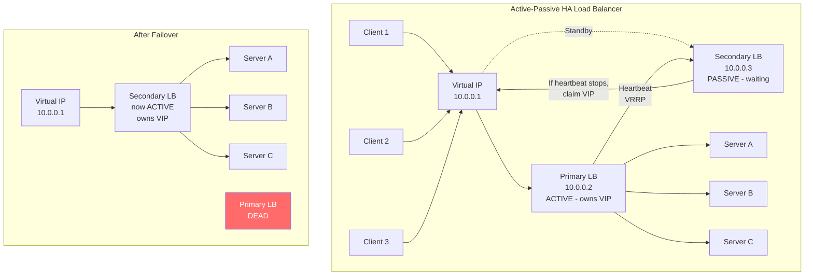

# Load Balancer High Availability

## Why This Topic Exists

You have learned that a load balancer distributes traffic across multiple backend servers so that no single server is a point of failure. But here is the uncomfortable question: what happens if the load balancer itself crashes?

If you have one load balancer and it goes down, every single backend server behind it becomes unreachable. Your entire application is down. The tool you deployed to eliminate single points of failure has itself become the biggest single point of failure in your system.

This topic is about solving that problem — how to make the load balancer itself highly available so it can fail, be upgraded, or be scaled without causing downtime. This is a senior-level topic that appears in staff engineer interviews and in real production architectures.

---

## Learning Objectives

By the end of this file you will be able to:

- Explain why a load balancer can be a single point of failure
- Describe the active-passive HA setup using a Virtual IP (VIP)
- Explain what VRRP and keepalived are and how they work
- Describe the active-active HA setup and its complexity
- Explain how AWS ELB handles high availability transparently
- Answer the meta question: "How do you load balance the load balancers?"

---

## Prerequisites

- [01. What is a Load Balancer](./01.%20What%20is%20a%20Load%20Balancer%20(BEGINNER).md) — Foundation: what a load balancer is and why it is used.
- [04. Reverse Proxy](./04.%20Reverse%20Proxy%20(BEGINNER).md) — Understanding that load balancers are a type of proxy helps when thinking about the traffic flow.
- [05. Global Load Balancing and Anycast](./05.%20Global%20Load%20Balancing%20and%20Anycast%20(INTERMEDIATE).md) — Cross-region HA concepts complement intra-region LB HA.
- Basic networking: IP addresses, network interfaces.

---

## Introduction

In the early lessons of this chapter, you learned about health checks — the load balancer pings each backend server and removes failing ones from the pool. This is great for backend server failures. But what monitors the load balancer? Who removes the load balancer from the pool if it fails?

For the load balancer to be highly available, it must not be a single instance. Just like your backend servers run in a pool of multiple instances, your load balancers should also run as a cluster. The challenge is different from backend servers, though. Backend servers are stateless (in a well-designed system) — any server can handle any request. Load balancers have a harder problem: all traffic enters through a single IP address, so you need to ensure that IP address always resolves to a working load balancer.

The solution involves a concept called a **Virtual IP address (VIP)**.

---

## Real-World Analogy

Imagine a security checkpoint at a building entrance. The building has one main entrance door, and all visitors must pass through it. A single guard manages the checkpoint. What happens if the guard falls ill?

You could have a second guard standing by. When the main guard becomes ill, the backup guard steps forward and takes over the exact same position at the door. Visitors do not need a new door or a new badge — everything looks the same to them. The transition is transparent.

The "entrance door" is the **Virtual IP (VIP)**. The "main guard" is the primary load balancer. The "backup guard" is the standby load balancer. The process of the backup stepping in is called **failover**. The protocol that coordinates the handoff is called **VRRP** (Virtual Router Redundancy Protocol).

---

## Core Concepts

### The Single Point of Failure Problem

Consider this setup:

```
Clients → LB (10.0.0.1) → Server A, Server B, Server C
```

- Clients connect to `10.0.0.1`.
- If `10.0.0.1` crashes, all clients lose connectivity.
- Backend servers A, B, C are all running, but unreachable because the entry point is gone.

This is the classic single point of failure. The LB that was supposed to provide high availability is itself not highly available.

### Virtual IP (VIP)

A VIP is an IP address that is not permanently tied to any single network interface or machine. Instead, it floats — it can be moved from one machine to another. At any given time, one machine "owns" the VIP by having it configured on its network interface. That machine receives all traffic destined for the VIP.

When a failover happens, the VIP is unconfigured from the failing machine and configured on the standby machine. From the network's perspective, the VIP is now at a different physical location (different MAC address), so a gratuitous ARP is sent to update the network's ARP cache. After this update, all traffic to the VIP flows to the new owner.

From the client's perspective, nothing changes. They still connect to the same IP address. The handoff is transparent.

---

## Visual Diagram (Mermaid)



---

## Deep Explanation

### Setup 1: Active-Passive with VRRP/keepalived

This is the most common on-premises HA load balancer setup.

**How it works**:

1. Two load balancer instances run on separate physical machines: LB1 (primary) and LB2 (standby).
2. A VIP (e.g., `10.0.0.1`) is configured on LB1. All clients point to this VIP.
3. LB1 and LB2 run **keepalived**, software that implements the VRRP protocol.
4. LB1 sends VRRP heartbeat packets to LB2 every second (by default).
5. LB2 receives these heartbeats and stays passive — it does not own the VIP.
6. If LB1 crashes or becomes unreachable, LB2 stops receiving heartbeats.
7. After a configurable timeout (typically 3 seconds), LB2 declares itself the new VRRP master.
8. LB2 configures the VIP (`10.0.0.1`) on its own network interface.
9. LB2 sends a **gratuitous ARP** broadcast: "Hey, `10.0.0.1` is now at my MAC address." Network switches and routers update their ARP tables.
10. All new and existing TCP connections to `10.0.0.1` now reach LB2.
11. Failover is typically complete in 3-5 seconds.

**What is VRRP?**: The Virtual Router Redundancy Protocol (RFC 5798) is a standard network protocol designed specifically for this use case. It was originally designed for router failover but is used for load balancer failover as well. keepalived is the most popular Linux implementation of VRRP.

**Limitations of Active-Passive**:
- LB2 is idle most of the time. You are paying for a full machine that does nothing during normal operation. This is about 50% wasted capacity.
- During the failover window (3-5 seconds), active TCP connections are dropped. New connections work immediately; existing long-lived connections (WebSockets, database connections held open) are lost.

### Setup 2: Active-Active Load Balancers

In an active-active setup, both LB1 and LB2 are actively handling traffic simultaneously. This eliminates the wasted standby capacity problem.

**Challenge**: If both LBs are handling traffic, how do clients know which LB to use? You cannot have two machines owning the same VIP simultaneously (that causes an ARP conflict). You need a mechanism above the LBs to distribute traffic between them.

**Solutions for active-active LB**:

**Option A: DNS Round Robin** — DNS returns both LB1 and LB2 IPs. Clients alternate between them. Simple, but slow failover (DNS TTL) and clients may keep hitting the dead LB for TTL seconds.

**Option B: Anycast** — Both LBs announce the same IP via BGP. Network routing handles distribution. This is how large providers like AWS, Cloudflare, and Google distribute traffic across their LB fleet. See file 05 for Anycast details.

**Option C: An upstream L4 LB** — Use a simple, ultra-lightweight L4 load balancer (or even a hardware load balancer) in front of your two software L7 load balancers. This pushes the problem up one level but the L4 LB is much simpler and less likely to fail.

**Session state in active-active**: If LB1 is tracking active connection counts (Least Connections algorithm) and LB2 is also tracking connection counts independently, their views are inconsistent. A connection established through LB1 is invisible to LB2's bookkeeping. To solve this:
- Use stateless algorithms (Round Robin, IP Hash) that do not need shared state between LBs.
- Or synchronize connection tables between LBs (complex, adds latency).

### How AWS ELB Handles High Availability

When you create an AWS Elastic Load Balancer (ALB, NLB, or CLB), you do not manage any of this yourself. AWS handles load balancer HA transparently:

1. **Multiple ELB nodes**: AWS creates multiple ELB nodes distributed across the Availability Zones you specify. An ALB in a 3-AZ region has at least one ELB node in each AZ.
2. **Single DNS name**: AWS gives you a DNS name like `myalb-123456.us-east-1.elb.amazonaws.com`. This DNS name resolves to the IP addresses of all active ELB nodes using DNS round robin.
3. **Automatic scaling**: AWS automatically scales the number of ELB nodes up and down based on traffic. During a traffic spike, more nodes are added. You do not see or manage this.
4. **Node replacement**: If an ELB node fails, AWS automatically replaces it. The DNS name stops returning the failed node's IP.
5. **Cross-zone load balancing**: By default (for ALB), each ELB node distributes traffic across backend servers in all AZs, not just its own. This ensures that even if one AZ has fewer healthy backends, traffic is evenly distributed.

The "how do you load balance the load balancers" question is answered by AWS using DNS round robin across multiple ELB nodes spread across AZs. The nodes themselves use Anycast internally.

### The Meta-Problem: Load Balancing Load Balancers

This is the philosophical problem at the heart of LB HA: you need something to distribute traffic across your LBs. That something is itself a potential point of failure. How do you stop the recursion?

In practice, this is solved at different levels of abstraction:

| Level | Solution |
|-------|----------|
| Very small scale | Active-passive with VRRP. One instance at a time, simple failover. |
| Medium scale | Active-active with DNS round robin. DNS TTL is the failure window. |
| Large scale (your own infrastructure) | Anycast — L3/BGP routing naturally distributes and fails over |
| Cloud (AWS/GCP/Azure) | Managed LB service handles this transparently using Anycast + DNS internally |

For most organizations, the cloud answer is the right one. Let AWS manage the HA of the ELB fleet. For on-premises or compliance-driven environments, VRRP/keepalived with active-passive, or a purpose-built HA solution like F5, is the standard.

---

## Step-by-Step Example

### Setting Up keepalived for Active-Passive HA Nginx

**Scenario**: Two Nginx reverse proxy servers. LB1 is primary, LB2 is standby. VIP is `10.0.0.1`.

**On LB1 (`/etc/keepalived/keepalived.conf`)**:
```
vrrp_instance VI_1 {
    state MASTER
    interface eth0
    virtual_router_id 51
    priority 100          # Higher priority = MASTER
    advert_int 1          # Send VRRP heartbeat every 1 second

    authentication {
        auth_type PASS
        auth_pass secretkey
    }

    virtual_ipaddress {
        10.0.0.1          # The VIP
    }
}
```

**On LB2 (`/etc/keepalived/keepalived.conf`)**:
```
vrrp_instance VI_1 {
    state BACKUP
    interface eth0
    virtual_router_id 51
    priority 90           # Lower priority = BACKUP
    advert_int 1

    authentication {
        auth_type PASS
        auth_pass secretkey
    }

    virtual_ipaddress {
        10.0.0.1          # Same VIP
    }
}
```

**What happens**:
1. Both machines start. LB1 has higher priority (100 > 90), so it becomes MASTER and owns `10.0.0.1`.
2. LB1 sends VRRP advertisements every second.
3. All clients connect to `10.0.0.1`, which reaches LB1.
4. LB1 crashes. keepalived on LB2 stops receiving advertisements.
5. After 3 advertisements are missed (~3 seconds), LB2 transitions to MASTER.
6. LB2 claims `10.0.0.1` on its `eth0` interface and sends a gratuitous ARP.
7. Traffic flows to LB2. Failover is complete.
8. LB1 is repaired and restarts. With higher priority, it preempts LB2 and reclaims MASTER status (if `nopreempt` is not configured).

---

## Advantages / Disadvantages / Trade-offs

### Active-Passive

| | Active-Passive |
|--|----------------|
| Advantages | Simple to configure, well-understood failure mode, only one LB processes traffic (no state sync needed) |
| Disadvantages | 50% capacity wasted, failover window of 3-5 seconds (dropped connections), standby machine costs money but does nothing |
| Best for | Smaller deployments, on-premises infrastructure, when simplicity matters |

### Active-Active

| | Active-Active |
|--|----------------|
| Advantages | Full capacity utilization, no single LB failure drops all traffic |
| Disadvantages | State synchronization complexity, harder to implement correctly, DNS round robin failover is slow |
| Best for | High-traffic systems, cloud deployments (AWS ELB handles this transparently) |

---

## When to Use / When NOT to Use

### Use HA Load Balancing When:
- Any downtime of the load balancer is unacceptable
- You are building a production system that users depend on
- You are serving traffic 24/7 and need zero-downtime LB upgrades

### Do NOT Use Complex HA Setup When:
- You are using a managed cloud LB (AWS ALB, GCP LB) — HA is already handled for you
- You are building an internal tool with low availability requirements
- You are in early development and have not yet reached production scale

---

## Common Interview Questions

**Q: If a load balancer distributes traffic to prevent single points of failure, what prevents the load balancer itself from being a single point of failure?**
A: Run multiple load balancer instances. Use a Virtual IP (VIP) that floats between them using VRRP/keepalived (active-passive), or use DNS round robin / Anycast to distribute traffic across multiple active LB instances.

**Q: What is a Virtual IP (VIP) and why is it used in load balancer HA?**
A: A VIP is an IP address that is not tied to a specific machine. It can be moved from one machine to another. In LB HA, the VIP is the address clients connect to. It normally lives on the primary LB. On failure, the VIP is moved to the standby LB, making the failover transparent to clients.

**Q: What is the difference between active-passive and active-active load balancer HA?**
A: In active-passive, only one LB handles traffic; the other is on standby. Simple but wastes capacity. In active-active, both LBs handle traffic simultaneously, using DNS round robin or Anycast to distribute between them. More efficient but requires care around state synchronization.

**Q: How does AWS ALB achieve high availability?**
A: AWS automatically creates multiple ALB nodes distributed across the specified Availability Zones. The ALB DNS name resolves to multiple node IPs via DNS round robin. AWS scales the number of nodes based on traffic and replaces failed nodes automatically. The user never manages this.

**Q: What is VRRP?**
A: The Virtual Router Redundancy Protocol. A standard protocol that enables a group of routers (or load balancers) to share a Virtual IP. One machine is the MASTER and owns the VIP. If the MASTER fails, a BACKUP takes over. keepalived is the most popular Linux implementation.

---

## Common Beginner Mistakes

- **Setting up LB HA but forgetting health checks on backends**: HA for the LB itself is separate from health checks on backend servers. Both are necessary.
- **Not accounting for the failover window**: Even with VRRP, there is a 3-5 second window where the VIP is being transferred. Design your client retry logic to handle brief connection failures.
- **Using active-passive when a cloud LB already handles it**: On AWS, ALB is already highly available. Adding your own keepalived setup in front of ALB is unnecessary complexity.
- **Expecting active-active to solve everything**: Active-active LBs with stateful algorithms (Least Connections) need state synchronization. Without it, load distribution is inaccurate. Use stateless algorithms (Round Robin, IP Hash) in active-active setups.
- **Forgetting that VIP failover drops active connections**: When the VIP moves, active TCP connections are reset. Long-lived connections (WebSockets, streaming) will be dropped. Clients must reconnect. Design your clients for this.

---

## Summary

A load balancer is itself a potential single point of failure. The standard solution is to run multiple load balancer instances with a floating Virtual IP (VIP). In an active-passive setup, the primary LB owns the VIP; keepalived/VRRP automatically moves the VIP to the standby on failure. In an active-active setup, both LBs handle traffic, distributed via DNS round robin or Anycast. AWS ELB handles all of this transparently by running multiple LB nodes across Availability Zones, scaling them automatically, and using internal Anycast. For on-premises environments, keepalived with VRRP is the industry standard for active-passive HA. The meta-question — who load balances the load balancers — is answered at each scale level differently, ultimately terminating at Anycast or managed cloud services.

---

## Key Takeaways

- One load balancer instance is a single point of failure — always run at least two.
- A Virtual IP (VIP) floats between LB instances to make failover transparent to clients.
- VRRP (implemented by keepalived) coordinates VIP ownership between LB nodes.
- Active-passive is simpler but wastes 50% capacity. Active-active is efficient but complex.
- AWS ALB is already highly available across AZs — you do not need to add keepalived on top.
- Active-passive failover drops active TCP connections during the 3-5 second handoff window.
- Design client retry logic to handle brief connectivity disruptions.

---

## Related Topics

- [01. What is a Load Balancer](./01.%20What%20is%20a%20Load%20Balancer%20(BEGINNER).md) — The foundation this topic builds on
- [04. Reverse Proxy](./04.%20Reverse%20Proxy%20(BEGINNER).md) — Reverse proxies have the same HA problem and the same solutions
- [05. Global Load Balancing and Anycast](./05.%20Global%20Load%20Balancing%20and%20Anycast%20(INTERMEDIATE).md) — Anycast is one solution to "how do you load balance the LBs"
- [Chapter 03: Scalability](../03.%20Scalability/README.md) — HA is a component of overall system reliability
- [Chapter 11: Disaster Recovery](../11.%20Disaster%20Recovery/README.md) — Cross-region HA extends these single-region HA concepts to full disaster recovery
