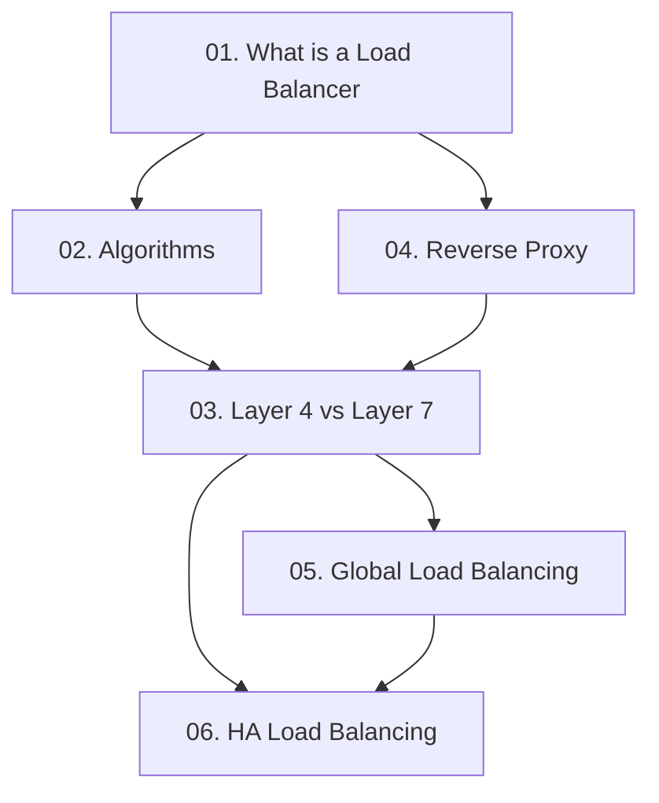

# Chapter 06: Load Balancing

## Why This Chapter Exists

When a single server handles all incoming traffic, it becomes a bottleneck. As user demand grows, that one server runs out of CPU, memory, or network bandwidth. Load balancing solves this by distributing traffic across multiple servers so that no single machine is overwhelmed. Understanding load balancing is essential for designing systems that are fast, reliable, and scalable.

This chapter takes you from the very basics — what a load balancer is and why you need one — all the way to advanced topics like global traffic distribution, high availability setups, and the difference between Layer 4 and Layer 7 load balancing. By the end, you will have the vocabulary and mental models needed to answer load balancing questions in system design interviews and to make sound architectural decisions at work.

## Learning Objectives

By the end of this chapter you will be able to:

- Explain what a load balancer is and why it is necessary
- Describe the most common load balancing algorithms and choose the right one for a given scenario
- Distinguish between Layer 4 and Layer 7 load balancing and know when to use each
- Understand what a reverse proxy is and how it differs from a load balancer
- Explain how global load balancing and Anycast routing work
- Design a highly available load balancer setup that eliminates the load balancer as a single point of failure

## Prerequisites

Before starting this chapter you should be comfortable with:

- Basic networking concepts (IP addresses, ports, TCP/UDP)
- What a web server is and how HTTP requests work
- The concept of horizontal scaling (adding more servers)
- DNS basics (how a domain name resolves to an IP address)

If any of these feel unfamiliar, review Chapter 02 (Networking Fundamentals) and Chapter 03 (Scalability) first.

## Chapter Overview

This chapter contains six files. They are ordered from beginner to intermediate. Read them in order the first time. Later you can jump to individual topics as needed.

---

## Topics in This Chapter

| File | Title | Level | Description |
|------|-------|-------|-------------|
| [01. What is a Load Balancer](./01.%20What%20is%20a%20Load%20Balancer%20(BEGINNER).md) | What is a Load Balancer | Beginner | The problem a load balancer solves, how it works as a traffic cop, health checks, SSL termination, and hardware vs software LBs |
| [02. Load Balancing Algorithms](./02.%20Load%20Balancing%20Algorithms%20(INTERMEDIATE).md) | Load Balancing Algorithms | Intermediate | Round Robin, Weighted Round Robin, Least Connections, Least Response Time, IP Hash, and Random — with a comparison table and guidance on when to use each |
| [03. Layer 4 vs Layer 7 Load Balancing](./03.%20Layer%204%20vs%20Layer%207%20Load%20Balancing%20(INTERMEDIATE).md) | Layer 4 vs Layer 7 Load Balancing | Intermediate | How transport-layer and application-layer load balancers differ, path-based routing, AWS NLB vs ALB, and cost/performance trade-offs |
| [04. Reverse Proxy](./04.%20Reverse%20Proxy%20(BEGINNER).md) | Reverse Proxy | Beginner | What a reverse proxy is, how it hides servers from clients, SSL termination, caching, compression, logging, and how it relates to a load balancer |
| [05. Global Load Balancing and Anycast](./05.%20Global%20Load%20Balancing%20and%20Anycast%20(INTERMEDIATE).md) | Global Load Balancing and Anycast | Intermediate | DNS-based load balancing, GeoDNS, Anycast routing, GSLB, active-active vs active-passive datacenters, and cross-region failover |
| [06. Load Balancer High Availability](./06.%20Load%20Balancer%20High%20Availability%20(INTERMEDIATE).md) | Load Balancer High Availability | Intermediate | Why the load balancer itself can be a single point of failure, active-passive and active-active HA setups, VRRP/keepalived, and how managed services like AWS ELB handle this |

---

## How These Topics Connect

Start with topic 01 to build the foundation. Topics 02 and 04 both build directly on 01. Topic 03 connects algorithms with the type of load balancer you choose. Topics 05 and 06 are advanced topics that assume you understand the basics well.

---

## Common Interview Questions Covered in This Chapter

- "How does a load balancer work?"
- "What load balancing algorithm would you use for long-lived connections like WebSockets?"
- "What is the difference between a Layer 4 and a Layer 7 load balancer?"
- "How would you route `/api` requests to one set of servers and `/static` to another?"
- "What is a reverse proxy and how is it different from a load balancer?"
- "How do you make a load balancer itself highly available?"
- "How does Cloudflare route traffic to the nearest datacenter?"
- "What is sticky session and why can it be a problem?"

---

## Key Terms to Know Before You Finish This Chapter

| Term | Plain-English Definition |
|------|--------------------------|
| Load Balancer | A device or software that distributes incoming requests across multiple servers |
| Health Check | A periodic ping from the LB to each server to verify it is still running |
| Round Robin | Send requests to servers in rotation: 1, 2, 3, 1, 2, 3... |
| Sticky Session | Always send requests from the same client to the same server |
| Reverse Proxy | A proxy that sits in front of servers and forwards client requests |
| Layer 4 LB | Routes based on IP and port only, does not inspect request content |
| Layer 7 LB | Inspects HTTP headers, URLs, and cookies to make routing decisions |
| Anycast | One IP address announced from multiple locations; traffic goes to the nearest one |
| GSLB | Global Server Load Balancing — routes users to the best datacenter worldwide |
| VIP | Virtual IP — a floating IP address that moves to a standby node on failover |
| VRRP | Virtual Router Redundancy Protocol — the standard way to implement VIP failover |
| Active-Passive | One node handles traffic; the other is on standby and takes over on failure |
| Active-Active | Both nodes handle traffic simultaneously |

---

## Recommended Reading Order

If you are new to system design, read every file in order (01 through 06). If you are preparing for an interview and have limited time, prioritize:

1. 01 (What is a Load Balancer) — always asked
2. 02 (Algorithms) — frequently asked
3. 03 (Layer 4 vs Layer 7) — intermediate interviews
4. 06 (HA) — senior-level interviews

---

## Related Chapters

- [Chapter 03: Scalability](../03.%20Scalability/README.md) — Load balancing enables horizontal scaling
- [Chapter 05: Caching](../05.%20Caching/README.md) — Load balancers and caches often sit together at the edge
- [Chapter 07: Databases](../07.%20Databases/README.md) — Database read replicas use similar distribution concepts
- [Chapter 09: CDN](../09.%20CDN/README.md) — CDNs use Anycast and global load balancing internally
