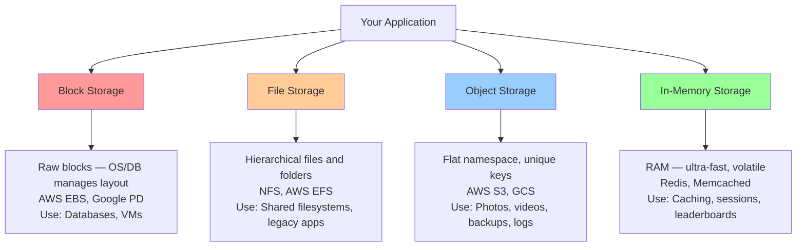

# Types of Storage

## Why This Topic Exists

Every piece of data you interact with — a photo you upload, a tweet you post, a video you stream — lives somewhere on a physical machine. But not all storage is the same. Some storage is optimized for raw speed, some for organizing files, some for storing billions of objects cheaply, and some for serving data in microseconds.

Engineers who do not understand the different types of storage make expensive mistakes: routing large video uploads through their application servers, storing session data in a slow database when Redis would be 100x faster, or picking file storage for a workload that needs object storage. This topic prevents those mistakes.

## Learning Objectives

By the end of this topic, you will be able to:

- Name the four major types of storage and describe what each one does
- Explain what block storage is and why databases use it
- Explain what object storage is and why companies like Instagram and YouTube use it
- Distinguish between file storage and object storage
- Know when to use in-memory storage and what its main limitation is
- Choose the right storage type for a given use case in an interview

## Prerequisites

- Basic understanding of what a hard drive is
- Know what RAM (memory) is and why it is faster than a disk
- Familiarity with what a database is

## Introduction

Imagine you are building Instagram. Users upload photos. You need to store those photos somewhere. Where do you put them? On a regular disk? In a database? In memory? On a distributed cluster?

The answer depends on the access pattern. Photos are large, infrequently updated, read by many users, and never need to be modified in place. You do not need to run SQL queries on them. You just need to store them and serve them back. That is a completely different problem from storing user account data, which is small, frequently updated, and queried in complex ways.

This is why different storage types exist. They are optimized for different problems.

## Real-World Analogy

Think about how you store things in real life:

- **Block storage** is like an empty plot of land. You own the land, but it has no structure. You decide what to build on it — a house, a parking lot, a garden. In computing, the operating system decides how to organize data on top of raw blocks.
- **File storage** is like a traditional filing cabinet. Files are organized into folders, which are organized into drawers. You can navigate by name. Simple and familiar.
- **Object storage** is like a giant Amazon warehouse. Each item has a unique barcode (key). Items are stored on shelves in no particular order. You retrieve an item by scanning its barcode — you do not need to know which shelf it is on.
- **In-memory storage** is like holding something in your hand. It is instantly accessible — no searching, no waiting. But if you drop it (power off), it is gone.

## Core Concepts

### Block Storage

Block storage provides raw storage capacity divided into fixed-size chunks called blocks. There is no file system on top of it — the operating system or application manages how data is organized.

Key characteristics:
- Low-level, raw access to disk
- The application (or OS) formats the block device with a file system (ext4, NTFS, etc.)
- Ideal for databases, because databases manage their own on-disk layout and do not want the overhead of a file system
- Accessed over a network using protocols like iSCSI or over a local bus
- Examples: AWS EBS (Elastic Block Store), Google Persistent Disk, a physical hard drive

### File Storage

File storage provides a hierarchical file system — files are organized in directories, directories can contain other directories. Multiple clients can access the same file system over a network.

Key characteristics:
- Familiar tree structure: /home/user/documents/report.pdf
- Supports standard file operations: open, read, write, seek, close
- Multiple machines can mount the same file system (NFS, SMB/CIFS)
- Easier to use than block storage, but less flexible
- Examples: NFS (Network File System), AWS EFS (Elastic File System), Samba shares

### Object Storage

Object storage stores data as discrete objects in a flat namespace. There are no directories or folders. Each object has a unique key (identifier), the data itself, and metadata (key-value pairs describing the object).

Key characteristics:
- Flat namespace — no hierarchy, no folders (you can simulate folders with key prefixes like `photos/2024/vacation.jpg`, but it is just a naming convention)
- Access via HTTP API (GET, PUT, DELETE)
- Each object is immutable — to update it, you overwrite the whole object
- Infinitely scalable — designed to store billions of objects
- Cheaper than block or file storage at scale
- Examples: AWS S3, Google Cloud Storage, Azure Blob Storage, Cloudflare R2

### In-Memory Storage

In-memory storage stores data entirely in RAM, which is orders of magnitude faster than disk. It is used as a cache or for data that needs to be accessed in microseconds.

Key characteristics:
- Sub-millisecond read/write (often microseconds)
- Volatile — data is lost if the process crashes or the machine restarts (unless persistence is configured)
- Much more expensive per GB than disk storage
- Best for caching, session storage, rate limiting, real-time leaderboards
- Examples: Redis, Memcached

## Visual Diagram (Mermaid)

## Deep Explanation

### Why Block Storage Exists

Databases like PostgreSQL and MySQL need precise control over how they write data to disk. They manage their own page formats, buffer pools, and recovery logs. If you put a generic file system between the database and the disk, you add overhead and lose control.

Block storage gives the database a raw canvas. The database treats the block device like a very large array of fixed-size pages (typically 4KB or 8KB). It reads and writes specific pages directly, manages its own page cache in memory, and has full control over durability guarantees.

This is why AWS EBS is specifically designed for databases. When you spin up an RDS instance, it uses EBS under the hood.

### Why Object Storage Became Dominant

Object storage solved a problem that file systems could not scale to: storing billions of large, unstructured files (images, videos, backups) cheaply and reliably.

File systems struggle at scale because:
- Directory hierarchies become bottlenecks (too many files in one directory)
- Metadata operations (listing files) get slow
- Scaling horizontally is hard because file system consistency is complex

Object storage solves this by eliminating the hierarchy entirely. The "filesystem" is just a hash map: key → object. This is trivially distributed across thousands of machines. S3 stores trillions of objects and serves them reliably — something no traditional file system could do.

### The In-Memory Trade-off

Redis and Memcached are fast because they serve data from RAM, which is 1000x faster than an SSD. A Redis GET takes about 0.1 milliseconds (100 microseconds). A PostgreSQL query reading from disk might take 10–100ms. This 100–1000x speed difference is why caching is such a powerful technique.

The catch: RAM is volatile and expensive. Redis offers optional persistence (snapshots and write-ahead logs), but it is not designed to be your source of truth. You use Redis to cache data that lives in a slower, durable store.

### How They Differ from a Database

A database is a layer built on top of storage. PostgreSQL is built on top of block storage. Most NoSQL databases are built on top of local disk (which is block storage). Object storage is itself a storage system — you can store databases *inside* S3 (Parquet files, CSV files), but S3 itself is not a queryable database.

## Step-by-Step Example

**Scenario**: You are designing a photo sharing app. Users upload a photo, which gets displayed on their profile.

**Step 1: User uploads a photo.**
The photo is a large binary blob (JPEG, 2–5MB). You do not run queries on it. You do not update it. You just store it and serve it. This is a perfect use case for object storage. Store it in S3 with a key like `photos/{user_id}/{photo_id}.jpg`.

**Step 2: Store photo metadata in a database.**
The photo's title, description, timestamp, user ID, and S3 key go into a relational database (PostgreSQL). This database runs on block storage (EBS). You need to run queries on this data — find all photos by user, sort by date, etc.

**Step 3: Cache popular photos' metadata.**
When a celebrity posts a photo, millions of users will load that profile. Instead of hitting the database every time, cache the photo metadata in Redis. The cache stores just the small metadata, not the photo binary itself.

**Step 4: Serve the photo.**
When a user views the photo, your app retrieves the S3 URL from the database (or cache) and returns it. The browser then downloads the photo directly from S3.

You have used three storage types together: object storage for the photo, block storage for the database, in-memory storage for the cache.

## Advantages / Disadvantages / Trade-offs

| Storage Type | Advantages | Disadvantages | Best For |
|---|---|---|---|
| Block | Full control, low latency, good for databases | No built-in sharing, requires a file system or app to manage layout | Databases, VMs, high-IOPS workloads |
| File | Familiar, easy to use, multi-client access | Hard to scale horizontally, not ideal for large unstructured files | Shared code repositories, legacy apps, home directories |
| Object | Infinitely scalable, cheap, HTTP access, durable | High latency vs block/file, objects are immutable, not queryable by content | Photos, videos, backups, data lakes, static websites |
| In-Memory | Extremely fast (microseconds), flexible data structures | Volatile (lost on restart unless persisted), expensive per GB, limited capacity | Caches, sessions, real-time counters, pub/sub |

## When to Use / When NOT to Use

**Use Block Storage when:**
- You are running a database (PostgreSQL, MySQL, MongoDB)
- You need low-latency, high-IOPS disk access
- You need a VM that requires a root disk

**Do NOT use Block Storage when:**
- You need to share the same storage across many machines (use File or Object instead)
- You are storing media files (overkill and expensive)

**Use File Storage when:**
- Multiple machines need to mount the same directory and share files
- You are migrating legacy applications that assume a POSIX file system
- You need simple directory browsing

**Do NOT use File Storage when:**
- You need to store billions of files (scalability limit)
- You need HTTP-based access for media delivery

**Use Object Storage when:**
- Storing user-generated content (photos, videos, documents)
- Storing backups and archives
- Building a data lake (storing raw data for analytics)
- Hosting static website assets (HTML, CSS, JS, images)

**Do NOT use Object Storage when:**
- You need sub-millisecond access (too slow for caching)
- You need to update small parts of a file frequently (objects are immutable — you must rewrite the whole thing)

**Use In-Memory Storage when:**
- You need microsecond-level access
- The data is derived (you can recompute it from a durable store if lost)
- Storing sessions, rate limit counters, leaderboards

**Do NOT use In-Memory Storage when:**
- You cannot afford to lose the data
- You need to store large volumes (RAM is expensive)

## Common Interview Questions

1. **What is the difference between block storage and object storage?**
   Block storage is raw disk capacity — the OS or database manages structure on top. Object storage is a flat key-value store for arbitrary blobs, accessed via HTTP. Block storage is for databases and VMs; object storage is for media and backups.

2. **Why does Instagram use S3 instead of a regular database to store photos?**
   Photos are large binary blobs. Databases are not designed to store large binaries efficiently. S3 is infinitely scalable, cheap per GB, and delivers files via HTTP — perfect for serving images to browsers.

3. **Why is Redis fast?**
   Redis serves data from RAM, which is about 1000x faster than reading from an SSD. It also has an event-driven, single-threaded architecture that minimizes context switching overhead.

4. **What happens to Redis data when the server restarts?**
   By default, data is lost. Redis supports persistence via RDB snapshots (periodic full dumps) and AOF (Append-Only File — logs every write). Neither is as durable as a traditional database.

## Common Beginner Mistakes

- **Storing large files (photos, videos) in a relational database.** This kills database performance and is expensive. Use object storage for large blobs.
- **Using in-memory storage as the only store.** Redis is a cache, not a primary database. Always have a durable store behind it.
- **Confusing file storage with object storage.** They look similar on the surface (both store files) but are architecturally very different. Object storage has no hierarchy and uses HTTP; file storage has directories and uses POSIX.
- **Assuming object storage is fast enough for everything.** S3 GET latency is ~10–50ms. That is too slow for a session cache or rate limiter.

## Summary

There are four main types of storage: block (raw disk for databases), file (hierarchical filesystem for shared access), object (flat key-value for media and backups), and in-memory (RAM for caching). Each has a specific use case. The key decision is: what are your access patterns? Large blobs read rarely but by millions of users → object storage. Structured data queried in complex ways → block storage backing a database. Derived data needed in microseconds → in-memory.

## Key Takeaways

- Block storage = raw disk, used by databases (AWS EBS)
- File storage = hierarchical filesystem, used for shared access (NFS, EFS)
- Object storage = flat key-value for blobs, infinitely scalable (S3, GCS)
- In-memory storage = RAM, ultra-fast but volatile (Redis, Memcached)
- Most production systems use multiple storage types together
- Do not store large binary files in relational databases
- Do not use Redis as your only data store

## Related Topics

- [Object Storage Deep Dive](./02.%20Object%20Storage%20Deep%20Dive%20(INTERMEDIATE).md) — Go deeper on S3 architecture, storage classes, and pre-signed URLs
- [Database Storage Engines](./06.%20Database%20Storage%20Engines%20(ADV).md) — What happens inside block storage when a database writes data
- [Data Replication Strategies](./05.%20Data%20Replication%20Strategies%20(INTERMEDIATE).md) — How all storage types achieve durability through replication
- [Chapter 06: Caching](../06.%20Caching/README.md) — In-memory storage as a caching layer in system design
