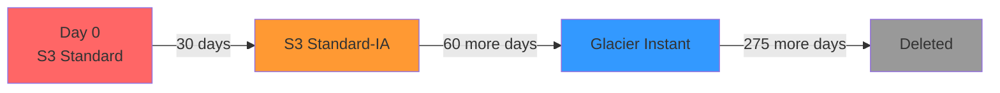
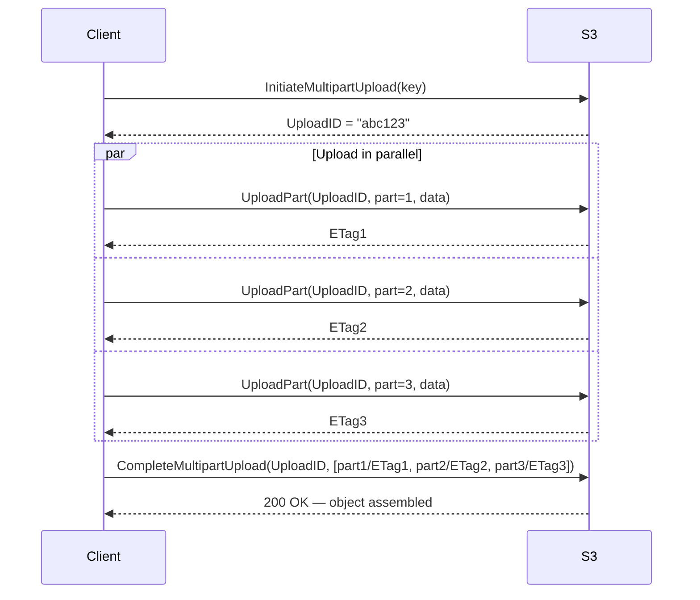
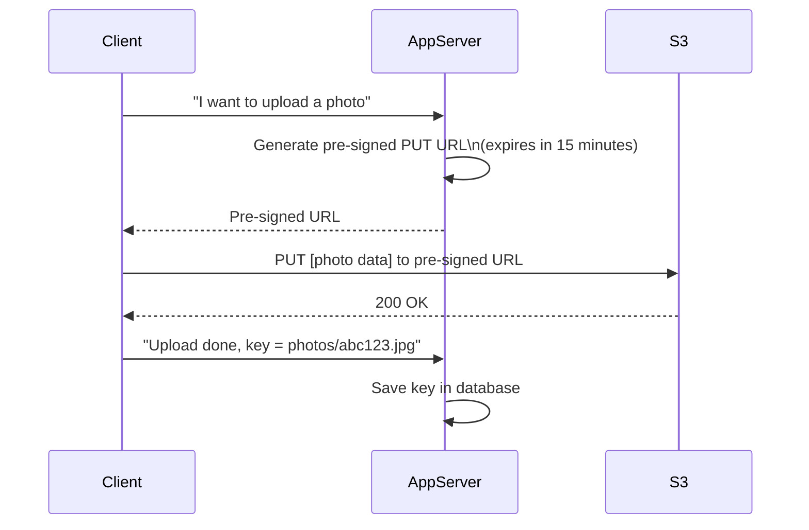

# Object Storage Deep Dive

## Why This Topic Exists

Object storage is the backbone of the modern internet. Every photo on Instagram, every video on YouTube, every file in Google Drive, every static asset on every website — all of it is stored in object storage. AWS S3 alone stores hundreds of trillions of objects and processes millions of requests per second.

Yet most developers interact with S3 as a black box: "upload file, get URL back." Senior engineers go much further. They understand the data model, know when to use storage classes to cut costs by 90%, know how to handle massive file uploads without saturating the server, and know how to give users direct upload access without exposing credentials. This topic covers all of that.

## Learning Objectives

By the end of this topic, you will be able to:

- Explain what object storage is and how it differs from a file system
- Describe the key concepts: buckets, objects, keys, metadata, and versioning
- Explain the S3 API and the three core operations
- Choose the right S3 storage class for a given access pattern
- Design a lifecycle policy to automate storage cost management
- Explain multipart upload and when it is necessary
- Explain pre-signed URLs and why they remove the need for a proxy server
- Design the photo storage system for an application like Instagram using S3

## Prerequisites

- Completed [Types of Storage](./01.%20Types%20of%20Storage%20(BEGINNER).md)
- Basic understanding of HTTP (GET, PUT, DELETE)
- Familiarity with what a CDN is (helpful but not required)

## Introduction

Before S3 launched in 2006, if you wanted to store user-generated media at scale, you either bought expensive storage hardware or ran a complex distributed file system yourself. Amazon changed the game by offering a simple API: give us a file and a key, we store it forever, you pay per GB. Engineers could suddenly focus on their product instead of their storage infrastructure.

The mental model is simple: S3 is a giant hash map in the cloud. The key is a string (like `photos/user123/vacation.jpg`). The value is an arbitrary blob of bytes — an image, a video, a PDF, a compressed archive. You PUT an object in, you GET it back by key, you DELETE it when you are done.

But there is a lot of depth below that simple surface.

## Real-World Analogy

Think of S3 as a postal service warehouse the size of a continent.

- A **bucket** is a named section of the warehouse (like "US East Wing").
- An **object** is a package inside the warehouse.
- The **key** is the unique tracking number on the package. You can retrieve any package instantly if you know its tracking number.
- **Metadata** is the label on the package — content type, creation date, custom tags.
- **Versioning** means the warehouse keeps all old packages when you ship an update, labeled with a version number.
- **Storage classes** are like different warehouse sections: some shelves are instantly accessible (hot storage), some are in a back room (warm), some are in a deep vault (cold/archival).

## Core Concepts

### Buckets

A bucket is a top-level container for objects. Every object in S3 lives inside a bucket. Bucket names are globally unique across all of AWS — if someone else has taken `photos`, you cannot use it. You choose which AWS region a bucket lives in, which affects latency and data residency.

```
Bucket: my-app-photos (region: us-east-1)
  ├── users/alice/profile.jpg
  ├── users/bob/profile.jpg
  └── posts/2024/01/vacation.mp4
```

Note: the slashes above are *not* real directories. They are just part of the key string. S3 has no hierarchy. The slash convention is a naming convenience.

### Objects and Keys

An object is a combination of:
- **Data**: the raw bytes (up to 5TB per object)
- **Key**: a unique string identifier within the bucket
- **Metadata**: HTTP-style headers (Content-Type, Content-Length) plus up to 2KB of custom key-value pairs
- **Version ID**: if versioning is enabled, each version of an object gets a unique ID

### Versioning

When versioning is enabled on a bucket, every time you overwrite an object, the old version is preserved. You can retrieve any previous version by specifying its version ID. DELETE operations create a "delete marker" instead of erasing data — the data is still there and recoverable.

Use versioning when: you want an undo history for documents, you need protection from accidental overwrites, or compliance requires data retention.

### Consistency Model

S3 provides **strong read-after-write consistency** for all operations (as of December 2020). When you PUT an object and the request succeeds, any subsequent GET will return the new object. Earlier versions of S3 had eventual consistency, which caused subtle bugs. This is no longer a concern.

## S3 API

The S3 API is a REST API over HTTP. The three core operations are:

| Operation | HTTP Method | Description |
|---|---|---|
| PUT Object | PUT | Upload a new object or overwrite an existing one |
| GET Object | GET | Download an object by key |
| DELETE Object | DELETE | Delete an object (or add a delete marker if versioning is enabled) |
| LIST Objects | GET (on bucket) | List objects in a bucket, with optional prefix filter |
| HEAD Object | HEAD | Get metadata only, without downloading the object body |

Example request to upload a photo:

```
PUT /my-app-photos/users/alice/profile.jpg
Host: s3.amazonaws.com
Content-Type: image/jpeg
Content-Length: 142783

[binary image data]
```

The response is a 200 OK with an ETag (hash of the object data for integrity verification).

## Storage Classes

One of S3's most powerful features is storage classes. Different classes trade off access cost, retrieval latency, and storage cost. Choosing the right class can cut your storage bill by 50–90%.

| Storage Class | Access Pattern | Retrieval Time | Use Case |
|---|---|---|---|
| S3 Standard | Frequently accessed | Milliseconds | Active user content, profile photos |
| S3 Intelligent-Tiering | Unknown or changing | Milliseconds | Data with unpredictable access patterns |
| S3 Standard-IA (Infrequent Access) | Monthly or less | Milliseconds | Backups, older content |
| S3 One Zone-IA | Infrequent, can tolerate one AZ loss | Milliseconds | Derived/reproducible data |
| S3 Glacier Instant Retrieval | Quarterly or less | Milliseconds | Long-term archives with instant access |
| S3 Glacier Flexible Retrieval | Rarely | Minutes to hours | Compliance archives |
| S3 Glacier Deep Archive | Rarely | 12 hours | Long-term regulatory archives |

The pattern is clear: the less frequently you access data, the cheaper the storage per GB — but retrieval becomes slower and/or more expensive. Archive-class storage can cost 10–20x less per GB than Standard, but retrieving data from Deep Archive takes 12 hours.

## Lifecycle Policies

Lifecycle policies let you automate transitions between storage classes (and deletions) based on the age of an object.

Example policy:
- After 30 days: move to Standard-IA (saves money on rarely-accessed old content)
- After 90 days: move to Glacier Instant Retrieval
- After 365 days: delete the object

This is extremely valuable for log files, backups, and user-generated content you need to retain but rarely access.



## Multipart Upload

S3 has a 5GB single-PUT limit. For files larger than 5GB (or even for files over 100MB), you should use multipart upload.

Multipart upload works like this:
1. **Initiate**: Tell S3 you are starting a multipart upload for a given key. You get back an upload ID.
2. **Upload parts**: Split the file into chunks (minimum 5MB each) and upload each part in parallel. Each part gets a part number and an ETag.
3. **Complete**: Send S3 the list of part numbers and ETags. S3 assembles the parts into a single object.

Benefits of multipart upload:
- Parts upload in parallel — much faster than sequential upload for large files
- If one part fails, retry only that part, not the whole file
- Can pause and resume uploads (parts are stored until the upload completes or is aborted)



## Pre-Signed URLs

This is one of the most important S3 concepts for system design. 

**The problem**: You want users to upload photos directly to S3. But you cannot embed your AWS credentials in the client app — anyone could extract them and get full access to your S3 bucket.

**The naive solution**: Route uploads through your server. Client → your server → S3. But this is wasteful: your server now handles all upload bandwidth, which is expensive and slow.

**The correct solution**: Pre-signed URLs.

Your server generates a time-limited, signed URL that grants the bearer permission to perform one specific S3 operation (usually a PUT to a specific key). The client uses this URL to upload directly to S3. Your server never sees the file data.



Pre-signed GET URLs work the same way for downloads — useful for serving private content that should not be publicly accessible.

## Deep Explanation: How S3 Achieves Durability

S3 Standard is designed for 99.999999999% (11 nines) durability. This means if you store 10 million objects, you can expect to lose one object every 10,000 years.

How? S3 achieves this through:
1. **Erasure coding**: Objects are broken into shards and stored across multiple devices and multiple Availability Zones using erasure coding (similar to RAID 6 but more efficient).
2. **Background integrity checking**: S3 constantly verifies the integrity of stored data using checksums and automatically repairs corruption.
3. **Geographic redundancy**: Data is stored in at least three separate Availability Zones within the chosen region.

You do not need to manage any of this. It is transparent.

## Step-by-Step Example: Photo Storage for Instagram

Let's design the photo storage system for an Instagram-like app.

**Requirements:**
- Users upload photos (up to 10MB each)
- Photos are displayed at multiple sizes (thumbnail, medium, full)
- Old photos should cost less to store
- Photos should load fast globally

**Design:**

**Step 1: Bucket setup**
Create two buckets:
- `myapp-photos-uploads`: Receives raw uploads, private
- `myapp-photos-processed`: Stores processed images at multiple sizes, served via CDN

**Step 2: Upload flow with pre-signed URLs**
1. User selects a photo in the app
2. App calls your API: `POST /api/photos/upload-url`
3. Server generates a pre-signed PUT URL for `myapp-photos-uploads/raw/{photo_id}.jpg`
4. App uploads photo directly to S3 using the pre-signed URL
5. App notifies server: "Upload complete for photo_id {photo_id}"
6. Server puts a message on a queue: "Process photo {photo_id}"

**Step 3: Processing pipeline**
A worker picks up the message, downloads the raw photo from S3, generates three sizes (thumbnail 150x150, medium 720x720, full original), uploads all three to `myapp-photos-processed`:
- `myapp-photos-processed/thumb/{photo_id}.jpg`
- `myapp-photos-processed/medium/{photo_id}.jpg`
- `myapp-photos-processed/full/{photo_id}.jpg`

The raw photo in `myapp-photos-uploads` is deleted after processing.

**Step 4: Serving via CDN**
The processed bucket is served through CloudFront (AWS CDN). Users get URLs like `https://cdn.myapp.com/medium/{photo_id}.jpg`. The CDN caches photos at edge locations worldwide, so a user in Tokyo does not need to fetch from an S3 bucket in Virginia.

**Step 5: Lifecycle policy**
On the processed bucket:
- After 1 year: move full-size photos to S3 Standard-IA (most photos are not viewed after a year)
- After 3 years: move to Glacier Instant Retrieval
- Thumbnails and medium sizes stay in Standard (they are shown in feeds and searches)

## Advantages / Disadvantages / Trade-offs

| Aspect | Detail |
|---|---|
| Scalability | Virtually unlimited — S3 scales automatically, no capacity planning |
| Durability | 11 nines durability — far more than any self-managed storage |
| Cost | Very cheap per GB (~$0.023/GB/month for Standard in us-east-1), but request costs add up at scale |
| Latency | First-byte latency is 10–50ms for Standard — fine for file downloads, too slow for caching |
| Immutability | Objects cannot be partially updated — you must overwrite the whole object |
| API | Simple REST API, SDKs for every language |
| Not a database | Cannot run queries — for querying data in S3, use Athena or Spark |

## When to Use / When NOT to Use

**Use object storage when:**
- Storing user-generated media (photos, videos, documents)
- Storing logs, backups, data dumps
- Hosting static assets for a website
- Building a data lake for analytics
- You need 11-nines durability without managing infrastructure

**Do NOT use object storage when:**
- You need sub-10ms access (use in-memory or block storage)
- You need to update small parts of a large file frequently
- You need transactional guarantees (ACID)
- You need to query data by content (use a database instead)

## Common Interview Questions

1. **How would you store and serve user-uploaded photos for a social media app?**
   Pre-signed URL for direct upload, S3 for storage, CDN for delivery, lifecycle policies to manage cost.

2. **What is a pre-signed URL and why is it better than routing uploads through your server?**
   A pre-signed URL is a time-limited, signed URL that grants the bearer permission to perform one S3 operation. It eliminates the need to route file data through your application server, saving bandwidth and server resources.

3. **How does S3 achieve 11 nines of durability?**
   Erasure coding across multiple devices and AZs, background integrity checking, and automatic repair.

4. **What is the difference between S3 Standard and S3 Glacier?**
   Standard is for frequently accessed data — millisecond retrieval, higher cost per GB. Glacier is for archival data — retrieval takes minutes to hours, but much cheaper per GB.

5. **How would you handle uploading a 50GB video file to S3?**
   Multipart upload. Split the file into 5–100MB chunks, upload them in parallel, then call CompleteMultipartUpload to assemble.

## Common Beginner Mistakes

- **Routing large uploads through your app server.** Use pre-signed URLs so clients upload directly to S3.
- **Storing everything in S3 Standard.** Use lifecycle policies to move old data to cheaper storage classes.
- **Putting all data in one S3 bucket with no organization.** Use consistent key naming conventions for easy lifecycle policy management.
- **Ignoring request costs.** S3 charges per request. Millions of small requests add up. Cache aggressively and batch small operations.
- **Not using versioning for critical data.** Accidental deletes and overwrites are a real operational risk.

## Summary

Object storage is a flat key-value store for arbitrary binary data. S3's core model is simple: buckets contain objects, objects have keys and metadata, you access them via HTTP. The power is in the ecosystem: storage classes let you trade retrieval latency for cost savings, lifecycle policies automate the transition, multipart upload handles large files efficiently, and pre-signed URLs allow direct client uploads without exposing credentials. Every large-scale media application uses this architecture.

## Key Takeaways

- Object storage: flat namespace, unique keys, HTTP API, immutable objects
- Pre-signed URLs let clients upload/download directly from S3 — no proxy needed
- Storage classes (Standard → IA → Glacier) trade access speed for lower cost
- Lifecycle policies automate movement between storage classes and deletion
- Multipart upload is required for files over 5GB and recommended over 100MB
- S3 achieves 11-nines durability via erasure coding across multiple AZs
- S3 is not a database — use Athena/Spark to query data stored in S3

## Related Topics

- [Types of Storage](./01.%20Types%20of%20Storage%20(BEGINNER).md) — Understand where object storage fits among block, file, and in-memory
- [Data Replication Strategies](./05.%20Data%20Replication%20Strategies%20(INTERMEDIATE).md) — How S3 achieves durability through replication and erasure coding
- [Distributed File Systems](./04.%20Distributed%20File%20Systems%20(INTERMEDIATE).md) — An alternative paradigm for large-scale distributed data storage
- [Chapter 06: Caching](../06.%20Caching/README.md) — Pair S3 with a CDN and cache layer for optimal performance
