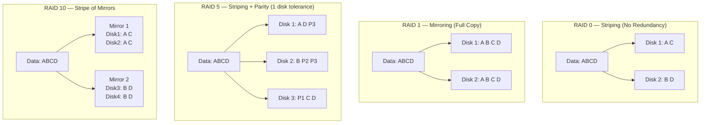

# RAID and Disk Reliability

## Why This Topic Exists

Hard drives fail. This is not a possibility — it is a certainty. Every hard drive ever manufactured will eventually stop working. The question is not *whether* your disk will fail, but *when*, and whether you will lose data when it does.

RAID (Redundant Array of Independent Disks) is the classic solution to this problem. By spreading data across multiple physical disks, RAID lets you survive disk failures without data loss — and often improves performance at the same time.

While cloud storage systems handle disk failure transparently today, understanding RAID is essential for three reasons: (1) many on-premise databases and storage systems still rely on it, (2) the trade-offs (redundancy vs performance vs cost) are timeless and appear in distributed systems design, and (3) it comes up regularly in system design and infrastructure interviews.

## Learning Objectives

By the end of this topic, you will be able to:

- Explain why RAID exists and what problem it solves
- Describe RAID 0, 1, 5, 6, and 10 and the trade-offs of each
- Calculate storage efficiency for each RAID level
- Choose the right RAID level for a given use case
- Explain the difference between RAID and cloud-managed storage redundancy

## Prerequisites

- Understanding of what a hard drive is
- Basic understanding of what data redundancy means
- Completed [Types of Storage](./01.%20Types%20of%20Storage%20(BEGINNER).md)

## Introduction

Imagine you run a bank. You have one book that contains all transaction records. If someone spills coffee on that book, or it catches fire, all records are gone. You would never run a bank this way — you would keep copies.

RAID applies the same logic to disk storage. Instead of one disk holding all your data, you spread data across multiple disks. Different RAID levels make different bets: some sacrifice storage space for safety, some sacrifice safety for speed, some do both.

## Real-World Analogy

Think about sending an important letter to a friend.

**RAID 0** is like tearing the letter in half and sending each half to a different courier for speed. Both halves arrive faster (they travel in parallel). But if one courier loses their half, the whole letter is unreadable. Faster, but fragile.

**RAID 1** is like sending the exact same complete letter to two different couriers. If one gets lost, the other still arrives. Safe, but you paid for two stamps and the delivery is only as fast as the fastest courier.

**RAID 5** is like sending the letter to three couriers where each carries part of the letter, but one also carries a "parity" note that lets you reconstruct any missing part. If one courier is lost, you can recreate their content from the other two. Efficient and fault-tolerant.

**RAID 10** is like RAID 1 and RAID 0 combined — you mirror the letters AND split them for speed.

## Core Concepts

### What is Striping?

Striping means splitting data across multiple disks in round-robin fashion. If you write a file, block 1 goes to Disk 1, block 2 goes to Disk 2, block 3 goes to Disk 3, and so on. This allows multiple disks to serve different read requests simultaneously, and allows parallel writes. Result: higher throughput.

### What is Mirroring?

Mirroring means writing identical data to two or more disks simultaneously. Every write goes to all mirrors. Reads can be served from any mirror. If one mirror fails, the others continue serving requests. Result: redundancy, no data loss on single disk failure.

### What is Parity?

Parity is a mathematical technique where you compute a checksum (XOR of all blocks) and store it alongside the data. If one block is lost, you can recover it by recomputing from the parity and the remaining blocks. It is more space-efficient than full mirroring, but requires computation on every write. Result: fault tolerance with less storage overhead than mirroring.

### Rebuild Time

When a disk fails and is replaced, the RAID controller must reconstruct the missing data onto the new disk — this is called a rebuild. During a rebuild, the array is vulnerable: if another disk fails before the rebuild completes, data may be lost. Modern SSDs rebuild in hours; large HDDs can take days.

## Visual Diagram (Mermaid)

## Deep Explanation

### RAID 0 — Striping Only

RAID 0 takes N disks and treats them as one large, fast logical disk. Data is striped across all disks in parallel.

- **Minimum disks**: 2
- **Storage efficiency**: 100% (all capacity is usable)
- **Fault tolerance**: None. If any single disk fails, all data is lost.
- **Read performance**: N× faster than a single disk (multiple disks serve reads in parallel)
- **Write performance**: N× faster than a single disk

Use case: Scratch space, render farms, temporary processing. Anything where losing data is acceptable and you need maximum throughput.

RAID 0 is the *inverse* of reliability — the more disks you add, the higher the chance of losing everything (since any single failure kills the array). With 10 disks, if each has a 1% annual failure rate, there is a ~10% chance of losing all data in a year.

### RAID 1 — Mirroring

RAID 1 writes identical data to two (or more) disks simultaneously.

- **Minimum disks**: 2
- **Storage efficiency**: 50% (half the raw capacity is used for the mirror)
- **Fault tolerance**: 1 disk can fail (or N-1 if you mirror to more than 2 disks)
- **Read performance**: Can read from either disk, effectively 2× read throughput
- **Write performance**: Limited by the slowest disk (both must acknowledge the write)

Use case: Operating system disks, small critical databases, any situation where losing data is catastrophic and simplicity matters.

RAID 1 is simple and reliable but expensive: you pay for double the storage.

### RAID 5 — Striping with Distributed Parity

RAID 5 stripes data across N disks and uses one disk worth of distributed parity. The parity is not stored on a dedicated disk — it rotates across all disks to avoid a write bottleneck.

- **Minimum disks**: 3
- **Storage efficiency**: (N-1)/N — with 4 disks, you get 75% usable capacity
- **Fault tolerance**: Any single disk can fail. Data is reconstructed from parity.
- **Read performance**: Good — reads from multiple disks in parallel
- **Write performance**: Slower — every write requires reading the current parity, computing the new parity (XOR), and writing both the data and parity

The parity calculation: if Disk 1 has block A and Disk 2 has block B, the parity P = A XOR B. If Disk 2 fails, you can recover B = A XOR P.

Use case: File servers, NAS devices, medium-scale storage where you want a balance of capacity, performance, and reliability.

Warning: RAID 5 is increasingly risky with large modern HDDs (4TB+). Rebuilding a 4TB RAID 5 array can take 24–48 hours, during which any second disk failure destroys all data. Many storage engineers now recommend RAID 6 instead.

### RAID 6 — Striping with Double Parity

RAID 6 is identical to RAID 5 but stores two independent parity blocks per stripe, allowing two simultaneous disk failures.

- **Minimum disks**: 4
- **Storage efficiency**: (N-2)/N — with 6 disks, you get ~67% usable capacity
- **Fault tolerance**: Any two disks can fail simultaneously
- **Write performance**: Slower than RAID 5 (two parity computations per write)

Use case: Large disk arrays (12+ disks) where the rebuild window is long enough that a second failure during rebuild is a real risk.

### RAID 10 (RAID 1+0) — Mirroring + Striping

RAID 10 combines RAID 1 and RAID 0. First, disks are grouped into mirror pairs (RAID 1). Then, data is striped across the mirror groups (RAID 0).

- **Minimum disks**: 4 (in multiples of 2)
- **Storage efficiency**: 50% (same as RAID 1)
- **Fault tolerance**: One disk per mirror group can fail. In an 8-disk RAID 10, up to 4 disks can fail — as long as no two failed disks are from the same mirror pair.
- **Read performance**: Excellent — reads are striped across all mirror groups
- **Write performance**: Excellent — writes go in parallel to each mirror group
- **Rebuild time**: Fast — recovering a failed disk only requires copying from its mirror partner, not recomputing parity

Use case: High-performance databases (MySQL with intensive writes), any workload where both performance and reliability are critical.

RAID 10 is the preferred choice for database servers when storage cost is acceptable.

## Comparison Table

| Level | Min Disks | Usable Capacity | Fault Tolerance | Read Perf | Write Perf | Use Case |
|---|---|---|---|---|---|---|
| RAID 0 | 2 | 100% | None | Excellent | Excellent | Scratch/temp storage |
| RAID 1 | 2 | 50% | 1 disk | Good | Moderate | OS disk, small DBs |
| RAID 5 | 3 | (N-1)/N | 1 disk | Good | Moderate | File servers, NAS |
| RAID 6 | 4 | (N-2)/N | 2 disks | Good | Slower | Large disk arrays |
| RAID 10 | 4 | 50% | 1 per mirror | Excellent | Excellent | High-performance DBs |

## Step-by-Step Example

**Scenario**: You are setting up a database server for an e-commerce application. The database has 500GB of data, growing slowly. You need good write performance and must not lose data if a disk fails. You have a budget for 6 disks at 1TB each.

**Evaluating options:**

RAID 0 (6 disks): 6TB usable, no redundancy. Any single disk failure loses everything. Ruled out — too risky for a production database.

RAID 5 (6 disks): 5TB usable (83%). Can survive one disk failure. Rebuild time with 1TB HDDs is roughly 12–24 hours. Write performance is reduced by parity overhead. Acceptable but not ideal for a write-heavy database.

RAID 10 (6 disks): 3TB usable (50%). Can survive up to three disk failures (one per mirror pair). Rebuild time is fast (just copy the mirror). Excellent read and write performance. The 3TB capacity is more than enough for the 500GB database.

**Decision**: RAID 10. The write performance is critical for the database, and fast rebuild times reduce the vulnerability window.

## Advantages / Disadvantages / Trade-offs

| RAID Level | Advantage | Disadvantage |
|---|---|---|
| RAID 0 | Maximum performance, full capacity | Zero fault tolerance — any failure loses everything |
| RAID 1 | Simple, fast rebuild, strong redundancy | Only 50% usable capacity |
| RAID 5 | Good balance of capacity and redundancy | Slow rebuilds on large disks; risky during rebuild |
| RAID 6 | Survives 2 disk failures | Even slower writes; more complex |
| RAID 10 | Best performance + good redundancy | Expensive: only 50% usable capacity |

## When to Use / When NOT to Use

**Use RAID when:**
- Running an on-premise database server that needs local redundancy
- Building a NAS (Network Attached Storage) device
- Any scenario where hardware failure must not cause data loss

**Do NOT rely on RAID alone when:**
- You need protection from fire, flood, or theft — RAID only protects against single-disk failure; it does not replace backups
- You are using cloud services — AWS EBS, Google Persistent Disk, and similar services handle redundancy transparently using erasure coding better than RAID
- You need protection from file-level corruption or accidental deletion — RAID does not help here (if you delete a file, the deletion is immediately replicated to all RAID members)

**RAID is not a backup.** RAID protects against hardware failure only. A virus, accidental deletion, or ransomware attack will affect all RAID members simultaneously. Always maintain separate backups.

## Common Interview Questions

1. **What is the difference between RAID 5 and RAID 6?**
   Both stripe data with distributed parity, but RAID 6 stores two independent parity blocks per stripe instead of one. This allows RAID 6 to survive two simultaneous disk failures. RAID 5 can only tolerate one. The cost is slightly lower usable capacity and slower writes.

2. **Why is RAID 5 considered risky for large disks?**
   When a disk fails in RAID 5, the array must read every remaining disk to reconstruct the lost data. For a large modern disk (4–8TB), this rebuild can take 24–48 hours. During that time, if any other disk fails, all data is lost. The larger the disks, the longer and more dangerous the rebuild window.

3. **What is the difference between RAID 1 and RAID 10?**
   RAID 1 mirrors two disks. RAID 10 stripes data across multiple mirror pairs. RAID 10 provides RAID 1's reliability with RAID 0's performance — at the cost of 50% usable capacity, same as RAID 1.

4. **Does cloud storage use RAID?**
   Cloud storage providers like AWS S3 and Google Cloud Storage do not use traditional RAID. They use erasure coding — a more sophisticated technique that achieves better storage efficiency than RAID 5/6 while tolerating multiple simultaneous failures and spreading data across multiple physical locations.

## Common Beginner Mistakes

- **Treating RAID as a backup.** RAID does not protect against logical data corruption, accidental deletion, or ransomware. Always maintain offline backups.
- **Using RAID 0 for anything important.** RAID 0 has no redundancy. Adding more disks increases the probability of data loss. Only use it for expendable data.
- **Ignoring rebuild risk in RAID 5.** Modern disks are large. Rebuild windows are long. A second failure during rebuild is a real risk, not a theoretical one.
- **Assuming cloud services use RAID.** Cloud providers use erasure coding across multiple physical servers and AZs — far more robust than RAID. RAID is an on-premise concept.

## Summary

RAID combines multiple physical disks into a logical unit to achieve redundancy, performance, or both. RAID 0 strips for performance but offers no fault tolerance. RAID 1 mirrors for full redundancy at 50% capacity efficiency. RAID 5 uses parity to balance capacity and redundancy but is risky during long rebuilds. RAID 6 adds a second parity for double-disk tolerance. RAID 10 combines mirroring and striping for the best of both worlds at 50% capacity efficiency. RAID is essential on-premise but largely transparent in modern cloud infrastructure, which uses more sophisticated erasure coding.

## Key Takeaways

- RAID 0: maximum speed, no redundancy — never use for important data
- RAID 1: mirror, simple, 50% capacity — good for OS and small DBs
- RAID 5: striping + parity, 1-disk tolerance — risky on large modern disks
- RAID 6: double parity, 2-disk tolerance — better than RAID 5 for large arrays
- RAID 10: mirror + stripe, best performance + reliability — the go-to for databases
- RAID is NOT a backup — it only protects against hardware failure
- Cloud storage uses erasure coding, not RAID, and handles redundancy transparently

## Related Topics

- [Types of Storage](./01.%20Types%20of%20Storage%20(BEGINNER).md) — Block storage fundamentals that RAID operates on
- [Data Replication Strategies](./05.%20Data%20Replication%20Strategies%20(INTERMEDIATE).md) — Distributed systems approach to the same redundancy problem RAID solves
- [Distributed File Systems](./04.%20Distributed%20File%20Systems%20(INTERMEDIATE).md) — How HDFS and GFS achieve fault tolerance across commodity hardware
- [Database Storage Engines](./06.%20Database%20Storage%20Engines%20(ADV).md) — How databases layer on top of storage for ACID guarantees
