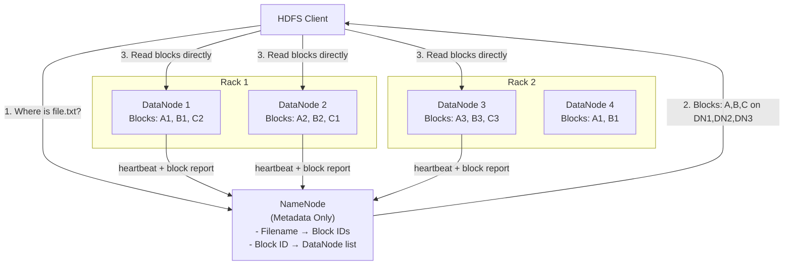
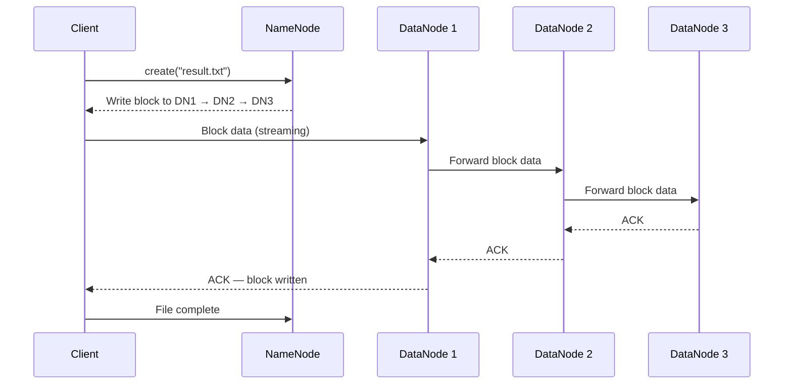

# Distributed File Systems

## Why This Topic Exists

In 2003, Google published a paper called "The Google File System." It described how Google stored and processed petabytes of data across thousands of cheap commodity machines. This paper changed the industry. It directly inspired Hadoop's HDFS (Hadoop Distributed File System), which became the foundation of the big data revolution.

Understanding distributed file systems helps you answer a fundamental system design question: when a single machine's disk runs out — when you have more data than any one computer can hold — how do you store and access it reliably? Distributed file systems answer this question in a principled way. The ideas behind them (fault tolerance through replication, separation of metadata and data, sequential access optimization) appear across many modern systems.

## Learning Objectives

By the end of this topic, you will be able to:

- Explain what a distributed file system is and when you need one
- Describe the Google File System (GFS) paper's key design decisions
- Explain HDFS architecture: NameNode, DataNodes, blocks, and replication
- Walk through a read and write in HDFS step by step
- Explain why GFS and HDFS made specific trade-offs (consistency vs. throughput)
- Know when modern engineers use S3 + Spark instead of HDFS

## Prerequisites

- Completed [Types of Storage](./01.%20Types%20of%20Storage%20(BEGINNER).md)
- Basic understanding of what a network request is
- Basic understanding of replication (having multiple copies of data)

## Introduction

Imagine your company logs every user event — page views, clicks, purchases. You have 1 billion events per day, each about 500 bytes. That is 500GB of log data per day, or about 180TB per year.

A single hard drive holds 4–8TB. A single server with many drives holds maybe 100TB before becoming impractical. After a year, you have already outgrown one server, and you still need to process all historical data.

The solution: distribute data across many machines and treat them as a single logical storage system. That is a distributed file system.

## Real-World Analogy

Think of a library with too many books for one building.

A **regular file system** is like a single library. The librarian knows where every book is. Simple, but limited by one building's size.

A **distributed file system** is like a university library system spread across many buildings:
- One central catalog (the **NameNode**) knows which building and shelf every book is on.
- Many buildings (**DataNodes**) actually hold the books.
- Every important book has copies in multiple buildings — if one burns down, the book is not lost.
- To read a book, you ask the catalog which building has it, then go directly to that building. The catalog does not carry the book.

## Core Concepts

### Design Principles of GFS (Google File System)

The GFS paper made a set of deliberate trade-offs based on Google's actual workload in 2003:

1. **Commodity hardware, not expensive storage.** Component failures are the norm, not the exception. The system must detect, tolerate, and recover from failures automatically.

2. **Large files are the norm.** Google stored multi-GB files. Small files existed but were not the primary concern. Block size was 64MB (much larger than typical file systems) to reduce metadata overhead.

3. **Sequential reads, not random access.** Google's workload was mostly batch processing: read a file start-to-finish, process it, write output. Random access to specific byte offsets was rare. The system was optimized for streaming throughput, not low latency.

4. **Append-only writes.** Files were mostly written once and read many times. Random in-place updates were rare. The consistency model was relaxed to allow high-throughput concurrent appends.

5. **Co-design with the application.** Unlike POSIX file systems that must work with any application, GFS was co-designed with Google's MapReduce framework. This allowed design choices that would be unacceptable in a general-purpose file system.

### HDFS Architecture

HDFS (Hadoop Distributed File System) implements GFS-like ideas in open-source Java. Its architecture has two main components:

**NameNode (Master)**
- Stores all filesystem metadata: file names, directories, permissions, and the mapping of every file to its blocks and which DataNodes hold each block
- Runs on a single dedicated machine
- Does not hold any actual file data
- The single point of failure in HDFS — losing the NameNode means losing access to all data (Hadoop 2.x added High Availability to address this)

**DataNodes (Workers)**
- Store the actual file data as blocks (default 128MB per block)
- Run on many commodity machines (a production cluster might have hundreds or thousands)
- Report to the NameNode periodically via heartbeats (alive) and block reports (which blocks they hold)
- Handle direct read/write requests from clients after the client learns block locations from the NameNode

**Block Replication**
- Each block is replicated to multiple DataNodes (default replication factor = 3)
- HDFS uses a rack-aware placement policy: for a replication factor of 3, place one replica on a node in Rack 1, a second on a different node in Rack 1, and a third on a node in Rack 2. This tolerates both node failures and rack failures.

## Deep Explanation

### How a Read Works in HDFS

1. The client calls `open("/data/logs/2024.log")` on the HDFS client library.
2. The client library contacts the NameNode and asks: "Which blocks does this file consist of, and which DataNodes hold each block?"
3. The NameNode responds with a list of block IDs and the DataNodes that hold each block (ordered by network proximity to the client).
4. The client reads each block directly from the closest DataNode, one block at a time (or several in parallel).
5. The DataNode streams the block data directly to the client.
6. The NameNode is not involved in the data transfer — it only serves the block location metadata.

This design means the NameNode is not a throughput bottleneck. Hundreds of clients can read from hundreds of DataNodes simultaneously without going through the NameNode for every byte.

### How a Write Works in HDFS

1. The client calls `create("/data/output/result.txt")`.
2. The NameNode creates a new file entry in the metadata and assigns block IDs.
3. The NameNode instructs the client to write the first block to DataNode 1, which should replicate it to DataNode 2, which should replicate it to DataNode 3. This is a replication pipeline.
4. The client sends data to DataNode 1. DataNode 1 forwards it to DataNode 2 as it receives it. DataNode 2 forwards it to DataNode 3.
5. When all three DataNodes have written the block, they acknowledge upwards: DN3 → DN2 → DN1 → Client.
6. The client proceeds to the next block.

The replication pipeline is efficient: data flows in a chain, so the network load is spread across the pipeline rather than the client sending three copies.

### Fault Tolerance in HDFS

**DataNode failure**: The NameNode detects a failed DataNode when it stops sending heartbeats (default: 10 minutes). It then identifies all blocks that were on the failed node and instructs surviving DataNodes to replicate those blocks to restore the replication factor.

**NameNode failure**: Traditional HDFS has a single NameNode — the single point of failure. If it dies, the cluster is inaccessible (data is safe on DataNodes, but no one knows where anything is). Hadoop 2.x introduced NameNode HA (High Availability) with an active and a standby NameNode that shares metadata via a quorum journal. Hadoop also introduced HDFS Federation, where multiple NameNodes manage separate namespaces.

### The Small File Problem

HDFS is not good at small files. Each file, regardless of size, requires a metadata entry in the NameNode. With millions of small files, the NameNode's memory (which holds all metadata in RAM for fast access) fills up. And small files cannot take advantage of large blocks — a 1KB file still occupies one 128MB block slot in metadata.

The practical rule: HDFS is excellent for large files (hundreds of MB to TB). For small files, use other systems (HBase, S3, or merge small files into larger ones before putting them in HDFS).

## Modern Context: HDFS vs. S3 + Spark

When Hadoop launched in 2006, HDFS was the only scalable distributed file system available to the open-source community. You ran HDFS on your own cluster, and you ran Spark or MapReduce on the same cluster (compute and storage co-located).

Today, the industry has largely moved toward **disaggregated storage**: keeping compute and storage separate.

| Aspect | HDFS on-premise | S3 + Spark/EMR |
|---|---|---|
| Setup | Complex — manage a Hadoop cluster | Simple — S3 is managed, Spark is on-demand |
| Cost | High — servers running 24/7 even when idle | Lower — pay per query, no idle cluster cost |
| Scalability | Limited by cluster size | Virtually unlimited |
| Durability | 3× replication across nodes | 11-nines via erasure coding across AZs |
| Latency | Lower (compute + storage on same nodes) | Higher network round-trips |
| Tooling | Mature Hadoop ecosystem | Rich AWS/GCP tooling, Delta Lake, Iceberg |
| Best for | Strict latency requirements, on-premise | Most modern analytics workloads |

The dominant pattern for new systems in 2024 is: store data in S3 (or GCS/ADLS), process with Spark, Presto, Athena, or BigQuery. HDFS is largely a legacy technology, but it powers enormous existing workloads (Uber, LinkedIn, and others still run large HDFS clusters).

## Step-by-Step Example

**Scenario**: You are building a log analytics pipeline. Every server generates 10GB of compressed logs per day. You need to store 90 days of logs (900GB) and run daily Spark jobs to analyze them.

**HDFS approach (on-premise):**
- Run a 10-node HDFS cluster with 2TB per node = 20TB raw, ~13TB usable with replication factor 3
- Each day, collect logs from servers, merge small log files into 128MB+ chunks, upload to HDFS
- Run Spark on the same cluster (co-located) for fast local reads
- Total cost: server hardware + power + ops overhead, 24/7

**S3 + Spark approach (cloud):**
- Upload daily logs directly to S3 under a consistent key structure: `s3://logs/year=2024/month=01/day=15/server_{id}.gz`
- Run a Spark job on AWS EMR (Elastic MapReduce) once per day — the cluster spins up, runs the job, shuts down
- Query with Athena (serverless SQL on S3) for ad-hoc analysis
- Total cost: $0.023/GB/month for S3 storage (900GB × $0.023 ≈ $21/month), plus EMR cluster cost only when running

For most new companies, the S3 + Spark approach is cheaper and simpler. The HDFS approach might win if you are already on-premise and need the lowest possible read latency for computationally intensive jobs.

## Advantages / Disadvantages / Trade-offs

| Aspect | HDFS | S3-based Data Lake |
|---|---|---|
| Simplicity | Complex to manage | Simple — storage is managed |
| Cost (compute) | High idle cost | Pay-per-use |
| Latency | Lower (co-located compute/storage) | Higher (network round-trip to S3) |
| Durability | Good with replication factor 3 | Excellent (11 nines) |
| Scalability | Limited by cluster | Unlimited |
| Ecosystem | Mature Hadoop/HBase/Hive tooling | Growing (Delta Lake, Iceberg, Spark) |

## When to Use / When NOT to Use

**Use HDFS when:**
- You have an existing Hadoop ecosystem investment
- You need the lowest possible latency for batch analytics (co-located compute/storage)
- You are on-premise with no cloud access

**Do NOT use HDFS when:**
- Starting a new project — S3 + Spark is almost always simpler and cheaper
- You have mostly small files — HDFS is poorly suited to this
- You need random access to small portions of large files — HDFS is sequential-access oriented

**Use distributed file systems (HDFS or object storage-backed) when:**
- Data volume exceeds a single machine's capacity
- You need fault tolerance without manual RAID management
- Multiple compute nodes need to read the same data in parallel

## Common Interview Questions

1. **What is the role of the NameNode in HDFS? What is its limitation?**
   The NameNode is the metadata server — it stores the mapping of files to blocks and blocks to DataNodes. Its limitation is that it is a single point of failure: if it crashes, the whole cluster is inaccessible. Hadoop 2.x added NameNode HA to address this.

2. **How does HDFS achieve fault tolerance?**
   HDFS replicates each block to multiple DataNodes (default 3, with rack-aware placement). The NameNode monitors DataNode heartbeats and automatically triggers re-replication when a DataNode is detected as failed.

3. **What is the small file problem in HDFS?**
   HDFS keeps all metadata in the NameNode's RAM. Each file entry consumes memory. Millions of small files exhaust NameNode memory. Also, each small file wastes a full 128MB block slot. HDFS is designed for large sequential reads, not small random files.

4. **Why are modern systems using S3 instead of HDFS?**
   S3 is managed (no operational overhead), offers virtually unlimited scale, higher durability (11 nines vs HDFS's 3× replication), and a pay-per-use model. The main trade-off is higher read latency due to network round-trips vs. HDFS co-location.

## Common Beginner Mistakes

- **Thinking HDFS is like a regular file system.** HDFS is optimized for large sequential reads and append-only writes. It is not a drop-in replacement for ext4 or NTFS.
- **Ignoring the NameNode single-point-of-failure.** Production HDFS deployments need NameNode HA (High Availability).
- **Storing small files in HDFS.** This is a well-known anti-pattern that exhausts NameNode memory.
- **Assuming HDFS is the best modern solution.** For most new analytics workloads, S3 + Spark is simpler, cheaper, and more scalable.

## Summary

Distributed file systems solve the problem of data volumes that exceed a single machine's capacity. GFS and HDFS pioneered the architecture: a single metadata server (NameNode) tracks block locations, many DataNode workers store actual data, and blocks are replicated across multiple nodes and racks for fault tolerance. The design is optimized for large files, sequential reads, and append-only writes — the workload of batch analytics. Modern systems increasingly use S3 as the storage layer with separate compute clusters (Spark, Athena), which is simpler to operate and more cost-efficient. HDFS remains relevant for existing Hadoop ecosystems and latency-sensitive on-premise workloads.

## Key Takeaways

- Distributed file systems span many machines to store data that exceeds one machine's capacity
- HDFS architecture: one NameNode (metadata) + many DataNodes (data) + block replication
- Default block size is 128MB; default replication factor is 3
- NameNode is the single point of failure — production systems use NameNode HA
- HDFS is optimized for sequential reads and large files; bad for small files
- Modern analytics: use S3 + Spark instead of HDFS for new systems
- GFS paper (2003) → HDFS → Spark + S3: this is the lineage of big data storage

## Related Topics

- [Object Storage Deep Dive](./02.%20Object%20Storage%20Deep%20Dive%20(INTERMEDIATE).md) — S3 as the modern replacement for HDFS in new architectures
- [Data Replication Strategies](./05.%20Data%20Replication%20Strategies%20(INTERMEDIATE).md) — Replication strategies used in HDFS and other distributed systems
- [RAID and Disk Reliability](./03.%20RAID%20and%20Disk%20Reliability%20(INTERMEDIATE).md) — RAID vs replication: two approaches to the same reliability problem
- [Database Storage Engines](./06.%20Database%20Storage%20Engines%20(ADV).md) — How storage engines work on top of local disk
