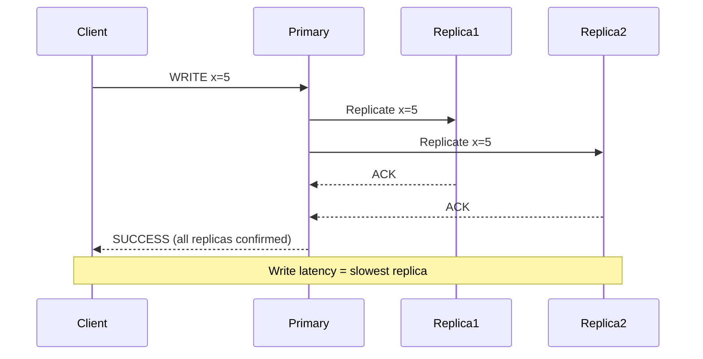
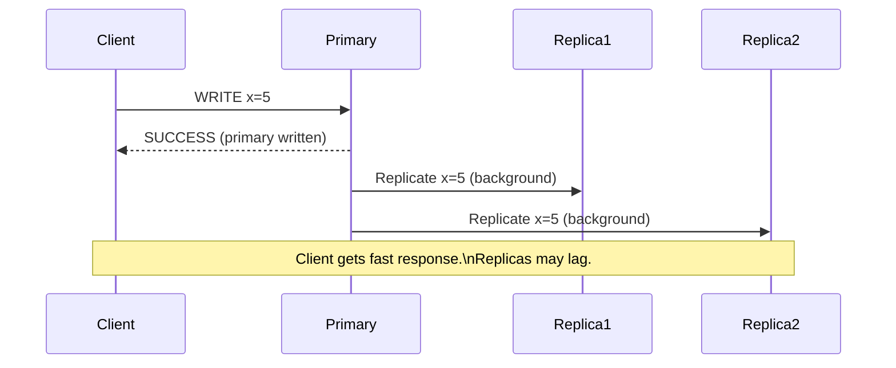
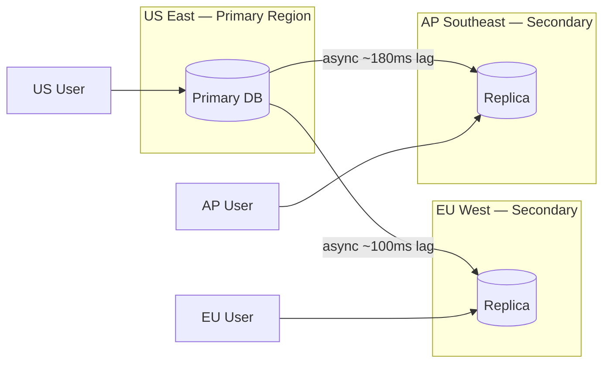

# Data Replication Strategies

## Why This Topic Exists

Data replication is one of the most important concepts in distributed systems. It is the answer to a fundamental question: "What happens when a machine dies?" In a distributed system, machines die regularly. Disks fail. Networks partition. Data centers flood. The only way to ensure data survives these events is to keep multiple copies.

But replication is not just about survival. It also enables performance at scale. Multiple replicas can serve read requests in parallel. Replicas in different geographic regions can serve users locally, reducing latency from 200ms to 10ms.

Every design decision about replication involves trade-offs between consistency, availability, performance, and cost. Understanding these trade-offs is a core skill for senior and staff engineers.

## Learning Objectives

By the end of this topic, you will be able to:

- Explain why replication exists and what it protects against
- Distinguish between synchronous and asynchronous replication and the trade-offs of each
- Explain replication factor and why 3 is the industry standard
- Describe quorum writes and reads and how they achieve tunable consistency
- Explain geo-replication and the latency/consistency trade-off it introduces
- Describe conflict resolution strategies: last-write-wins, vector clocks
- Use Cassandra as a real-world example of tunable consistency via replication

## Prerequisites

- Basic understanding of what a distributed system is (multiple machines, networked)
- Completed [Types of Storage](./01.%20Types%20of%20Storage%20(BEGINNER).md)
- Understanding of what "latency" means in a network context
- Helpful: familiarity with CAP theorem (consistency, availability, partition tolerance)

## Introduction

Imagine a bank with three branches. Each branch has a ledger. When you make a deposit at Branch A, does Branch B immediately know about it? What if the phone line between branches is cut? Do you let the customer make a withdrawal at Branch B even though the balance might be outdated?

These are exactly the questions database replication forces you to answer. And there is no universally correct answer — only trade-offs that depend on your application's requirements.

## Real-World Analogy

Think about how a law firm handles important documents.

**Synchronous replication** is like requiring the lawyer to get a signed confirmation from all three branch offices before telling the client "the document is filed." Safe, but slow — the lawyer must wait for all responses.

**Asynchronous replication** is like the lawyer telling the client "it's filed" as soon as the main office signs it, then faxing copies to the other offices in the background. Fast, but there is a window where branches might not have the latest version.

**Quorum** is a compromise: "I need confirmation from at least 2 of 3 offices." Fast enough, safe enough. If one office is unreachable, the other two can still confirm.

## Core Concepts

### Replication Factor

The replication factor is the number of copies of each piece of data that the system maintains.

- **Replication factor 1**: One copy. If the machine dies, data is lost. Only appropriate for development environments or truly expendable data.
- **Replication factor 2**: Two copies. Survives one machine failure. But during a failure, if the surviving machine also fails before the first is repaired, data is lost.
- **Replication factor 3**: Three copies. Survives one machine failure comfortably, with two machines still available to continue serving requests and re-replicate data. This is the industry standard in distributed systems (Cassandra, HDFS, Kafka all default to 3).

Why 3 specifically? It is the minimum that allows a majority quorum (2 of 3) to function while tolerating 1 failure. It is also enough to place replicas across 3 failure domains (e.g., 3 servers in different racks) without doubling storage costs.

### Synchronous Replication

In synchronous replication, a write is not acknowledged to the client until all designated replicas have written the data.

- **Consistency guarantee**: Strong. All replicas are always in sync. If the write succeeds, every subsequent read (from any replica) will see the new value.
- **Write latency**: High. Limited by the slowest replica. If you have replicas in London and Tokyo, a write must round-trip to Tokyo before it is acknowledged.
- **Availability**: Lower. If any replica is unreachable, the write fails (or waits indefinitely).

**When to use**: Financial transactions, inventory management, any system where reading stale data would cause real harm.

### Asynchronous Replication

In asynchronous replication, a write is acknowledged to the client as soon as the primary node has written the data. Replication to followers happens in the background.

- **Consistency guarantee**: Eventual. If the primary fails immediately after a write, the replica might not have the latest data yet — this is called **replication lag**.
- **Write latency**: Low. The client does not wait for replicas.
- **Availability**: Higher. The primary can accept writes even if replicas are temporarily unreachable.
- **Risk**: Data loss. If the primary fails before replication completes, any writes that had not yet been replicated are lost.

**When to use**: Social media feeds, analytics pipelines, any system where slightly stale data is acceptable and write throughput is critical.

### Quorum Reads and Writes

Quorum is the middle ground between synchronous (all replicas) and asynchronous (just one).

With a replication factor of N, you define:
- **W** (write quorum): How many replicas must confirm a write before it is acknowledged.
- **R** (read quorum): How many replicas must respond to a read before it is returned.

**The consistency guarantee**: If W + R > N, you are guaranteed to read the latest write. At least one replica that participated in the write must participate in the read.

For N=3:
- W=3, R=1: Strongly consistent reads, slow writes
- W=1, R=3: Fast writes, consistent reads (slow)
- W=2, R=2: Balanced — tolerates one failure for both reads and writes, consistent (W+R=4 > N=3)
- W=1, R=1: Fastest, but no consistency guarantee — you might read stale data

Quorum gives you *tunable* consistency. You can trade consistency for performance depending on the operation.

### Geo-Replication

Geo-replication means keeping replicas in multiple geographic regions (data centers in different countries or continents).

**Why**: Disaster recovery (a whole data center going offline), reduced read latency for global users, compliance (data must reside in certain jurisdictions).

**The trade-off**: Speed of light. The round-trip latency between London and Singapore is ~180ms. Synchronous geo-replication adds this latency to every write. Most systems use asynchronous geo-replication — writes are fast locally, and remote regions catch up over time.

**Consistency implication**: With async geo-replication, a user in Singapore might read data that is a few hundred milliseconds behind what a user in London sees. For most applications (social media, e-commerce browsing), this is acceptable. For banking, it is not.

### Conflict Resolution

When multiple replicas can accept writes independently (as in active-active geo-replication), two clients might update the same record simultaneously. The replicas must eventually agree on which value "wins." This is the conflict resolution problem.

**Last-Write-Wins (LWW)**: Each write is tagged with a timestamp. The write with the latest timestamp wins. Simple, but relies on synchronized clocks — and clocks in distributed systems are notoriously unreliable. Two events with almost-simultaneous timestamps might have their order reversed due to clock skew.

**Vector Clocks**: A more sophisticated approach. Each node maintains a vector of counters, one per node, tracking causality. If one write causally follows another (it was received, processed, and then updated), the vector clock captures this. If two writes are concurrent (neither causally follows the other), the system can detect the true conflict and either merge them or ask the application to resolve.

**CRDTs (Conflict-free Replicated Data Types)**: Specialized data structures designed to merge automatically. A distributed counter, a set where you can only add elements, or a shopping cart where adding the same item twice is idempotent — these can all merge without conflict by construction.

## Deep Explanation: Cassandra's Tunable Consistency

Apache Cassandra is one of the best real-world examples of tunable consistency through replication.

**Cassandra's replication model:**
- Data is distributed across nodes in a ring using consistent hashing
- Each piece of data is replicated to N nodes (the replication factor, configured per keyspace)
- All nodes are peers — there is no single master

**Cassandra's consistency levels (for writes and reads):**

| Consistency Level | Description |
|---|---|
| ONE | Write/read succeeds after 1 replica responds |
| TWO | Write/read succeeds after 2 replicas respond |
| THREE | Write/read succeeds after 3 replicas respond |
| QUORUM | Write/read succeeds after majority of replicas respond (floor(N/2)+1) |
| LOCAL_QUORUM | Majority within the local data center |
| EACH_QUORUM | Majority in each data center |
| ALL | All replicas must respond |
| ANY | Even an unresponsive node's hinted handoff counts for writes |

**Tuning example:**
You have a replication factor of 3 and write data with QUORUM (W=2) and read with QUORUM (R=2). Since W+R = 4 > N = 3, you are guaranteed strong consistency.

But during a peak traffic period, you switch reads to ONE (R=1). Now W+R = 3, which is not greater than N = 3. You might read stale data. But your reads are now much faster and your system handles more load.

Cassandra also uses a concept called **hinted handoff**: if a replica is down during a write, the coordinator node stores a "hint" and delivers it to the replica when it comes back online. This improves availability at the cost of a temporary consistency gap.

## Step-by-Step Example

**Scenario**: You are designing a distributed counter for a website's "likes" feature. Users worldwide can like a post. You need to show the count in near-real-time.

**Requirements**: Very high write rate (millions of likes per minute), approximate reads are acceptable (showing 12,432 likes vs 12,431 is fine).

**Design:**
1. Use Cassandra with a replication factor of 3 across 3 regions
2. Use a CRDT counter (Cassandra's built-in counter type handles conflicting increments correctly)
3. Write with consistency level LOCAL_ONE (write succeeds as soon as the local datacenter node acknowledges — fast)
4. Read with consistency level LOCAL_ONE (read from one local node — fast, but might be slightly stale)
5. A like might take a few hundred milliseconds to appear in all regions, but the count will be approximately correct and never lose a like

The local-first consistency level lets users in Tokyo write fast without waiting for a US replica, and read fast without waiting for the US.

## Advantages / Disadvantages / Trade-offs

| Strategy | Consistency | Write Latency | Availability | Data Loss Risk |
|---|---|---|---|---|
| Synchronous (W=All) | Strong | High | Low (fails if any replica down) | None |
| Asynchronous (W=1) | Eventual | Low | High | Yes (primary failure) |
| Quorum (W+R > N) | Strong | Medium | Medium | Very low |
| Geo-replication (async) | Eventual cross-region | Low (local) | High | Yes (cross-region lag) |

## When to Use / When NOT to Use

**Use synchronous replication when:**
- Data loss is catastrophic: banking, medical records, financial transactions
- Strong consistency is required by your application's correctness

**Use asynchronous replication when:**
- High write throughput is critical
- Eventual consistency is acceptable: social media likes, view counts, analytics
- You need geographic distribution without adding write latency

**Use quorum when:**
- You need tunable consistency — strong enough for most cases, but can relax under load
- You are using Cassandra, DynamoDB, or similar systems

**Use geo-replication when:**
- You serve a global user base and need low latency in multiple regions
- You need disaster recovery across data centers

## Common Interview Questions

1. **What is the difference between synchronous and asynchronous replication?**
   Synchronous: write waits for all replicas to confirm — strong consistency, higher latency. Asynchronous: write returns after the primary confirms, replicas catch up in the background — lower latency, risk of data loss and stale reads.

2. **What is quorum and why is W + R > N required for strong consistency?**
   A quorum is a majority. If W replicas wrote the new value and R replicas are read, and W + R > N, then at least one of the R replicas must have participated in the write. You are guaranteed to read the latest value.

3. **What is replication lag and when is it a problem?**
   Replication lag is the delay between a write on the primary and its propagation to replicas. It becomes a problem when a read hits a replica that has not yet received the latest write — the user sees stale data. This is especially painful if the same user reads immediately after writing (read-after-write inconsistency).

4. **How does Cassandra achieve tunable consistency?**
   Cassandra lets you choose the consistency level per operation: ONE, QUORUM, ALL, etc. By tuning W and R values, you can trade between consistency and performance/availability dynamically.

5. **What is last-write-wins and what is its weakness?**
   Last-write-wins resolves conflicts by keeping the write with the latest timestamp and discarding earlier ones. The weakness: distributed clocks are not perfectly synchronized. Two writes that appeared concurrent may have their order reversed due to clock skew, causing data loss.

## Common Beginner Mistakes

- **Assuming eventual consistency means you will miss data.** It means reads might be temporarily stale, not that writes are lost. The data will eventually appear — usually in milliseconds, not hours.
- **Using synchronous replication everywhere.** For global applications, synchronous cross-region replication adds hundreds of milliseconds to every write. Use it only where consistency is truly required.
- **Ignoring replication lag in application design.** If a user posts a comment and immediately navigates to the page, they might not see their own comment if reads go to a lagging replica. Design your application to handle this (e.g., read-after-write consistency, optimistic UI updates).
- **Setting replication factor to 2.** With a replication factor of 2, if one replica fails, you have no redundancy. The surviving replica must not fail during the repair window. Factor 3 is the safe minimum.

## Summary

Replication keeps multiple copies of data to ensure availability and durability when machines fail. The core trade-off is between consistency (all replicas agree) and performance/availability (writes are fast, replicas catch up later). Synchronous replication provides strong consistency at the cost of write latency. Asynchronous replication provides low latency at the cost of potential staleness and data loss. Quorum is the middle ground: require a majority to agree, which is provably consistent while tolerating minority failures. Cassandra's tunable consistency is the best real-world example of these trade-offs made configurable. Geo-replication extends these ideas across data centers to serve global users and survive regional disasters.

## Key Takeaways

- Replication factor 3 is the standard — tolerates 1 failure with quorum still available
- Synchronous = strong consistency + high write latency
- Asynchronous = low latency + risk of stale reads and data loss
- Quorum: W + R > N guarantees strong consistency
- Geo-replication enables low latency globally but introduces cross-region consistency lag
- Last-write-wins is simple but vulnerable to clock skew
- Vector clocks detect true concurrent conflicts but are complex to implement
- Cassandra's consistency levels (ONE, QUORUM, ALL) are the canonical example of tunable consistency

## Related Topics

- [Distributed File Systems](./04.%20Distributed%20File%20Systems%20(INTERMEDIATE).md) — How HDFS uses replication for fault tolerance
- [RAID and Disk Reliability](./03.%20RAID%20and%20Disk%20Reliability%20(INTERMEDIATE).md) — The on-premise equivalent of distributed replication
- [Database Storage Engines](./06.%20Database%20Storage%20Engines%20(ADV).md) — How storage engines implement WAL for durability before replication kicks in
- [Chapter 10: Consistency and Replication](../10.%20Consistency%20and%20Replication/README.md) — The full deep dive into CAP theorem, PACELC, and linearizability
