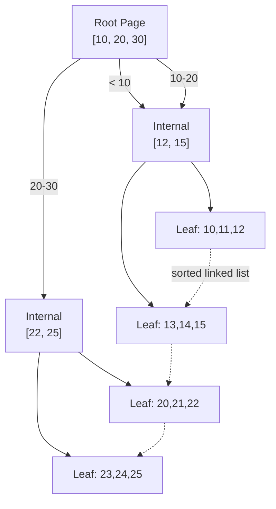
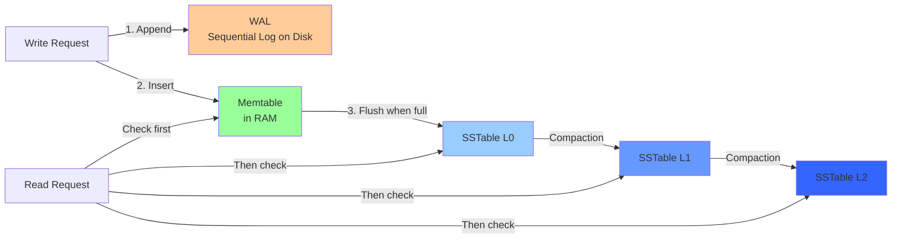

# Database Storage Engines

## Why This Topic Exists

Most engineers use databases as black boxes. They write SQL, data goes in, data comes back out. But senior engineers know that choosing the *wrong storage engine* for a workload is one of the most expensive architectural mistakes you can make. A write-heavy workload on a B-tree engine, or a read-heavy workload on an LSM-tree engine, can degrade performance by 10–100x compared to the optimal choice.

Storage engines determine how data is physically laid out on disk, how writes are processed, how reads are served, and how the database recovers from crashes. Understanding this layer turns you from someone who uses databases to someone who can reason about which database to pick, what its limits are, and why it behaves the way it does under load.

## Learning Objectives

By the end of this topic, you will be able to:

- Explain what a storage engine is and how it fits into a database
- Describe the B-tree data structure and why it is optimal for reads and range queries
- Describe the LSM-tree and why it is optimal for write-heavy workloads
- Explain what a Write-Ahead Log (WAL) is and how it enables crash recovery
- Explain SSTables and memtables and how they relate to the LSM-tree
- Describe compaction and why it is necessary in LSM-tree engines
- Know which databases use B-trees vs LSM-trees and why
- Make an informed storage engine choice for a given workload

## Prerequisites

- Familiarity with what a relational database is
- Basic understanding of what a disk is and that reading/writing to disk is slow
- Completed [Types of Storage](./01.%20Types%20of%20Storage%20(BEGINNER).md)
- Some exposure to data structures (trees, lists) is helpful

## Introduction

When you execute `INSERT INTO users (id, name) VALUES (1, 'Alice')` in PostgreSQL, what actually happens on disk? Does PostgreSQL immediately write to the table file? Does it buffer the write in memory first? How does it ensure you do not lose data if the server crashes mid-write?

The answer depends on the storage engine. PostgreSQL uses a B-tree-based storage engine. Cassandra uses an LSM-tree-based engine. Both get your data to disk reliably, but they make completely different trade-offs about *how* they do it.

This topic explains those trade-offs from the ground up.

## Real-World Analogy

**B-tree** is like a well-organized bookshelf with a detailed index. Every book is always in its correct alphabetical position. Finding a book is fast — you go directly to the right shelf, right section. But *inserting* a new book is slow if the shelf is full: you have to shift other books to make room.

**LSM-tree** is like a scratch pad on your desk. When a new note arrives, you scribble it at the bottom of the scratch pad immediately — fast! Periodically, you gather all your scratch pads, sort them into a clean, organized notebook, and throw away the scratch pads. Reading is slower (you might have to check multiple scratch pads and notebooks), but writing is extremely fast.

The bookshelf (B-tree) is optimized for reading. The scratch pad system (LSM-tree) is optimized for writing.

## Core Concepts

### What is a Storage Engine?

A storage engine is the component of a database responsible for how data is stored and retrieved from disk. The database's query layer (SQL parser, query planner, query executor) sits on top of the storage engine and calls into it to read and write rows.

Some databases are tightly coupled to a single storage engine (PostgreSQL's heap files with B-tree indexes). Others support pluggable storage engines (MySQL supports both InnoDB/B-tree and historically MyISAM; RocksDB is used as the storage engine in MyRocks, TiKV, and others).

### The Problem: Disk is Slow

Disk access patterns matter enormously because disk hardware is slow — particularly for random access (jumping to arbitrary byte positions). On a spinning HDD, a random read takes ~10ms (a disk seek + rotational latency). An SSD is much faster (~0.1ms) but still 1000x slower than RAM.

The consequence: storage engines are designed to minimize random I/O. Both B-trees and LSM-trees do this, but in different ways:
- B-trees minimize random reads by organizing data on disk in a tree structure that narrows the search to a small number of disk pages.
- LSM-trees minimize random writes by buffering writes in memory and flushing them to disk sequentially.

## Deep Explanation

### B-Tree Storage Engine

A B-tree (Balanced tree) is a self-balancing tree data structure where each node contains multiple keys and pointers to child nodes. Database indexes are almost always B-trees (or B+ trees, which store all data in leaf nodes and keep only keys in internal nodes).

**How data is organized:**
- The table is logically divided into fixed-size pages (typically 4KB or 8KB), matching the OS page size.
- Pages are connected in a tree structure: the root page, internal pages (for navigation), and leaf pages (for data).
- The B+ tree leaf pages are linked in a sorted doubly-linked list, enabling efficient range scans.

**How a write works (simplified):**
1. Find the leaf page where the new key belongs (tree traversal: O(log N))
2. If the page has room: insert the key/value in sorted order within the page. Write the modified page to disk.
3. If the page is full: split it into two pages, insert the key in the correct one, and update the parent page to point to both. This may cascade upward.

**How a read works:**
1. Start at the root page.
2. Compare the query key against the keys on each page to navigate to the next child.
3. Reach the leaf page containing the row. Return the data.
Total: O(log N) page reads. For a table with 1 billion rows, a B-tree with a branching factor of 500 and 3-level depth can find any row in 3 page reads.

**Characteristics:**
- Reads are efficient: O(log N) for point queries, sequential for range scans
- Writes are moderate: in-place updates to existing pages (good for updates, but causes random I/O for inserts into non-sequential keys)
- Worst case: write amplification when pages split

**Databases that use B-trees:** PostgreSQL, MySQL (InnoDB), Oracle, SQL Server, SQLite, MongoDB (default WiredTiger engine).

### LSM-Tree (Log-Structured Merge-Tree)

The LSM-tree was described by Patrick O'Neil et al. in a 1996 paper and became the basis for many modern write-optimized storage systems.

The key insight: sequential writes to disk are much faster than random writes. An SSD can write sequentially at ~500MB/s but handles only ~50,000 random writes per second. If you convert all random writes into sequential writes, you dramatically improve write throughput.

**The four components of an LSM-tree engine:**

**1. Memtable (in-memory write buffer)**
All incoming writes go into an in-memory data structure (a sorted tree like a Red-Black tree or AVL tree). This is the memtable. Writes are extremely fast because they only touch RAM.

**2. Write-Ahead Log (WAL)**
Before writing to the memtable, the write is appended to a WAL — a sequential append-only log file on disk. The WAL is written sequentially (fast), and it exists solely for crash recovery: if the server crashes, the memtable (RAM) is lost, but the WAL survives and the engine replays it to reconstruct the memtable.

**3. SSTables (Sorted String Tables)**
When the memtable grows large enough (e.g., 64MB), it is flushed to disk as an SSTable. An SSTable is an immutable file of key-value pairs sorted by key. Writing an SSTable is purely sequential — the entire file is written in one pass. Fast.

Over time, many SSTables accumulate.

**4. Compaction**
Multiple SSTables are periodically merged and sorted into larger SSTables. This is called compaction. Compaction:
- Reclaims space from deleted/overwritten values (old SSTables may contain outdated versions of keys)
- Keeps the number of SSTables manageable
- Maintains sorted order, which speeds up range reads

**How a write works:**
1. Append to WAL (sequential, fast)
2. Insert into memtable (RAM, fast)
3. Done. The write is acknowledged. Total disk I/O: one sequential append to WAL.

**How a read works:**
1. Check the memtable (RAM) — if the key is there, return it
2. Check each SSTable from newest to oldest until the key is found
3. Use Bloom filters (probabilistic data structure) to quickly skip SSTables that definitely do not contain the key

Reads can be slower because you may have to check multiple SSTables. Compaction reduces this over time.

**Characteristics:**
- Writes are extremely fast (all writes are sequential appends)
- Reads can be slower (check multiple SSTables)
- Deletes are lazy: a deleted key is recorded as a "tombstone" marker; the data is only removed during compaction
- Compaction causes background I/O, which can affect read/write latency (write amplification)

**Databases that use LSM-trees:** Cassandra, RocksDB, LevelDB, HBase, InfluxDB, TiKV, ScyllaDB.

### Write-Ahead Log (WAL) in Detail

The WAL is used by both B-tree and LSM-tree engines, but for different purposes.

**In B-tree engines (e.g., PostgreSQL):**
Before modifying any B-tree page in the buffer pool, PostgreSQL writes the intended change to the WAL. If the server crashes mid-write, PostgreSQL replays the WAL on restart to bring the database to a consistent state. This is the foundation of PostgreSQL's ACID durability guarantee.

**In LSM-tree engines:**
The WAL is the primary crash recovery mechanism for the in-memory memtable. Since the memtable is in RAM, it is lost on crash. The WAL lets the engine replay all writes since the last SSTable flush.

The WAL is always append-only (sequential writes), which makes it fast. The WAL is typically flushed to disk (`fsync`) after each transaction to guarantee durability. This is a key performance knob: `fsync=on` is safe but slower; `fsync=off` is faster but can lose data on crash.

### Bloom Filters (LSM-tree optimization)

A Bloom filter is a space-efficient probabilistic data structure that answers "is this key definitely NOT in this SSTable?" It never gives false negatives (if the key is in the SSTable, the Bloom filter will not say it is absent), but it can give false positives (it might say a key is present when it is not).

In practice, Bloom filters allow the engine to skip the vast majority of SSTable reads for a point query. Without Bloom filters, a point query in an LSM engine might read dozens of SSTables. With Bloom filters, it typically reads only one or two.

## Step-by-Step Example

**Scenario**: You are building a system that ingests IoT sensor data — 100,000 writes per second, each write is a sensor reading with a timestamp, sensor ID, and value. Queries are mostly time-range reads: "give me all readings from sensor X between 2pm and 3pm."

**Evaluating B-tree:**
- 100,000 writes/second means constant B-tree page updates. Many sensor IDs writing interleaved creates random I/O patterns — the engine must seek to different pages for different sensor IDs. High write amplification.
- Range reads are efficient — B+ tree leaf pages are linked, so range scans are sequential.
- Problem: write throughput may be a bottleneck.

**Evaluating LSM-tree:**
- 100,000 writes/second all go to the memtable and WAL (sequential). The engine handles this easily.
- Range reads require checking multiple SSTables. But if data is organized by sensor ID + timestamp as the key (so a sensor's time-range data ends up in the same SSTables after compaction), range reads are still efficient.
- Good fit for this workload.

**Decision**: LSM-tree engine (e.g., Cassandra, InfluxDB, or TimescaleDB). The write volume is too high for a B-tree to handle efficiently, and LSM-trees are designed for exactly this "time-series write-heavy" workload.

## Advantages / Disadvantages / Trade-offs

| Aspect | B-Tree | LSM-Tree |
|---|---|---|
| Write performance | Good for small updates; struggles with heavy random inserts | Excellent — all writes are sequential |
| Read performance | Excellent for point queries and range scans | Good, but checking multiple SSTables adds overhead |
| Space amplification | Low — data is stored in-place | Medium-high — dead data persists until compaction |
| Write amplification | Low-medium (page splits) | High during compaction (data rewritten multiple times) |
| Crash recovery | WAL replay | WAL replay for memtable |
| Compaction | Not needed | Required — background I/O, can cause latency spikes |
| Best for | Mixed read/write, OLTP, relational DBs | Write-heavy, append-heavy (IoT, logs, time series) |

## When to Use / When NOT to Use

**Use B-tree storage engine (PostgreSQL, MySQL InnoDB) when:**
- Your workload is balanced read/write (OLTP)
- You need strong ACID compliance
- Range queries and secondary indexes are important
- Write volume is moderate (not millions of writes per second)

**Use LSM-tree storage engine (Cassandra, RocksDB) when:**
- You have an extremely write-heavy workload
- Your writes are mostly inserts, not updates in place
- You can tolerate background compaction overhead
- Time-series data, event logs, sensor data

**Avoid LSM-trees when:**
- Your workload is read-dominated with frequent point queries (B-tree will outperform)
- You cannot tolerate occasional latency spikes from compaction

## Common Interview Questions

1. **What is the difference between a B-tree and an LSM-tree storage engine?**
   B-trees organize data in a sorted tree on disk — good for reads and range queries. LSM-trees buffer all writes in memory, flush sequentially to immutable SSTables, and merge them periodically — excellent for write-heavy workloads. B-trees are read-optimized; LSM-trees are write-optimized.

2. **What is a Write-Ahead Log and why is it needed?**
   A WAL is an append-only log of all changes before they are applied to the main data structure. It enables crash recovery: on restart, the database replays the WAL to restore any writes that were in-flight when the crash occurred. It also enables replication in many databases.

3. **How does Cassandra handle deletes?**
   Cassandra (LSM-tree) does not immediately delete data. Instead, it writes a "tombstone" — a special marker indicating deletion. During compaction, tombstones and the expired data they mark are removed. Tombstones accumulate until compaction runs, which is why Cassandra performs poorly on read-heavy workloads with many deletes.

4. **What is compaction in an LSM-tree engine and why is it necessary?**
   Compaction merges multiple SSTables into fewer, larger ones — sorting keys, removing outdated values and tombstones. It keeps the number of SSTables manageable (improving read performance) and reclaims space. Without compaction, read performance degrades as more SSTables accumulate.

5. **Why does PostgreSQL use a B-tree for its default storage and not an LSM-tree?**
   PostgreSQL was designed for OLTP workloads with a mix of reads, updates, and deletes. B-trees excel at point reads and range scans. PostgreSQL's MVCC (Multi-Version Concurrency Control) model is also designed around in-place updates with old row versions, which fits the B-tree model naturally.

## Common Beginner Mistakes

- **Thinking that "database performance" is one-dimensional.** A database that is fast for writes may be slow for reads. Always consider your workload's read/write ratio.
- **Ignoring compaction overhead in LSM-tree engines.** Compaction consumes significant I/O and CPU. In production Cassandra clusters, compaction is a major operational concern. Understand your compaction strategy (SizeTiered vs Leveled) before deploying.
- **Assuming all databases are interchangeable.** PostgreSQL and Cassandra can both store records, but their performance characteristics are completely different. Using Cassandra for read-heavy OLTP (it has no joins, limited secondary index support) or PostgreSQL for 1 million writes/second is a mismatch.
- **Forgetting that the WAL must be synced for durability.** If `fsync` is disabled, the WAL is in the OS page cache (not on disk), and data can be lost on a crash. This is a common misconfiguration that leads to data loss.

## Summary

Storage engines are the layer of a database that determines how data is physically stored and retrieved. B-tree engines organize data in a sorted on-disk tree with in-place updates — optimal for reads and range queries, used by PostgreSQL and MySQL. LSM-tree engines buffer all writes in memory (memtable), log them sequentially for crash recovery (WAL), flush to immutable sorted files (SSTables), and periodically compact them — optimal for write-heavy workloads, used by Cassandra and RocksDB. The WAL is the shared foundation of both: it ensures that committed writes survive crashes by providing a sequential log that can be replayed. Choosing the right engine means understanding your read/write ratio and access patterns.

## Key Takeaways

- B-tree: read-optimized, in-place updates, good for balanced OLTP workloads (PostgreSQL, MySQL)
- LSM-tree: write-optimized, append-only, good for write-heavy workloads (Cassandra, RocksDB)
- WAL (Write-Ahead Log): append-only crash recovery log — used by both engine types
- Memtable: in-memory write buffer in LSM engines — fast but volatile (WAL handles durability)
- SSTable: immutable sorted file — the on-disk format of LSM-tree data
- Compaction: periodic SSTable merging — necessary maintenance, but causes background I/O
- Bloom filters: probabilistic skip-list — let LSM engines avoid reading irrelevant SSTables
- The choice between B-tree and LSM-tree is the most consequential storage engine decision

## Related Topics

- [Types of Storage](./01.%20Types%20of%20Storage%20(BEGINNER).md) — Block storage is what these engines run on
- [Data Replication Strategies](./05.%20Data%20Replication%20Strategies%20(INTERMEDIATE).md) — WAL is also the foundation of database replication
- [RAID and Disk Reliability](./03.%20RAID%20and%20Disk%20Reliability%20(INTERMEDIATE).md) — Physical disk reliability underneath the storage engine
- [Chapter 05: Databases](../05.%20Databases/README.md) — Higher-level database concepts that build on storage engines
