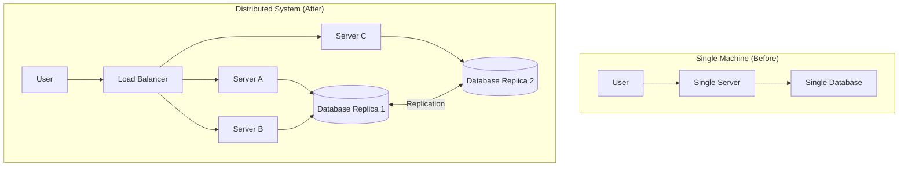

# Introduction to Distributed Systems

## Why This Topic Exists

The history of computing is a history of hitting walls. First, programs grew too large for a single CPU. Then databases grew too large for a single disk. Then read traffic grew too heavy for a single server. At every wall, engineers reached for the same solution: add more machines.

But the moment you add a second machine, something surprising happens. Problems that were trivial on a single machine — like "what time is it?" or "did that operation succeed?" — become genuinely hard. A distributed system is not just a faster single machine. It is a fundamentally different kind of system, with its own failure modes, its own guarantees, and its own set of engineering tools.

Understanding distributed systems is no longer optional for software engineers. It is the foundation of every large-scale product built today.

---

## Learning Objectives

By the end of this file, you will be able to:
- Define a distributed system and explain why it is needed
- Name and explain each of the 8 fallacies of distributed computing
- Describe the three fundamental challenges of distributed systems
- Explain the basic idea behind the CAP theorem
- Reason about which problems are introduced the moment you add a second machine

---

## Prerequisites

- Basic understanding of how a server works (HTTP request/response)
- Basic understanding of networking (TCP, IP addresses)
- Understanding what a database is

---

## Introduction

Imagine you run a pizza shop. On opening day, you do everything yourself: take orders, make pizzas, deliver them. You are the single machine. For a small business, this works fine.

Now you become popular. More orders come in than you can handle alone. You hire employees. Now you have a distributed system — multiple workers, each doing part of the work, coordinating to serve customers.

This sounds simple. But now you have real problems:
- What if one employee misunderstands the order?
- What if two employees both grab the last portion of cheese?
- What if an employee goes home sick mid-shift?
- What if the delivery driver gets stuck in traffic and you don't know if the pizza was delivered?

These are the problems of distributed systems, just disguised as pizza shop problems.

---

## Real-World Analogy

**Single machine = one person doing all the work**

A brilliant but single employee can handle a small workload perfectly. They have perfect memory (shared state), they make decisions instantly (no network delay), and when they take a lunch break, everything stops — but at least you know why.

**Distributed system = a large organization**

A large organization has departments, managers, and employees. They communicate by email and meetings (messages over a network). Sometimes email gets delayed. Sometimes two teams make conflicting decisions because neither knew what the other was doing. Sometimes an employee quits mid-project and nobody knows what state they left things in.

The organization gets more done than any single person. But coordination is costly and imperfect.

---

## Core Concepts

### What Is a Distributed System?

A distributed system is a collection of independent computers that appear to their users as a single coherent system. The computers communicate by passing messages over a network.

Key characteristics:
1. **No shared memory** — each machine has its own RAM
2. **No shared clock** — each machine has its own clock, and clocks drift
3. **Communication via messages** — all coordination happens through the network
4. **Independent failures** — any machine can fail at any time

### Why Distributed Systems Exist

There are four main reasons to build a distributed system:

| Reason | Explanation | Example |
|--------|-------------|---------|
| **Scale** | A single machine cannot handle the traffic or data | Google processes 8.5 billion searches per day |
| **Availability** | A single machine can fail; multiple machines can survive one failing | AWS S3 is designed for 99.999999999% durability |
| **Geography** | Users are all over the world; a single server in one city is slow for everyone else | Netflix has servers in 190+ countries |
| **Cost** | Many cheap commodity servers cost less than one supercomputer | Commodity cloud servers vs. mainframes |

---

## Visual Diagram (Mermaid)

---

## Deep Explanation

### The 8 Fallacies of Distributed Computing

In 1994, Peter Deutsch at Sun Microsystems listed the false assumptions that engineers make when first working with distributed systems. These became known as the 8 fallacies.

Every single one of these fallacies will burn you if you believe it.

---

**Fallacy 1: The Network Is Reliable**

Most code is written as if the network always delivers messages. In reality, networks drop packets, routers fail, cables get cut, and cloud provider networks have outages.

Real consequence: Your API call to another service times out. The service received the request and processed it, but the response got lost. Did the operation succeed? You don't know. You must design for this uncertainty.

---

**Fallacy 2: Latency Is Zero**

A function call within the same process takes nanoseconds. A network call between two servers in the same data center takes milliseconds. A call between two data centers on different continents takes hundreds of milliseconds.

Real consequence: An engineer treats a remote database call like a local function call, makes 100 of them inside a loop, and the endpoint takes 10 seconds to respond. Latency compounds.

---

**Fallacy 3: Bandwidth Is Infinite**

There is a finite amount of data that can flow through any network link. Sending large payloads, uncompressed data, or millions of small messages will saturate the link.

Real consequence: A microservice sends the full user object (50 fields) in every inter-service message when it only needs the user ID. Under load, this floods the internal network and degrades every other service.

---

**Fallacy 4: The Network Is Secure**

Data sent over a network can be intercepted, modified, or replayed by anyone who can observe the link.

Real consequence: An internal microservice communicates in plain HTTP assuming "it's just internal traffic." An attacker who gains access to the network can read all that traffic. TLS is not optional.

---

**Fallacy 5: Topology Doesn't Change**

IP addresses, servers, load balancers, and routers are assumed to be fixed. In practice, cloud environments are highly dynamic — servers are added and removed, IP addresses change, DNS entries change.

Real consequence: A service hardcodes the IP address of a database. The database is migrated to a new server. The service breaks.

---

**Fallacy 6: There Is One Administrator**

In a large system, different parts are owned by different teams, different vendors, or different cloud providers. There is no single person who controls everything.

Real consequence: You need to change a firewall rule to allow traffic between two services. One team owns service A. Another team owns service B. A third team owns the network. This takes three meetings and a ticket, not three seconds.

---

**Fallacy 7: Transport Cost Is Zero**

There is a cost — in time, money, and CPU — to serializing data, sending it over the network, and deserializing it on the other end. Every network call has overhead.

Real consequence: Engineers design a system with 12 microservices that call each other in a chain for every user request. The serialization/deserialization overhead at each hop adds up to a 400ms latency tax.

---

**Fallacy 8: The Network Is Homogeneous**

Not all networks are the same. Internal data center networks, the public internet, mobile networks, and satellite networks all have wildly different latency, bandwidth, reliability, and cost characteristics.

Real consequence: An application is built and tested entirely on a fast internal network. It is then deployed to mobile users on 3G. Suddenly every "fast" API call takes 2-3 seconds.

---

### The Three Fundamental Challenges

**Challenge 1: Partial Failures**

On a single machine, the failure modes are simple: the program crashes, the power goes out, the disk fails. The whole system fails together.

In a distributed system, any individual component can fail while the rest of the system keeps running. The network between two services can fail while both services are healthy. A disk on one replica can fail while other replicas are fine.

Partial failure is the hardest problem in distributed systems. You must design every system to handle the case where some components fail while others continue operating.

**Challenge 2: No Shared Clock**

Every machine has its own clock. Computer clocks drift over time — even with NTP (Network Time Protocol) synchronization, clocks on different machines can differ by milliseconds or even seconds.

This means you cannot rely on timestamps to determine the order of events across machines. If Server A records an event at 10:00:00.001 and Server B records an event at 10:00:00.002, you cannot be certain which event actually happened first. This has serious consequences for databases (which write conflicts happened first?) and for debugging (what happened in what order?).

**Challenge 3: No Shared Memory**

On a single machine, two threads can communicate through shared variables in RAM. This is fast, but requires careful synchronization to avoid race conditions.

Distributed machines have no shared memory. Every piece of information must be explicitly communicated by sending a message over the network. This makes coordination slower and more complex — and those messages can be lost or delayed.

---

### CAP Theorem Preview

The CAP theorem, proven by Eric Brewer in 2000, states that a distributed system can only guarantee two of three properties at the same time:

| Property | Meaning |
|----------|---------|
| **Consistency (C)** | Every read receives the most recent write |
| **Availability (A)** | Every request receives a response (not an error) |
| **Partition Tolerance (P)** | The system continues operating even when the network splits |

Because network partitions (splits) are a fact of life in any real distributed system, every system must choose: when a partition occurs, do you prioritize being consistent (correct but possibly unavailable) or available (always responds but possibly stale)?

- A bank prioritizes **Consistency** — you must never see an incorrect balance
- A social media "like" counter prioritizes **Availability** — showing 9,999 likes instead of 10,000 for a few seconds is acceptable

This is covered in depth in Chapter 10. For now, understand that every distributed system forces a choice between correctness and availability.

---

## Step-by-Step Example

**What happens when a single machine hits its limits:**

1. Your startup launches. One server handles all traffic. Everything is fast and simple.
2. Traffic grows. The CPU on the single server hits 90%. Response times increase.
3. You add a second server behind a load balancer. Traffic is split. But now the two servers have separate in-memory caches — a user might get different results depending on which server handles their request.
4. You add a shared database. Now both servers read/write the same data. But the database becomes the new bottleneck.
5. You add database read replicas. Writes go to the primary, reads are distributed. But now a write on the primary takes a moment to replicate — a user might read stale data from a replica.
6. Traffic grows more. You shard the database across multiple machines. Now a query that joins data across shards becomes expensive.

At each step, you solve one problem and introduce two more. This is the nature of distributed systems.

---

## Advantages / Disadvantages / Trade-offs

| Aspect | Distributed Systems | Single Machine |
|--------|--------------------|--------------------|
| Scale | Can scale horizontally to handle virtually unlimited load | Limited by the hardware of one machine |
| Availability | Can survive individual node failures | Single point of failure |
| Latency (geographic) | Can serve users from nearby servers | Far users always experience high latency |
| Complexity | Enormously complex to build, debug, and operate | Simple to reason about |
| Cost (small scale) | More expensive than a single machine for small workloads | Cheap and simple |
| Debugging | Distributed traces are hard; partial failures are subtle | Straightforward stack traces |
| Consistency | Hard to keep all nodes in sync | Trivial — single source of truth |

---

## When to Use / When NOT to Use

**Use distributed systems when:**
- Your traffic exceeds what a single machine can handle
- You need more availability than a single machine provides (99.99%+ uptime)
- Your users are globally distributed and latency matters
- Your data is too large to fit on a single machine
- Regulations require data to reside in specific geographic regions

**Do NOT use distributed systems when:**
- Your traffic and data easily fit on a single machine
- You are in early-stage development (premature scaling is a major productivity killer)
- Your team does not yet have the expertise to operate distributed systems safely
- Your consistency requirements are extremely strict and the system is small

The classic mistake is over-engineering from day one. Many successful products (Basecamp, Stack Overflow, GitHub early on) ran on a very small number of servers for years.

---

## Common Interview Questions

1. What is a distributed system? What are its key characteristics?
2. Explain the 8 fallacies of distributed computing. Which one surprises engineers the most?
3. What is partial failure? Why is it harder to handle than total failure?
4. Explain the CAP theorem. Give an example of a CP system and an AP system.
5. Why can you not rely on timestamps to order events in a distributed system?
6. What are the trade-offs between consistency and availability in a distributed database?

---

## Common Beginner Mistakes

**Mistake 1: Treating network calls like function calls**
Network calls fail, timeout, and return partial results. Function calls do not. Every network call needs error handling, retries with backoff, and a timeout.

**Mistake 2: Ignoring partial failure**
Writing code that only handles "success" or "complete failure". The hardest case is "I don't know" — the call timed out, and you don't know if it succeeded.

**Mistake 3: Distributing too early**
Building a distributed system for a problem that a single well-optimized machine could handle. Always exhaust vertical scaling before moving to horizontal.

**Mistake 4: Assuming the network is the internal company network**
Internal networks fail too. They have less reliability engineering behind them than the public internet.

**Mistake 5: Forgetting about clock skew**
Using `System.currentTimeMillis()` or equivalent to order events across machines. Clocks disagree. This leads to bugs that are extremely hard to reproduce.

---

## Summary

A distributed system is multiple computers working together to appear as one. They exist because single machines have limits in computation, storage, and geography.

Distributed systems introduce a new class of problems that do not exist on a single machine: partial failures, no shared clock, no shared memory, and unreliable networks. The 8 fallacies of distributed computing describe the false assumptions that engineers carry from single-machine programming into distributed programming.

Every distributed system must make trade-offs, most famously captured by the CAP theorem. There are no perfect solutions — only context-appropriate choices.

---

## Key Takeaways

- A distributed system is multiple independent computers that communicate via messages and appear as one system to users
- Distributed systems exist to overcome the scale, availability, and geographic limits of a single machine
- The 8 fallacies of distributed computing describe the dangerous assumptions engineers make about networks
- Partial failure — some components fail while others continue — is the hardest challenge in distributed systems
- There is no global clock in a distributed system; timestamps cannot reliably order events across machines
- The CAP theorem forces every distributed database to trade off consistency against availability
- Single-machine solutions should always be considered and exhausted before distributing

---

## Related Topics (relative markdown links)

- [Chapter README — All Distributed Systems Topics](./README.md)
- [Consistent Hashing](./02.%20Consistent%20Hashing%20%28INTERMEDIATE%29.md)
- [Gossip Protocol](./03.%20Gossip%20Protocol%20%28ADV%29.md)
- [Leader Election](./04.%20Leader%20Election%20%28INTERMEDIATE%29.md)
- [Vector Clocks and Logical Time](./06.%20Vector%20Clocks%20and%20Logical%20Time%20%28ADV%29.md)
- [Chapter 04: Databases](../04.%20Databases/README.md)
- [Chapter 10: Consistency and Consensus](../10.%20Consistency%20and%20Consensus/README.md)
- [Chapter 11: Reliability and Fault Tolerance](../11.%20Reliability%20and%20Fault%20Tolerance/README.md)
