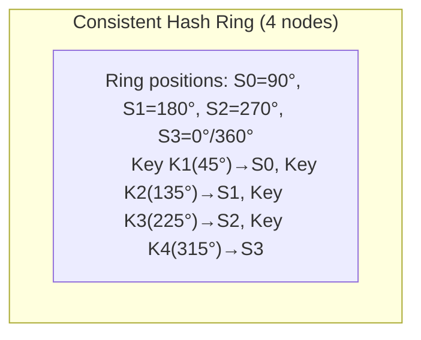
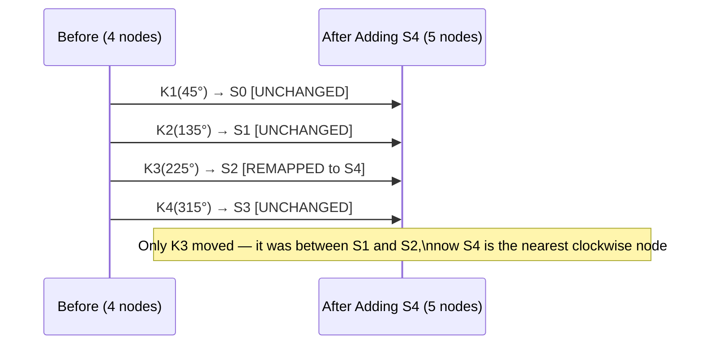

# Consistent Hashing

## Why This Topic Exists

Imagine you have 10 cache servers storing data for millions of users. The simple approach is to route each request to a server using `hash(key) % 10`. This works perfectly — until you need to add an 11th server to handle increased load. Now the formula is `hash(key) % 11`, and almost every key routes to a different server than before. Your entire cache is effectively invalidated in an instant. Every request becomes a cache miss and hits your database, which immediately collapses under the load.

This is a real production problem. Consistent hashing is the solution that allows you to add or remove nodes while only remapping a small fraction of keys — not the entire key space.

---

## Learning Objectives

By the end of this file, you will be able to:
- Explain why modulo-based hashing fails when the number of nodes changes
- Describe how the consistent hashing ring works
- Explain what virtual nodes are and why they improve the distribution
- Describe how DynamoDB and Cassandra use consistent hashing
- Draw a before/after diagram showing which keys are affected when a node is added

---

## Prerequisites

- Understanding of hash functions (deterministic, distributes values evenly)
- Basic understanding of caching (why cache servers exist)
- Understanding of what a distributed system is (see [Introduction to Distributed Systems](./01.%20Introduction%20to%20Distributed%20Systems%20%28BEGINNER%29.md))

---

## Introduction

Hashing is one of the most useful tools in computer science. If you have N servers and a key to route, the obvious approach is `server = hash(key) % N`. This distributes keys evenly and is O(1) to compute.

The problem is that N rarely stays constant. Servers fail. Traffic grows and you add servers. Traffic shrinks and you remove servers. Every time N changes, the modulo changes, and the routing for most keys changes.

Consistent hashing solves this by mapping both servers and keys onto a conceptual ring (a circle). Adding or removing a node only affects the keys that were assigned to that node — all other keys stay where they are.

---

## Real-World Analogy

Imagine a circular track at a running event. There are 10 water stations placed around the track, and runners are assigned to the nearest station ahead of them.

If you add a new water station between stations 3 and 4, only the runners who were going to station 4 now need to go to the new station instead. All other runners are completely unaffected.

If you remove station 7, its runners simply walk a bit further to station 8. No other runners change their destination.

This is exactly how consistent hashing works. The track is the hash ring. The water stations are the servers. The runners are the keys.

---

## Core Concepts

### The Problem with Modulo Hashing

Consider 10 servers, S0 through S9. A key is routed using `hash(key) % 10`.

When you add an 11th server (S10), the formula becomes `hash(key) % 11`.

Let's trace what happens to a few keys:
- `hash("user_123") = 847`. Old: 847 % 10 = **7** (was on S7). New: 847 % 11 = **0** (now on S0). Remapped.
- `hash("product_456") = 1203`. Old: 1203 % 10 = **3** (was on S3). New: 1203 % 11 = **5** (now on S5). Remapped.

In practice, approximately `(N-1)/N` of all keys get remapped when you go from N to N+1 servers. Going from 10 to 11 servers remaps about 90.9% of all keys. This causes a "thundering herd" — all those cache misses hit the database simultaneously.

### The Consistent Hashing Ring

Consistent hashing maps both servers and keys to positions on a conceptual ring (a circular number line from 0 to 2^32 - 1, for a 32-bit hash).

**How keys are assigned:**
1. Hash each server name to get its position on the ring
2. Hash each key to get its position on the ring
3. Walk clockwise from the key's position until you find the first server — that server owns the key

**What happens when a node is added:**
Only the keys that now sit between the new node and its predecessor get remapped. All other keys are unaffected.

**What happens when a node is removed:**
Only the keys that were assigned to the removed node get reassigned — to the next node clockwise. All other keys are unaffected.

---

## Visual Diagram (Mermaid)

### Before Adding a Node (4 nodes)



```
         K1(45°)
           |
    S3 ----+---- S0(90°)
    (0°)   |
    |      K2(135°)
    |      |
    S2----S1(180°)
   (270°)
    |
    K3(225°) → S2
    K4(315°) → S3
```

### After Adding Node S4 Between S1 and S2



The key insight: only keys that sit in the arc between the new node's position and its predecessor get remapped. This is typically 1/N of all keys (one node's worth), not 90%+ as with modulo hashing.

---

## Deep Explanation

### Adding and Removing Nodes

**Adding a new node (S_new) at position P:**
- Find the node that currently owns position P by walking clockwise from P
- Call this node S_next
- All keys in the arc from S_new's predecessor to S_new are moved from S_next to S_new
- Fraction of keys moved: approximately 1/N (one node's share)

**Removing a node (S_gone):**
- All keys that were assigned to S_gone are now assigned to S_gone's successor (the next node clockwise)
- All other keys are unaffected
- Fraction of keys moved: approximately 1/N

Compare this to modulo hashing where (N-1)/N keys are moved — roughly 90% for N=10.

### The Problem: Uneven Distribution

In a naive consistent hashing ring with few nodes, the distribution is often very uneven. If 4 servers happen to cluster together on one part of the ring, one server will own nearly half the key space while another owns almost nothing.

This is solved with virtual nodes.

### Virtual Nodes (VNodes)

Instead of placing each physical server at one point on the ring, you place it at multiple points. These extra points are called virtual nodes.

For example, Server A is represented at positions A1, A2, A3, A4, A5, A6, A7, and A8 on the ring. Server B has positions B1...B8. Server C has positions C1...C8.

**Why this works:**
- With many virtual nodes, the positions interleave across the ring
- The key space is divided more evenly among physical servers
- Adding a new server means adding many virtual node positions — each one takes a small slice from a different existing server, spreading the re-routing load

**Practical numbers:**
- Cassandra uses 256 virtual nodes per physical node by default (configurable)
- DynamoDB uses a similar approach internally

**Example with 3 servers and 4 virtual nodes each:**

```
Ring position:  0°    45°   90°   135°   180°   225°   270°   315°
Owner:          A1    C2    B1    A2     C1     B2     A3     C3
Physical:        A     C     B     A      C      B      A      C
```

With this interleaving, no single physical server owns a disproportionately large arc of the ring.

### How DynamoDB Uses Consistent Hashing

Amazon DynamoDB's original design (described in the 2007 Dynamo paper) placed each node at multiple positions on a consistent hash ring. The key design decisions were:

1. **Preference list**: When a key needs to be stored, the system identifies the N nodes responsible for that key by walking clockwise from the key's position. This gives a "preference list" of primary and replica nodes.

2. **Sloppy quorum**: During failures, writes can go to nodes that are not in the original preference list. This maintains availability at the cost of consistency. When the original nodes recover, they receive the data via anti-entropy (covered in the Gossip Protocol chapter).

3. **Rebalancing**: When a new node joins, it receives data from the nodes whose key ranges it is taking over. This is efficient because only the affected nodes need to transfer data.

### How Cassandra Uses Consistent Hashing

Apache Cassandra uses consistent hashing (with virtual nodes) as the basis for its distributed architecture:

1. **Partitioner**: Cassandra uses a partitioner (default: Murmur3Partitioner) to hash partition keys onto the ring
2. **Token range**: Each node owns a range of tokens (positions on the ring)
3. **Replication**: For a replication factor of 3, Cassandra stores copies on the 3 nodes clockwise from the key's position
4. **vnodes**: With virtual nodes enabled (the default), each physical node owns many small token ranges scattered around the ring, ensuring even distribution

---

## Step-by-Step Example

**Scenario**: You operate a cache cluster with 4 servers. Your traffic doubles and you need to add a 5th server without dropping your cache hit rate.

**Step 1: Current state (4 servers)**
- Server A is at position 90 on the ring (positions range 0-360)
- Server B is at position 180
- Server C is at position 270
- Server D is at position 0/360

**Step 2: Key assignment**
- User session `sess_alice` hashes to position 50 → nearest clockwise server is A (at 90) → stored on Server A
- User session `sess_bob` hashes to position 120 → nearest clockwise server is B (at 180) → stored on Server B
- User session `sess_carol` hashes to position 230 → nearest clockwise server is C (at 270) → stored on Server C

**Step 3: Adding Server E at position 135**
- Server E is inserted at position 135 on the ring
- Walk from position 135 clockwise → the first server is B (at 180)
- Therefore, Server E "takes over" the arc from 90 to 135
- Keys in positions 90-135 move from Server B to Server E

**Step 4: Impact assessment**
- `sess_alice` (position 50): nearest clockwise server is still A → **UNCHANGED**
- `sess_bob` (position 120): was going to B (180), now E (135) is closer → **REMAPPED to E**
- `sess_carol` (position 230): still going to C → **UNCHANGED**

Only `sess_bob` and other keys in the 90-135 arc are affected. Everything else stays where it is.

**Step 5: Data migration**
Server B transfers its keys in positions 90-135 to Server E. No other data movement is needed.

---

## Advantages / Disadvantages / Trade-offs

| Aspect | Consistent Hashing | Modulo Hashing |
|--------|-------------------|----------------|
| Keys remapped when node added | ~1/N | ~(N-1)/N |
| Keys remapped when node removed | ~1/N | ~(N-1)/N |
| Implementation complexity | Medium | Very simple |
| Distribution evenness (basic) | Uneven without vnodes | Even |
| Distribution evenness (with vnodes) | Even | N/A |
| Cache invalidation on node change | Minimal (only affected arc) | Massive (almost total) |

| Advantage | Detail |
|-----------|--------|
| Minimal disruption | Adding/removing a node only affects that node's key range |
| Incremental scaling | You can add one server at a time without a full cache flush |
| Hotspot management | Virtual nodes help distribute the load evenly |
| Replication-friendly | Natural to replicate by assigning multiple consecutive ring positions |

| Disadvantage | Detail |
|--------------|--------|
| Uneven distribution | Without virtual nodes, basic consistent hashing can create hotspots |
| Complexity | More complex to implement and reason about than modulo hashing |
| Virtual node overhead | More metadata to maintain (which virtual node maps to which physical node) |
| Data movement on join | Still requires data transfer when a new node joins, just less of it |

---

## When to Use / When NOT to Use

**Use consistent hashing when:**
- You have a cache layer that must survive node additions/removals without total invalidation
- You are building a distributed database or key-value store with dynamic node membership
- You need to route requests to specific nodes based on a key (horizontal partitioning)
- You expect the cluster size to change over time

**Do NOT use consistent hashing when:**
- Your cluster size is fixed and will never change (simple modulo hashing is sufficient)
- You need sorted order access (consistent hashing provides random distribution, not sorted ranges)
- You need to do range queries (range-based partitioning like in HBase or Google Bigtable is better)
- The data access pattern is highly skewed and a better partitioning strategy is needed

---

## Common Interview Questions

1. What is consistent hashing and what problem does it solve?
2. How many keys need to be remapped when a node is added to a consistent hash ring vs. a modulo-based system?
3. What are virtual nodes and why are they needed?
4. How does adding a virtual node affect the key redistribution compared to adding a physical node?
5. How does Cassandra use consistent hashing? What is a token range?
6. What is the difference between consistent hashing and range-based partitioning?
7. Walk me through what happens when a node fails in a consistent hashing ring.

---

## Common Beginner Mistakes

**Mistake 1: Thinking consistent hashing eliminates data movement**
It minimizes data movement, but does not eliminate it. When a node joins, it still needs to receive data from its neighbors. When a node leaves, its data must move to the next node.

**Mistake 2: Forgetting virtual nodes**
Basic consistent hashing without virtual nodes creates uneven distribution. Most real systems (Cassandra, DynamoDB) use virtual nodes. When describing consistent hashing in an interview, mention virtual nodes.

**Mistake 3: Confusing the ring with geographic distribution**
The ring is a mathematical abstraction, not a physical layout. Two nodes that are "adjacent" on the ring may be in the same data center.

**Mistake 4: Assuming even distribution without virtual nodes**
With N physical nodes placed at random on the ring, some nodes will own much larger arcs than others. The variance is high with small N. Virtual nodes fix this.

**Mistake 5: Not explaining replication**
Consistent hashing on its own handles routing but not replication. In practice, a key is stored on the first N nodes clockwise from its position (where N is the replication factor). Forgetting to mention this in an interview gives an incomplete answer.

---

## Summary

Modulo-based hashing is simple but fragile: changing the number of nodes remaps nearly all keys, causing a thundering herd of cache misses.

Consistent hashing solves this by placing both nodes and keys on a conceptual ring. A key is assigned to the nearest node clockwise from its position. When a node is added or removed, only the keys in that node's arc are affected — roughly 1/N of all keys.

Virtual nodes improve the distribution evenness by representing each physical server at multiple positions on the ring. This is how Cassandra, DynamoDB, and many other distributed systems implement their data partitioning.

---

## Key Takeaways

- Modulo hashing remaps ~(N-1)/N keys when N changes — catastrophic for caches
- Consistent hashing maps both nodes and keys to a ring; keys go to the nearest clockwise node
- Adding/removing a node only remaps ~1/N keys — the affected arc
- Virtual nodes (multiple ring positions per physical node) ensure even distribution
- DynamoDB and Cassandra both use consistent hashing with virtual nodes as their partitioning foundation
- For replication, assign a key to the first K nodes clockwise from its position (replication factor K)

---

## Related Topics (relative markdown links)

- [Introduction to Distributed Systems](./01.%20Introduction%20to%20Distributed%20Systems%20%28BEGINNER%29.md)
- [Gossip Protocol](./03.%20Gossip%20Protocol%20%28ADV%29.md)
- [Leader Election](./04.%20Leader%20Election%20%28INTERMEDIATE%29.md)
- [Chapter 04: Databases](../04.%20Databases/README.md)
- [Chapter 05: Caching](../05.%20Caching/README.md)
- [Chapter README — All Distributed Systems Topics](./README.md)
